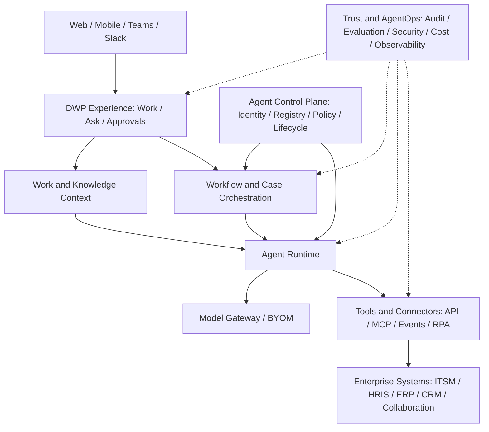

# DWP 프로젝트 개요

> 문서 상태: 프로젝트 기획 기준안 v1.1
>
> 기준일: 2026-08-07
>
> 적용 저장소: `dwp-frontend`, `dwp-backend`, `dwp_agent`
>
> 문서 목적: 이후 작성할 PRD, 아키텍처, 데이터, 보안, 로드맵 문서의 상위 기준
>
> 실행 기준: 단계별 우선순위와 현재 범위는 `프로젝트로드맵.md`를 따른다.

## 1. Executive Summary

DWP는 기존의 사내 포털이나 그룹웨어를 다시 만드는 프로젝트가 아니다. 이
프로젝트는 직원, 기업 지식, 업무 프로세스, 기존 시스템, AI 에이전트를 하나의
통제된 업무 흐름으로 연결하는 **엔터프라이즈 Agentic Work Platform**을
구축한다.

직원은 여러 시스템과 메뉴를 찾아다니지 않고 DWP에서 필요한 정보를 묻고,
업무를 요청하고, 승인하고, 결과를 확인한다. AI 에이전트는 독립된 권한과
정책을 가진 업무 수행 주체로 등록되며, 허용된 데이터와 도구만 사용한다. 모든
판단과 실행은 근거, 승인, 변경 이력과 함께 추적할 수 있어야 한다.

제품의 권장 포지셔닝은 다음과 같다.

> **DWP: Governed Agentic Work Platform**
>
> 기업의 기존 업무 시스템 위에서 사람과 AI 에이전트가 안전하고 측정 가능한
> 방식으로 함께 업무를 완료하도록 만드는 벤더 중립적 업무 운영 플랫폼

## 2. 프로젝트 배경과 시장 판단

### 2.1 시장 변화

Digital Workplace라는 시장은 사라진 것이 아니라 중심 가치가 변했다. 과거의
포털, 공지, 문서함, 메뉴 통합은 기본 기능이 되었고, 시장의 중심은 다음으로
이동하고 있다.

- Employee Experience와 역할 기반 개인화
- 권한을 보존하는 기업 지식 검색과 업무 컨텍스트
- 답변을 넘어 실제 업무를 처리하는 AI 에이전트
- 사람, 에이전트, 워크플로, RPA를 함께 조정하는 오케스트레이션
- 에이전트 ID, 권한, 소유자, 비용, 성과, 수명주기를 관리하는 Control Plane
- AI 판단과 실행에 대한 보안, 평가, 관찰 가능성, 감사와 규제 대응

Microsoft의 2025 Work Trend Index에서는 리더의 81%가 향후 12~18개월 안에
에이전트를 조직 전략에 본격 통합할 것으로 전망했다. McKinsey의 2025 조사에서는
기업의 88%가 적어도 하나의 업무에서 AI를 사용하지만, 에이전트를 확장한 기업은
23%, 기업 수준의 EBIT 효과를 확인한 기업은 39%에 그쳤다. 이는 수요 부족보다
업무 재설계, 통합, 거버넌스와 운영 역량의 부족이 더 큰 시장 문제임을 보여준다.

### 2.2 글로벌 제품 방향

글로벌 사업자의 공통 방향은 단순한 AI Assistant가 아니라 **관리 가능한 AI
Workforce**다.

| 사업자                      | 주요 방향                                             | 프로젝트 시사점                                                             |
| --------------------------- | ----------------------------------------------------- | --------------------------------------------------------------------------- |
| Microsoft Agent 365         | 에이전트 등록, ID, 보안, 관찰, 거버넌스               | 에이전트도 독립된 엔터프라이즈 ID와 수명주기가 필요하다.                    |
| ServiceNow AI Control Tower | 사내외 AI 시스템 검색, 통제, 비용과 성과 관리         | 특정 모델이나 에이전트 프레임워크에 종속되지 않는 Control Plane이 필요하다. |
| Google Gemini Enterprise    | 권한 기반 통합 검색과 에이전트 실행                   | 검색 결과와 에이전트 컨텍스트가 원본 ACL을 보존해야 한다.                   |
| Atlassian Rovo              | Teamwork Graph 기반 조직 맥락과 에이전트              | 문서만이 아니라 사람, 업무, 프로젝트, 결정 관계가 경쟁 자산이 된다.         |
| SAP Joule, Workday          | 역할과 프로세스 기반 에이전트, Agent System of Record | 에이전트 소유자, 역할, 위험등급, 성과와 폐기 절차가 필요하다.               |
| UiPath Maestro              | 에이전트, RPA, 사람, BPMN 프로세스 통합               | 비결정적 AI와 결정적 업무 프로세스를 함께 설계해야 한다.                    |

### 2.3 시장 진입 판단

다음 형태로는 시장 진입을 권장하지 않는다.

- 일반적인 사내 포털 또는 인트라넷 재구축
- 메뉴와 대시보드에 AI 채팅만 추가한 제품
- 출처와 권한 통제가 약한 범용 RAG 검색
- 특정 LLM이나 특정 SaaS에 종속된 에이전트 빌더
- 업무 결과와 ROI를 증명하지 못하는 기능 중심 플랫폼

반대로 다음 포지션은 사업성이 있다.

- 복수의 기존 시스템 위에서 동작하는 벤더 중립적 Agent Control과 Orchestration
- 한국 및 아시아 규제 산업을 위한 감사, 개인정보, 데이터 주권 기본 제공
- SaaS뿐 아니라 Private Cloud와 Hybrid 배포를 지원하는 엔터프라이즈 제품
- 반복 가능한 산업·업무 패키지를 통한 빠른 딜리버리
- 답변이 아니라 실제로 완료된 업무 결과를 기준으로 가치를 증명하는 제품

이 판단은 글로벌 사업자의 제품 방향과 시장 조사에 기반한 프로젝트 전략
가설이며, 초기 고객 인터뷰와 유료 파일럿을 통해 검증해야 한다.

### 2.4 통신·반도체 산업 방향

통신과 반도체 모두 AI 에이전트를 단순 대화 도구가 아니라 복잡한 운영과
엔지니어링 업무를 조정하는 주체로 도입하고 있다.

- 통신에서는 TM Forum의 Agentic NOC와 Ericsson의 Autonomous Network 방향처럼
  NOC, 서비스, Field Force, OSS/BSS 전반에서 여러 에이전트가 감지, 분석,
  권고와 실행을 협업하는 구조로 이동하고 있다.
- 반도체에서는 Samsung Semiconductor와 Synopsys 사례처럼 설계, 검증, 장비,
  공정, 품질과 수율을 잇는 Multi-agent Workflow와 Digital Twin이 발전하고 있다.
- 두 산업 모두 실시간성과 실패 비용이 높으므로, DWP가 네트워크 제어 시스템,
  MES, EDA 또는 장비 제어를 직접 대체해서는 안 된다. DWP는 사람의 업무 접점,
  지식, Case, 승인과 에이전트 통제 계층을 담당하고, 운영 시스템 변경은 검증된
  도메인 API와 결정적 제어 절차를 통해서만 수행해야 한다.

## 3. 비전, 미션과 프로젝트 목표

### 3.1 비전

> 모든 직원이 필요한 업무 맥락과 AI 역량을 안전하게 활용하여, 조직의 경계를
> 넘어 더 빠르고 정확하게 업무를 완료하는 디지털 업무 환경을 만든다.

### 3.2 미션

기업의 System of Record를 교체하지 않고 그 위에 연결되는 **System of
Engagement and Agentic Action**을 제공한다. 직원의 요청부터 정보 탐색, 판단,
승인, 시스템 실행, 결과 확인까지 하나의 감사 가능한 흐름으로 통합한다.

### 3.3 핵심 목표

1. **통합 업무 접점**: 직원이 역할과 권한에 맞는 업무, 지식, 승인, 알림을
   하나의 경험에서 사용하게 한다.
2. **검색에서 실행으로 전환**: AI가 답변만 생성하지 않고 허용된 업무 도구를
   통해 실제 결과를 만들게 한다.
3. **관리 가능한 AI Workforce**: 모든 에이전트에 ID, 소유자, 역할, 권한,
   위험등급, 비용, 성과와 수명주기를 부여한다.
4. **엔터프라이즈 신뢰 확보**: 권한 보존, 사람 승인, 근거 제시, 전체 감사,
   데이터 보호와 안전한 실패를 기본 기능으로 제공한다.
5. **확장 가능한 플랫폼화**: 모델, 채널, 데이터 소스, 업무 시스템을 표준
   인터페이스로 교체하거나 추가할 수 있게 한다.
6. **측정 가능한 사업 성과**: 기능 사용량이 아니라 처리시간, 자동 해결률,
   오류, 재작업, SLA, 비용과 직원 경험 개선으로 성공을 판단한다.

### 3.4 비목표

DWP는 다음 제품을 직접 대체하는 것을 목표로 하지 않는다.

- Microsoft 365, Google Workspace, Slack, Teams와 같은 협업 제품
- ERP, CRM, HRIS, ITSM과 같은 System of Record
- 화상회의, 메신저, 오피스 편집기 전체 기능
- 범용 로우코드 개발 플랫폼 또는 범용 LLM 학습 플랫폼
- 사람의 통제 없이 중요 시스템을 변경하는 완전 자율 에이전트
- 초기 고객과 업무가 정해지기 전에 모든 산업 기능을 포함하는 대형 플랫폼

## 4. 목표 시장과 사용자

### 4.1 초기 Ideal Customer Profile

초기 제품은 산업을 한정하지 않고 다음 특성을 가진 엔터프라이즈 조직을
대상으로 한다.

- 직원 2,000명 이상 또는 여러 법인·지역·사업부를 운영하는 조직
- Microsoft 365 또는 Google Workspace와 HRIS, ITSM, ERP, 그룹웨어, 자체
  Legacy가 혼재해 직원의 업무 진입점이 분산된 조직
- 메일, 일정, 승인, 사내 문의, 문서 탐색과 서비스 요청의 반복 업무량이 많고
  탐색시간, 처리시간, SLA와 재작업을 측정할 수 있는 조직
- SSO, 조직·권한 동기화, 감사, 개인정보, 데이터 주권과 Private Cloud 또는
  Hybrid 배포를 중요하게 요구하는 조직
- 제품팀과 함께 실제 업무, 사용자, 데이터, Connector와 KPI를 제공할 수 있는
  디자인 파트너

초기 지역은 한국 시장을 중심으로 제품과 레퍼런스를 검증하되, 다국어,
멀티테넌시, 데이터 주권, 글로벌 규제 대응 구조는 처음부터 고려한다.

통신과 반도체는 우선 검토할 후속 Industry Pack이다. 공통 DWP Core의 가치와
재사용성이 실제 고객에서 검증되기 전에는 산업 전용 기능이 제품 구조와 초기
메뉴를 지배하지 않게 한다.

### 4.2 후속 산업별 업무 특성과 제품 경계

| 항목        | 통신                                                         | 반도체                                                         |
| ----------- | ------------------------------------------------------------ | -------------------------------------------------------------- |
| 주요 사용자 | NOC·SOC 운영자, OSS/BSS 담당자, Field Engineer, 컨택센터     | Fab 운영자, 장비·공정·품질 엔지니어, 설계·검증 엔지니어        |
| 주요 맥락   | 알람, Topology, 서비스·고객 영향, Ticket, Runbook, SLA       | 장비 알람, Lot·공정·Recipe 맥락, 검사·수율, 작업지시, 기술문서 |
| 첫 가치     | 장애 분석과 인수인계 단축, 반복 장애 감소, Field 해결률 향상 | 알람·장비 지식 탐색과 인수인계 단축, 유지보수·결함 분석 지원   |
| 주요 통합   | NMS, OSS/BSS, ITSM, CMDB, Knowledge, Field Service           | MES, EAP, EAM, QMS, APC, Data Historian, EDA, Knowledge        |
| 금지 경계   | MVP에서 RAN·Core·전송망 설정을 직접 변경하지 않음            | MVP에서 Recipe·공정 파라미터·장비를 직접 변경하지 않음         |
| 핵심 위험   | 대규모 고객 영향, SLA 위반, 개인정보, 실시간성               | 생산 중단, 수율·스크랩, 설계 IP 유출, OT 망과 안전             |

### 4.3 구매자와 사용자

| 구분          | 대상                                         | 기대 가치                                            |
| ------------- | -------------------------------------------- | ---------------------------------------------------- |
| 경제적 구매자 | CIO, CDO, COO, CHRO                          | 생산성, 운영비, 전환 속도와 전사 확장성              |
| 위험 승인자   | CISO, CPO, 감사, 컴플라이언스                | 권한 통제, 데이터 보호, 설명, 감사와 중단 가능성     |
| 업무 소유자   | HR·IT·총무·지식·업무혁신 및 산업 업무 책임자 | 처리시간, SLA, 재작업과 업무 품질 개선               |
| 최종 사용자   | 일반 직원, 운영자, 엔지니어, 관리자          | 탐색·분석 시간 감소, 정확한 근거와 투명한 진행 상태  |
| 플랫폼 운영자 | DWP 운영자, AgentOps, 개발자                 | 재사용 가능한 연결, 배포, 평가, 모니터링과 비용 관리 |

## 5. 제품 가치 제안

### 5.1 직원

- 자연어와 구조화 화면을 함께 사용해 정보를 찾고 업무를 요청한다.
- 답변의 출처, 최신성, 접근 권한과 AI 사용 여부를 확인한다.
- 실행 전에 계획, 변경 대상, 예상 결과와 필요한 승인을 확인한다.
- 요청 진행 상태, 담당 주체와 결과를 하나의 타임라인에서 확인한다.

### 5.2 업무 부서

- 반복 요청을 자동 해결하고 예외와 고위험 건에 집중한다.
- 기존 정책과 승인 구조를 유지하면서 업무를 자동화한다.
- 업무별 처리시간, 재작업, 실패 원인과 ROI를 측정한다.

### 5.3 IT와 보안

- 에이전트와 도구를 중앙에서 등록하고 최소 권한을 적용한다.
- 모델과 공급자가 달라도 하나의 정책, 감사와 관찰 체계를 사용한다.
- 민감정보와 데이터 국외 이전을 정책으로 통제한다.
- 문제가 발생하면 에이전트, 버전, 도구 또는 전체 실행을 즉시 중단한다.

## 6. 제품 범위

### 6.1 제품 모듈

| 모듈                       | 책임                                                             |
| -------------------------- | ---------------------------------------------------------------- |
| DWP Hub                    | Home, Work, Ask, Inbox, People, Services, Apps와 Agents          |
| Workforce Foundation       | HRIS Projection, 발령, Position, 조직 설계와 HRIS 데이터 운영    |
| Work and Knowledge Context | 조직, 사용자, 업무, 문서, 프로젝트, 결정과 권한 관계 관리        |
| Collaboration              | 업무 맥락 Thread, 메일·일정·회의 연결, 요약과 후속 업무          |
| Employee Service           | IT·HR 지식 답변, 서비스 요청, 티켓, 상태와 에스컬레이션          |
| Common Business Packs      | HR, IT, Workplace, 구매와 법무의 공통 서비스 경험                |
| Process and Case           | 장기 실행 워크플로, SLA, 예외, 사람 작업과 보상 처리             |
| Agent Control              | Agent Registry, ID, 소유자, 정책, 위험등급, 버전과 수명주기      |
| Agent Studio               | 에이전트와 워크플로 설계, 테스트, 평가, 승인과 배포              |
| Integration Hub            | API, 이벤트, MCP, A2A, iPaaS 및 필요한 경우 RPA 연결             |
| AgentOps and Trust         | 추적, 평가, 비용, 품질, 보안, 감사, 레드팀과 중단 제어           |
| Industry Packs             | 통신 또는 반도체용 Connector, 용어체계, 정책, 평가와 업무 템플릿 |

### 6.2 권장 정보 구조

초기 공통 셸의 최상위 메뉴는 제품의 핵심 업무만 반영한다.

- **Home**: 역할 기반 Daily Brief, 일정, 메일, 업무와 승인 요약
- **Work**: 나의 업무, 요청, 승인, Case와 진행 상태
- **Ask**: 권한 기반 검색, 질의, 요약과 에이전트 협업
- **Inbox**: 메일, 알림, 멘션과 업무 요청의 통합 우선순위
- **People**: 구성원, 조직, 프로필, 역할과 스킬
- **Services**: HR, IT, Workplace와 공통 서비스 Catalog
- **Knowledge**: 정책, 문서, FAQ, 전문가와 출처
- **Apps**: Legacy와 SaaS 검색, SSO, Deep Link와 통합 Action
- **Agents**: 사용 가능한 에이전트, 실행계획, 승인과 결과
- **Workforce Management**: 권한을 받은 HR 운영자의 구성원, 발령, 조직, Position, 기준정보와 HRIS 운영
- **Control Center**: 계정, Role, Group, SCIM, Navigation, 정책, 감사와 AgentOps

`People`은 전 구성원의 읽기 전용 탐색 경험이고 `Workforce Management`는 명시적으로
권한을 받은 HR 운영 앱이다. Tenant 관리자는 Workforce 권한을 자동 상속하지 않는다.

산업별 메뉴는 초기 고객과 업무 범위가 승인된 뒤에 추가한다. 과거 시스템의
메뉴나 테이블을 제품 가설 없이 다시 도입하지 않는다.

## 7. 첫 번째 대표 제품과 사용자 흐름

### 7.1 권장 Lighthouse: DWP AI Employee Work Hub

시장 검증을 위한 첫 번째 제품은 **DWP AI Employee Work Hub**로 한다. 산업과
직무를 넘어 반복되는 메일·일정·업무·승인·지식·사내 서비스를 하나의 개인 업무
맥락으로 연결하고, AI가 근거와 권한을 보존하면서 다음 행동까지 이어 주는
제품이다.

초기 범위는 다음 네 가지로 제한한다.

1. 중요 메일, 일정, 업무, 승인과 공지를 묶은 역할 기반 Daily Brief
2. 원본 권한을 보존하는 통합 검색·질의, 문서·메일 요약과 출처
3. HR·IT·Workplace 서비스 탐색, 요청 생성과 진행상태 확인
4. 실행계획 미리보기와 사람 승인 후 허용된 저위험 Action 수행

메일 서버, 화상회의 엔진, HRIS와 ITSM 원장은 직접 만들지 않는다. DWP는 통합
경험과 업무 맥락을 만들고, 기존 제품과 Legacy는 Connector로 연결한다.

### 7.2 구현과 확장 순서

| 순서 | 제품 범위                                  | 검증할 가치                             |
| ---- | ------------------------------------------ | --------------------------------------- |
| 1    | Enterprise Foundation와 Universal DWP Core | 안전한 통합 업무 진입점과 탐색시간 단축 |
| 2    | HR·IT·Workplace Common Business Packs      | 요청 처리시간, 셀프서비스와 재사용성    |
| 3    | Agent Control과 Governed Agentic Work      | 승인된 실행, Task Success와 감사 가능성 |
| 4    | 통신 또는 반도체 Industry Pack             | 산업 KPI와 반복 가능한 딜리버리         |
| 장기 | 검증된 고위험·Closed-loop 업무             | 별도 안전·규제 Gate 통과                |

공통 Core와 Agent Platform의 제품 Gate를 통과하기 전 산업별 3~4단계 기능을
동시에 개발하지 않는다.

### 7.3 목표 사용자 흐름

1. 사용자가 자연어 또는 화면에서 질문이나 업무를 요청한다.
2. DWP가 사용자, 조직, 역할, 현재 업무와 원본 데이터 권한을 확인한다.
3. 에이전트가 근거가 있는 답변 또는 실행 계획을 제시한다.
4. 정책 엔진이 위험등급, 데이터, 도구와 승인 필요 여부를 판단한다.
5. 필요한 경우 사용자가 변경 내용과 근거를 확인하고 승인한다.
6. 워크플로가 제한된 자격증명으로 기존 시스템의 도구를 실행한다.
7. 결과, 실패, 사용된 근거, 승인자와 변경 사항을 감사 로그로 보존한다.
8. 실패 시 안전하게 중단하고 사람에게 전달하거나 보상 절차를 수행한다.

## 8. AI 에이전트 운영모델

### 8.1 에이전트 유형

- **Assistant Agent**: 읽기와 추천 중심이며 시스템을 직접 변경하지 않는다.
- **Delegated Agent**: 현재 사용자를 대신하되 사용자의 권한 범위를 넘지 않는다.
- **Process Agent**: 특정 역할과 서비스 계정을 사용해 승인된 프로세스를 수행한다.
- **Autonomous Agent**: 제한된 범위에서 지속 실행한다. 충분한 운영 경험과 별도
  승인 없이는 초기 제품 범위에 포함하지 않는다.

### 8.2 위험등급

| 등급 | 예시                            | 기본 통제                                      |
| ---- | ------------------------------- | ---------------------------------------------- |
| R0   | 공개 정보 요약                  | 기본 로깅과 품질 검사                          |
| R1   | 권한 기반 사내 검색과 초안      | ACL, 출처, 입력·출력 필터링                    |
| R2   | 티켓 생성, 저위험 시스템 변경   | 계획 미리보기, 정책 검사, 멱등성, 사후 통지    |
| R3   | 개인정보, 금전, 인사, 권한 변경 | 사람의 사전 승인, 이중 검증, 상세 감사, 롤백   |
| R4   | 법적·안전상 중대한 판단         | 자동 결정 금지 또는 독립된 고영향 AI 승인 절차 |

### 8.3 수명주기

모든 에이전트는 `제안 -> 설계 -> 오프라인 평가 -> Shadow -> Canary -> 승인 ->
운영 -> 재평가 -> 중지 또는 폐기` 단계를 따른다. 각 단계에는 소유자, 버전,
평가 데이터, 허용 도구, 비용 한도, 위험등급과 승인자가 기록되어야 한다.

## 9. 아키텍처 청사진

### 9.1 핵심 설계 원칙

1. **Deterministic Core, Agentic Edge**: 금전, 권한, 개인정보와 같은 핵심 변경은
   결정적 워크플로와 정책 검사가 통제한다.
2. **Permission-aware by Default**: 검색, RAG, 에이전트 메모리와 도구 호출은 원본
   ACL과 테넌트 경계를 보존한다.
3. **Agent as an Identity**: 에이전트는 사람 계정을 공유하지 않으며 독립 ID,
   최소 권한, 소유자와 만료 시점을 가진다.
4. **Human-led Control**: 고위험 작업은 계획과 근거를 보여주고 사람 승인을
   받아야 하며 취소와 롤백이 가능해야 한다.
5. **Model and Framework Neutrality**: 모델 게이트웨이와 표준 계약으로 LLM과
   에이전트 프레임워크를 교체할 수 있게 한다.
6. **API and Event First**: 안정된 API와 이벤트를 우선 사용하고 MCP는 AI 도구
   계약에, A2A는 에이전트 간 협업에 사용한다. RPA는 마지막 연결 수단이다.
7. **Observable and Evaluable**: 프롬프트, 컨텍스트, 도구, 승인, 결과, 지연시간,
   토큰과 비용을 하나의 실행 단위로 추적한다.
8. **Safe Failure**: 타임아웃, 재시도, 멱등성 키, Circuit Breaker, 보상 처리,
   사람 에스컬레이션과 Kill Switch를 설계한다.
9. **Privacy and Data Minimization**: 필요한 데이터만 처리하며 로그, 메모리,
   학습 사용과 보존 기간을 각각 통제한다.
10. **Incremental Architecture**: 초기에는 모듈형 구조로 빠르게 검증하고, 부하와
    소유 경계가 확인된 기능만 독립 서비스로 분리한다.

### 9.2 현재 저장소의 책임

| 저장소         | 현재 기반                                               | 발전 방향                                                                   |
| -------------- | ------------------------------------------------------- | --------------------------------------------------------------------------- |
| `dwp-frontend` | React 로그인, 공통 헤더·사이드바, 테마·다국어·권한 기반 | DWP Hub, Work, Ask, Approvals, Agents, Admin UI                             |
| `dwp-backend`  | Spring Boot 인증, Tenant, RBAC, Gateway, 요청 추적      | Control Plane, Policy, Approval, Audit, Workflow·Connector API              |
| `dwp_agent`    | 최소 FastAPI 런타임과 Health API                        | 모델 게이트웨이 클라이언트, Agent Runtime, MCP, Retrieval, 평가와 Telemetry |

초기 데이터베이스는 기존 인증·RBAC 기반을 유지한다. `Agent`, `Policy`,
`Execution`, `Approval`, `Audit`, `Connector`, `Workflow`와 같은 플랫폼 엔터티는
PRD, ADR, ERD 승인 후 필요한 순서대로 추가한다. 과거 업무 테이블은 복구하지
않는다.

`pgvector`는 제품의 기본 전제가 아니다. 권한 기반 지식검색 유스케이스와 데이터
격리 방식이 확정되면 별도의 Knowledge 스키마 또는 서비스에 도입한다. 벡터 검색
도입 전 원본 ACL, 삭제 전파, 출처, 최신성, 임베딩 재생성과 보존 정책을 먼저
설계한다.

### 9.3 권장 기술 방향

- React 기반 공통 경험과 접근성 있는 엔터프라이즈 UI
- Spring Boot 기반 인증, 정책, 워크플로와 Agent Control Plane
- Python FastAPI 기반 AI 실행과 평가 런타임
- PostgreSQL 기반 트랜잭션·감사 데이터
- OpenTelemetry 기반 로그, 메트릭, 트레이스와 AI 실행 상관관계
- 내구성 있는 워크플로 엔진, 이벤트 버스, 객체 저장소, 검색·벡터 저장소는
  Lighthouse 요구사항과 ADR을 통해 선정
- Tenant-aware 구조로 시작하고, 초기 배포는 단일 제품 단위로 단순화
- 엔터프라이즈 확장 단계에서 SaaS, Single Tenant, Private/Hybrid 배포를 패키지화

## 10. 보안, 개인정보와 AI 거버넌스

거버넌스는 운영 후 추가하는 기능이 아니라 제품의 기본 기능이다.

- NIST AI RMF의 `Govern, Map, Measure, Manage`를 위험관리 수명주기에 반영한다.
- ISO/IEC 42001 기반의 AI Management System과 역할·증적 구조를 고려한다.
- 한국 AI 기본법의 고영향 AI 요구사항인 위험관리, 설명, 사람의 관리·감독,
  문서 작성과 보관을 지원한다.
- 개인정보 처리 목적, 적법 근거, 최소 수집, 출처, 국외 이전, 학습 사용 여부,
  Opt-out, 삭제와 보존 정책을 관리한다.
- OWASP Agentic Application 위험을 기준으로 Prompt Injection, Tool Misuse,
  데이터 유출, 권한 상승, 과도한 자율성과 Memory Poisoning을 시험한다.
- 모델 입력·출력만이 아니라 검색 문서, 도구 인자, 실행 결과와 후속 시스템
  변경까지 감사한다.
- 운영 데이터가 모델 학습에 사용되는지는 명시적으로 분리하고 기본값을
  `사용 안 함`으로 둔다.

## 11. 성공 지표

### 11.1 North Star

**Governed Work Outcomes**: 정책과 권한을 준수하고, 필요한 승인을 거쳐,
감사 가능한 상태로 완료된 유효 업무 결과 수와 그로 인해 절감된 처리시간을
핵심 지표로 사용한다.

단순 대화 수, 생성 토큰 수, 등록된 에이전트 수는 North Star로 사용하지 않는다.

### 11.2 KPI 체계

| 영역     | 핵심 지표                                                                    |
| -------- | ---------------------------------------------------------------------------- |
| 비즈니스 | 처리시간, 자동 해결률, Straight-through 비율, SLA, 재작업, 절감 시간·비용    |
| 사용자   | 주간 활성 사용자, 재사용률, 완료율, 만족도, 신뢰도, 사람 에스컬레이션 만족도 |
| AI 품질  | Grounded Accuracy, Task Success, 도구 성공률, 잘못된 실행, 사람 수정·거부율  |
| 위험     | 무권한 실행, 개인정보 노출, 정책 위반, 고위험 무승인 실행, 감사 누락         |
| 운영     | 가용성, 지연시간, 성공 결과당 비용, 장애 복구, Connector 신선도              |

Industry Pack을 시작하면 다음 지표를 추가한다.

| 산업   | 우선 지표                                                                   |
| ------ | --------------------------------------------------------------------------- |
| 통신   | MTTA·MTTR, 반복 Incident, SLA 위반, Runbook 탐색시간, Field First-time Fix  |
| 반도체 | 알람 분류시간, 장비 MTTR, 비계획 Downtime, 정비 재작업, 결함 분석 Lead Time |

수율, 스크랩, 네트워크 품질과 같은 최종 운영지표는 중요하지만 외부 요인이 많다.
초기 Pilot에서는 DWP가 직접 영향을 주는 탐색, 분석, 인수인계와 조치 준비시간을
1차 지표로 측정하고 최종 운영지표를 Guardrail과 장기 효과로 추적한다.

### 11.3 최초 90일 제품 Gate

- 업무 시작에 필요한 시스템 이동과 탐색시간 50% 이상 단축
- 선정한 서비스 요청 또는 승인 업무의 처리시간 30% 이상 단축
- Daily Brief의 유효 후속 행동 연결률과 사용자 유용성 목표 충족
- 승인된 평가 데이터셋에서 Task Success 80% 이상
- 목표 사용자 주간 활성률 70% 이상
- 에이전트와 도구 실행의 감사 추적률 100%
- 고위험 작업의 무승인 실행 0건
- 중대한 권한 침해 또는 개인정보 유출 0건
- 실패·에스컬레이션 사유의 95% 이상 분류 가능

Gate를 충족하지 못하면 기능 수를 늘리지 않고 원인에 따라 개선, 범위 조정 또는
중단을 결정한다.

## 12. 단계별 추진 로드맵

| 단계                                  | 권장 기간      | 목표                         | 주요 산출물                                                         | 다음 단계 Gate                           |
| ------------------------------------- | -------------- | ---------------------------- | ------------------------------------------------------------------- | ---------------------------------------- |
| R0. Product and Experience Foundation | 0~6주          | 제품·UX·보안·기술 기준 확정  | ICP, IA, Design System, 인증·권한·감사 ADR, Connector 계약          | 범위·보안·경험 Gate 승인                 |
| R1. AI Employee Work Hub              | 7~16주         | 첫 End-to-end 공통 업무 출시 | Home, Work, Ask, Services, Apps, 기본 Agent Control과 4개 Connector | 제한 사용자 가치와 품질 검증             |
| R2. Common Work and Service           | 4~7개월        | 공통 업무와 부서 서비스 확장 | Inbox, People, Knowledge, HR·IT·Workplace Pack, Case·SLA            | 세 개 이상 재사용 업무와 90일 Gate 충족  |
| R3. Governed Agentic Work             | 7~10개월       | 통제된 Agent 실행 운영       | Registry, Policy, Evaluation, AgentOps, Workflow와 Human Handoff    | 위험등급별 운영 증적과 Task Success 확보 |
| R4. Enterprise Scale                  | 10~15개월      | 다중 조직·배포 모델 제품화   | Tenant, Private/Hybrid, DR·SLO, Work Graph, 상용 운영 패키지        | 반복 판매·딜리버리 가능성 확인           |
| R5. Industry Packs                    | 12~18개월 이후 | 통신·반도체 산업 확장        | Domain Connector, Workflow, 평가 데이터, KPI와 안전 Gate            | 산업별 반복성과 ROI 검증                 |

일정은 기능 목록이 아니라 Gate 통과 여부로 운영한다. 에이전트 수나 부서 수를
늘리는 것보다 재사용 가능한 정책, Connector, 평가 데이터와 운영 증적을 먼저
축적한다.

## 13. 딜리버리와 운영모델

### 13.1 제품 팀

초기 Cross-functional 팀에는 다음 책임이 필요하다.

- Product Lead: 고객 문제, 범위, KPI와 사업성
- Domain Owner: 실제 업무 정책과 예외, 승인 기준
- Platform Architect: 시스템 경계, 통합, 데이터와 비기능 요구사항
- Backend, Frontend, Agent Engineer: 제품 구현과 테스트 자동화
- AI/ML Engineer: 모델 라우팅, Retrieval, 평가와 품질
- Security and Privacy: Threat Model, 권한, 개인정보와 규제 증적
- UX Research and Design: 직원 신뢰, 승인, 설명, 오류 회복 경험
- AgentOps/SRE: 배포, 관찰, 비용, 장애와 실행 중단

### 13.2 AI/DWP Governance Council

제품 팀과 별도로 IT, 보안, 개인정보, HR, 법무, 감사, 업무 부서가 참여하는
의사결정 체계를 둔다. 모든 변경을 위원회가 승인하게 만드는 것이 아니라,
위험등급별 승인 권한과 SLA를 명확히 하여 병목을 방지한다.

### 13.3 배포 패턴

모든 에이전트와 중요 변경은 다음 순서를 따른다.

`오프라인 평가 -> 내부 테스트 -> Shadow -> 제한 사용자 Canary -> 점진 확대 ->
정기 재평가`

각 단계에서 품질, 위험, 비용, 사용자 경험과 비즈니스 KPI를 함께 평가한다.

## 14. 사업화 방향

### 14.1 Land and Expand

1. 산업과 무관한 디자인 파트너에서 AI Employee Work Hub로 진입한다.
2. 동일 고객에서 HR·IT·Workplace 서비스와 승인된 저위험 실행으로 확장한다.
3. 여러 고객에서 검증된 정책, Connector와 업무 패턴을 공통 Pack으로 만든다.
4. 통신 또는 반도체 디자인 파트너에 공통 플랫폼을 재사용해 첫 Industry Pack을 만든다.
5. Agent Control과 Private/Hybrid 운영을 엔터프라이즈 상위 상품으로 제공한다.

### 14.2 권장 상품 구성

- DWP Hub
- Employee Service Pack
- Telecom Operations Pack
- Semiconductor Engineering and Fab Pack
- Agent Studio
- Agent Control and AgentOps
- Process and Case
- Connector and Industry Packs
- Private/Hybrid Enterprise Edition

과금 가설은 `활성 사용자 + 성공한 업무 실행량 + 거버넌스 등급 + 배포 모델`의
조합으로 두고 고객 인터뷰에서 구매 단위와 예산 출처를 검증한다.

### 14.3 지속 가능한 경쟁 자산

모델 자체나 일반 채팅 UI는 장기적인 차별점이 되기 어렵다. 다음 자산을 축적한다.

- 권한을 보존하는 Work and Knowledge Context
- 검증되고 재사용 가능한 기업 시스템 Connector
- 산업별 프로세스, 정책, 평가 데이터와 위험 통제 패키지
- 에이전트 실행과 업무 결과를 연결하는 AgentOps 데이터
- 한국어와 지역 규제에 특화된 Private/Hybrid 딜리버리 역량

## 15. 주요 위험과 대응

| 위험                               | 대응 원칙                                                                      |
| ---------------------------------- | ------------------------------------------------------------------------------ |
| 포털 기능의 무분별한 확장          | Lighthouse와 KPI에 직접 기여하는 기능만 승인한다.                              |
| 범용 챗봇 또는 RAG에 머무름        | 답변 이후의 요청, 승인, 실행, 결과까지 End-to-end로 설계한다.                  |
| 에이전트의 과도한 자율성           | 위험등급, 최소 권한, 결정적 워크플로와 사람 승인을 적용한다.                   |
| 파일럿만 증가하고 전사 가치가 없음 | 공통 Control Plane, Connector, 평가와 운영 패턴을 재사용한다.                  |
| 데이터 품질·권한 오류              | 원본 ACL, Data Owner, 출처, 최신성, 삭제 전파를 필수 계약으로 둔다.            |
| 비용과 지연시간 증가               | Model Routing, Cache, Budget, 성공 결과당 비용을 관리한다.                     |
| 공급자 종속                        | Model Gateway, MCP, A2A와 내부 표준 계약을 사용한다.                           |
| 직원 불신과 낮은 채택              | AI 사용 표시, 근거, 계획 미리보기, 수정, 거부, 에스컬레이션을 제공한다.        |
| 규제 및 개인정보 위반              | Privacy by Design, 영향평가, 증적 자동화와 지역별 정책을 적용한다.             |
| IT와 OT 제어 경계 침범             | MVP는 읽기·추천·Case 생성으로 제한하고 제어는 별도 안전 승인 대상으로 둔다.    |
| 반도체 설계·제조 IP 유출           | Private Data Plane, 목적 제한, 외부 학습 금지와 세밀한 데이터 구획을 적용한다. |
| 산업 기능의 조기 확장              | 공통 Core와 Agent Platform Gate를 통과한 뒤 하나의 Industry Pack만 시작한다.   |

## 16. 기획 착수 전 의사결정

다음 항목은 아직 사업 이해관계자의 확인이 필요하다. 지연을 막기 위해 권장
기본안을 함께 둔다.

| 의사결정    | 권장 기본안                                                             |
| ----------- | ----------------------------------------------------------------------- |
| 제품 성격   | 내부 구축물이 아니라 외부 판매 가능한 B2B 플랫폼으로 설계               |
| 초기 시장   | 산업을 한정하지 않고 분산된 업무 도구와 강한 통제가 필요한 엔터프라이즈 |
| 후속 산업   | 공통 Core 검증 후 통신과 반도체를 Industry Pack으로 확장                |
| Lighthouse  | DWP AI Employee Work Hub                                                |
| 초기 채널   | DWP Web 우선, Teams·Slack은 Connector와 알림 채널로 추가                |
| 시스템 연동 | 메일·일정, IdP·조직, 지식 저장소, 서비스 시스템의 최소 Connector로 제한 |
| 배포        | Tenant-aware 단일 배포로 시작, Private/Hybrid 경계는 초기 ADR에 반영    |
| 모델        | 자체 Foundation Model을 만들지 않고 BYOM Model Gateway 사용             |
| 자율성      | MVP는 읽기·추천과 승인된 저위험 Action만 허용                           |
| 데이터      | 고객 데이터를 모델 학습에 사용하지 않는 것을 기본값으로 설정            |
| 언어·지역   | 한국어 우선, 다국어·시간대·지역별 보존 정책 구조 확보                   |

## 17. 다음 기획 산출물

프로젝트 기획은 다음 순서로 진행한다.

1. **ICP와 Problem Interview Plan**: 고객군, 인터뷰 대상, 문제 가설과 검증 질문
2. **Persona and JTBD**: 일반 직원, Manager, HR·IT 서비스 담당자, 승인자와 플랫폼 운영자의 목표
3. **As-is Service Blueprint**: 메일·일정·탐색·요청·승인·결과까지 시스템, 시간,
   예외와 실패 비용
4. **Enterprise Capability Prioritization**: Home, Work, Ask, Inbox, People, Services,
   Knowledge, Apps와 Agents의 가치·빈도·재사용성 평가
5. **Use Case Portfolio**: 가치, 빈도, 데이터 준비도, 통합 난이도, 위험, 재사용성
   기준의 우선순위 매트릭스
6. **Lighthouse PRD**: DWP AI Employee Work Hub 범위, 사용자 흐름,
   수용 기준과 제외 범위
7. **AI Risk and Governance v1**: 위험등급, 승인, 데이터, 평가, 감사와 사고 대응
8. **Architecture ADR Set**: 워크플로 엔진, 모델 게이트웨이, Connector, 테넌시,
   배포, 검색·벡터 저장소 결정
9. **Measurement Plan**: 산업별 베이스라인, 실험 설계, 90일 Gate와 ROI 산식
10. **Delivery and Commercial Plan**: 디자인 파트너, Pilot 계약, 가격 가설과
    12개월 릴리스 계획

기능 개발은 최소한 Lighthouse 사용자, 측정 가능한 현재 프로세스, 연결 대상
시스템, 데이터 소유자, 위험등급과 성공 Gate가 확정된 뒤 시작한다.

## 18. 프로젝트 원칙 요약

1. 포털이 아니라 업무 완료 플랫폼을 만든다.
2. AI는 부가 기능이 아니라 통제되는 업무 수행 주체다.
3. 기존 System of Record를 대체하지 않고 안전하게 연결한다.
4. 결정적 프로세스가 비결정적 에이전트를 통제한다.
5. 권한, 개인정보, 감사와 평가를 첫 버전부터 구현한다.
6. 공통 Lighthouse로 가치를 증명한 뒤 업무 Pack과 Industry Pack으로 확장한다.
7. 모델보다 업무 컨텍스트, Connector, 정책과 평가 데이터를 경쟁 자산으로 만든다.
8. 기능 수가 아니라 안전하게 완료된 업무 결과와 ROI로 성공을 판단한다.

## 19. 산업별 후보 유스케이스 백로그

아래 목록은 초기 제품 범위가 아니라 R5 Industry Pack Discovery에서 평가할
후보군이다. `Wave 4`는 별도 안전·규제·제어 프로그램을 통과하기 전 개발하지
않는다.

### 19.1 통신

| 후보 유스케이스                        | 권장 Wave | 비고                                      |
| -------------------------------------- | --------- | ----------------------------------------- |
| NOC 장애 감지·상관분석·Root Cause 조력 | 1         | 읽기, 근거, Incident Case 중심            |
| Field Engineer 지식·조치 지원          | 1         | 모바일, 장비 이력, First-time Fix         |
| 컨택센터 상담원 Agent Assist           | 1~2       | 고객정보 마스킹과 응답 검수 필요          |
| BSS/OSS 주문·개통·과금 예외 Case       | 2         | 결정적 워크플로와 보상 처리 필요          |
| Call 분석·품질·정책 준수               | 2         | 녹취 개인정보와 보존 정책 필요            |
| 고객 셀프서비스 Agent                  | 2         | 인증, 거래별 추가 승인 필요               |
| Sales·Offer 추천                       | 3         | 공정성, 설명과 마케팅 동의 필요           |
| 비용·에너지 최적화                     | 3         | 분석·시뮬레이션부터 시작                  |
| 제품·시장·망 투자 Insight              | 3         | 의사결정 지원이며 자동 결정 금지          |
| RAN·트래픽 Closed-loop 최적화          | 4         | DWP MVP 범위 밖, 별도 Network Safety Gate |

### 19.2 반도체

| 후보 유스케이스                       | 권장 Wave | 비고                                   |
| ------------------------------------- | --------- | -------------------------------------- |
| Fab 운영자·Engineer 지식과 알람 조력  | 1         | 읽기, 근거, 인수인계 중심              |
| 장비 예측 유지보수 조력               | 1         | 예측 결과의 불확실성과 근거 표시       |
| 작업자 안전·교육 Coach                | 1         | 공식 SOP 우선, 안전 판단 자동화 금지   |
| 결함 분류·Root Cause 조력             | 2         | 검사·공정 데이터 계보 필요             |
| EAM 작업지시와 정비 Case              | 2         | 사람 승인과 장비 상태 확인 필요        |
| 생산계획·스케줄 시뮬레이션            | 2~3       | 추천부터 시작하고 MES 반영은 별도 승인 |
| 자재·부품·공급망 위험 조력            | 2~3       | ERP·Supplier 데이터 품질 필요          |
| EDA 설계·검증·PPA 조력                | 3         | 설계 IP 격리와 도구 라이선스 통제 필요 |
| 수율·원가·기술 Roadmap Insight        | 3         | 경영 의사결정 지원이며 자동 결정 금지  |
| Recipe·공정 파라미터 Closed-loop 제어 | 4         | DWP MVP 범위 밖, 별도 Fab Safety Gate  |

## 20. 주요 참고 자료

- [Microsoft Work Trend Index 2025](https://www.microsoft.com/en-us/worklab/work-trend-index/2025-the-year-the-frontier-firm-is-born)
- [McKinsey, The State of AI 2025](https://www.mckinsey.com/capabilities/quantumblack/our-insights/the-state-of-ai?lang=en)
- [McKinsey, Rethinking Enterprise Architecture for the Agentic Era](https://www.mckinsey.com/capabilities/mckinsey-technology/our-insights/rethinking-enterprise-architecture-for-the-agentic-era)
- [BCG, Reinventing the Operating System of Work with AI](https://www.bcg.com/publications/2026/reinventing-the-operating-system-of-work-with-ai)
- [Forrester, Digital Workplace, DEX and DEXOps](https://www.forrester.com/blogs/clarifying-the-digital-workplace-dex-and-the-rise-of-dexops/)
- [Microsoft Agent 365 Overview](https://learn.microsoft.com/en-us/microsoft-agent-365/overview)
- [ServiceNow AI Control Tower](https://newsroom.servicenow.com/press-releases/details/2026/ServiceNow-expands-AI-Control-Tower-to-discover-observe-govern-secure-and-measure-AI-deployed-across-any-system-in-the-enterprise/default.aspx)
- [Google Gemini Enterprise](https://docs.cloud.google.com/gemini/enterprise/docs?hl=en)
- [Atlassian Rovo and Teamwork Graph](https://www.atlassian.com/blog/company-news/rovo-team-26)
- [Workday Agent System of Record](https://www.workday.com/en-us/artificial-intelligence/agent-system-of-record.html)
- [UiPath Maestro](https://www.uipath.com/product/maestro)
- [TM Forum, Agentic NOC](https://www.tmforum.org/catalysts/projects/C26.0.924/agentic-noc-ainative-operations-for-the-autonomous-telco)
- [Ericsson, Agentic AI-driven Telecom Operations](https://www.ericsson.com/en/blog/2026/6/from-data-to-decisions-make-agentic-ai-driven-telecom-operations-a-reality)
- [Samsung Semiconductor, Agentic AI Engineering at GTC 2026](https://semiconductor.samsung.com/news-events/tech-blog/samsung-showcases-agentic-ai-driven-semiconductor-engineering-innovation-at-nvidia-gtc-2026/)
- [Synopsys, Agentic AI Chip Design](https://investor.synopsys.com/news/news-details/2026/Synopsys-Advances-Agentic-AI-Chip-Design-with-AMD-and-Microsoft/default.aspx)
- [Model Context Protocol](https://blog.modelcontextprotocol.io/posts/2026-07-28/)
- [A2A Protocol](https://a2a-protocol.org/latest/)
- [NIST AI Risk Management Framework](https://www.nist.gov/itl/ai-risk-management-framework)
- [ISO/IEC 42001](https://www.iso.org/standard/42001)
- [OWASP Top 10 for Agentic Applications 2026](https://genai.owasp.org/2025/12/09/owasp-genai-security-project-releases-top-10-risks-and-mitigations-for-agentic-ai-security/)
- [국가법령정보센터, 인공지능기본법 제34조](https://www.law.go.kr/lsLinkCommonInfo.do?chrClsCd=010202&lsJoLnkSeq=1031810839)
- [개인정보보호위원회, 생성형 AI 개발·활용 개인정보 처리 안내](https://pipc.go.kr/np/cop/bbs/selectBoardArticle.do?bbsId=BS074&mCode=C020010000&nttId=11410)
