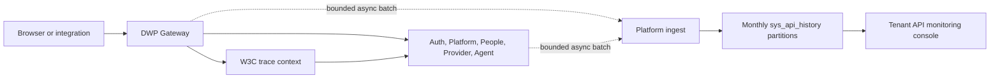

# R0 API 이력 및 운영 관측 ADR

> 상태: Accepted / Local baseline implemented
> 적용 저장소: `dwp-backend`, `dwp_agent`, `dwp-frontend`
> 기준: OpenTelemetry HTTP Semantic Conventions, W3C Trace Context, OWASP Logging

## 1. 결정

DWP의 모든 HTTP 진입점은 업무 처리와 분리된 비동기 Publisher를 통해 개인정보를
최소화한 API 교환 메타데이터를 중앙 Platform Collector로 전송한다. Gateway와 각
Service는 같은 요청을 서로 다른 `observation_point`로 기록하고 W3C `traceparent`로
연결한다.

API 이력은 운영 관측 데이터다. 누가 기준정보를 변경했는지 증명하는 관리 감사로그,
보안 원장, 분산 Trace 원본을 대체하지 않는다. 이 세 데이터는 목적·보존기간·접근권한이
다르므로 하나의 테이블에 합치지 않는다.

## 2. 수집 원칙

- 요청 처리 Thread는 DB 또는 Collector 응답을 기다리지 않는다.
- 메모리 Queue는 유한하며 포화 시 본 요청은 성공시키고 관측 이벤트만 폐기한다.
- Batch는 최대 200건, 기본 Queue 4,096건, Flush 1초, 전송 재시도 3회다.
- Collector 호출 자체는 재수집하지 않아 재귀 이력을 방지한다.
- 전송 Token과 선언한 Service 이름을 확인하고 Batch 전체의 `service_name` 일치를 검증한다.
- 운영 환경에서는 공용 Token을 사용하지 않고 Workload별 Secret 또는 mTLS Identity로
  교체한다.
- `trace_id`, `span_id`, `parent_span_id`는 W3C Trace Context 형식을 따른다.
- Client 취소는 `status_code=499`, `outcome=CANCELLED`로 분류한다.

## 3. 데이터 계약

`dwp_platform.sys_api_history`는 월 단위 Range Partition을 사용하는 Append-only 운영
Index다. 기본 보존기간은 90일이며 일일 Maintenance가 현재 월과 다음 두 달 Partition을
보장하고 만료 Partition을 Drop한다.

| 분류         | 컬럼                                                                                                                                                                                                   |
| ------------ | ------------------------------------------------------------------------------------------------------------------------------------------------------------------------------------------------------ |
| 식별·시간    | `history_id`, `occurred_at`, `completed_at`, `ingested_at`                                                                                                                                             |
| Tenant·Actor | `tenant_id`, `actor_type`, `actor_id`, `auth_type`                                                                                                                                                     |
| 배포 단위    | `service_name`, `service_version`, `service_instance`, `environment`                                                                                                                                   |
| HTTP         | `observation_point`, `route_id`, `http_method`, `route_template`, `request_path`, `http_scheme`, `http_protocol`, `status_code`, `outcome`, `duration_ms`, `request_size_bytes`, `response_size_bytes` |
| 연결성       | `correlation_id`, `trace_id`, `span_id`, `parent_span_id`                                                                                                                                              |
| 최소화 정보  | `client_address_hash`, `user_agent_family`, `user_agent_hash`, `error_type`, `capture_policy_version`                                                                                                  |

주요 조회 Index는 Tenant+시간, Service+시간, Route+시간, Trace ID, 5xx Partial Index와
시간 BRIN이다. 모든 관리자 조회는 `tenant_id` 조건을 강제하고 Cursor에는 Tenant와
Filter Fingerprint를 포함해 HMAC 서명한다.

## 4. 개인정보와 보안

다음 데이터는 수집을 금지한다.

- Request/Response Body
- Query String과 URL Fragment
- Authorization, Session Cookie, API Key와 CSRF Token
- 원본 IP 주소와 전체 User-Agent
- Email·사번·파일명 등 Path에 포함된 직접 식별자

Path의 UUID, 숫자 ID, 장문 Hex, Token 유사 Segment와 Email은 Placeholder로 치환한다.
IP와 User-Agent는 환경별 Secret으로 HMAC-SHA-256 처리하며 Secret이 없으면 저장하지
않는다. 관리자 화면은 `ADMIN.API_MONITORING:VIEW`를 가진 관리자에게만 노출하고 Backend는
신뢰된 Gateway Identity, 관리자 Role과 Tenant Scope를 재검증한다.

## 5. 운영 조회 계약

- `GET /api/platform/v1/admin/api-history/overview`: 처리량, 오류율, p50/p95/p99,
  상태 분포, 추세와 상위 Route
- `GET /api/platform/v1/admin/api-history/events`: 서명 Cursor 기반 상세 목록
- `GET /api/platform/v1/admin/api-history/events/{historyId}`: 동일 Tenant의 요청과 Trace Hop
- `POST /internal/observability/api-history`: 내부 Batch 수집 전용

관리 화면은 1시간·6시간·24시간·7일·30일 범위, Gateway/Service 관측점, 서비스,
HTTP Method, 결과와 Route/Correlation/Trace 검색을 지원한다. Body·Query가 없으므로
화면에서도 이를 복원하거나 추론하지 않는다.

## 6. 운영 전환 Gate

현재 Direct HTTP Collector와 PostgreSQL은 로컬 개발 및 초기 Tenant 규모의 운영
Baseline이다. 다음 조건 중 하나를 만족하면 Publisher Port 뒤를 OpenTelemetry
Collector와 Durable Queue로 교체한다.

- 지속 500 RPS 이상 또는 Peak Queue Drop 발생
- 다중 Region, 30일 초과 고해상도 분석 또는 장기 규제 보관 필요
- Trace·Metric·Log를 하나의 Backend에서 연계해야 함

Production Gate는 Workload Identity/mTLS, Collector HA, Durable Buffer, KMS Secret,
Exporter Drop·Retry Metric Alert, 저장소 암호화, 파티션 용량 예측, 삭제 증적과 SIEM/APM
연동 승인이다. PostgreSQL 이력은 운영 제어면 Index로 유지하고 원본 Telemetry의 영구
저장소로 확장하지 않는다.

## 7. 근거

- [OpenTelemetry HTTP semantic conventions](https://opentelemetry.io/docs/specs/semconv/http/http-spans/)
- [W3C Trace Context](https://www.w3.org/TR/trace-context/)
- [OWASP Logging Cheat Sheet](https://cheatsheetseries.owasp.org/cheatsheets/Logging_Cheat_Sheet.html)
- [PostgreSQL Table Partitioning](https://www.postgresql.org/docs/current/ddl-partitioning.html)
