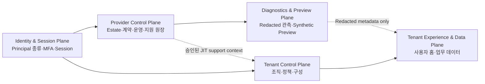
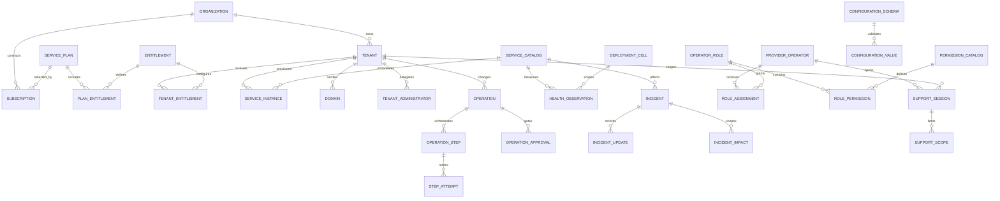
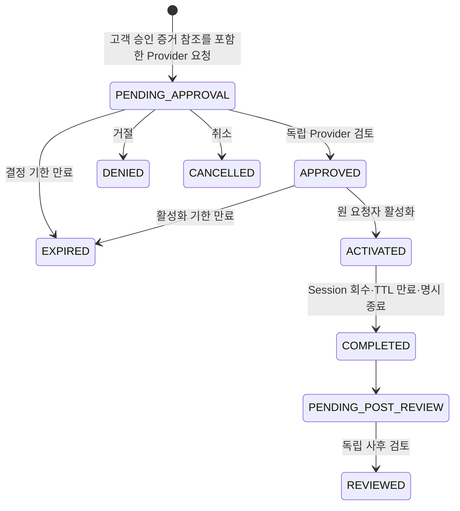

# R0 Provider Control Plane 및 Tenant Estate ADR

> 상태: Accepted. Provider/Tenant Hardening v1.4 software baseline, Production external gates pending
>
> 기준일: 2026-08-27
>
> 적용 저장소: `dwp-frontend`, `dwp-backend`

이 문서는 Provider가 여러 고객 Tenant를 운영·지원할 때의 **정본 ADR**이다. Tenant 내부
관리 모델은 [R0 Platform Control Plane 및 Admin Governance ADR](./R0%20Platform%20Control%20Plane%20및%20Admin%20Governance%20ADR.md),
역할·위임의 일반 규칙은 [R1 권한 계층 및 앱 접근 거버넌스 ADR](./R1%20권한%20계층%20및%20앱%20접근%20거버넌스%20ADR.md)을 따르되,
Provider Principal, 지원 접근, Tenant Context 전환과 고객 데이터 경계가 충돌하면 이 ADR을
우선한다. `필수`, `금지`, `해야 한다`는 Release Gate에서 예외 없이 검증하는 규범이다.

## 1. 결정 배경

DWP는 여러 회사에 전달되는 SaaS이므로 회사 관리자용 관리 센터와 DWP 운영자용
Provider Control Plane을 분리한다. Provider 운영자는 전체 고객 자산과 개통 작업을
관리하고, 회사 관리자는 자신이 속한 회사의 사용자 경험과 접근 정책만 관리한다.

숫자 Tenant ID 하나를 회사 자체로 사용하지 않는다. 계약 주체인 회사와 실제 서비스
격리 단위인 Tenant를 분리해야 한 회사의 운영·검증 환경, 복수 지역 배치와 계약 이력을
안전하게 확장할 수 있다.

### 1.1 Persona와 운영 질문

| Persona                                | 소속과 기본 Context | 반드시 답해야 하는 운영 질문                                             | 기본 진입점                                                   | 고객 데이터 접근                        |
| -------------------------------------- | ------------------- | ------------------------------------------------------------------------ | ------------------------------------------------------------- | --------------------------------------- |
| Provider Estate Operator               | DWP Provider 조직   | 어떤 Tenant·Cell·서비스에 고객 영향이 있고 어떤 조치가 필요한가?         | `/provider`                                                   | 불가. 운영 Metadata와 Redacted 진단만   |
| Provider Provisioner·Entitlement Admin | DWP Provider 조직   | 계약한 환경과 권한이 정확히 개통·조정됐는가?                             | `/provider/tenants`, `/provider/commercial`                   | 불가                                    |
| Provider Support Engineer              | DWP Provider 조직   | 재현 가능한 증거만으로 원인을 좁힐 수 있는가, 추가 접근이 정말 필요한가? | `/provider/support`                                           | 승인된 JIT 세션의 허용 Scope만          |
| Provider Approver·Auditor              | DWP Provider 조직   | 요청·변경·비상 접근이 독립 승인과 정책을 지켰는가?                       | `/provider`가 권한별 첫 승인·감사 Surface로 결정              | 변경 불가, Redacted 증거만              |
| Customer Support Access Approver       | 고객 조직           | 어떤 사유·Scope·기간으로 Provider 접근을 허용할 것인가?                  | 현재 외부 고객 승인 System of Record, 향후 Tenant 지원 접근함 | 승인 증거 제공·회수, Provider 권한 없음 |
| Tenant Administrator                   | 고객 조직           | 우리 회사의 구성·사용자 경험·위임 정책은 올바른가?                       | `/admin`                                                      | 자신의 Tenant만                         |
| Tenant Member                          | 고객 조직           | 내 업무·개인화·보안 설정은 무엇인가?                                     | Workspace와 `/account/settings`                               | 본인·위임 업무만                        |

Provider의 첫 대응은 Tenant 화면 진입이 아니라 Estate 상태, 배포, SLO와 Correlation 기반
Redacted 진단이다. UI 구성 재현이 필요하면 Preview 전용 L1 JIT Scope를 요청한다. 이 증거로
해결할 수 없는 구성·Workforce 문제는 고객 측 재현·Support Bundle로 전환하며, 실행 가능한
최소 Projection과 별도 출시 Gate가 생기기 전에는 더 넓은 Scope로 확대하지 않는다.

### 1.2 명시적 Plane과 호출 방향

| Plane                          | 신뢰 경계와 Source of Authority                                                                             | 허용 호출                                                                             | 명시적 금지                                                      |
| ------------------------------ | ----------------------------------------------------------------------------------------------------------- | ------------------------------------------------------------------------------------- | ---------------------------------------------------------------- |
| Identity & Session             | Auth가 불변 `identity_plane`을 Principal에 저장하고 Role Family 일치를 검증하며 MFA·Session Revision을 발급 | 각 Plane이 검증된 Actor Context를 소비                                                | 한 Principal/Session에 Provider·Tenant Role 합성 또는 Plane 변경 |
| Provider Control Plane         | Provider Service가 Estate, 상용, 운영, 지원·승인 원장을 소유                                                | Tenant 서비스의 상태·개통 Adapter, 진단 Projection                                    | Tenant Admin API를 Cross-tenant API처럼 재사용                   |
| Diagnostics & Preview Plane    | 관측 Pipeline과 Preview Renderer가 Redaction·Synthetic Dataset 계약을 소유                                  | 운영 Metadata 읽기. Preview는 승인된 전용 JIT Scope에서 Session-bound Projection 생성 | 사용자 토큰 발급, 고객 본문·개인정보 원문 조회, 업무 명령 실행   |
| Tenant Control Plane           | 현재 Tenant의 Platform·People 등 Domain Service가 정책과 구성을 소유                                        | 자신의 Tenant Data Plane 관리                                                         | 임의 Tenant Header, Provider Role만으로 접근                     |
| Tenant Experience & Data Plane | 각 Domain Service가 사용자·업무 데이터와 목적 기반 권한을 소유                                              | Tenant 구성원·명시적 업무 위임                                                        | Provider 상시 접근, 지원 세션을 사용자 가장으로 변환             |

`계정 설정`은 별도 권한 Plane이 아니라 현재 Principal이 자기 Session·표시 환경을 관리하는
Self-service Surface다. 현재 Plane에 적용되지 않는 설정을 노출하거나 Tenant 설정으로
해석해서는 안 된다.

## 2. 핵심 모델

### 2.1 회사와 Tenant

| 개념      | 테이블                 | 의미                                                    |
| --------- | ---------------------- | ------------------------------------------------------- |
| 회사      | `prv_organizations`    | 계약·고객 관계의 루트이며 법인명과 CRM 참조를 소유한다. |
| Tenant    | `prv_tenants`          | 인증·데이터·배포 격리 단위이며 회사별 환경을 표현한다.  |
| 지역      | `prv_regions`          | 데이터 거주와 가용 지역 카탈로그다.                     |
| 배포 Cell | `prv_deployment_cells` | Region 안에서 장애와 용량을 분리하는 배치 단위다.       |

- 회사와 Tenant는 `1:N`이다.
- `(organization_id, environment_key)`는 유일하다.
- Provider UUID는 전역 제어 식별자이고, 각 서비스의 숫자 Tenant ID는 서비스별 외부
  참조다. 서로 같은 값이라고 가정하지 않는다.
- 고객 데이터 삭제 대신 `SUSPENDED`, `CLOSED`, `RETIRED` Lifecycle을 사용한다.

### 2.2 상품과 구독

- `prv_service_plans`는 `plan_key + plan_version`으로 불변 버전을 보관한다.
- `prv_organization_subscriptions`는 회사별 계약 기간과 계약 참조를 보관한다.
- 종료된 구독은 이력으로 남기고 한 회사에는 현재 구독 하나만 허용한다.
- Plan의 기본 권한은 `prv_service_plan_entitlements`, Tenant별 적용 결과와 Override는
  `prv_tenant_entitlements`에 분리한다.
- Secret, 결제 수단과 계약 문서 원문은 저장하지 않고 외부 시스템 참조만 저장한다.

### 2.3 서비스 배치와 개통

- `prv_service_catalog`는 Auth, Platform, People, Storage 등 프로비저닝 대상을 정의한다.
- `prv_tenant_service_instances`는 Tenant별 서비스 상태, 배포 Cell, 외부 리소스 ID와
  마지막 조정 결과를 소유한다.
- `prv_operations`, `prv_operation_steps`, `prv_operation_step_attempts`는 재시도 가능한
  Saga 원장이다. `idempotency_key`, 단계 순서와 시도 번호는 유일하다.
- 작업 종류는 `prv_operation_type_catalog`에서 위험도, 실행 전략과 요청 Schema를
  버전 관리한다. 신규 작업을 위해 `CHECK` 제약을 매번 수정하지 않는다.
- 부분 실패는 성공한 단계를 삭제하지 않고 재시도 이력과 Redacted 결과를 남긴다.

### 2.4 운영 상태와 통제 원장

- `prv_operation_approvals`는 고위험 변경의 승인 Gate, 요청자, 결정자, 만료 시각과 결정을
  보관한다. 실행 작업과 분리해 승인 정책이 바뀌어도 작업 원장을 다시 쓰지 않는다.
- L3 변경은 승인 전 실행할 수 없고 요청자와 승인자가 같을 수 없다. 거절된 작업은
  취소되며 만료된 승인은 재사용할 수 없다.
- `prv_service_incidents`는 현재 인시던트 Aggregate이고
  `prv_service_incident_updates`는 상태 전이와 고객 커뮤니케이션의 Append-only Timeline이다.
- `prv_service_incident_impacts`는 하나의 인시던트가 여러 서비스·Region·Cell·Tenant에
  미치는 영향을 정규 관계로 보관한다. 인시던트의 직접 Scope 컬럼은 최초 Primary Target이고,
  영향 관계는 복합 장애의 확장 가능한 전체 범위다.
- `prv_service_health_observations`는 서비스·Region·Cell 단위의 시계열 관측값이다. 현재
  상태와 원시 관측 이력을 분리해 Dashboard 조회와 사후 분석을 모두 지원한다.
- Cell의 용량과 경고·위험 임계치는 `prv_deployment_cells`에 명시한다. Tenant 수만 세어
  용량을 추정하지 않는다.
- Incident, Approval, Support Session과 Operation은 모두 Correlation ID를 통해 감사
  이벤트와 연결한다.

## 3. 확장 설정 원칙

정렬·검색·권한·관계·Lifecycle에 사용되는 값은 정규 컬럼으로 둔다. 제품별로 늘어나는
희소 설정만 JSONB를 사용한다.

- `prv_configuration_schemas`: Namespace, Schema 버전, 적용 범위를 등록한다.
- `prv_configuration_values`: 회사, Tenant, 서비스 인스턴스 중 정확히 하나를 소유자로
  갖는다.
- 생성된 `scope_kind`와 복합 외래키가 Schema의 선언 범위와 실제 소유자 범위를 DB에서
  일치시킨다.
- 활성 Schema와 활성 값은 Namespace와 Scope별 하나만 허용하고, 이전 버전은
  `RETIRED`로 보존한다.
- JSON 원문은 Object만 허용한다. 애플리케이션은 저장 전 등록된 JSON Schema로 검증하며
  알 수 없는 Namespace를 임의 저장하지 않는다.
- 비밀번호, Token, API Key는 JSONB에도 저장하지 않는다. Vault의 Credential Reference만
  허용한다.

## 4. 권한과 관리 경계

| 사용자               | 범위                      | 저장 모델                 | 대표 권한         |
| -------------------- | ------------------------- | ------------------------- | ----------------- |
| Provider Admin       | 전체 회사·Tenant          | Provider Operator RBAC    | 전체 운영         |
| Provider Operator    | 전체 자산의 개통·변경     | Provider Operator RBAC    | Estate, Operation |
| Provider Support     | 승인된 Tenant의 제한 시간 | Support Session           | 최소 Scope        |
| Provider Auditor     | 전체 감사 조회            | Provider Operator RBAC    | Read-only         |
| Tenant Administrator | 단일 Tenant               | Tenant Administrator Role | 회사 자체 관리    |

- Provider Operator와 Tenant Administrator는 같은 테이블이나 Role로 합치지 않는다.
- 운영 권한은 `prv_operator_permission_catalog`에 등록하고 Role과 다대다로 연결한다.
- Tenant 관리자 Role과 지원 Scope도 각각 카탈로그로 관리해 새 역할을 데이터로 확장한다.
- 지원 세션은 사유, 최소 Scope, 만료 시각, 단방향 Token Hash와 회수자를 기록한다.
- Provider 권한만으로 고객 Data Plane에 상시 접근하지 않는다. 활성 지원 세션을 별도로
  요구한다.

### 4.1 Provider/Tenant Principal 공존 금지

- Auth는 Principal의 불변 `identity_plane`을 `PROVIDER` 또는 `TENANT` 중 정확히 하나로 저장하고,
  Built-in `role_family`와 `PROVIDER_*` 예약 Namespace가 이 Plane과 일치하는지 DB와 Token 검증에서
  강제한다. 마지막 Role이 제거돼도 Principal Plane은 자동 전환되지 않으며, 전환이 필요하면 기존
  Principal을 폐기하고 다른 자격 증명의 새 Principal을 개통한다. Provider Principal은 고객 Tenant의 구성원·관리자 Role,
  Resource Role, 개인 Workspace Entitlement를 가질 수 없고 Tenant Principal은 `PROVIDER_*`
  Role을 가질 수 없다.
- 이 규칙은 UI 메뉴 필터가 아니라 계정 생성·초대·Role Assignment, Token 발급, Session 복원,
  Gateway와 각 Service PEP에서 모두 강제한다. 충돌 Assignment는 원자적으로 거부하고 기존
  Session을 무효화하며 보안 감사 이벤트를 남긴다.
- 동일한 사람이 Provider 업무와 고객사 내부 업무를 모두 수행해야 하면 **서로 다른 Principal,
  자격 증명과 Browser Profile**을 사용한다. 계정 Link는 사람 식별·감사 상관용일 뿐 권한,
  Session, Tenant Context를 합성하지 않는다.
- `PROVIDER_ADMIN`도 예외가 아니다. 로컬 통합 검증은 역할별 전용 계정을 사용하고,
  `admin@dwp.local`처럼 `ADMIN + PROVIDER_*`가 공존하는 Legacy Seed는 전환 대상이지 허용 모델이
  아니다. 이 호환 Bootstrap 계정은 삭제하지 않고 `PROVIDER_ADMIN` 전용으로 축소하며 Access
  Revision 증가와 전 Session 회수를 수행한다. Production에는 혼합 Principal이 0건이어야 한다.
- Provider Principal은 고객 Tenant 소속이 아니다. 인증에 필요한 Provider Identity Realm 또는
  고정 Provider Organization Context와 지원 대상 Tenant Context를 분리한다. Provider 로그인
  Tenant를 고객 Tenant로 해석하지 않는다.
- 지원 세션은 Provider Principal에 Tenant Role을 부여하지 않는다. `actor_principal_id`,
  `support_session_id`, `target_provider_tenant_id`, `target_auth_tenant_id`, Scope, 만료가 결속된
  별도의 위임 Context이며 세션 종료와 동시에 효력을 잃는다.

### 4.2 승인과 고객 접근

- 일반 지원은 고객 승인 증거 참조를 필수로 하고 만료되는 최소 Scope 세션을 발급한다.
  현재 로컬 Baseline은 명시적 개발 Opt-in에서만 `approvalReference`의 존재와 요청 지문 결속을
  검증하는 `LOCAL_REFERENCE_ONLY` Fixture다. 비로컬 환경은 권위 있는 고객 승인 증거 검증기가
  없으므로 고객 승인 필요 Scope 활성화를 fail-closed한다. DWP가 참조 문자열만으로 고객 승인자의
  신원·서명·Scope를 검증했다고 표현해서는 안 된다.
- 목표 계약은 검증 가능한 Customer Approval Artifact/Webhook 또는 Tenant Admin의 내장 승인 중
  하나를 Tenant별로 구성하는 것이다. 이 연계가 구현되면 증거는 Tenant, 승인자, 승인 Scope,
  최대 기간, 결정 시각, 원 요청 지문과 결속되고 고객이 회수할 수 있어야 한다. 해당 외부 연계
  Gate 전에는 `approvalReference + Provider 검토`가 로컬 E2E Fixture일 뿐이며 비로컬 활성화는
  차단하는 것이 정직한 출시 기준이다.
- 비상 접근은 `BREAK_GLASS_SUPPORT` 권한, L3 위험 표시, 명시적 사유와 강화된 감사를
  요구한다. 일반 지원의 편의 기능으로 사용하지 않는다.
- 변경 승인은 역할 기반 권한뿐 아니라 요청자·승인자 분리, 만료, 낙관적 Version 검사를
  함께 적용한다.
- 감사자에게 조회 권한을 부여하되 변경·승인·지원 세션 생성 권한은 부여하지 않는다.
- 지원 권한은 `prv_support_scope_catalog`에서 위험도와 고객 승인 필요 여부를 관리한다.
  API는 활성 카탈로그를 반환하지만, 현재 Frontend는 실행 가능한 단일 계약
  `TENANT_EXPERIENCE_PREVIEW`만 정확히 허용한다. 신규 Scope는 백엔드 카탈로그 추가만으로 UI에
  자동 노출하지 않고, 정확한 Projection/Command·Frontend 처리·Negative Test가 함께 출시될 때
  명시적으로 확장한다.
- Scope 허용은 **Catalog 승인과 Code Allowlist 승인의 이중 Gate**다. 요청·세션의
  Scope가 활성 Catalog에 있어야 하고, 동시에 `ProviderSupportAccessPolicy`, Gateway와
  대상 Service PEP의 정확한 Method+Canonical Path Allowlist에도 일치해야 한다.
  Catalog만 ACTIVE이거나 Code에만 경로가 있는 편면 변경은 둘 다 거부한다.
- 세션에는 Scope 선택 시 평가된 `customer_approval_required`를 보존한다. 표준 접근은 이
  정책값이 참일 때만 승인 참조가 필수이고, 비상 접근은 별도 권한과 감사 규칙을 따른다.

| Scope                        | Risk | 고객 승인 참조 | 현재 효과                                                                                         |
| ---------------------------- | ---- | -------------- | ------------------------------------------------------------------------------------------------- |
| `TENANT_EXPERIENCE_PREVIEW`  | L1   | 필수           | **ACTIVE.** 정확한 GET Preview Projection만                                                       |
| `TENANT_CONFIGURATION_READ`  | L1   | 필수           | **RETIRED·deny-all.** 전용 최소 조회 Projection 출시 전 재개 금지                                 |
| `WORKFORCE_READ`             | L2   | 필수           | **RETIRED·deny-all.** 신뢰 가능한 Population Provenance와 Field Mask Projection 출시 전 재개 금지 |
| `TENANT_CONFIGURATION_WRITE` | L3   | 필수           | **RETIRED·deny-all.** 승인·복구·감사 통제와 정확한 Command 출시 전 재개 금지                      |

### 4.3 JIT 지원 접근 Lifecycle과 직무 분리

지원 요청 원장은 위 상태를 사용하고, 요청이 `ACTIVATED`인 동안 연결된 지원 Session 원장은
`ACTIVE → REVOKED | EXPIRED`를 별도로 기록한다. 요청과 Session 상태를 하나의 값으로 합치지
않는다.

현재 원장의 `PENDING_APPROVAL`은 `approvalReference`를 입력 증거로 받고 Provider 독립 검토를
대기하는 상태다. 고객 승인이 DWP 안에서 이미 완료됐다는 상태로 해석하지 않는다. 향후 검증
가능한 고객 승인 연계를 도입할 때만 `PENDING_CUSTOMER_APPROVAL → PENDING_PROVIDER_REVIEW`를
별도 상태와 결정자로 추가한다. 이 목표 상태를 현재 구현·출시 증거로 사용하지 않는다.

1. **진단 우선:** Support Engineer는 Tenant, 장애·Case/Ticket, 목적, 필요한 최소 Scope,
   5~60분 기간, 기대 확인 항목과 고객 승인 증거 참조를 제출한다. 요청 지문과 Idempotency
   Key에 Tenant·Scope·기간·사유·승인 참조를 포함한다.
2. **Provider 독립 검토:** `SUPPORT_ACCESS_REVIEW` 권한자가 외부 고객 승인 System of Record의
   참조와 정책·Scope를 확인하고 결정 근거를 남긴다. 요청자와 같은 Principal일 수 없다.
   DWP 내부 Customer Approval 연계 전에는 이 검토가 증거 진위 확인의 통제점이다.
3. **활성화:** 원 요청자만 승인 유효기간 안에 Step-up 인증 후 활성화한다. 활성화 시점부터
   요청된 5~60분 TTL을 계산하고 원문 Token은 재발급하지 않는다. Phishing-resistant MFA와
   최근 인증 시간 강제는 Production Identity Gate이며, 연계 전에는 구현 완료로 표시하지 않는다.
4. **사용:** 매 요청마다 Actor, 정확한 Tenant, Session, Method+Route Allowlist, Scope,
   만료·회수·Session Revision을 검증한다. 15분 Idle 시 자동 종료하고 TTL 연장은 새 요청으로만
   허용한다. V46의 DB 시간 기반 last-used/idle containment와 회귀 Test가 15분 Idle Timeout을
   강제하며, Client Timer나 화면 상태를 권위로 사용하지 않는다.
5. **종료·회수:** TTL, 사용자 종료, Provider 회수, 보안 Kill Switch 중 하나면 다음 요청부터
   즉시 거부한다. 현재 고객 회수는 승인 System of Record/지원 채널을 통해 Provider가 즉시
   집행하고, 향후 고객 승인 연계가 직접 회수 신호를 전달한다. Cookie와 Client Cache를 지우고
   Provider Context로 복귀한다.
6. **사후 검토:** 요청자 이외의 Auditor가 실제 사용 Scope, 허용·거부 명령, 결과와 이상 징후를
   1영업일 안에 검토한다. 비상 접근은 종료 후 24시간 안에 검토와 고객 통지를 완료한다.

사후 검토는 화면에 보이는 최근 이벤트 몇 건만으로 완료할 수 없다. Provider Service가 정확한
요청·세션·Tenant·증거 시간 범위를 결속하고 전체 Audit 집합을 집계한 뒤 표시용 최신 6건만
절단한다. `ALLOW`는 `GET + /api/platform/v1/admin/tenant-experience-preview +
TENANT_EXPERIENCE_PREVIEW + canonical correlation`의 결합만 인정한다. `DENY`도 정본 exact 경로
또는 안전한 Route Template과 canonical correlation을 요구한다. Cross-tenant/session,
비정본 Method·경로·Correlation, 집계 불일치가 하나라도 있으면 `evidenceComplete=false`로
검토를 차단한다. 실제 사용이 없으면 전체 증거 범위가 완전하고 Session이 Terminal인 경우에만
명시적 `noUseConfirmed`로 완료할 수 있다. UI 판정과 DB의 원자적 `REVIEWED` 전환은 같은
Classifier를 사용해야 하며 어느 한쪽만 완화할 수 없다.

현재 DWP가 강제하는 직무 분리의 최소 단위는 `요청자 ≠ Provider 검토자`,
`요청자 ≠ 사후 검토자`다. 고객 승인자는 외부 증거의 Actor이므로 Provider 검토자가 고객
승인자의 신원과 범위를 확인한다. 향후 고객 승인 연계가 완료되면
`Provider Principal ≠ 고객 승인자`도 시스템 불변식으로 승격한다. 쓰기 Scope는 요청자·고객
승인 증거·Provider 검토자·실행 Actor를 감사에서 구분하고, 동일 요청의 Provider 검토자는
지원 중 변경 명령을 실행할 수 없다.

Break-glass는 진행 중인 SEV1/SEV2 Incident ID, 최근 MFA, 전용 `BREAK_GLASS_SUPPORT`, 최대
30분, 최소 Scope와 명시적 예상 고객 영향을 요구한다. 고객 사전 승인을 우회할 수 있지만
Provider 독립 사후 검토와 고객 통지를 없애지 않는다. 생성 즉시 Security·On-call Approver에게
경보하고, 고객 통지는 안전을 해치지 않는 가장 이른 시점과 늦어도 종료 후 24시간 이내에
보낸다. 자동 연장, 대량 Export, 사용자 가장, Secret 조회는 비상 접근에서도 금지한다.
현재 Incident 결속, 최근 MFA Assurance, 즉시 Alert와 고객 통지 연계가 모두 구현되지 않았으므로
Break-glass는 RETIRED Scope나 운영 토글로 끄는 kill-switch 상태가 아니라, Service Code가
`INVALID_STATE`로 **무조건 fail-closed하는 disabled 기능**이다. UI도 활성화 동작을 노출하지
않는다. 위 네 통제와 Negative/E2E 증거를 구현한 새 정책·forward 변경이 따로 출시되기
전에는 `BREAK_GLASS_SUPPORT` Permission이 있어도 세션을 만들 수 없다.

### 4.4 지원 세션의 실행 경로

- 지원 세션 원문 Token은 API 응답과 JavaScript에 반환하지 않는다. DB에는 SHA-256 Hash만
  저장하고 Browser에는 `HttpOnly`, `SameSite=Strict`, Production `Secure` Cookie로 발급한다.
  Browser Cookie의 실제 `Path`는 현재 `/api/provider/v1/admin/`, `/api/auth/`,
  `/api/platform/v1/admin/`의 **coarse Service Prefix**다. Cookie Path를 권한 Allowlist로
  해석하지 않고, 실제 지원 권한은 Gateway가 정확한 GET Preview Projection 하나에만
  투영한다. Tenant product-surface Context·Authority 평가·Governed Route 평가·Step-up 경로에는
  지원 Cookie를 해석하거나 지원 권한을 투영하지 않는다.
- Gateway는 외부 요청의 지원 관련 Header를 모두 제거한다. 지원 Cookie가 포함된 Platform·
  People 요청은 Provider 내부 검증 API에서 현재 운영자, 대상 Tenant, 만료, 회수 상태와
  요청 Method·Path별 Scope를 매 요청 다시 검증한다.
- 검증 성공 시에만 Gateway가 인증 세션의 Provider Actor Identity Context를 보존하고 대상
  Auth Tenant ID를 별도 내부 Tenant Header에 설정한다. 전환 기간의 원 로그인 Tenant 값은
  고객 소속 권한으로 해석하지 않는다. 검증 실패는 `403`, Provider 검증 장애는 `503`으로 닫힌다.
- Platform과 People Service도 지원 Session ID, Provider Actor Context, 대상 Tenant와 Scope를
  다시 확인한다.
  Legacy 혼합 Role이 발견돼도 요청을 거부하며, 읽기 전용 세션으로 변경 API를 호출하거나
  허용 목록 밖의 Tenant Admin API에 접근할 수 없다.
- 현재 실행 가능한 지원 범위는 `TENANT_EXPERIENCE_PREVIEW` 하나뿐이며 GET
  `/api/platform/v1/admin/tenant-experience-preview`와 정확히 일치해야 한다.
  `TENANT_CONFIGURATION_READ`, `TENANT_CONFIGURATION_WRITE`, `WORKFORCE_READ`는 Catalog에서
  `RETIRED`이고 Gateway와 대상 Service에서 deny-all한다. 새 Projection·Command는 Scope Catalog,
  정확한 Method+Route, 대상 Service PEP, 감사·복구 계약과 별도 출시 증거를 함께 갖춰야 재개한다.
  `/people/{id}`, HRIS Connector, Export, Reference Data와 Workforce Admin 경로는 명시적 부정 테스트
  대상이다. 지원 모드에서는 Frontend Navigation도
  같은 범위만 노출하고, 대상 Tenant·만료·접근 모드를 고정 Banner로 표시하며 종료 시 Provider
  범위로 복귀한다.
- 허용, 거부와 회수는 Support Session ID와 Correlation ID로 Provider 감사 원장에 남긴다.

### 4.5 다중 Tenant Context 전환 계약

- Provider Estate에서 Tenant 행을 선택하는 것은 **조사 Scope 선택**일 뿐 Tenant 로그인이나
  `/admin` 전환이 아니다. Provider URL은 `providerTenantId`를 사용하고 Tenant 업무 API용
  `authTenantId`를 Browser가 직접 만들지 않는다.
- 지원 Context는 Provider Operator당 모든 Browser·Device를 합쳐 동시에 하나의 Tenant만
  활성화한다. DB는 활성 Session Partial Unique Index로 이를 강제한다. 다른 Tenant로 전환하려면
  기존 지원 Context를 명시적으로 종료·회수한 뒤 새 요청을 활성화해야 한다.
- 지원 진입은 새 Top-level Navigation으로 열고 `window.opener`를 제거하며 Tenant 이름·환경·
  Region·Session ID 단축값·Scope·남은 시간을 지속 Banner에 표시한다. 색상만으로 일반 관리
  Context와 구분하지 않는다.
- Gateway만 검증된 지원 Context에서 대상 `authTenantId`를 내부 Header로 투영한다. Actor의
  Provider Realm/Organization, 원 Principal과 Session ID를 별도 내부 Header와 Trace Attribute로
  보존한다. Client가 보낸 Tenant·Support Header는 항상 제거한다.
- 현재 Baseline의 지원 화면은 React Query만 사용하며 전환·종료 시 민감 Query를 취소·삭제하고
  일반 Provider Query와 Key를 공유하지 않는다. 지원 화면은 IndexedDB, Service Worker,
  SSE/WebSocket, 다운로드를 만들지 않는다. 이 채널을 향후 도입하려면
  `effective_principal_plane + actor_session_id + support_session_id + target_tenant_id` 격리와
  전환 시 폐기를 별도 Release Gate로 통과해야 한다.
- Bookmark·뒤로 가기·새로 고침은 활성 세션 재검증 뒤에만 같은 Tenant로 복원한다. 만료·회수,
  불일치, Provider 검증 장애는 Fail closed로 `/provider/support`에 복귀시키며 다른 Tenant나
  기본 SKAX Tenant로 Fallback하지 않는다.

### 4.6 진단, 지원 접근과 사용자 가장의 구분

| 기능                    | Actor가 보는 것                                   | 고객 승인          | 쓰기                             | 사용자 `sub`/Token  | 정책                          |
| ----------------------- | ------------------------------------------------- | ------------------ | -------------------------------- | ------------------- | ----------------------------- |
| Estate Diagnostics      | 상태, Version, 오류 분류, Redacted ID·Count·Trace | 불필요             | 운영 원장에만 별도 권한으로 가능 | 발급 안 함          | Provider 기본 조사 경로       |
| Safe Experience Preview | 제한된 Tenant 브랜딩·홈 구조, 업무 Data 없음      | STANDARD 승인 필수 | 불가                             | 발급 안 함          | `TENANT_EXPERIENCE_PREVIEW`만 |
| JIT Support Session     | 현재는 Preview 전용 Tenant 구성 Projection        | 표준 접근 필수     | 현재 불가                        | Provider Actor 유지 | 4.3~4.5 준수                  |
| User Impersonation      | 실제 사용자의 개인화·업무 데이터                  | 해당 없음          | 해당 없음                        | 필요하게 됨         | **현재 금지·미구현**          |

지원 세션의 `subject`는 항상 Provider Principal이다. 대상 사용자의 `DWP_SESSION`이나 향후
도입될 재발급 Credential을 복제·발급하거나, 감사 Actor를 대상 사용자로 기록하거나, UI에서 `사용자로 로그인`처럼
표현해서는 안 된다. 실제 사용자 상태가 필요한 문제는 사용자가 명시적으로 생성한 Redacted
Support Bundle 또는 공동 화면 공유로 재현한다. 향후 Impersonation이 필요하면 법무·개인정보·
노무 승인, Tenant Opt-in, 사용자 통지, 금지 데이터 범위와 별도 ADR/Threat Model이 승인되기
전에는 구현하지 않는다.

### 4.7 안전한 Tenant Experience Preview 계약

Preview의 목적은 Tenant가 배포한 브랜딩·Navigation·홈 구성의 구조적 문제를 고객 데이터 없이
재현하는 것이다. 실제 사용자 홈의 복제본이 아니다.

- Preview는 L1·고객 승인 필요 Scope `TENANT_EXPERIENCE_PREVIEW`의 STANDARD JIT 지원 세션과
  GET `/api/platform/v1/admin/tenant-experience-preview`에서만 제공한다. `ESTATE_READ`나 일반
  Provider Role만으로 호출할 수 없고 다른 Preview 경로를 만들지 않는다.
- 대상 Tenant는 활성 지원 세션에서 Server가 결정하고 Client Query·Header의 Tenant ID를 받지
  않는다. Renderer 입력은 응답의 Contract·Branding·Home Version, Locale, Viewport Profile,
  만으로 고정한다. 현재 `TENANT_CONFIGURATION_ONLY` Preview는 Persona나 업무 Fixture를 받지
  않는다. 임의 User ID, Email, 사번, 검색어, 업무 객체 ID를 받을 수 없다.
- Backend Projection은 Tenant Branding과 Home 구성의 텍스트·수치·구조만 반환한다. Asset URL,
  파일명, Actor, User/Workforce, Live Announcement는 제외한다. Draft, Secret, 사용자 Preference,
  알림·메일·문서·결재·일정·급여·조직 구성원 원문도 조회하지 않는다.
- 퇴역한 `TENANT_CONFIGURATION_READ`는 공지뿐 아니라 모든 구성 목록·상세·Runtime API를
  허용하지 않는다. 본문·Audience·Action/Cover URL·Actor·Engagement를 제거한 실행 가능한
  전용 Projection이 생기기 전까지 공지 진단도 닫힌 상태로 유지한다.
- 응답 계약은 `contractVersion=tenant-experience-preview.v1`,
  `previewMode=TENANT_CONFIGURATION_ONLY`다. Asset은 `logoConfigured`·`backgroundConfigured`와
  크기·배치 수치만 반환하고 위치는 반환하지 않는다. `excludedData`는
  `USER_PERSONALIZATION`, `USER_CONTENT`, `WORKFORCE_DATA`, `LIVE_ANNOUNCEMENTS`,
  `ASSET_LOCATIONS`, `AUDIT_ACTOR_METADATA`를 명시한다.
- 현재 Renderer는 실제 업무 Data를 전혀 채우지 않고 제품 Localized Fallback과 제한된 Tenant
  구성만 표시한다. 향후 Widget 상태 예시가 필요하면 제품이 소유한 비개인 Synthetic Fixture만
  사용한다. 이름·Email·Avatar·회사 사건은 명백한 가상 값이며 실제 Tenant 데이터를 샘플링·
  마스킹해 만들지 않는다.
- Preview Renderer는 활성 지원 Context와 전용 Network Allowlist만 사용한다. 별도 사용자 Token을
  발급하지 않으며 모든 업무 Mutation, Export, 외부 Link, Webhook, Notification, Agent/Model
  호출과 Data Plane API를 차단한다.
- 화면 전체에 `합성 데이터 미리보기`, 대상 Tenant·환경, Revision, 생성 시각 Watermark를
  표시한다. 현재 화면은 별도 Screenshot/Export 기능을 제공하지 않으므로 화면 캡처에는 표시된
  Watermark가 그대로 포함된다. 향후 Export/Capture 기능은 결과물 자체 Watermark를 별도 Gate로
  검증하기 전까지 추가하지 않는다. `실제 사용자에게 보이는 값`이라고 표현하지 않는다.
- 현재 Baseline은 응답을 영구 Snapshot으로 저장하지 않고 지원 Session 범위의 단기 Client
  Cache만 사용한다. Contract·Branding·Home Version은 화면에 표시하고 지원 호출의 진입 Audit는
  Session·Correlation로 연결한다. 응답 Version까지 Audit Event에 결속하는 기능과 영구
  `preview_snapshot_id`, Renderer/Fixture Version과 SHA-256은 후속 Backend Evidence Gate다.
  Preview 실패는 실제 Tenant 상태 정상으로 Fallback하지 않는다.
- 특정 사용자의 문제는 Preview에서 해결됐다고 판정하지 않는다. 구조 재현이 안 되면 사용자
  동의 기반 Redacted Support Bundle로 전환하고 Bundle에는 Allowlist Field, 자동 Redaction,
  단일 Case, 목적, 만료와 다운로드 감사를 적용한다.

### 4.8 계정 설정 적용 정책

| 설정 영역                                                   | Tenant Member/Admin       | Provider Principal                                                       | 활성 지원 Context                                                                         |
| ----------------------------------------------------------- | ------------------------- | ------------------------------------------------------------------------ | ----------------------------------------------------------------------------------------- |
| Profile 원천·Provider 역할 확인                             | 자신의 Tenant/회사 정보   | Auth Identity 정보와 Provider 운영 역할, 읽기 중심                       | `/account` 열람 금지·`/provider/support` redirect. Provider Actor 정보는 지원 화면에 유지 |
| 보안·활성 Session·MFA                                       | 허용                      | Auth Session 조회·종료. MFA 상태는 Provider IdP 계약 도입 전 관리 안내만 | `/account` 열람 금지. 지원 Session 종료는 Provider 지원 화면·Banner에서 제공              |
| 언어                                                        | 허용                      | Auth `preferredLocale`                                                   | 기존 Provider 값을 표시에 적용하되 `/account` 편집은 금지. 대상 Tenant에 저장 금지        |
| Theme·대비·Motion·Density·시간대·날짜·숫자 등 비민감 표시값 | 허용                      | Browser-local Provider Preference                                        | 같은 Provider 값을 보존·적용하되 `/account` 열람·편집은 금지. 대상 Tenant에 저장 금지     |
| Provider 운영 알림                                          | 해당 없음                 | Provider 알림 계약 도입 시 역할별 제공                                   | 지원 중에도 Tenant 개인 알림 설정은 숨김                                                  |
| 개인 홈·Widget·업무 앱 알림                                 | 허용                      | 숨김                                                                     | 숨김                                                                                      |
| Tenant 관리형 설정·예외 요청                                | 자신의 Tenant 정책에 따라 | 숨김                                                                     | 숨김. Provider는 `/admin`에 진입하지 않으며 현재 지원 세션은 읽기 전용 Preview만 허용     |

Provider에게도 보안·Session, 접근성·표시 환경 설정은 필요하다. 현재 Baseline은 Auth Session
조회·종료를 제공하지만 MFA Assurance/등록 상태 Projection은 아직 없으며 Provider IdP가 관리한다는
안내만 표시한다. 이를 확인 가능한 MFA 상태로 표현하지 않는다. Provider 지원 Session은 Account
화면이 아니라 지속 Banner와 `/provider/support`에서 조회·종료한다. 또한 Provider
Context에서 Tenant Branding·`personal-preferences` API를 호출하지 않고, 언어는 Auth
`preferredLocale`, 비민감 Appearance·Accessibility·Regional 표시값은
`dwp.provider-realm-preference.v2:realm:DWP_PROVIDER:user:<user>` Browser `localStorage`에
격리한다. 동일 사용자의 Legacy v1 값은 허용 Namespace만 정규화해 v2로 이관한 뒤 제거한다. 이 값은
Cross-device Server Sync가 없음을 화면에 정직하게 표시하며 Secret, Tenant ID, 고객 데이터,
지원 Session과 보안 설정을 저장하지 않는다. 지원 Tenant가 바뀌어도 같은 Provider 표시값만
적용하고 대상 Tenant Preference를 읽거나 쓰지 않는다.

Provider Principal 범위의 Versioned Server Preference는 후속 Backend Gate다. 구현 전에는
Browser-local 저장을 서버 동기화 완료로 표현하지 않는다. `(tenant_id, user_id)` 개인 홈 설정을
Provider 계정에 억지로 생성하거나 SKAX Tenant 정책을 상속하지 않는다. Frontend Navigation,
설정 Applicability와 API 호출 Gate가 일치해야 하며 숨겨진 경로의 직접 URL과 Tenant Preference
저장 호출도 거부한다. 현재 Frontend에서 Provider가 Tenant-only `home`, `notifications`,
`managed` 설정 URL을 직접 열면 `404/403` 화면이 아니라 허용된
`/account/settings/appearance`로 safe redirect하고 Tenant API는 호출하지 않는다. Provider의 평상 경로는
`/provider/**`와 제한된 `/account` self-service이며 `/admin/**`, 개인 홈과 Tenant 업무 Route는
지원 중에도 금지한다. Provider에게 활성 지원 Context가 있으면 `/account` 하위 전체는
`/provider/support`로 redirect하며, 기존 Provider Browser-local Preference는 보존하되 지원 중에는
열람·편집하지 않는다.

## 5. 도메인과 관리자 초대

- 내부 Fallback 도메인은 항상 검증된 Primary로 먼저 유지한다.
- 고객 도메인은 DNS 검증이 끝나기 전 `requested_primary` 후보일 뿐 Primary가 아니다.
- 검증된 도메인만 원자적으로 Primary로 승격한다.
- 관리자 식별자는 정규화한 Email이며 Principal 문자열을 중복 보관하지 않는다.
- Provider API·UI·감사·Log에는 관리자 초대·활성화·복구 Token 원문과 활성화 URL을 절대 반환하지
  않는다. Token Hash와 만료만 Auth가 소유한다.
- 이미 `ACTIVE`인 고객 관리자에게 초기 초대 Token을 다시 발급하거나 초대 흐름으로 비밀번호를
  교체할 수 없다. 계정 복구는 고객 IdP 또는 고객이 승인한 별도 Recovery Workflow다.
- 신규 관리자의 활성화 Secret은 검증된 고객 소유 Email/IdP 채널로 직접 전달해야 한다. 이
  Out-of-band 전달 연계가 없으면 Provider의 초대 발급 API와 UI는 fail-closed하며 성공으로
  표시하지 않는다.
- 현재 Runtime의 Provider 관리자 초대 API는 모든 발급 시도를 `409 RESOURCE_CONFLICT`로
  fail-closed한다. 생성 OpenAPI도 성공 `200`을 제거하고 `409`
  `AdministratorInvitationConflictError`(`E1009`)만 명시하며, Contract Test가 이 계약과
  활성화 Token·Path 부재를 강제한다.

## 6. Control Plane 업무 구조

Provider Control Plane은 테이블 중심 메뉴가 아니라 운영 의사결정과 통제 흐름을 기준으로
다음 일곱 업무 영역을 제공한다.

| 업무 영역        | 운영 질문                                     | 핵심 기능                                       |
| ---------------- | --------------------------------------------- | ----------------------------------------------- |
| 운영 지휘        | 지금 고객 영향이나 조치가 필요한가?           | 상태 요약, 우선 조치 큐, 서비스·Cell 포트폴리오 |
| 고객 및 Tenant   | 어떤 고객 환경이 어디에 어떤 상태로 배치됐나? | 회사·환경·Region·Cell·Lifecycle 탐색            |
| 변경 통제        | 어떤 변경이 승인·실행·재시도 중인가?          | 위험도 Gate, 승인 분리, 단계별 실행 원장        |
| 서비스 운영      | 서비스 열화와 고객 영향은 무엇인가?           | 상태 Matrix, 용량, Incident 선언·상태 전이      |
| 권한 있는 지원   | 고객 데이터 접근이 승인되고 제한됐나?         | 표준 지원, 비상 접근, Scope·만료·회수           |
| 구독 및 권한     | 계약과 제품 권한이 실제 배포와 일치하는가?    | Plan 버전, 구독 갱신, Entitlement 채택          |
| 거버넌스 및 감사 | 누가 무엇을 왜 수행했고 결과는 무엇인가?      | 범주·결과·Tenant·Correlation 기반 조사          |

- `ESTATE_READ` Operator의 첫 화면은 전 고객 상태와 조치 큐를 제공하고, 상세 목록은 조사 또는
  실행 문맥으로 Drill-down한다. `/provider`는 서버가 반환한 읽기 권한으로 첫 허용 Surface를
  결정한다. Release·Data 승인자에게 Landing을 위해 `ESTATE_READ`를 추가하지 않으며 각각
  Feature rollout·Data governance로 진입한다.
- Health, Commercial, Audit는 단순 통계가 아니라 Incident, Renewal, Privileged Access 같은
  실행 가능한 위험을 표면화한다.
- 위험 작업은 Dialog에서 영향 범위와 사유를 검토한 뒤 실행하며 결과는 비동기 원장에
  남긴다.
- 좁은 화면에서는 좌측 Navigation을 Drawer로 전환하고 지표와 조치 큐를 한 열로 재배치한다.

## 7. 감사와 운영 안전성

- 모든 Provider 변경은 Actor, 회사, Tenant, Target, 결과, Correlation ID와 Redacted
  Snapshot을 `prv_audit_events`에 기록한다.
- `sys_audit_outbox`는 같은 트랜잭션에서 감사 전달 이벤트를 생성하며 재시도와 Dead 상태를
  보존한다.
- 운영 객체는 `version`으로 낡은 화면의 변경을 `409`로 거부한다.
- 대량 시간순 감사 조회에는 BRIN, Tenant·Operator별 조회에는 B-tree 인덱스를 사용한다.
- 외래키는 기본적으로 삭제를 제한한다. 감사·계약·개통 이력을 Cascade 삭제하지 않는다.

### 7.1 신뢰성 의사결정과 예정 유지보수

- `prv_service_level_objectives`는 목표·범위·측정 창을, Append-only
  `prv_service_level_snapshots`는 달성률·오류 예산·Burn rate를 보존한다. 상태 숫자만
  표시하지 않고 배포 중단이나 조치 판단의 입력으로 사용한다.
- `prv_governance_controls`와 시간순 `prv_governance_evaluations`는 기대 상태와 관측 상태를
  분리한다. 최신 비준수 결과만 운영 화면에 노출하되 원 평가 이력은 덮어쓰지 않는다.
- 예정 유지보수는 `prv_maintenance_windows`와 `prv_operations`가 1:1로 연결된다. 요청 시
  창은 `DRAFT`, 작업은 `PREVIEWED / L3`이며 요청자와 다른 Provider Admin의 승인을 받은
  뒤 `SCHEDULE_MAINTENANCE` 단계가 성공해야만 `SCHEDULED`가 된다.
- 고객 통지 시각, 최소 통지 시간, 실제 영향 초, 범위 대상은 검색 가능한 정규 컬럼과 DB
  제약으로 검증한다. 설명과 공급자별 확장 정보만 JSONB에 둔다.
- 승인 거절은 작업과 유지보수 창을 함께 취소하고, 실행 실패는 Tenant 온보딩 상태를
  변경하지 않는다. 모든 전이는 동일 Operation ID와 Correlation ID로 감사된다.

### 7.2 데이터 수명과 확장

- 자주 변경되는 현재 상태는 Aggregate Table, 재생과 조사가 필요한 변경은 Append-only
  Timeline Table에 저장한다.
- 감사와 상태 관측은 시간순 BRIN과 Tenant·서비스·운영자별 B-tree를 함께 사용한다.
- 데이터량이 운영 기준을 넘을 때 월 단위 Partition과 보존 정책을 적용할 수 있도록 시간
  컬럼과 단방향 참조를 유지한다. 초기 규모에서 미리 Partition을 강제하지 않는다.
- Metadata JSONB는 공급자별 확장 속성에만 사용하고 Scope, 상태, 위험도, 만료, 관계와
  검색 조건은 정규 컬럼과 제약으로 유지한다.

### 7.3 감사·Telemetry·보존 계약

감사 원장은 보안·책임 증거이고 Telemetry는 상태·성능 진단이다. Trace가 있다고 감사를 생략하지
않고, 감사 이벤트에 고객 본문을 넣어 Trace처럼 사용하지 않는다.

아래 목록은 Production 목표 공통 Event Schema다. 현재 Software Baseline은 Provider 변경 이벤트와
지원 요청·검토·활성화·사용·거부·회수·자동 만료·자동 완료를 로컬 Append-only 원장과 Outbox에
기록하며, 지원 사용 이벤트에는 Method·Resource Path·Scope·Session·Actor/Target Auth Tenant·Mode·
Expiry·Version을 기록한다. Gateway의 ambient Provider 차단과 검증 불가 `503`, Auth 로그인/MFA,
모든 `409`를 동일 Envelope로 Provider 원장에 집계하는 중앙 Denial Sink, Trace/정책 Version,
Auth Session 단방향 지문과 Assurance는 아직 Production Gate다. 따라서 현재 구현을 아래 완성
Schema 충족으로 표시하지 않는다.

목표상 모든 Provider 접근 시도는 성공 여부와 무관하게 다음 공통 필드를 가진다.

- `occurred_at`, `event_id`, `event_schema_version`, `correlation_id`, `trace_id`
- `actor_principal_id`, `actor_principal_kind=PROVIDER`, Provider Role·Permission Snapshot,
  Auth Session ID의 단방향 참조와 인증 강도
- `provider_tenant_id`, `target_auth_tenant_id`, `environment_key`, `deployment_cell_id`
- `support_access_request_id`, `support_session_id`, `access_mode`, Scope Snapshot, 만료 시각
- Action, Canonical Resource Type·ID, HTTP Method·Route Template, 정책 Version, Outcome,
  구체 Reason Code, 처리 Service
- 고객 승인 참조의 Redacted 표시값과 단방향 지문, Provider 결정자, Break-glass Incident ID
- 변경 명령의 Redacted Before/After Hash·Version. 사용자 본문, Secret, Token, Cookie, 원문
  Header와 전체 Request/Response Payload는 기록 금지

목표 필수 이벤트는 Role Assignment 허용·거부, 로그인·Step-up, 지원 요청·검토·활성화·매 요청
허용/거부·전환·회수·만료·사후 검토, Break-glass 경보·통지, Preview 생성·실패·Export,
Support Bundle 생성·열람·다운로드·삭제와 Retention 작업이다. `403`·`409`·`503`도 Outcome과
Reason Code를 남긴다.

| 데이터 Class                                      | 기본 보존                                 | 저장·접근 원칙                                                                                                    |
| ------------------------------------------------- | ----------------------------------------- | ----------------------------------------------------------------------------------------------------------------- |
| Privileged Access Audit, 승인·회수·사후 검토 증거 | 7년                                       | Append-only, Production은 WORM/SIEM Gate 후 Release. `AUDIT_READ` 보유자(기본 Provider Admin/Auditor)만 내용 조회 |
| 지원 요청·세션 운영 원장                          | 종료 후 7년                               | Token 원문 제외. 감사 사건과 참조 무결성 유지                                                                     |
| 지원 Token 원문                                   | 0일                                       | 발급 응답 본문·JS·Log에 저장하지 않음. Path 제한 HttpOnly Cookie만                                                |
| 지원 Token Hash                                   | 세션 종료 후 30일                         | 재사용·Incident 분석 후 삭제, 원장에는 Session ID만 유지                                                          |
| 고해상도 API Log·Trace·Metric                     | 90일                                      | [R0 API 이력 및 운영 관측 ADR](./R0%20API%20이력%20및%20운영%20관측%20ADR.md)과 동일, PII Redaction               |
| 집계 보안 Metric·SLO                              | 13개월                                    | 개인·본문 Dimension 금지, 월별 추세와 Alert 검증용                                                                |
| Safe Preview API 응답·Client Cache                | 지원 Session 범위, Client stale 최대 10초 | 현재 영구 Snapshot 없음. 진입 Audit는 Session·Correlation만 결속하며 응답 Version 결속은 후속 Gate                |
| 향후 불변 Preview Evidence Snapshot               | 기본 30일                                 | 별도 Backend Gate 후 Synthetic Data·Version·Hash만, 고객 본문 금지                                                |
| 고객 생성 Redacted Support Bundle                 | 기본 7일, 고객 승인 시 최대 30일          | Case별 Envelope Encryption, 1회 목적 접근, 만료 삭제 증거                                                         |

지역 법규·계약 또는 Legal Hold가 더 긴 보존을 요구하면 승인된 Retention Policy Version으로
연장할 수 있다. 더 짧은 기간은 법무·Security·고객 Data Owner 승인과 영향 Preview가 있어야
한다. Legal Hold는 원문 Token이나 금지 데이터 수집을 정당화하지 않는다. WORM, KMS/HSM,
SIEM과 실제 삭제 검증이 연결되기 전에는 위 표를 Production 완료라고 표시하지 않는다.

Telemetry Dimension은 Tenant·Environment·Service·Cell·Route Template·Scope·Outcome·Reason
Code로 제한한다. User ID, Email, 자유 형식 사유, 승인 Ticket 원문과 업무 Object 제목을 Metric
Label 또는 Trace Attribute에 넣지 않는다. Tenant별 지원 접근률, 거부율, Break-glass 횟수,
평균 Session 시간, Scope별 사용, 만료 후 요청, Preview/Data API 차단, 미완료 사후 검토를
경보와 월간 Access Review의 입력으로 사용한다.

### 7.4 Threat Model과 필수 통제

| 위협                      | 공격·실패 시나리오                                         | 예방 통제                                                                   | 탐지·검증                                      |
| ------------------------- | ---------------------------------------------------------- | --------------------------------------------------------------------------- | ---------------------------------------------- |
| T1 권한 합성              | `ADMIN + PROVIDER_*` 혼합 계정으로 지원 Gate 우회          | Role Family 배타 DB/Service 제약, 충돌 Session·Token 거부                   | 혼합 Principal 0건 CI/DB Query, 거부 Audit     |
| T2 Tenant Header 위조     | Browser가 다른 `tenantId`·지원 Header 전송                 | Gateway Strip 후 서버 Context 재생성, Service 재검증                        | 위조 Header Negative Test, Target 불일치 Alert |
| T3 Confused Deputy        | Tenant A 지원 Cookie로 Tenant B API 호출                   | Session-Target 결속, 매 요청 Method+Route+Tenant 검증                       | A→B Matrix Test, Cross-tenant 0건              |
| T4 Token 탈취·재사용      | XSS·Log·Referer에서 지원 Token 유출                        | HttpOnly/Secure/SameSite, Path·TTL 제한, 원문 미직렬화                      | Secret Scan, 종료·회수 후 Replay Test          |
| T5 승인 증거 위조         | 임의 Ticket 문자열로 고객 승인 주장                        | 현재 Provider 독립 검토·원 요청 지문, 목표 Artifact/Webhook 서명 검증       | 외부 Evidence 표본 감사, 불일치 거부·Alert     |
| T6 Scope·경로 우회        | Encoded Path, Method Override, 새 API가 Allowlist를 벗어남 | Canonical Route Template + Method Allowlist, Default deny, 대상 Service PEP | 경로 정규화 Fuzz·계약 Drift CI                 |
| T7 Preview 데이터 혼입    | Preview가 실제 홈 API·Cache를 호출                         | 전용 Audience, Network Allowlist, Synthetic Fixture, Mutation 차단          | Canary PII Fixture, Data Plane 호출 0건 E2E    |
| T8 사용자 가장·감사 세탁  | Provider 작업을 고객 사용자 Actor로 기록                   | Provider `subject` 유지, Impersonation Token 금지                           | Audit Actor 일관성 Test, User Token 발급 0건   |
| T9 Cache·실시간 채널 누출 | Tenant 전환 후 Query/SSE 데이터 잔존                       | Context 포함 Cache Key, 전환 시 Cache·SSE·SW 폐기                           | 연속 A→B→A Browser Test                        |
| T10 Break-glass 남용      | 편의상 비상 접근·자동 연장                                 | 전용 권한, Incident, 최대 30분, 즉시 Alert, 사후 검토                       | 빈번 사용·미검토 Alert, 분기 Drill             |
| T11 회수 Race             | 회수 후 이미 열린 요청·WebSocket이 계속 실행               | 매 요청 Revision, Connection 재인증·강제 종료, Worker 재검증                | 회수 동시성 Test, p99 효력 시간 SLO            |
| T12 진단·Log 유출         | 사유·Ticket·본문이 Trace/Metric Label에 저장               | Structured Allowlist와 중앙 Redaction, Payload 미수집                       | DLP Canary·Log Schema CI, 표본 감사            |

지원 검증 서비스 장애는 `503` Fail closed다. 감사 Outbox 장애에서 읽기 진단은 정책에 따라
제한적으로 유지할 수 있지만 지원 세션 활성화, Write Scope, Break-glass와 Preview Export는
감사 원장 수락이 확인되지 않으면 실행하지 않는다.

## 8. Source of Truth

| 데이터                                                                          | 소유 서비스                                             |
| ------------------------------------------------------------------------------- | ------------------------------------------------------- |
| 회사, Provider Tenant, 구독, Entitlement, 개통 원장                             | `dwp-provider-server`                                   |
| 불변 `identity_plane`, Role-Plane 일관성, 로그인 Tenant, 사용자, 초대와 Session | `dwp-auth-server`                                       |
| 지원 요청, Provider 검토, 세션·Scope·회수·사후 검토                             | `dwp-provider-server`                                   |
| 외부 고객 승인 원문과 승인자 권위                                               | 고객 승인 System of Record                              |
| 고객 승인 증거 참조·지문·검증 결과                                              | `dwp-provider-server`                                   |
| 브랜딩, 홈, 공지와 Tenant 설정                                                  | `dwp-platform-server`                                   |
| 향후 Field-masked 조직도·구성원 지원 Projection                                 | `dwp-people-server` (`WORKFORCE_READ` 재활성화 전 필수) |
| Synthetic Fixture·Preview Snapshot 계약                                         | Preview Renderer + `dwp-platform-server` Revision       |
| Provider 언어                                                                   | Auth `preferredLocale`                                  |
| Provider 비민감 표시 Preference 현재 Baseline                                   | 격리된 Browser `localStorage`; Server Sync 없음         |

서비스 간 Database Foreign Key는 만들지 않는다. Provider의 외부 ID와 Idempotency Key를
사용해 API로 조정하고, 실패는 Operation Step에서 재처리한다.

## 9. 수용 Gate

### 9.1 Software·Local Integration Gate

1. 빈 Database에서 모든 Flyway Migration이 순서대로 적용된다.
2. 같은 회사·환경, 현재 구독, Primary 도메인과 관리자 Email 중복이 DB에서 거부된다.
3. 설정 Schema 범위와 값의 소유 범위가 다르면 복합 외래키가 거부한다.
4. 개통 재시도는 기존 회사·Tenant·서비스 인스턴스를 중복 생성하지 않는다.
5. Provider RBAC의 읽기·쓰기·감사·지원 권한을 각각 API Test로 검증한다.
6. 지원 세션 생성·만료·회수와 모든 변경이 감사 이력에 연결된다.
7. 회사 관리자는 자신의 Tenant만 조회하고 Provider Route에 접근할 수 없다.
8. L3 작업은 유효한 승인 없이는 실행되지 않으며 요청자는 자신의 작업을 승인할 수 없다.
9. 표준 지원은 고객 승인 참조가 없으면 거부되고, 현재 비상 접근은 조건·권한에 관계없이
   `INVALID_STATE`를 반환하며 지원 Session을 만들지 않는다.
10. Incident 상태 전이, Timeline, 영향 Scope와 종료 시각의 일관성을 DB와 API에서 검증한다.
11. 운영 지휘의 조치 큐는 Incident, 승인 대기, 실패 작업, 만료·용량 위험을 하나의 우선순위로
    통합한다.
12. Provider 전 화면은 Desktop과 390px Mobile에서 핵심 명령과 상태가 겹치지 않는다.
13. SLO는 목표와 관측 Snapshot을 분리하고 오류 예산과 Burn rate를 같은 평가 시점으로
    재구성할 수 있다.
14. 정책 Drift는 기대·관측 Snapshot과 교정 작업 유형을 보존하며 최신 위반에서 원 평가
    이력으로 추적할 수 있다.
15. 예정 유지보수는 Operation 없는 행을 허용하지 않고, L3 승인 전에는 `SCHEDULED`로
    전이할 수 없으며 요청자는 자신의 작업을 승인할 수 없다.
16. 지원 Token 원문은 JSON 응답에 직렬화되지 않고 Path 제한 HttpOnly Cookie로만 전달된다.
17. Gateway는 위조한 지원 Header를 제거하고 Provider 검증 성공 전에는 대상 Tenant Header를
    변경하지 않는다.
18. 읽기 전용 지원 세션은 Tenant 설정 변경과 조직 변경을 모두 거부한다.
19. 지원 세션은 허용 목록 밖의 Admin API를 거부하고 대상 Service도 같은 Scope를 재검증한다.
20. 지원 모드의 UI, Gateway, Provider, 대상 Service가 동일한 Tenant와 Session ID를 사용한다.
21. Provider/Tenant Role Assignment API와 DB 정합성 검사가 혼합 Principal을 거부하고,
    Migration 후 Production 후보 데이터에서 혼합 Principal이 0건이다.
22. `admin@dwp.local`은 호환 Bootstrap Principal로 유지하되 `ADMIN`을 제거하고
    `PROVIDER_ADMIN`만 보유하며, 표시명을 `Provider Bootstrap Administrator`로 바꾸고 Access
    Revision 증가와 기존 Session 전부 회수 뒤 `/admin`을 사용할 수 없다. 일상 회귀는 Provider
    `provider.admin@dwp.local`, Tenant Admin `hyunwoo.park@sk.com`으로 분리한다.
23. Provider Estate의 Tenant 선택은 Provider 조사 Scope만 바꾸며 지원 세션 없이 Tenant Admin
    API, 개인 홈과 업무 Data API를 호출하지 않는다.
24. Tenant A 지원 중 같은 Operator의 다른 Browser·Device를 포함한 Tenant B 활성화는 기존
    Context 종료 없이는 DB에서 거부되고, A→B→A 반복에서 현재 사용하는 Query Cache에 교차
    Tenant 잔존이 없다. 현재 지원 화면이 만들지 않는 IndexedDB, Service Worker, SSE/WebSocket과
    다운로드는 도입 시 같은 전환 Test를 새로 통과해야 한다.
25. STANDARD 지원은 고객 승인 증거 `approvalReference`가 Request Fingerprint에 결속되고,
    요청자와 다른 Provider Reviewer의 승인 뒤에만 원 요청자가 활성화한다. 이 Gate는 외부 고객
    승인 Artifact를 DWP가 직접 검증한다고 주장하지 않는다.
26. 회수·만료·Role 변경·보안 Kill Switch 뒤 열린 REST와 실시간 연결이 다음 권한 검사부터
    실패하고 UI는 Provider Context로 복귀한다.
27. 진단 API는 Redacted 운영 Metadata만 반환하고 지원 세션·사용자 Token 없이 동작한다.
    지원 세션은 Provider Actor를 유지하며 사용자 Subject Token 발급이 0건이다.
28. Safe Preview Endpoint는 활성 `TENANT_EXPERIENCE_PREVIEW` Scope의 GET만 허용하고 Branding·
    Home 텍스트·수치·구조만 반환한다. Asset URL·파일명·Actor·User/Workforce·Live Announcement와
    Data Plane 요청·Mutation·Export·외부 호출은 0건이며 Renderer와 Capture에
    Watermark·Tenant·환경·Revision이 표시된다.
29. Provider 계정 설정은 Profile, 보안·Session, Auth 언어와 Browser-local 비민감 화면·접근성만
    노출한다. Provider Context의 Tenant Branding·Personal Preference API 호출은 0건이고 Storage
    Key는 `dwp.provider-realm-preference.v2:realm:DWP_PROVIDER:user:<user>`로 격리된다. 개인 홈·Tenant 관리형
    설정은 메뉴와 저장 API에서 거부하고 직접 URL은 Appearance로 safe redirect하며,
    Server Sync가 없음을 정직하게 표시한다. 활성 지원 중 `/account/**`는 전체가
    `/provider/support`로 redirect되고 표시 Preference는 보존하되 편집되지 않는다.
30. 지원·Break-glass·Preview의 성공·거부·오류가 7.3의 Audit Schema로 연결되고 Token·Cookie,
    Email·사유·Ticket 원문과 고객 본문이 Log·Trace·Metric Label에서 검출되지 않는다.
31. Threat Model T1~T12의 Negative, 동시성, 경로 정규화와 Cache 전환 Test가 자동화되고
    Break-glass·회수·Provider 검증 장애 Drill이 Release Evidence에 연결된다.
32. 지원 요청·세션 조회와 활성화 응답은 최소 Ledger DTO만 공개한다. OpenAPI의 Provider·Gateway
    계약은 내부 Operator ID, Request Key, Token, 원시 Audit Snapshot과 내부 결정 필드를 포함하면
    실패한다.
33. Scope 퇴역, Tenant 비가용, Operator 정지, Kill Switch와 만료 Batch는 동일한 DB
    Containment Lock Namespace를 사용한다. 생성·활성화는 Operator·Assignment·Role·Permission과
    정본 Scope를 `FOR SHARE`로 잠그며, 교차 실행 뒤 실행 가능한 Session이나 열린 Poison Request가
    남지 않는다.
34. 사후 검토는 전체 증거 집계, actual-use/explicit-no-use, canonical Method·Route·Scope·
    Correlation, Cross-tenant/session 이상 징후와 독립 검토자를 서버·DB에서 함께 검증한다.
35. Operator Assignment·Role·Permission·Permission Catalog에서 유효
    `SUPPORT_SESSION_WRITE` 권위가 사라지면 열린 요청과 활성 Session을 같은 DB containment
    경계에서 취소·회수한다. 주기 reconciliation은 누락 전이를 복구하되 실제 전이가 없는
    pulse에는 Audit·Outbox를 만들지 않고, 전이 증거는 exact action·reason·reasonCode와
    `AUTOMATIC_AUTHORITY_CONTAINMENT` origin을 보존한다.
36. `/provider`와 Account 복귀는 고정 Overview가 아니라 Operator의 첫 읽기 가능 Provider
    Surface로 이동한다. `PROVIDER_RELEASE_APPROVER`와 `PROVIDER_DATA_APPROVER`는
    `ESTATE_READ` 없이 각각 Feature rollout과 Data governance로 진입하며 권한 없는 Surface는
    계속 403이어야 한다.

### 9.2 Production External Gate

다음 항목은 코드가 존재하더라도 실제 운영 연계 증거 없이는 완료로 표시하지 않는다.

1. 고객별 승인 System of Record와 `approvalReference` 검증 Runbook·표본 감사가 승인된다.
   현재 비로컬 환경은 권위 있는 서명 승인 증거 검증기가 없으면 고객 승인 필요 Scope 활성화를
   서버에서 차단한다. 로컬의 `LOCAL_REFERENCE_ONLY`는 E2E Fixture이며 운영 승인 증거가 아니다.
2. 검증 가능한 Customer Approval Artifact/Webhook 또는 Tenant Admin 내장 승인 도입 시에는
   서명·Replay·Tenant/Scope/기간/요청 지문 결속과 고객 회수 E2E를 별도 통과한다. 이 연계는
   현재 Software Gate의 필수 완료를 과장하는 조건으로 사용하지 않는다.
3. Provider IdP의 Phishing-resistant MFA, 최근 인증, 고위험 로그인·Session 회수와 비상 계정
   Vault 절차가 실제 운영 Tenant에서 검증된다.
4. Audit WORM, KMS/HSM, SIEM Alert·재전송, 7년 보존과 Support Bundle 삭제 증거가 법무·Security·
   고객 Data Owner의 승인을 받는다.
5. 최소 두 개의 격리된 Pilot Tenant에서 표준 지원, Context 전환, 회수, Preview와
   사후 검토 Drill을 수행하고 Cross-tenant 노출·무승인 실행이 0건이다. Break-glass는
   현재 무조건 disabled Negative Drill만 수행하며, 향후 별도 출시 후에만 실행 Drill을 추가한다.

## 10. Rollout과 Migration 결정

- 전환은 `관측 → 신규 혼합 Assignment 차단 → Principal 분리 → Context 강제 → JIT 지원 →
Preview·설정 정리 → Production Gate` 순서로 진행한다. 단계별 상세 Entry/Exit와 Rollback은
  [Provider-Tenant 접근 고도화 개발·전환 및 출시 Gate](../06-delivery/Provider-Tenant%20접근%20고도화%20개발·전환%20및%20출시%20Gate.md)를 따른다.
- Migration은 기존 Tenant 계정에서 Provider Role을 단순 삭제하지 않는다. Provider 전용 Principal을
  만들고 Operator Assignment·감사 상관 키를 복사한 뒤 허용 Route와 업무 소유권을 검증하고
  Legacy Provider Assignment를 비활성화한다. 원 감사 Actor ID는 변경하지 않는다.
- Auth V99~~V104는 Role Family 충돌 정책·DB Trigger, `admin@dwp.local`의 Provider-only 정규화,
  Auth Session 회수, Provider Reviewer 정리와 Identity authority lock 직렬화를 소유한다. V99는
  배포된 checksum을 변경하지 않고 후속 동시성 강화를 V104 forward migration으로 적용한다.
  Auth V105는 기존 ACTIVE 관리자 활성화 Token을 전부 회수하고
  `sys_account_activation_tokens`의 **모든 INSERT**를 DB Trigger로 차단한다. 향후 고객 소유 OOB
  전달 채널을 도입하더라도 V105를 수정하지 않고, 검증된 조건부 발급을 여는 새
  Auth forward migration을 추가해야 한다. Provider V38은 Preview Scope와 Operator별 활성
  지원 Session 1건 Partial Unique Index를 소유한다. Provider V39~~V44는 각각
  `WORKFORCE_READ` 퇴역·회수, 특권 지원 Audit 보존, Auth `sid` 세션 가족 결속,
  `PROVIDER_*` 역할 Namespace, Scope 퇴역 시 즉시 요청·세션 회수,
  `TENANT_CONFIGURATION_READ/WRITE` 퇴역을 순서대로 추적한다.
- Provider V45는 제품 Rollout Inventory에 Meetings를 비실행 후보로 등록하고, V46은 지원
  활성화 Kill Switch·Tenant 비가용·Idle/TTL 런타임 회수를 DB에서 강제한다. V47은 Tenant
  Mutation Orchestration 원장을 내구화한다. V48은 요청을 원 Auth `sid`에 결속하고, V49는
  요청↔세션의 exact grant lifecycle·독립 결정·불변 감사 원장을 강제한다. V50은
  `SUPPORT_ACCESS_READ`를 별도 권한으로 분리한다. V51은 자동 containment actor·불변
  provenance·Operator/Scope/Tenant/만료 동시성 직렬화와 V50 poison-row 순방향 정리를
  도입한다. V52는 적용된 V51 SYSTEM 주체의 모든 Assignment·Permission을 제거해 실제
  zero-authority·non-interactive principal을 강제한다. V53은 Operator Assignment·Role·
  Permission·Catalog 권위 상실 시 열린 요청과 활성 Session을 DB Trigger와 주기
  reconciliation으로 containment한다. 적용된 V48~V53은 수정하지 않고 후속 보정은 새
  forward migration으로만 수행한다.
- Platform V202는 Provider containment와 Mail CHECK 레지스트리 기준선을 투영하고, V203은
  Mail 조직화 계약을 완성하며, V204는 `AUTOMATIC_AUTHORITY_CONTAINMENT`를 Provider 취소·회수
  origin 정본에 추가한다. V205는 Meeting·Mail 조직 코드 계약, V206은 Widget 명령 Target 계약,
  V207은 Widget ingress 실패 계약을 중앙 레지스트리에 exact projection한다. 적용 순서는
  `Provider V53 → Platform V203 → Platform V204 → Platform V205 → Platform V206 → Platform V207`
  이고, 각 적용 파일은 체크섬을 동결한다.
- Gateway는 Auth `/me`가 명시한 durable `identityPlane` 값만 신뢰하며 Role 이름으로 Plane을
  추론하지 않는다. 누락·미지 값·Plane/Role 불일치·혼합 Role은 mixed-version 계약
  오류로 보고 `503` fail-closed하며, Auth·Gateway·Provider의 혼합 버전 운영은 금지한다.
  Gateway 경계의 `PROVIDER_*` Role 보조 검사는 Provider로서 거부하기 위한 deny-side
  defense일 뿐, 이를 권위 부여나 `identityPlane` 추론에 사용하지 않는다.
- 지원 세션은 활성화한 유효 `DWP_SESSION`의 Auth `sid`에 결속된다. 아직 유효한
  `DWP_SESSION`을 same-family로 rotation하면 `sid`를 보존하지만, 만료 JWT는 refresh할 수
  없고 로그아웃 후 재로그인은 다른 세션 가족이므로 남은 지원 Cookie를 재사용할 수 없다.
- 신규 혼합 Assignment 차단은 첫 단계부터 Fail closed다. 기존 혼합 계정은 관측 Allowlist에
  일시 등록할 수 있지만 만료일·Owner·Migration Target이 필요하고 지원 세션 없이 고객 Data
  접근을 허용하는 예외가 될 수 없다.
- Context v1/v2 병행 기간에는 v2 검증 결과를 Shadow 비교하되 불일치를 자동 허용하지 않는다.
  Write Scope는 v2 Audit·회수 경로가 검증된 뒤에도 별도 출시로만 활성화한다.
  Break-glass는 운영 토글로 열지 않고 필수 통제·증거와 새 정책·forward 변경이 함께 출시될
  때만 현재 unconditional disable을 변경할 수 있다.
- Rollback은 Provider UI 기능 Flag와 읽기 진단으로의 축소만 허용한다. 혼합 Role 허용, Client
  Tenant Header 신뢰, 지원 승인·감사 우회 또는 만료 세션 복원으로 되돌릴 수 없다.

## 11. 근거

- [Microsoft Azure Architecture Center - Multitenant control planes](https://learn.microsoft.com/en-us/azure/architecture/guide/multitenant/considerations/control-planes)
- [Microsoft Azure Architecture Center - Control plane approaches](https://learn.microsoft.com/en-us/azure/architecture/guide/multitenant/approaches/control-planes)
- [AWS SaaS Lens - Tenant isolation](https://docs.aws.amazon.com/wellarchitected/latest/saas-lens/isolation-mindset.html)
- [AWS Control Tower - Detect and resolve drift](https://docs.aws.amazon.com/controltower/latest/userguide/drift.html)
- [AWS SaaS Lens - Operations](https://docs.aws.amazon.com/wellarchitected/latest/saas-lens/operate.html)
- [Microsoft Entra PIM - Approval workflow](https://learn.microsoft.com/en-us/entra/id-governance/privileged-identity-management/pim-approval-workflow)
- [Microsoft 365 - Service health](https://learn.microsoft.com/en-gb/microsoft-365/enterprise/view-service-health?view=o365-worldwide)
- [Microsoft 365 - Message center](https://learn.microsoft.com/en-us/microsoft-365/admin/manage/message-center?view=o365-worldwide)
- [Azure Service Health - Planned maintenance](https://learn.microsoft.com/en-us/azure/service-health/service-health-planned-maintenance)
- [Google SRE Workbook - Error budget policy](https://sre.google/workbook/error-budget-policy/)
- [Google Cloud - SLO monitoring](https://docs.cloud.google.com/stackdriver/docs/solutions/slo-monitoring)
- [Google Cloud Resource Manager - Audit logging](https://docs.cloud.google.com/resource-manager/docs/audit-logging)
- [PostgreSQL - JSON Types](https://www.postgresql.org/docs/current/datatype-json.html)
- [PostgreSQL - Constraints](https://www.postgresql.org/docs/current/ddl-constraints.html)
