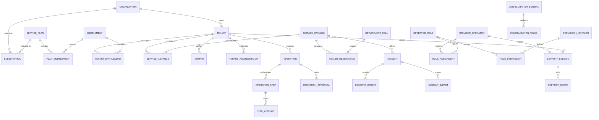

# R0 Provider Control Plane 및 Tenant Estate ADR

> 상태: Accepted and Implemented Local Baseline v1.2
>
> 기준일: 2026-08-11
>
> 적용 저장소: `dwp-frontend`, `dwp-backend`

## 1. 결정 배경

DWP는 여러 회사에 전달되는 SaaS이므로 회사 관리자용 관리 센터와 DWP 운영자용
Provider Control Plane을 분리한다. Provider 운영자는 전체 고객 자산과 개통 작업을
관리하고, 회사 관리자는 자신이 속한 회사의 사용자 경험과 접근 정책만 관리한다.

숫자 Tenant ID 하나를 회사 자체로 사용하지 않는다. 계약 주체인 회사와 실제 서비스
격리 단위인 Tenant를 분리해야 한 회사의 운영·검증 환경, 복수 지역 배치와 계약 이력을
안전하게 확장할 수 있다.

## 2. 핵심 모델

### 2.1 회사와 Tenant

| 개념      | 테이블                 | 의미                                                    |
| --------- | ---------------------- | ------------------------------------------------------- |
| 회사      | `prv_organizations`    | 계약·고객 관계의 루트이며 법인명과 CRM 참조를 소유한다. |
| Tenant    | `prv_tenants`          | 인증·데이터·배포 격리 단위이며 회사별 환경을 표현한다.  |
| 지역      | `prv_regions`          | 데이터 거주와 가용 지역 카탈로그다.                     |
| 배포 Cell | `prv_deployment_cells` | Region 안에서 장애와 용량을 분리하는 배치 단위다.       |

- 회사와 Tenant는 `1:N`이다.
- `(organization_id, environment_key)`는 유일하다.
- Provider UUID는 전역 제어 식별자이고, 각 서비스의 숫자 Tenant ID는 서비스별 외부
  참조다. 서로 같은 값이라고 가정하지 않는다.
- 고객 데이터 삭제 대신 `SUSPENDED`, `CLOSED`, `RETIRED` Lifecycle을 사용한다.

### 2.2 상품과 구독

- `prv_service_plans`는 `plan_key + plan_version`으로 불변 버전을 보관한다.
- `prv_organization_subscriptions`는 회사별 계약 기간과 계약 참조를 보관한다.
- 종료된 구독은 이력으로 남기고 한 회사에는 현재 구독 하나만 허용한다.
- Plan의 기본 권한은 `prv_service_plan_entitlements`, Tenant별 적용 결과와 Override는
  `prv_tenant_entitlements`에 분리한다.
- Secret, 결제 수단과 계약 문서 원문은 저장하지 않고 외부 시스템 참조만 저장한다.

### 2.3 서비스 배치와 개통

- `prv_service_catalog`는 Auth, Platform, People, Storage 등 프로비저닝 대상을 정의한다.
- `prv_tenant_service_instances`는 Tenant별 서비스 상태, 배포 Cell, 외부 리소스 ID와
  마지막 조정 결과를 소유한다.
- `prv_operations`, `prv_operation_steps`, `prv_operation_step_attempts`는 재시도 가능한
  Saga 원장이다. `idempotency_key`, 단계 순서와 시도 번호는 유일하다.
- 작업 종류는 `prv_operation_type_catalog`에서 위험도, 실행 전략과 요청 Schema를
  버전 관리한다. 신규 작업을 위해 `CHECK` 제약을 매번 수정하지 않는다.
- 부분 실패는 성공한 단계를 삭제하지 않고 재시도 이력과 Redacted 결과를 남긴다.

### 2.4 운영 상태와 통제 원장

- `prv_operation_approvals`는 고위험 변경의 승인 Gate, 요청자, 결정자, 만료 시각과 결정을
  보관한다. 실행 작업과 분리해 승인 정책이 바뀌어도 작업 원장을 다시 쓰지 않는다.
- L3 변경은 승인 전 실행할 수 없고 요청자와 승인자가 같을 수 없다. 거절된 작업은
  취소되며 만료된 승인은 재사용할 수 없다.
- `prv_service_incidents`는 현재 인시던트 Aggregate이고
  `prv_service_incident_updates`는 상태 전이와 고객 커뮤니케이션의 Append-only Timeline이다.
- `prv_service_incident_impacts`는 하나의 인시던트가 여러 서비스·Region·Cell·Tenant에
  미치는 영향을 정규 관계로 보관한다. 인시던트의 직접 Scope 컬럼은 최초 Primary Target이고,
  영향 관계는 복합 장애의 확장 가능한 전체 범위다.
- `prv_service_health_observations`는 서비스·Region·Cell 단위의 시계열 관측값이다. 현재
  상태와 원시 관측 이력을 분리해 Dashboard 조회와 사후 분석을 모두 지원한다.
- Cell의 용량과 경고·위험 임계치는 `prv_deployment_cells`에 명시한다. Tenant 수만 세어
  용량을 추정하지 않는다.
- Incident, Approval, Support Session과 Operation은 모두 Correlation ID를 통해 감사
  이벤트와 연결한다.

## 3. 확장 설정 원칙

정렬·검색·권한·관계·Lifecycle에 사용되는 값은 정규 컬럼으로 둔다. 제품별로 늘어나는
희소 설정만 JSONB를 사용한다.

- `prv_configuration_schemas`: Namespace, Schema 버전, 적용 범위를 등록한다.
- `prv_configuration_values`: 회사, Tenant, 서비스 인스턴스 중 정확히 하나를 소유자로
  갖는다.
- 생성된 `scope_kind`와 복합 외래키가 Schema의 선언 범위와 실제 소유자 범위를 DB에서
  일치시킨다.
- 활성 Schema와 활성 값은 Namespace와 Scope별 하나만 허용하고, 이전 버전은
  `RETIRED`로 보존한다.
- JSON 원문은 Object만 허용한다. 애플리케이션은 저장 전 등록된 JSON Schema로 검증하며
  알 수 없는 Namespace를 임의 저장하지 않는다.
- 비밀번호, Token, API Key는 JSONB에도 저장하지 않는다. Vault의 Credential Reference만
  허용한다.

## 4. 권한과 관리 경계

| 사용자               | 범위                      | 저장 모델                 | 대표 권한         |
| -------------------- | ------------------------- | ------------------------- | ----------------- |
| Provider Admin       | 전체 회사·Tenant          | Provider Operator RBAC    | 전체 운영         |
| Provider Operator    | 전체 자산의 개통·변경     | Provider Operator RBAC    | Estate, Operation |
| Provider Support     | 승인된 Tenant의 제한 시간 | Support Session           | 최소 Scope        |
| Provider Auditor     | 전체 감사 조회            | Provider Operator RBAC    | Read-only         |
| Tenant Administrator | 단일 Tenant               | Tenant Administrator Role | 회사 자체 관리    |

- Provider Operator와 Tenant Administrator는 같은 테이블이나 Role로 합치지 않는다.
- 운영 권한은 `prv_operator_permission_catalog`에 등록하고 Role과 다대다로 연결한다.
- Tenant 관리자 Role과 지원 Scope도 각각 카탈로그로 관리해 새 역할을 데이터로 확장한다.
- 지원 세션은 사유, 최소 Scope, 만료 시각, 단방향 Token Hash와 회수자를 기록한다.
- Provider 권한만으로 고객 Data Plane에 상시 접근하지 않는다. 활성 지원 세션을 별도로
  요구한다.

### 4.1 승인과 고객 접근

- 일반 지원은 고객 승인 참조를 필수로 하고 만료되는 최소 Scope 세션을 발급한다.
- 비상 접근은 `BREAK_GLASS_SUPPORT` 권한, L3 위험 표시, 명시적 사유와 강화된 감사를
  요구한다. 일반 지원의 편의 기능으로 사용하지 않는다.
- 변경 승인은 역할 기반 권한뿐 아니라 요청자·승인자 분리, 만료, 낙관적 Version 검사를
  함께 적용한다.
- 감사자에게 조회 권한을 부여하되 변경·승인·지원 세션 생성 권한은 부여하지 않는다.
- 지원 권한은 `prv_support_scope_catalog`에서 위험도와 고객 승인 필요 여부를 관리한다.
  API와 UI는 활성 카탈로그를 조회하므로 Scope 추가를 하드코딩된 열거값에 묶지 않는다.
- 세션에는 Scope 선택 시 평가된 `customer_approval_required`를 보존한다. 표준 접근은 이
  정책값이 참일 때만 승인 참조가 필수이고, 비상 접근은 별도 권한과 감사 규칙을 따른다.

## 5. 도메인과 관리자 초대

- 내부 Fallback 도메인은 항상 검증된 Primary로 먼저 유지한다.
- 고객 도메인은 DNS 검증이 끝나기 전 `requested_primary` 후보일 뿐 Primary가 아니다.
- 검증된 도메인만 원자적으로 Primary로 승격한다.
- 관리자 식별자는 정규화한 Email이며 Principal 문자열을 중복 보관하지 않는다.
- 초대 Token 원문은 Auth 서비스만 일시 반환하고 DB에는 Hash와 만료 정보만 저장한다.

## 6. Control Plane 업무 구조

Provider Control Plane은 테이블 중심 메뉴가 아니라 운영 의사결정과 통제 흐름을 기준으로
다음 일곱 업무 영역을 제공한다.

| 업무 영역        | 운영 질문                                     | 핵심 기능                                       |
| ---------------- | --------------------------------------------- | ----------------------------------------------- |
| 운영 지휘        | 지금 고객 영향이나 조치가 필요한가?           | 상태 요약, 우선 조치 큐, 서비스·Cell 포트폴리오 |
| 고객 및 Tenant   | 어떤 고객 환경이 어디에 어떤 상태로 배치됐나? | 회사·환경·Region·Cell·Lifecycle 탐색            |
| 변경 통제        | 어떤 변경이 승인·실행·재시도 중인가?          | 위험도 Gate, 승인 분리, 단계별 실행 원장        |
| 서비스 운영      | 서비스 열화와 고객 영향은 무엇인가?           | 상태 Matrix, 용량, Incident 선언·상태 전이      |
| 권한 있는 지원   | 고객 데이터 접근이 승인되고 제한됐나?         | 표준 지원, 비상 접근, Scope·만료·회수           |
| 구독 및 권한     | 계약과 제품 권한이 실제 배포와 일치하는가?    | Plan 버전, 구독 갱신, Entitlement 채택          |
| 거버넌스 및 감사 | 누가 무엇을 왜 수행했고 결과는 무엇인가?      | 범주·결과·Tenant·Correlation 기반 조사          |

- 첫 화면은 전 고객 상태와 조치 큐를 제공하고, 상세 목록은 조사 또는 실행 문맥으로
  Drill-down한다.
- Health, Commercial, Audit는 단순 통계가 아니라 Incident, Renewal, Privileged Access 같은
  실행 가능한 위험을 표면화한다.
- 위험 작업은 Dialog에서 영향 범위와 사유를 검토한 뒤 실행하며 결과는 비동기 원장에
  남긴다.
- 좁은 화면에서는 좌측 Navigation을 Drawer로 전환하고 지표와 조치 큐를 한 열로 재배치한다.

## 7. 감사와 운영 안전성

- 모든 Provider 변경은 Actor, 회사, Tenant, Target, 결과, Correlation ID와 Redacted
  Snapshot을 `prv_audit_events`에 기록한다.
- `sys_audit_outbox`는 같은 트랜잭션에서 감사 전달 이벤트를 생성하며 재시도와 Dead 상태를
  보존한다.
- 운영 객체는 `version`으로 낡은 화면의 변경을 `409`로 거부한다.
- 대량 시간순 감사 조회에는 BRIN, Tenant·Operator별 조회에는 B-tree 인덱스를 사용한다.
- 외래키는 기본적으로 삭제를 제한한다. 감사·계약·개통 이력을 Cascade 삭제하지 않는다.

### 7.1 신뢰성 의사결정과 예정 유지보수

- `prv_service_level_objectives`는 목표·범위·측정 창을, Append-only
  `prv_service_level_snapshots`는 달성률·오류 예산·Burn rate를 보존한다. 상태 숫자만
  표시하지 않고 배포 중단이나 조치 판단의 입력으로 사용한다.
- `prv_governance_controls`와 시간순 `prv_governance_evaluations`는 기대 상태와 관측 상태를
  분리한다. 최신 비준수 결과만 운영 화면에 노출하되 원 평가 이력은 덮어쓰지 않는다.
- 예정 유지보수는 `prv_maintenance_windows`와 `prv_operations`가 1:1로 연결된다. 요청 시
  창은 `DRAFT`, 작업은 `PREVIEWED / L3`이며 요청자와 다른 Provider Admin의 승인을 받은
  뒤 `SCHEDULE_MAINTENANCE` 단계가 성공해야만 `SCHEDULED`가 된다.
- 고객 통지 시각, 최소 통지 시간, 실제 영향 초, 범위 대상은 검색 가능한 정규 컬럼과 DB
  제약으로 검증한다. 설명과 공급자별 확장 정보만 JSONB에 둔다.
- 승인 거절은 작업과 유지보수 창을 함께 취소하고, 실행 실패는 Tenant 온보딩 상태를
  변경하지 않는다. 모든 전이는 동일 Operation ID와 Correlation ID로 감사된다.

### 7.2 데이터 수명과 확장

- 자주 변경되는 현재 상태는 Aggregate Table, 재생과 조사가 필요한 변경은 Append-only
  Timeline Table에 저장한다.
- 감사와 상태 관측은 시간순 BRIN과 Tenant·서비스·운영자별 B-tree를 함께 사용한다.
- 데이터량이 운영 기준을 넘을 때 월 단위 Partition과 보존 정책을 적용할 수 있도록 시간
  컬럼과 단방향 참조를 유지한다. 초기 규모에서 미리 Partition을 강제하지 않는다.
- Metadata JSONB는 공급자별 확장 속성에만 사용하고 Scope, 상태, 위험도, 만료, 관계와
  검색 조건은 정규 컬럼과 제약으로 유지한다.

## 8. Source of Truth

| 데이터                                              | 소유 서비스           |
| --------------------------------------------------- | --------------------- |
| 회사, Provider Tenant, 구독, Entitlement, 개통 원장 | `dwp-provider-server` |
| 로그인 Tenant, 사용자, 초대와 Session               | `dwp-auth-server`     |
| 브랜딩, 홈, 공지와 Tenant 설정                      | `dwp-platform-server` |
| 조직도와 구성원 Projection                          | `dwp-people-server`   |

서비스 간 Database Foreign Key는 만들지 않는다. Provider의 외부 ID와 Idempotency Key를
사용해 API로 조정하고, 실패는 Operation Step에서 재처리한다.

## 9. 수용 Gate

1. 빈 Database에서 모든 Flyway Migration이 순서대로 적용된다.
2. 같은 회사·환경, 현재 구독, Primary 도메인과 관리자 Email 중복이 DB에서 거부된다.
3. 설정 Schema 범위와 값의 소유 범위가 다르면 복합 외래키가 거부한다.
4. 개통 재시도는 기존 회사·Tenant·서비스 인스턴스를 중복 생성하지 않는다.
5. Provider RBAC의 읽기·쓰기·감사·지원 권한을 각각 API Test로 검증한다.
6. 지원 세션 생성·만료·회수와 모든 변경이 감사 이력에 연결된다.
7. 회사 관리자는 자신의 Tenant만 조회하고 Provider Route에 접근할 수 없다.
8. L3 작업은 유효한 승인 없이는 실행되지 않으며 요청자는 자신의 작업을 승인할 수 없다.
9. 표준 지원은 고객 승인 참조가 없으면 거부되고 비상 접근은 별도 권한과 L3 감사를 남긴다.
10. Incident 상태 전이, Timeline, 영향 Scope와 종료 시각의 일관성을 DB와 API에서 검증한다.
11. 운영 지휘의 조치 큐는 Incident, 승인 대기, 실패 작업, 만료·용량 위험을 하나의 우선순위로
    통합한다.
12. Provider 전 화면은 Desktop과 390px Mobile에서 핵심 명령과 상태가 겹치지 않는다.
13. SLO는 목표와 관측 Snapshot을 분리하고 오류 예산과 Burn rate를 같은 평가 시점으로
    재구성할 수 있다.
14. 정책 Drift는 기대·관측 Snapshot과 교정 작업 유형을 보존하며 최신 위반에서 원 평가
    이력으로 추적할 수 있다.
15. 예정 유지보수는 Operation 없는 행을 허용하지 않고, L3 승인 전에는 `SCHEDULED`로
    전이할 수 없으며 요청자는 자신의 작업을 승인할 수 없다.

## 10. 근거

- [Microsoft Azure Architecture Center - Multitenant control planes](https://learn.microsoft.com/en-us/azure/architecture/guide/multitenant/considerations/control-planes)
- [Microsoft Azure Architecture Center - Control plane approaches](https://learn.microsoft.com/en-us/azure/architecture/guide/multitenant/approaches/control-planes)
- [AWS SaaS Lens - Tenant isolation](https://docs.aws.amazon.com/wellarchitected/latest/saas-lens/isolation-mindset.html)
- [AWS Control Tower - Detect and resolve drift](https://docs.aws.amazon.com/controltower/latest/userguide/drift.html)
- [AWS SaaS Lens - Operations](https://docs.aws.amazon.com/wellarchitected/latest/saas-lens/operate.html)
- [Microsoft Entra PIM - Approval workflow](https://learn.microsoft.com/en-us/entra/id-governance/privileged-identity-management/pim-approval-workflow)
- [Microsoft 365 - Service health](https://learn.microsoft.com/en-gb/microsoft-365/enterprise/view-service-health?view=o365-worldwide)
- [Microsoft 365 - Message center](https://learn.microsoft.com/en-us/microsoft-365/admin/manage/message-center?view=o365-worldwide)
- [Azure Service Health - Planned maintenance](https://learn.microsoft.com/en-us/azure/service-health/service-health-planned-maintenance)
- [Google SRE Workbook - Error budget policy](https://sre.google/workbook/error-budget-policy/)
- [Google Cloud - SLO monitoring](https://docs.cloud.google.com/stackdriver/docs/solutions/slo-monitoring)
- [Google Cloud Resource Manager - Audit logging](https://docs.cloud.google.com/resource-manager/docs/audit-logging)
- [PostgreSQL - JSON Types](https://www.postgresql.org/docs/current/datatype-json.html)
- [PostgreSQL - Constraints](https://www.postgresql.org/docs/current/ddl-constraints.html)
