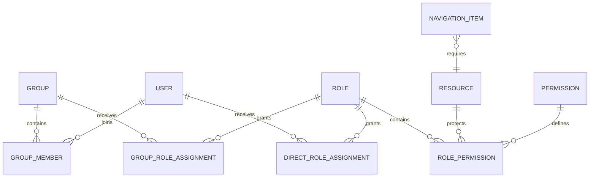
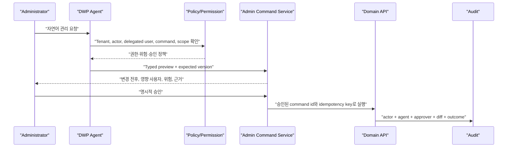

# R0 권한·메뉴·다국어 Admin Control Center ADR

> 상태: Accepted Baseline v1.1
>
> 기준일: 2026-08-10
>
> 적용 저장소: `dwp-frontend`, `dwp-backend`, `dwp_agent`

## 1. 결론

관리 기능은 일반 업무 App의 한 화면이 아니라 제품 전체의 Control Plane이다.
Tenant Admin은 `/admin` 전용 Shell과 Navigation을 사용하고, Provider Super Admin은
향후 별도 Identity·Route·Service로 분리한다. Tenant Admin이 Tenant ID를 바꿔 다른
고객을 관리하는 방식은 금지한다.

권한은 `Subject -> Role -> Resource + Action -> Scope`로 계산한다. 메뉴와 버튼은
별도 권한 원장을 만들지 않고 동일한 Effective Permission의 Projection으로 제어한다.

## 2. Admin Plane

| Plane             | 범위             | 대표 역할                                            |
| ----------------- | ---------------- | ---------------------------------------------------- |
| Provider Admin    | 전체 제품·Tenant | Tenant 개통, Region·Cell, Subscription, Release, SLO |
| Tenant Admin      | 단일 Tenant      | People, Access, Experience, Catalog, Integration     |
| Delegated Admin   | 위임 Scope       | 특정 조직·Domain·Catalog의 제한된 관리               |
| User Self-service | 본인             | 언어, 접근성, 알림, Home 개인화                      |

Provider와 Tenant Plane은 UI만 다르게 꾸미는 것이 아니라 Route, Permission Namespace,
Service Identity, Audit Stream과 운영 Runbook을 분리한다.

## 3. RBAC와 Scope



- Subject: User, Group, Service Identity, Agent Identity
- Role: System 또는 Tenant Custom Role
- Resource: App, Menu destination, Page, Dataset, API, Action Target
- Action: View, Create, Update, Delete, Manage, Execute, Approve, Export
- Scope: Tenant, Organization Unit, 특정 Resource
- Effect: 기본 Deny. 명시적 Allow만 유효하며 고위험 Deny/SoD는 Policy Engine에서 평가

NIST Core RBAC의 User–Role·Permission–Role 관계를 기본으로 하고, Group Assignment,
Role Hierarchy, Static/Dynamic Separation of Duty를 확장한다. 위임 관리는 Entra의
Administrative Unit처럼 Role과 Scope를 함께 부여한다.

### 3.1 Privileged Access

- Super/Tenant Admin은 일반 직원 Role과 분리한다.
- Privileged Role은 Group 자동 부여를 기본 금지한다.
- 향후 Eligible·Time-bound Assignment, MFA, Justification, Approval과 Emergency
  Access를 제공한다.
- 자기 Role 승인, 마지막 Emergency Admin 제거와 승인자 없는 Lockout을 금지한다.
- Role·Group·Scope 변경 시 Access Revision을 올리고 영향 Session·Cache를 폐기한다.

## 4. 메뉴·버튼 권한

메뉴는 다음 교집합일 때만 보인다.

```text
Product Registry Active
AND Tenant Entitlement Active
AND Navigation Item Active
AND User Effective Permission allows required Resource + VIEW
AND Feature/Policy availability allows current context
```

- Tenant Admin은 등록된 App·Route·Icon Key 안에서 Group, 순서, Label과 노출을 관리한다.
- 임의 URL, JavaScript, React Component 이름을 DB에 저장하지 않는다.
- 버튼은 `VIEW`가 아니라 실제 `UPDATE`, `APPROVE`, `EXECUTE`, `EXPORT`를 검사한다.
- 프론트 숨김/비활성화는 UX일 뿐 보안 경계가 아니다. API가 같은 Permission을 재검사한다.
- 메뉴 구조는 최대 2단계다. 더 깊은 구조는 Page 내부 Tab·Filter로 이동한다.

## 5. Admin Information Architecture

| Group                 | 현재/다음 기능                                             |
| --------------------- | ---------------------------------------------------------- |
| Experience            | Branding, Home, Announcements                              |
| People & Access       | Users & Access, Organization & Groups, Roles, Provisioning |
| Platform Setup        | Navigation & Apps, Reference Data, Localization, Registry  |
| AI & Automation       | Agents, Tools, Model Route, Policy, Approval               |
| Security & Compliance | Audit, Access Review, Retention, Consent, Export           |
| Operations            | Sync Health, Feature Rollout, Usage, Cost, SLO             |

구현되지 않은 메뉴는 Placeholder로 노출하지 않는다. 현재 완성된 기능만 Navigation에
표시하고, 기능·권한·Empty/Error 상태가 완성될 때 순차적으로 추가한다.

## 6. 사이드바 Interaction

확장된 Desktop Sidebar는 클릭 시 아래로 펼치는 2단계 Inline Submenu를 사용한다.
이는 Parent와 Child의 위치 관계를 유지하고 Keyboard·Touch·Screen Reader에서 동일하게
동작한다. 우측 Flyout은 Hover Tunnel, 화면 경계, 확대와 Mobile에서 취약하므로 기본
Navigation으로 사용하지 않는다.

- Group Header: Chevron, `aria-expanded`, `aria-controls`
- Child: 40px 이상 Target, 현재 Page 표시, Parent 자동 확장
- Mobile: 동일 구조를 Drawer에 제공
- Compact Rail을 도입할 때만 Click 기반 Flyout을 보조로 허용
- 3단계가 필요하면 Page 내부 Tab 또는 별도 Landing Page 사용

IBM Carbon UI Shell도 5개가 넘는 Secondary Navigation에 Left Panel을 사용하고,
Submenu는 클릭 시 아래로 확장하며 3단계를 지원하지 않는다.

## 7. 다국어 정책

- Product UI 기본 문구: Source Bundle과 CI Translation Workflow가 Source of Truth
- Tenant별 명칭·메뉴 Label·공지·서비스 설명: DB의 BCP 47 Locale별 값
- 기준정보: 기존 Item Label의 Locale별 값
- Tenant Override: 승인된 Namespace만 Draft -> Active -> Retired
- Fallback: User Locale -> Tenant Default -> Product Default `en` -> Key
- Locale은 `ko`, `en`, `en-US`, `zh-Hant-HK` 같은 BCP 47 Tag를 사용한다.
- 날짜·숫자·통화·복수형은 문자열 치환이 아니라 Locale Formatter를 사용한다.
- 번역 누락, 오래된 Source Revision과 Overflow를 Admin 및 CI에서 검사한다.

모든 제품 문구를 DB로 옮기면 배포 버전과 번역 버전이 분리되어 Rollback과 정적 분석이
깨지므로 채택하지 않는다.

제품 구현·언어 추가·검증·운영 절차는 `R0 제품 다국어 운영 및 확장 가이드.md`를
따른다. 공통 Shell, 인증, Home, Work, Account와 Tenant Admin의 `ko`, `en` 제품
번들은 2026-08-10 기준 Baseline에 반영되었다.

## 8. 기준정보 정책

- System Invariant와 Error Code는 Source/Migration에서만 관리한다.
- Tenant Reference Set은 Draft·Active·Retired, 유효기간과 다국어 Label을 가진다.
- Item은 Stable Code와 `parent_reference_item_id`로 같은 Set 안의 계층을 구성한다.
- 계층은 최대 8단계이며 활성 자식이 있는 Parent의 폐기와 Cycle을 금지한다.
- Typed Feature Flag, Secret, Executable Policy를 공통코드에 넣지 않는다.

## 9. Agent Admin Command

Agent는 관리자 API를 우회하거나 Super Admin Credential을 공유하지 않는다.



- Agent Identity와 Delegated User를 함께 기록하고 둘 다 권한을 만족해야 한다.
- 자연어를 바로 SQL/API Mutation으로 변환하지 않는다.
- Typed Command Allowlist, JSON Schema, Expected Version과 Idempotency Key를 사용한다.
- User·Role·Menu·PII·Tenant 변경은 기본적으로 Preview와 Human Approval이 필요하다.
- Plan Hash가 바뀌면 기존 승인은 무효다.
- Audit에는 Prompt 원문 대신 필요한 Redacted Intent와 구조화된 Diff를 저장한다.

## 10. 근거

- [NIST RBAC](https://csrc.nist.gov/Projects/role-based-access-control/faqs)
- [Microsoft Entra RBAC](https://learn.microsoft.com/en-us/entra/identity/role-based-access-control/)
- [Microsoft Entra Administrative Units](https://learn.microsoft.com/en-us/entra/identity/role-based-access-control/admin-units-manage)
- [Microsoft Entra PIM](https://learn.microsoft.com/en-us/entra/id-governance/privileged-identity-management/pim-configure)
- [W3C BCP 47 Language Tags](https://www.w3.org/International/articles/language-tags/Overview.en)
- [IBM Carbon UI Shell Left Panel](https://carbondesignsystem.com/components/UI-shell-left-panel/usage/)
- [Workday Agent System of Record](https://blog.workday.com/en-us/managing-ai-powered-future-of-work.html)
- [Workday Agent Security](https://doc.workday.com/admin-guide/en-us/workday-ai/agents/agent-system-of-record/agent-security-and-compliance/concept--agent-security.html)
- [NIST AI Risk Management Framework](https://www.nist.gov/itl/ai-risk-management-framework)
