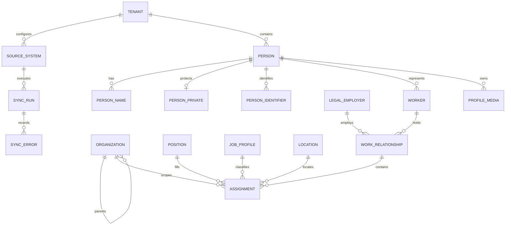

# R0 멀티테넌트 Workforce Projection 및 HRIS 연계 ADR

> 상태: Accepted Baseline v1.0
>
> 기준일: 2026-08-10
>
> 적용 저장소: `dwp-frontend`, `dwp-backend`, `dwp_agent`

## 1. 결론

DWP는 Workday·Oracle HCM·SAP HCM·고객 Legacy HR을 대체하는 HR 원장이 아니다.
외부 HRIS가 사람·고용·급여·보상·평가의 Source of Truth를 유지하고, DWP는 직원 경험,
조직 탐색, 권한 계산과 Agent Context에 필요한 **Workforce Projection**만 별도
`dwp_people` Database에 보관한다.

Projection의 고정 Core는 `Person -> Worker -> Work Relationship -> Effective-dated
Assignment`다. Tenant마다 다른 HR 속성은 Core Column을 무한히 추가하지 않고 승인된
Typed Attribute Definition과 Value로 확장한다.

## 2. 현재 상태와 Gap

현재 `dwp_auth`에는 Tenant, User Account, 기본 조직과 직접 Group이 있다. 이는 로그인과
접근 제어에는 적합하지만 다음 HR 요구를 표현하지 못한다.

- 한 사람이 퇴사 후 재입사하거나 Employee와 Contingent Worker 관계를 함께 가지는 경우
- 한 Work Relationship에 복수 Assignment가 있는 경우
- 미래 발령, 소급 정정, 같은 날짜의 순차 변경과 전체 발령 이력
- Position, Job Profile, Legal Employer, Location과 여러 Organization Type
- 민감 개인정보, 사원 식별자와 Profile Image의 별도 보안·보존 정책
- Workday·SCIM·고객 Legacy의 External ID, Watermark, 재처리와 오류 이력

`com_users`에 HR Column을 계속 추가하는 방식은 Identity와 Workforce Lifecycle을
결합하므로 채택하지 않는다.

## 3. Domain Model

### 3.1 핵심 의미

| Entity            | 의미                                                        |
| ----------------- | ----------------------------------------------------------- |
| Person            | 고용 상태와 무관하게 유지되는 사람의 Tenant 내부 식별자     |
| User Account      | 인증 Provider에서 로그인하는 Digital Identity               |
| Worker            | Person이 Tenant에서 수행하는 Employee·Contingent 등 역할    |
| Work Relationship | Worker와 Legal Employer 간 Date-enabled 관계                |
| Assignment        | 조직·직무·Position·Manager·Location의 Date-effective 발령   |
| Position          | 사람이 바뀌어도 유지되는 정원·자리                          |
| Job Profile       | 직무·직군·Management Level 분류                             |
| Organization      | Company·BU·Division·Department·Supervisory·Cost Center 계층 |

Person과 User Account는 논리 Link만 가진다. Database 간 FK를 만들지 않고
`com_users.person_public_id`가 `ppl_persons.public_id`를 참조하며, Outbox Event와
Reconciliation Job이 정합성을 검증한다.

같은 원칙을 조직에도 적용한다. `ppl_organizations`가 HRIS에서 수집한 Workforce
Organization Projection의 원본이고, `com_organization_units`는 인증·Scope 계산에 필요한
얇은 Access Projection이다. 두 객체는 `public_id`와
`workforce_organization_public_id`로 연결한다. People Outbox 소비자가 Access Projection을
갱신하며 두 Database를 화면이나 Agent가 동시에 쓰는 Dual Write는 금지한다. 고객 HRIS가
관리하는 조직은 Auth Admin에서 직접 수정하지 않고 Source System으로 되돌려야 한다.

## 4. 유효일과 정정 정책

- Work Relationship은 `start_date`, `end_date`를 갖는 Date-enabled 객체다.
- Assignment, Name과 확장 속성은 `effective_start_date`, `effective_end_date`와
  `effective_sequence`를 갖는 Date-effective 객체다.
- 현재값은 별도 원장 Column을 덮어쓰지 않고 기준 시각에 유효한 Slice를 조회한다.
- 미래 발령을 허용하고, 동일 날짜의 순차 변경은 Sequence로 결정한다.
- 원본 정정과 업무 발령을 구분해 Audit에 Action Reason과 Source Version을 남긴다.
- 물리 삭제 대신 종료·병합·보존 만료를 사용한다.

## 5. 개인정보와 Media

데이터 최소화를 기본값으로 한다. DWP Journey에 필요하지 않은 급여, 보상, 평가,
가족과 국가 식별번호는 Projection에 복제하지 않는다.

- 공개/내부 Profile: 표시명, 회사 연락처, 조직, 직무, 위치
- Confidential: 개인 연락처, 생년월일 등 승인된 최소 속성
- Restricted: 국가 식별자 등 고위험 값. 평문 저장 금지, 암호문·Hash·Key Reference만 저장
- Profile Image: DB BLOB 금지. Tenant별 Object Key, MIME, Size, SHA-256, Visibility 저장
- Local 개발은 Filesystem Storage Port, 운영은 S3 호환 Object Storage와 Malware Scan 사용
- Field Masking, Purpose-based Access, Export Audit와 보존/삭제 Policy를 API Gate로 적용

## 6. HRIS·SCIM Integration

Workday API는 REST를 사용자 중심의 소규모 Transaction, SOAP을 대량 System-to-system
교환, Graph API를 선택적 조회에 사용하도록 구분한다. DWP Connector도 Source 특성에
맞게 Full·Delta·Event를 지원한다.

1. `int_source_systems`: Source, Credential Reference, Authoritative Domain
2. `int_external_mappings`: Internal Key와 External ID·Version
3. `int_sync_runs`: Full·Delta·Event·Replay, Watermark와 처리 건수
4. `int_sync_errors`: Redacted Error, Retry 가능 여부
5. Idempotent Upsert와 Transactional Outbox
6. People Event를 Auth Directory, Search와 Agent Context Projection이 소비

SCIM User는 로그인·Directory Provisioning을 위한 표준이며 전체 HR 원장이 아니다.
SCIM Enterprise User의 `employeeNumber`, `costCenter`, `organization`, `division`,
`department`, `manager`는 Core Mapping의 최소 호환 계층으로 사용한다.

## 7. Database Topology와 명명

초기에는 Bounded Context별 Pool Database를 사용하고, 규제·규모 요구가 확인되면
Tenant Placement Metadata로 Bridge 또는 Silo Cell을 선택한다.

| Database       | Owner                      | Table Prefix                         |
| -------------- | -------------------------- | ------------------------------------ |
| `dwp_auth`     | Identity·Session·RBAC      | `com_`, `sys_`                       |
| `dwp_platform` | Tenant Admin Control Plane | `adm_`, `sys_`                       |
| `dwp_people`   | Workforce Projection       | `ppl_`, `int_`, `sys_`               |
| App Database   | 각 업무 App Data Plane     | `{bounded_context}_`, `int_`, `sys_` |

Prefix는 화면 메뉴가 아니라 데이터 책임을 나타낸다. 모든 Tenant Data Table은
`tenant_id`를 가지며 Unique, Parent FK, Cache Key, Event Partition과 Search Filter에도
Tenant를 포함한다. RLS는 `SET LOCAL dwp.tenant_id` Transaction Context와 Service Role
분리가 구현된 뒤 `FORCE ROW LEVEL SECURITY`로 적용한다. Application Owner가 RLS를
우회하는 상태에서는 완료로 보지 않는다.

## 8. Delivery Policy

- 기본: Shared Control Plane + Pooled Context Database
- 규제 고객: People 또는 App Data Plane만 Silo 가능한 Hybrid Cell
- Tenant 개통은 Provider Control Plane이 Auth·Platform·People Projection을 생성하고
  Schema Revision, Region, Isolation Model과 상태를 추적한다.
- Super Admin은 Tenant Admin API에서 Tenant Header만 바꾸는 방식으로 구현하지 않는다.
  별도 Provider Route, Identity, Audit와 Break-glass Policy를 사용한다.

## 9. 구현 Gate

1. 실제 SKAX HR Sample의 Attribute Classification과 Data Owner 승인
2. Workday/Legacy Source별 Worker·Organization·Position Mapping 승인
3. Joiner·Mover·Leaver와 미래 발령·재입사·복수 Assignment Contract Test
4. PII Encryption Key, Field Masking, Retention과 Export 승인
5. Tenant Cross-access, Replay, Duplicate, Out-of-order Event Test
6. 대규모 조직/사람 Cursor Pagination과 검색 부하 Test

## 10. 근거

- [Workday API Overview](https://developer.workday.com/api-overview)
- [Workday Worker Reference](https://developer.workday.com/documentation/dan1370797991225)
- [Workday Reporting Relationships](https://doc.workday.com/admin-guide/en-us/reporting-and-analytics/workday-reporting-concepts/concept--understanding-workday-reporting-relations.html)
- [Oracle HCM Work Relationships](https://docs.oracle.com/en/cloud/saas/human-resources/fawhr/work-relationships.html)
- [Oracle HCM Assignments](https://docs.oracle.com/en/cloud/saas/human-resources/fawhr/assignments.html)
- [Oracle HCM Date Effectivity](https://docs.oracle.com/en/cloud/saas/human-resources/faauk/date-effectivity.html)
- [SCIM Core Schema RFC 7643](https://www.rfc-editor.org/rfc/rfc7643)
- [SCIM Protocol RFC 7644](https://www.rfc-editor.org/rfc/rfc7644)
- [AWS SaaS Lens Tenant Isolation](https://docs.aws.amazon.com/wellarchitected/latest/saas-lens/preventing-cross-tenant-access.html)
- [PostgreSQL Row Security Policies](https://www.postgresql.org/docs/current/ddl-rowsecurity.html)
