# R1 DWP Notification Platform 및 Omnichannel Delivery ADR

> 상태: Final Candidate, 내부 구현 착수 가능; Production 출시는 승인 Gate 충족 필요
>
> 기준일: 2026-08-19
>
> 적용 저장소: `dwp-frontend`, `dwp-backend`

## 1. 결정 요약

DWP의 공통 알림 기능은 단순한 DB 목록이나 Header Popover가 아니라 모든 제품이 사용하는
**Notification Platform**으로 구축한다. 사용자 제품명은 `알림 센터`, 내부 도메인명은
`notification`, 서비스명은 `dwp-notification-server`, 기본 Route는 `/notifications`로 한다.

핵심 인프라는 다음처럼 역할을 분리한다.

| 계층         | 채택 기술                          | 책임                                                       | 원장이 아닌 것              |
| ------------ | ---------------------------------- | ---------------------------------------------------------- | --------------------------- |
| 업무 이벤트  | 기존 Kafka `dwp.domain-events.v1`  | 앱 간 비동기 전달, 순서, 재처리, 독립 Consumer             | 개인 Inbox 조회 저장소      |
| 원자성       | 기존 Transactional Outbox          | 업무 Commit과 Event 발행 사이 Dual Write 제거              | 최종 외부 채널 상태         |
| 알림 원장    | 전용 PostgreSQL `dwp_notification` | 정책, Template, 개인 Inbox 상태, 예약, 전달·감사 증적      | 앱 간 Message Broker        |
| 실시간 신호  | Redis Pub/Sub                      | 저장 완료 후 연결 중인 SSE Node에 가벼운 갱신 Hint Fan-out | 영속 메시지와 재처리 원장   |
| Browser Push | SSE `/api/notifications/v1/stream` | 서버에서 Browser로 단방향 갱신, 자동 재연결                | Notification 본문 전체 전송 |
| 외부 채널    | QoS Dispatch + Adapter Worker      | Email, Web Push, FCM/APNs, Teams·Slack 후속 연결           | 예약·재시도 상태 원장       |

즉 **DB만 사용하는 구조는 채택하지 않는다.** 그러나 DB를 없애는 것도 잘못이다. Kafka는
업무 사실을 전달하고, PostgreSQL은 사용자가 조회·읽음·저장·완료 처리할 수 있는 영속 Inbox와
정책 증적을 보존한다. Redis와 SSE는 이미 저장된 변화가 있다는 사실만 빠르게 전달한다.

## 2. 현재 상태와 문제

현재 Header의 `NotificationMenu`는 Badge `2`와 두 건의 문구가 정적으로 선언된 Prototype이다.
API, 읽음 상태, 개인 설정, 실시간 연결, 재시도, 감사가 없다.

반면 재사용할 Foundation은 이미 존재한다.

- `dwp-core`의 CloudEvents 정렬 Envelope, Transactional Outbox, Consumer Inbox, Aggregate
  Ordering, DLQ와 Replay Ledger
- Kafka 4.3.1과 명시적으로 생성되는 `dwp.domain-events.v1` Topic
- PostgreSQL, Redis, Gateway Session·CSRF, Tenant Context와 공통 Audit
- Versioned JSONB 기반 개인 설정과 자동 저장

새 Platform은 이 Foundation을 확장하며 별도의 사설 Event Bus, Audit 복제품 또는 앱별 알림
Table을 만들지 않는다.

## 3. 왜 Hybrid인가

| 후보                              | 장점                                       | 치명적 한계                                                    | 결정                        |
| --------------------------------- | ------------------------------------------ | -------------------------------------------------------------- | --------------------------- |
| PostgreSQL Table + Polling만 사용 | 단순, Transaction 친화적                   | 앱 결합, Polling 부하, 독립 Consumer·Replay·Backpressure 부족  | 거부                        |
| PostgreSQL `LISTEN/NOTIFY`        | 같은 DB Process 간 가벼운 Signal           | 현재 연결에만 전달, Payload 제한, DB 경계, Durable Replay 부재 | Core Transport로 거부       |
| Redis Pub/Sub만 사용              | 매우 빠른 Live Fan-out                     | `at-most-once`; 단절 중 Message 유실, Inbox Query·감사 부적합  | Live Hint로만 채택          |
| Redis Streams                     | ACK·Replay 가능                            | 기존 Kafka와 역할 중복, Stream Sharding·운영 모델 추가         | 초기 Core에는 미채택        |
| Kafka만 사용                      | Durable Log, Partition 순서, Consumer 확장 | 읽음·저장·Snooze Query, 예약·Preference·감사 View에 부적합     | Event Backbone으로 채택     |
| RabbitMQ 추가                     | Work Queue·Routing에 강함                  | 두 Broker 운영과 장애 모델 중복                                | 현재 미채택                 |
| SNS/SQS, Azure Service Bus        | Managed Scale                              | Cloud Lock-in, On-prem Delivery Baseline과 충돌                | 배포 Profile Adapter로 유보 |
| Hybrid                            | 각 저장소가 잘하는 책임에 집중             | 운영 구성 요소 증가                                            | 채택                        |

PostgreSQL `LISTEN/NOTIFY`는 같은 Database에 접속한 현재 Session에 알리는 IPC이며 Payload도
기본 8KB 미만이다. Redis Pub/Sub은 Subscriber가 끊기면 Message가 소실되는 `at-most-once`다.
따라서 둘 모두 Durable Notification 원장으로 사용할 수 없다.

## 4. 목표 구조

```mermaid
flowchart LR
  subgraph Apps["DWP 업무 앱"]
    Approval["결재"]
    HCM["HCM"]
    Mail["메일"]
    Space["Space"]
    Future["향후 앱"]
  end

  Apps -->|"Aggregate 변경 + Outbox 동일 Transaction"| Outbox["Service-local Outbox"]
  Outbox --> Kafka["Kafka\ndwp.domain-events.v1"]
  Kafka --> Consumer["Notification Contract Consumer"]
  Consumer --> Decision["Policy · Audience · Dedupe · Template 결정"]
  Decision --> NDB[("dwp_notification PostgreSQL")]
  NDB --> Scheduler["Due Job Scheduler\nTenant fairness · rate limit"]
  Scheduler --> DeliveryOutbox["Notification Delivery Outbox"]
  DeliveryOutbox --> QoS["Kafka QoS lanes\ncritical · interactive · bulk"]
  QoS --> Workers["Isolated Channel Workers"]
  Workers --> Email["Email"]
  Workers --> Push["Web Push / FCM / APNs"]
  Workers --> External["Teams / Slack Adapter"]
  Email --> Feedback["Signed Provider Feedback"]
  Push --> Feedback
  Feedback --> NDB
  NDB --> Hint["Redis Live Hint"]
  Hint --> SSE["SSE through Gateway"]
  SSE --> Web["DWP Web Header · 알림 센터"]
  Web -->|"Version Sync REST · 상태 변경"| NDB
```



### 4.1 서비스 경계

- `dwp-notification-server`는 별도 Spring Boot 서비스와 `dwp_notification` Database를 가진다.
- Gateway는 `/api/notifications/**`와 SSE Route를 제공한다.
- 다른 업무 서비스는 알림 Table이나 임의 `send(userId, text)` API를 호출하지 않는다.
- 업무 서비스는 자신이 소유한 **Business Fact**를 Event로 발행한다.
- Notification Platform은 등록된 Contract만 소비해 **Notification Intent**로 변환한다.
- 다른 Database의 User·조직·업무 Row에 Foreign Key를 만들지 않는다. Public ID와 필요한 최소
  Snapshot만 보존한다.
- Audit Event를 업무 Trigger로 재사용하지 않는다. Audit은 증적이고 Domain Event가 원천이다.

### 4.2 Topic과 Partition

| Topic                                      | Key                                       | 용도                                        | Retention             |
| ------------------------------------------ | ----------------------------------------- | ------------------------------------------- | --------------------- |
| `dwp.domain-events.v1`                     | `tenant:source:aggregateType:aggregateId` | Canonical 업무 사실                         | Platform Event 정책   |
| `dwp.notification-delivery-critical.v1`    | `tenant:user:channel`                     | 승인된 보안·SLA 긴급 전달, 예약 용량        | 짧은 운영 재처리 기간 |
| `dwp.notification-delivery-interactive.v1` | `tenant:user:channel`                     | 결재·멘션 등 사용자 조치 전달               | 짧은 운영 재처리 기간 |
| `dwp.notification-delivery-bulk.v1`        | `tenant:campaign:channel`                 | Digest·대규모 정보성 전달                   | 짧은 운영 재처리 기간 |
| `dwp.notification-lifecycle.v1`            | `tenant:user`                             | 생성·읽음·완료·전달 결과의 선택적 외부 소비 | 계약 승인 시 추가     |

Topic 자동 생성은 금지한다. Partition 수, Replication Factor, Min ISR과 Retention은 Local과
Production Profile을 분리한다. Production은 단일 Broker나 Replication Factor 1로 출시하지 않는다.

`critical`은 `D-NTF-05`에서 승인한 Type만 사용할 수 있고 독립 Consumer Group과 최소 예약 용량을
가진다. `bulk` Worker는 Interactive Backlog가 SLO를 넘으면 자동 감속한다. 단일 Tenant가 공용
Broker·Worker를 독점하지 못하도록 Kafka Principal·Client ID Quota와 Application 계층의
Tenant·Type·Channel Token Bucket을 함께 적용한다.

### 4.3 Production 배포 단위

| 구성 요소                 | Production Baseline                                                                           |
| ------------------------- | --------------------------------------------------------------------------------------------- |
| Gateway·Ingress           | 2개 이상 장애 영역, SSE Buffering Off, Heartbeat보다 긴 Read Timeout, 무중단 Drain            |
| Notification API·SSE      | 3개 이상 Replica, Stateless, Session Affinity 불필요, 연결·메모리 Limit                       |
| Materializer·Fan-out      | API와 독립 배포·Autoscale, Consumer Lag·Oldest Job 기반 확장                                  |
| Scheduler·Channel Worker  | QoS Lane·Channel별 독립 배포, Critical 예약 용량, Bulk 감속                                   |
| PostgreSQL                | 전용 `dwp_notification`, Multi-AZ HA, PITR, API·Scheduler·Worker·Provider·Migration Role 분리 |
| Kafka                     | 최소 3 Broker, RF 3, Min ISR 2, TLS·인증·ACL·Quota, Topic 자동 생성 금지                      |
| Redis                     | HA Profile, 암호화·인증, 비영속 Hint만 저장; 장애가 데이터 유실로 이어지지 않음               |
| Secret·Connector Registry | 기존 Secret Manager·Product Registry, DB에는 Reference만 저장                                 |
| Telemetry                 | OpenTelemetry Trace·Metric·Log, Tenant·본문은 저 Cardinality·비식별 원칙 적용                 |

Local 개발 환경의 단일 PostgreSQL·Redis·Kafka는 기능 검증용이며 HA 증거가 아니다. Production
Readiness는 실제 배포 Profile의 Failover·Backup Restore·Connection Drain 결과로 판정한다.

### 4.4 Region·Cell·Data Residency

- Tenant는 Provider Control Plane의 `home_region`과 `placement_cell`에 고정된다.
- Event 처리, Inbox DB, Redis Hint, SSE와 외부 Channel Egress는 같은 Regional Cell 안에서
  수행하며 정상 경로에 Cross-region 동기 호출을 두지 않는다.
- 한 Region 안에서는 Active HA로 운영하고 Region 재해는 Warm Standby와 검증된 Runbook으로
  복구한다. 지역 간 무검증 Active-active DB 쓰기는 금지한다.
- Global Contract·Template Package는 서명된 Version으로 배포하고 Tenant Runtime Data는
  Residency 정책 없이 다른 Region으로 복제하지 않는다.
- 규제·대형 Tenant가 필요하면 동일 Control Plane 아래 Notification Data Plane만 Silo로 배치할
  수 있도록 Pool·Silo Profile을 유지한다. 이는 별도 제품 Fork가 아니다.

## 5. 처리 의미론

1. Producer는 Aggregate 변경과 Outbox Event를 동일 Transaction으로 Commit한다.
2. Notification Consumer는 `(consumer_name, event_id)`로 중복을 차단한다.
3. Event Type Contract와 Provider·Tenant Policy를 평가해 Notification Intent와 논리 Thread를
   Commit한다.
4. 직접 수신자는 같은 경계에서 Materialize할 수 있고, 조직·Role Audience는 기준시점
   Snapshot Reference와 재개 Cursor를 가진 Fan-out Job으로 분리한다.
5. Fan-out Worker는 People의 승인된 내부 Target Population API로 기준시점 수신자를 조회하고 제한된
   Batch마다 사용자 Preference를 합성해 Inbox Projection, Counter와 Delivery Outbox를 함께
   Commit한다.
6. Scheduler는 PostgreSQL의 Due Job을 제한 Batch로 Lease하고 Tenant Fairness·Channel Quota를
   적용한 뒤 같은 Transaction에서 Dispatch Outbox를 기록한다.
7. Kafka Record는 실행 Trigger일 뿐이다. `ntf_delivery_jobs`가 예약·Lease·Retry·Terminal 상태의
   유일한 원장이며 Worker는 Version Compare-and-set 후에만 Provider를 호출한다.
8. 외부 전달은 `at-least-once`다. Provider가 지원하면 `delivery_idempotency_key`와 상태 조회로
   중복을 억제한다.
9. Provider가 요청을 수락한 뒤 응답이 유실되어 성공 여부를 증명할 수 없으면 `UNKNOWN`으로
   기록한다. 중복 민감 Channel은 상태 조회·Callback·운영 정책 없이 맹목 재시도하지 않는다.
10. 모든 Worker는 Job Version CAS와 Channel별 중복 억제를 적용하지만, Provider가 Idempotency를
    제공하지 않으면 외부 사용자에게 정확히 한 번 전달된다고 주장하지 않는다.
11. 재시도는 오류 분류, Provider `Retry-After`, 지수 Backoff와 Jitter를 적용한다. 재시도 시각은
    Kafka에 예약하지 않고 Job의 `next_attempt_at`에 기록한다.
12. 비재시도 오류와 한도 초과는 DLQ로 이동하고 Operator 승인 Replay만 허용한다.
13. 동일 업무의 반복 변화는 `thread_key` 또는 `chain_key`로 기존 Notification을 갱신·묶는다.
14. 업무가 취소·권한 박탈·삭제되면 Tombstone Event로 Deep Link와 Action을 무효화한다.

`exactly-once`라는 UI 보장은 주장하지 않는다. DWP의 실제 계약은 **at-least-once Transport +
Idempotent Consumer + 사용자에게 한 번만 보이는 Projection**이다.

### 5.1 장애 시 저하 방식

| 장애                      | 사용자·업무 영향                                      | 복구 계약                                   |
| ------------------------- | ----------------------------------------------------- | ------------------------------------------- |
| Notification Service 중단 | 원업무 Commit은 성공, 알림 도착만 지연                | Source Outbox와 Kafka Lag에서 자동 Catch-up |
| PostgreSQL 중단           | Materialize·Triage 중단, 기존 화면은 Stale 표시       | HA Failover 후 미완료 Event 재처리          |
| Redis 중단                | 즉시 Hint 지연, 데이터·읽음 상태는 보존               | SSE Heartbeat·REST Sync와 Redis 복구        |
| SSE·Gateway 중단          | 열린 화면 실시간성 저하                               | Jitter 재연결 후 Version Sync               |
| People API 중단           | 조직 Audience Fan-out만 지연, Direct 알림은 계속 처리 | Snapshot Cursor 기준 재개                   |
| 외부 Provider 중단        | In-app은 유지, 해당 Channel Job은 Circuit Open·대기   | 제한된 Probe 후 점진 재개                   |
| Bulk 폭주                 | Bulk만 감속, Critical·Interactive 예약 용량 유지      | Tenant Fair Queue·Quota·Traffic Smoothing   |

현재 People 공개 Directory API의 `asOf`·Cursor는 사용자 검색 계약이며 대량 수신자 결정을 위한
불변 Snapshot 계약이 아니다. 조직·Role Fan-out은 Service Principal, 허용 Audience DSL, Snapshot
Watermark, Cardinality Limit과 재개 Cursor를 가진 내부 Target Population API가 추가된 뒤에만
활성화한다. 이 의존성은 Direct Recipient Pilot을 막지 않는다.

## 6. Fan-out 전략

| Mode             | 대상                           | 저장 전략                                                              | 사용 예                    |
| ---------------- | ------------------------------ | ---------------------------------------------------------------------- | -------------------------- |
| `EAGER_DIRECT`   | 개인·소규모 Group, Action 필수 | 수신자 Row를 즉시 Batch 생성                                           | 결재 요청, 멘션, 보안 조치 |
| `EAGER_AUDIENCE` | 중간 규모 조직                 | Audience Snapshot 후 비동기 Batch Materialize                          | 부서 정책 확인             |
| `LAZY_BROADCAST` | 대규모 정보성 공지             | Publication과 Audience Rule을 저장하고 사용자 State는 상호작용 시 생성 | 전사 일반 소식             |

초기 Release는 정확성과 단순성을 위해 `EAGER_DIRECT`, `EAGER_AUDIENCE`를 구현한다.
`LAZY_BROADCAST`는 실제 Cardinality와 부하 시험이 임계치를 넘을 때 활성화한다. 대규모 공지는
기존 Communications 원장이 소유하며, 알림은 해당 게시물로 연결되는 Delivery Intent만 가진다.

## 7. 실시간 Browser 계약

- Browser 방향은 단방향이므로 WebSocket보다 SSE를 기본으로 한다.
- Same-origin HttpOnly Session Cookie를 사용하고 Gateway가 Tenant·User를 검증한다.
- SSE `id`와 Cursor는 사용자별 단조 증가 `changeVersion`을 서명한 불투명 Token이다.
- SSE Payload는 `changeVersion`, `counterVersion`, 제한된 `changedNotificationIds`만 포함한다.
  제목·본문·PII는 Redis Channel이나 SSE에 싣지 않는다.
- Client는 Signal 수신 후 `/sync?after=<version>`으로 권한이 검증된 Delta와 Summary를 조회한다.
- 사용자 상태를 바꾸는 Transaction은 Counter Row를 잠그고 `changeVersion`을 한 번 증가시킨 뒤
  변경된 Projection에 같은 Version을 기록한다. 이 Version이 DB Catch-up의 영속 근거다.
- `Last-Event-ID`와 Version Sync로 재연결 간 Gap을 복구한다. 보존 Watermark보다 오래된 Cursor는
  `RESET_REQUIRED`를 반환하고 Summary와 현재 View를 전체 재동기화한다.
- Redis Hint를 놓쳐도 다음 REST 조회와 SSE Catch-up에서 복원되므로 데이터는 유실되지 않는다.
- 연결 Race를 막기 위해 SSE Node는 자신의 Node Channel을 먼저 구독하고 DB Version Sync를
  수행한 뒤, 그 사이 Queue에 들어온 Hint를 ID로 중복 제거해 순서대로 반영한다.
- Redis에는 TTL이 있는 `tenant:user → active node IDs` 연결 Registry만 두고 각 Node는 하나의
  Node Channel을 구독한다. 사용자별 Channel을 무제한 생성하거나 전체 Node에 모든 Hint를
  Broadcast하지 않는다.
- 연결 중 Redis Subscription이 조용히 끊기는 상황을 찾기 위해 Heartbeat마다 DB
  `counter_version`을 가볍게 대조하고 불일치하면 Version Sync를 수행한다.
- Heartbeat, 최대 연결 시간, Drain, Tenant·User별 Connection Limit과 느린 Client 차단을 둔다.
- Web Push와 Mobile Push는 Browser가 열려 있지 않을 때의 별도 Channel이며 SSE 대체재가 아니다.
- Ingress는 SSE Route에서 Response Buffering·Cache·Compression을 끄고 Idle Timeout보다 짧은
  Comment Heartbeat를 전달한다. 배포 종료 시 새 연결을 막고 기존 연결에 재연결 Signal을 보낸다.

## 8. 정책 우선순위

최종 Delivery Policy는 다음 순서로 합성한다.

```text
법무·보안 필수 정책
  > Provider 안전 정책
  > Tenant 관리 정책
  > App Notification Type 기본값
  > 사용자 Global Delivery Profile
  > 사용자 App·Type별 예외
  > 현재 Focus·Quiet Hours·Presence
```

- `MANDATORY`는 사용자가 끌 수 없으며 왜 잠겼는지와 정책 Owner를 표시한다.
- 사용자는 관리자가 비활성화한 Channel을 스스로 활성화할 수 없다.
- `URGENT`만 Quiet Hours를 우회하며 사유와 승인 정책이 필수다.
- 동일 Event를 In-app, Email, Bot Message로 중복 노출하지 않도록 Channel Arbitration을 적용한다.
- 사용자 개인 설정 JSONB에는 UI 기본값만 둘 수 있다. App·Type·Channel별 구독과 Quiet Hours는
  조회·정책 합성이 필요한 정규화 Table로 분리한다.

## 9. 보안과 개인정보

- 모든 Domain Row와 Unique Key는 `tenant_id`를 포함한다.
- 요청 Tenant는 Token·Session Context에서만 결정하며 임의 Header 전환을 허용하지 않는다.
- API, Scheduler, Worker, Provider Operator, Migration DB Role을 분리하고 Runtime에 Table
  Owner·Superuser·`BYPASSRLS` 권한을 주지 않는다. Tenant·User Runtime Table은 PostgreSQL
  `FORCE ROW LEVEL SECURITY`를 적용하고 Transaction-local Tenant·User Context와 Application
  Query Guard를 함께 검증한다.
- 전 Tenant의 Due Job을 찾는 Scheduler는 본문 없는 Scheduling Column과 Dispatch Outbox에만
  Role 전용 RLS Policy·Column 권한을 가진다. Provider Runtime은 Redacted Fleet View와 감사되는
  Stored Command만 사용하며 Base Table과 사용자 Content를 조회하지 못한다.
- 제목과 Preview에는 급여, 건강, 징계, Secret, Token과 원문 개인정보를 넣지 않는다.
- Deep Link는 등록된 상대 Route Pattern만 허용하고 외부 URL은 Allowlist를 통과한다.
- 알림을 열 때 원업무 API가 권한을 다시 검사한다. 알림 수신 이력이 업무 접근 권한이 아니다.
- Push Token과 Web Push Subscription은 암호화하고 기기 철회·만료·정리 수명주기를 둔다.
- Tenant 관리자는 전달 상태와 운영 지표를 볼 수 있지만 사용자 Notification 본문을 기본 조회하지
  못한다. 지원 접근은 사유·시간 제한·감사 증적을 요구한다.
- Template 변수는 Schema Allowlist, 길이 제한, HTML Sanitization을 통과한다.
- Outbound Adapter는 승인된 Connector Egress만 사용할 수 있고 Tenant가 임의 URL·Host를 넣어
  SSRF 또는 Data Exfiltration 경로를 만들 수 없다.
- Provider Callback은 별도 Ingress에서 서명·시각·Nonce·Payload 크기와 Replay를 검증한다.
  Payload의 Tenant ID를 신뢰하지 않고 등록된 Provider Message Reference로 Scope를 복원한다.
- Web Push Endpoint·Key는 RFC 8030·8291·8292에 맞춰 암호화·인증하며 Push Payload는 기본적으로
  Notification ID와 일반화된 안전 문구만 포함한다.
- Email Route는 검증된 발신 Domain, SPF·DKIM·DMARC, Bounce·Complaint Callback과 수신자
  Suppression을 요구한다. 선택형 대량 메일은 RFC 8058 One-click Unsubscribe를 지원하고 필수
  업무 통지는 구독 정책과 법적 근거를 별도로 표시한다.

## 10. 성능·보존·관측성 Baseline

| 항목                             | 제안 SLO 또는 기준                                      |
| -------------------------------- | ------------------------------------------------------- |
| Event Commit → Inbox Materialize | 정상 부하 p95 2초, p99 5초 이내                         |
| Event Commit → 열린 Browser 표시 | 정상 부하 p95 3초 이내                                  |
| Inbox 첫 Page                    | p95 200ms 이내, Keyset Pagination                       |
| Badge Summary                    | p95 100ms 이내, Counter Projection 사용                 |
| 서비스 가용성                    | 월 99.9% 이상, 최종 Production Target 별도 승인         |
| 유실                             | Source Commit 이후 RPO 0 목표, Replay Drill로 검증      |
| Backlog                          | Consumer Lag, Oldest Job Age, DLQ Count Alert           |
| Provider Feedback                | UNKNOWN Age, Callback 검증 실패, Bounce·Complaint Alert |
| 사용자 Burst                     | Type·사용자별 Coalescing, 기본 20건/분 상한 이하        |
| Critical Lane Headroom           | Peak Pilot 부하에서 50% 이상 예약 여유                  |
| Regional HA                      | 단일 장애 영역 상실 시 RPO 0 목표, 자동 Failover 증적   |
| Regional DR                      | 제안 RTO 4시간·RPO 5분, `D-NTF-08`에서 최종 승인        |

Append-only `ntf_delivery_attempts`만 초기부터 월 Range Partition을 적용한다.
`ntf_notification_intents`와 `ntf_delivery_jobs`는 Capacity Gate 이후 후보이며, Update가 잦고
Global Unique·Saved Retention이 필요한 `ntf_user_notifications`는 초기에는 Partition하지 않는다.
실제 Row 수와 Memory·Query Plan을 확인하기 전 Tenant Subpartition을 만들지 않는다. Partition된
오래된 데이터는 Row Delete가 아니라 Detach·Archive·Drop을 사용한다.

보존기간은 출시 전에 법무·보안 결정을 받아야 한다. 제안 Baseline은 일반 Inbox 180일,
사용자 저장 항목 1년 또는 Tenant 정책, Delivery Attempt 90일, DLQ 30일, Audit은 기존 감사 정책이다.

## 11. 제품 경험 원칙

- Header Badge는 전체 알림 수가 아니라 **읽지 않은 Actionable 항목 수**를 우선 표시하고 `99+`로
  제한한다.
- Toast는 Urgent·High 중 즉시성이 입증된 경우에만 사용한다. 현재 화면의 관련 데이터가 이미
  갱신되면 Toast 대신 목록을 조용히 갱신한다.
- 제목은 짧고, 수신 이유, Source App, 시각, Actor, 정확한 Deep Link와 유용한 Inline Action을
  제공한다.
- 같은 업무의 연속 변화는 새 항목을 쌓지 않고 Thread로 묶는다.
- `우선` 정렬은 기한·Action Required·Urgency·Mention의 등록된 결정 규칙만 사용하고, 숨은 AI 점수나
  개인 민감정보 Profiling을 사용하지 않는다. 각 항목에 우선 노출 이유를 설명한다.
- 사용자는 `읽음/안 읽음`, `저장`, `완료`, `나중에`, `구독 해제`와 일괄 처리를 할 수 있다.
- `왜 이 알림을 받았나요?`에서 Event Type, Audience·Role, 적용 정책과 변경 가능한 설정을 설명한다.
- 장식적 Animation과 깜박임을 금지하고 180~240ms Fade·Slide만 사용한다. Reduce Motion에서는
  즉시 상태 변경과 `aria-live` Status Message를 사용한다.

## 12. 운영 Surface

| Surface                    | 대상              | 핵심 기능                                                             |
| -------------------------- | ----------------- | --------------------------------------------------------------------- |
| Header Notification Glance | 모든 사용자       | 최신 우선 알림, Badge, 읽음, 알림 센터 이동                           |
| 알림 센터                  | 모든 사용자       | Action Required, Mentions, Saved, Done, Filter, Bulk Triage           |
| 계정 설정 > 알림           | 모든 사용자       | Channel, Quiet Hours, Digest, App·Type별 설정, 관리형 정책 설명       |
| Tenant Admin > 알림 운영   | 위임 관리자       | Type Catalog, Policy, Template, Provider, Suppression, 운영·감사      |
| Provider Control Plane     | Provider Operator | Tenant Fleet 상태, Broker Lag, Provider 장애, Quota·Cost, Kill Switch |
| Producer Contract Portal   | App Owner         | Event·Type 등록, Schema 호환성, Template Preview, Sandbox Test        |

Tenant Admin과 Provider Control Plane은 같은 화면에 Scope Switch로 합치지 않는다.

## 13. 단계별 구현

1. **Foundation**: 서비스·DB·Gateway, Contract Registry, Kafka Consumer, Direct Recipient Inbox
   Projection, Version Sync REST·SSE, Header Badge, 알림 센터 기본 Triage, Tenant RLS
2. **Preference and Governance**: Quiet Hours·Digest·Type Override, Tenant Policy, Template Studio,
   Code Contract, Audit·DLQ·Replay Console
3. **Omnichannel**: Email, Web Push, Mobile Push, Teams·Slack Adapter, Channel Arbitration,
   QoS Dispatch, Provider Health·Quota
4. **Scale and Intelligence**: 대규모 Broadcast Mode, Noise Recommendation, Focus Digest,
   Capacity 기반 Partition·Shard 확장

각 단계는 독립적으로 Migration, Contract Test, Load Test, Failure Drill과 Rollback을 가진다.

## 14. 금지 결정

- 앱별 `notifications` Table 신설
- 업무 Transaction에서 Email·Push Provider 직접 호출
- 사용자 ID와 자유 형식 HTML을 받는 범용 `send notification` API
- Audit Log를 Polling하여 알림 생성
- Redis, Browser Local Storage 또는 Kafka만을 읽음 상태 원장으로 사용
- `OFFSET` 기반 무제한 Inbox Pagination과 매 조회 `COUNT(*)`
- PII·기밀 원문을 SSE, Push 제목 또는 Redis Channel에 적재
- 무제한 Retry, 정각 대량 발송, DLQ 자동 Replay
- 사용자에게 같은 사실을 Toast·Email·Bot·Feed로 무조건 중복 전달
- Kafka Header Priority만 믿고 Critical·Bulk를 같은 Consumer Queue에서 처리
- Kafka Record와 PostgreSQL Job을 서로 독립된 상태 원장으로 운영
- Durable Version 없이 Redis Hint 또는 SSE Memory만으로 재연결 Gap 복구를 주장

## 15. 근거

- [Apache Kafka Design](https://kafka.apache.org/43/design/design/): Partition과 Consumer Group 기반의
  순서·확장 모델
- [AWS Transactional Outbox](https://docs.aws.amazon.com/prescriptive-guidance/latest/cloud-design-patterns/transactional-outbox.html):
  DB 변경과 Event 발행의 Dual Write 제거, 중복에 대비한 Idempotent Consumer
- [Redis Pub/Sub Delivery Semantics](https://redis.io/docs/latest/develop/pubsub/): 연결 장애 시
  재전달되지 않는 `at-most-once` 특성
- [PostgreSQL LISTEN/NOTIFY](https://www.postgresql.org/docs/18/sql-notify.html): DB Session 간 IPC와
  Payload·Queue 경계
- [PostgreSQL Partitioning](https://www.postgresql.org/docs/18/ddl-partitioning.html): 대용량 Query와
  Retention 삭제를 위한 Partition Pruning·Detach
- [WHATWG Server-Sent Events](https://html.spec.whatwg.org/multipage/server-sent-events.html): 자동 재연결과
  `Last-Event-ID`를 포함한 단방향 Server Push 표준
- [CloudEvents Specification](https://github.com/cloudevents/spec): 서비스·Protocol 간 Event Envelope
  상호운용성
- [Firebase FCM Scale Guidance](https://firebase.google.com/docs/cloud-messaging/scale-fcm): Quota,
  Server Throttling, 지수 Backoff·Jitter와 Traffic Smoothing
- [Microsoft Teams Activity Feed Best Practices](https://learn.microsoft.com/en-us/graph/teams-activity-feed-notifications-best-practices):
  관련성, 중복 방지, 정확한 Deep Link, Type별 설정, Chain Update와 사용자별 Rate Limit
- [GitHub Inbox Filters](https://docs.github.com/en/subscriptions-and-notifications/reference/inbox-filters):
  수신 이유, 읽음·저장·완료 상태와 사용자 Filter
- [Slack Notification Preferences](https://slack.com/help/articles/201355156-Configure-your-Slack-notifications):
  Desktop·Mobile Channel, Focus Schedule과 Scope별 예외
- [Apple Notification HIG](https://developer.apple.com/design/human-interface-guidelines/notifications/):
  시의성·가치·간결성, 중복 방지, Foreground에서 비침해적 갱신, 민감정보 제한
- [Kafka Multi-tenancy](https://kafka.apache.org/43/operations/multi-tenancy/): ACL, Client Quota와
  Noisy Neighbor 격리
- [AWS SaaS Lens](https://docs.aws.amazon.com/wellarchitected/latest/saas-lens/general-design-principles.html):
  Tenant Context, Pool·Silo와 계층별 격리
- [PostgreSQL Row Security](https://www.postgresql.org/docs/18/ddl-rowsecurity.html): Default-deny
  Row Policy와 `FORCE ROW LEVEL SECURITY`
- [NGINX Proxy Module](https://nginx.org/en/docs/http/ngx_http_proxy_module.html): SSE 응답 Buffering과
  Read Timeout 운용
- [RFC 8030](https://www.rfc-editor.org/rfc/rfc8030.html),
  [RFC 8291](https://www.rfc-editor.org/info/rfc8291/),
  [RFC 8292](https://www.rfc-editor.org/info/rfc8292/): Web Push 전송·암호화·Application Server 인증
- [RFC 6376 DKIM](https://www.rfc-editor.org/rfc/rfc6376.html),
  [RFC 7208 SPF](https://www.rfc-editor.org/rfc/rfc7208.html),
  [RFC 7489 DMARC](https://www.rfc-editor.org/rfc/rfc7489.html),
  [RFC 8058 One-click Unsubscribe](https://www.rfc-editor.org/rfc/rfc8058.html): Email 발신 인증과
  선택형 메시지의 안전한 구독 해제
- [OpenTelemetry Messaging Conventions](https://opentelemetry.io/docs/specs/semconv/messaging/messaging-spans/):
  Producer·Consumer Context 전파와 Messaging Trace
- [WAI-ARIA Status Messages](https://www.w3.org/WAI/WCAG21/Techniques/aria/ARIA19): Focus 이동 없는
  상태 변화 전달

## 16. 승인 전 결정 항목

| ID         | 결정                                 | 제안 기본값                 | 승인 Owner        |
| ---------- | ------------------------------------ | --------------------------- | ----------------- |
| `D-NTF-01` | 일반·저장·전달 증적 보존기간         | 180일·1년·90일              | 법무·보안·Product |
| `D-NTF-02` | Production Kafka HA Profile          | 3 Broker, RF 3, Min ISR 2   | Platform SRE      |
| `D-NTF-03` | Mobile Push Provider                 | FCM + APNs Adapter          | Mobile·Security   |
| `D-NTF-04` | Email Provider·발신 Domain·Feedback  | Connector 계약 후 결정      | IT·Security       |
| `D-NTF-05` | Urgent가 Quiet Hours를 우회하는 Type | Security·SLA Incident만     | Tenant Governance |
| `D-NTF-06` | Pilot Capacity Profile               | Tenant/User/Event 산정 필요 | Product·SRE       |
| `D-NTF-07` | Provider의 Tenant 운영 가시성        | Metadata만, 본문 기본 차단  | Privacy·Support   |
| `D-NTF-08` | Region DR·Residency Profile          | RTO 4시간·RPO 5분           | SRE·Security      |
| `D-NTF-09` | Pool·Silo 제공 Tier                  | Pool 기본, 규제 Tenant Silo | Product·SRE       |

이 항목은 외부 결정이 필요한 Release Gate다. 내부 구현은 Adapter와 Policy Interface까지 진행할
수 있지만 결정 전 실제 Provider 연결이나 Production 완료로 표시하지 않는다.
