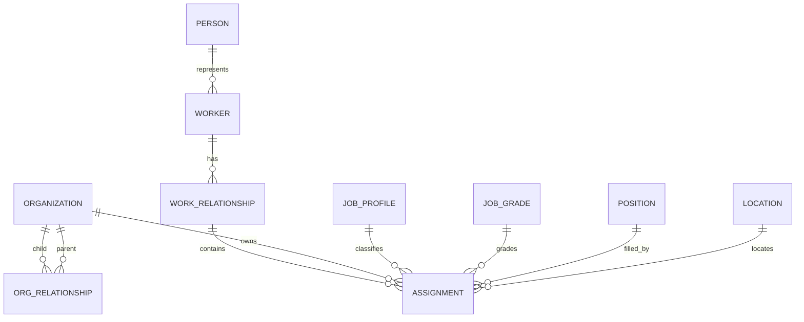

# R1 Effective Organization Graph 및 People Directory ADR

> 상태: Accepted and Implemented Local Baseline v1.0
>
> 기준일: 2026-08-10
>
> 적용 저장소: `dwp-backend`, `dwp-frontend`

## 1. 결정

DWP의 조직도는 Auth의 접근 제어용 조직·그룹을 시각화하지 않는다. People bounded
context가 소유하는 유효일 기준 Workforce Projection을 원본으로 사용하며, 동일 API를
조직도와 구성원 디렉터리가 공유한다.

- 조직 계층은 `ppl_organization_relationships`의 유효기간 관계로 표현한다.
- 직급은 `ppl_job_grades`, 직무는 `ppl_job_profiles`, 자리와 공석은 `ppl_positions`가
  각각 독립된 책임을 가진다.
- 기본 조직은 단일 상위의 `SUPERVISORY`, 겸임·협업 관계는 `MATRIX` 또는
  `FUNCTIONAL`로 분리한다.
- 사람의 보고 관계는 유효한 `ppl_assignments.manager_assignment_key`를 해석한다.
- React Flow가 상호작용·Viewport·접근성 기반을, Dagre가 계층 자동 배치를 담당한다.
  레이아웃 알고리즘을 업무 코드에서 직접 구현하지 않는다.
- `dwp_auth`의 역할은 이메일 정규화 키로 화면에서 읽기 결합한다. People DB에 RBAC
  테이블을 복제하거나 Database 간 FK를 만들지 않는다.

## 2. 제품 설계 원칙

Workday의 Supervisory Organization, ChartHop의 사람·그룹 전환과 상세 패널,
Workleap의 자동 갱신·공석·매트릭스 표현을 공통 기준으로 채택했다. 화면은 감상용
다이어그램이 아니라 반복 탐색을 위한 운영 도구다.

1. `조직 구조`와 `보고 체계`를 Segmented Control로 즉시 전환한다.
2. 기준일을 변경해 현재·미래 발령을 같은 화면에서 조회한다.
3. 조직과 사람 노드를 접고 펼치며, 전체 회사 또는 선택 조직으로 Scope를 좁힌다.
4. 조직·사람·이메일·직책 검색 결과로 Canvas가 이동한다.
5. 주 보고선과 매트릭스 관계는 색·선형·범례를 함께 달리해 색만으로 구분하지 않는다.
6. 선택 상세는 Desktop Side Inspector, Mobile Bottom Drawer로 제공한다.
7. 구성원 디렉터리는 조직·직급·근무지·재직상태·시스템 역할을 교차 필터링한다.

## 3. 데이터 모델



| 객체                             | 핵심 필드                                                           | 규칙                                    |
| -------------------------------- | ------------------------------------------------------------------- | --------------------------------------- |
| `ppl_organizations`              | key, type, short name, description, cost center, color, valid range | 조직 Master와 표시 Metadata             |
| `ppl_organization_relationships` | child, parent, type, primary, effective range                       | 같은 조직의 시간·관계 유형별 Graph Edge |
| `ppl_job_grades`                 | grade key, level order, career track, lifecycle                     | 고객별 직급 체계와 정렬 순서            |
| `ppl_assignments`                | effective range, org, position, job, grade, manager                 | 사람의 시점별 배치와 보고 관계          |
| `ppl_positions`                  | status, availability date, org, job, location                       | `OPEN`이면 조직별 공석으로 집계         |

모든 Key·Unique·FK는 `tenant_id`를 포함한다. 조직 관계는 Self-reference를 금지하고,
서비스 계층에서 순환을 방어한다. 유효일 조회는 시작일 포함·종료일 포함이며 같은 날짜의
복수 발령은 `effective_sequence`와 최신 ID 순으로 결정한다.

## 4. API 계약

`GET /api/people/v1/org-chart`

| Query                | 기본값       | 의미                            |
| -------------------- | ------------ | ------------------------------- |
| `asOf`               | 오늘         | 조직·발령 관계 기준일           |
| `rootOrganizationId` | Company Root | 선택 조직을 Root로 하는 Subtree |
| `depth`              | 10           | 1~10 범위의 최대 탐색 깊이      |

응답은 `company`, `metrics`, `organizations`, `people`, `relationships`,
`openPositions`로 구성한다. Worker Number는 HR Admin 계열 역할 외 사용자에게 마스킹한다.
People Directory API도 조직·직급·관리자·근무지·직속 인원 필드를 같은 기준일로 반환한다.

## 5. 화면 구조

```text
Summary metrics
View switch | Search | Company scope | Matrix | Effective date | Layout tools
--------------------------------------------------------------------------
Interactive organization/reporting canvas              | Selection detail
                                                       | leader / members
                                                       | roles / vacancies
--------------------------------------------------------------------------
```

노드 크기는 조직 `276x156`, 사람 `252x116`으로 고정한다. Dagre rank 간격과 node 간격을
방향별로 고정해 Hover·상태·텍스트가 레이아웃을 밀지 않게 한다. 긴 이름은 노드에서 한 줄
생략하고 상세 패널에서 전체를 제공한다. Zoom·Pan·Fit View·Mini Map을 기본 제공한다.

## 6. SKAX 합성 Baseline

- 회사 `SKAX`, 20개 활성 조직, 43명, 5개 근무지
- Company, 부문, 본부, 부서, 팀의 4단계 계층
- 생성형 AI, 데이터, 클라우드, ERP, 컨설팅, Corporate, 반도체 AX 조직
- 정규 구성원·외부 전문인력·휴직·미래 이동 발령
- G1~G7과 계약직 C1, 관리자·임원·전문가 직책
- 주 보고관계 19개, 매트릭스 관계 3개, 공석 6개
- Auth의 현재 제공 역할을 합성 계정에 결정적으로 분배하며 계정은 `INVITED` 상태로 유지

`@skax.example` 주소와 모든 이름·발령은 개발용 합성 데이터다. 운영 Delivery에서는
고객별 Source Mapping 승인을 거친 HRIS/SCIM Interface가 동일 Projection을 갱신한다.

## 7. Delivery Gate

1. 고객 HRIS 조직 유형·직급·공석·겸임 Mapping 승인
2. 조직 순환, 고아 조직, 겹치는 유효기간, 관리자 부재 Reconciliation
3. 대규모 Tenant의 Server-side Graph Slice, Search Index와 응답 Cache
4. 역할별 Profile Field Masking과 Export Audit
5. 1만 명 이상 조직의 Layout Worker 또는 ELK 전환 성능 검증
6. Tablet·Mobile 탐색, Keyboard, Screen Reader와 Reduced Motion 회귀 검증

현재 Baseline은 Local 개발 규모에서 API, 유효일, 자동 배치, 상호작용, 반응형 상세와
합성 데이터를 구현한다. 대규모 Graph의 전체 Rendering은 Delivery 성능 Gate로 남긴다.

## 8. 근거

- [Workday Organization Management](https://www.workday.com/content/dam/web/en-us/documents/datasheets/organization-management-in-workday-datasheet-en-us.pdf)
- [Workday Superior and Subordinate Organizations](https://doc.workday.com/admin-guide/en-us/manage-workday/organizations/manage-organization-concepts/concept--superior-and-subordinate-organizations.html)
- [ChartHop Org Chart](https://www.charthop.com/categories/org-chart)
- [Workleap Org Chart Software](https://workleap.com/org-chart-software)
- [React Flow Examples](https://reactflow.dev/examples)
- [React Flow Layouting](https://reactflow.dev/learn/layouting/layouting)
