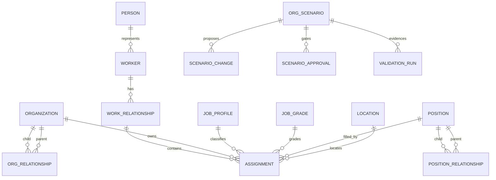

# R1 Effective Organization Graph 및 People Directory ADR

> 상태: Accepted and Implemented Local Baseline v4.0
>
> 기준일: 2026-08-13
>
> 적용 저장소: `dwp-backend`, `dwp-frontend`

## 1. 결정

DWP의 조직도는 Auth의 접근 제어용 조직·그룹을 시각화하지 않는다. People bounded
context가 소유하는 유효일 기준 Workforce Projection을 원본으로 사용한다. 사용자에게는
하나의 HR 제품 Shell을 제공하되, API와 데이터 권한은 목적에 따라 계속 분리한다.

| HR 제품 내부 표면 | 사용자와 목적                           | 데이터 노출                                             | 소유 메뉴                                                 |
| ----------------- | --------------------------------------- | ------------------------------------------------------- | --------------------------------------------------------- |
| `Employee`        | 전 구성원의 개인 HR·동료·보고 체계 탐색 | 본인 정보와 업무용 공개 Profile, 활성 구성원, 읽기 전용 | HR Home, 나의 HR, 구성원 디렉터리, 조직 탐색              |
| `Manager`         | 실제 직속 구성원이 있는 관리자          | 허용된 팀 관계와 공개 Profile                           | 나의 팀                                                   |
| `HR Operations`   | HR 운영자·조직 설계자                   | Worker·발령·직급·Position·비용·Scenario                 | 인력 운영, 구성원, 발령, 조직 설계, 기준정보, 데이터 운영 |
| `Control Center`  | Tenant IAM·플랫폼 관리자                | 계정·Role·Group·SCIM·Navigation 정책                    | Identity & Access, Platform Setup, Governance             |

Tenant Admin 권한은 HR 데이터 권한을 자동 포함하지 않는다. HR Operations는 `ADMIN`,
`HR_ADMIN`, `PEOPLE_ADMIN`과 `APP.WORKFORCE_MANAGEMENT` Entitlement를 함께 검사하며
`PEOPLE_ADMIN`은 읽기 전용이다. Provider 지원은
승인된 `WORKFORCE_READ` 세션에서만 읽기 접근하고 제한 필드는 계속 마스킹한다.

- 조직 계층은 `ppl_organization_relationships`의 유효기간 관계로 표현한다.
- 직급은 `ppl_job_grades`, 직무는 `ppl_job_profiles`, 자리와 공석은 `ppl_positions`가
  각각 독립된 책임을 가진다.
- 기본 조직은 단일 상위의 `SUPERVISORY`, 겸임·협업 관계는 `MATRIX` 또는
  `FUNCTIONAL`로 분리한다.
- 사람의 보고 관계는 유효한 `ppl_assignments.manager_assignment_key`를 해석한다.
- Position 보고 관계는 `ppl_position_relationships`의 유효기간과 Source를 사용한다.
  같은 시점에는 `SCENARIO > HRIS > POSITION > INFERRED` 우선순위를 적용하고 주 관계의
  기간 중첩과 자기 참조를 DB에서 차단한다.
- 조직 개편은 운영 Graph를 직접 수정하지 않고 Scenario에서 설계·검증·승인·게시한다.
  Baseline Fingerprint가 달라지면 게시를 거부해 오래된 조직안이 현재 구조를 덮지 못한다.
- React Flow가 상호작용·Viewport·접근성 기반을, Dagre가 계층 자동 배치를 담당한다.
  레이아웃 알고리즘을 업무 코드에서 직접 구현하지 않는다.
- `dwp_auth`의 역할은 이메일 정규화 키로 화면에서 읽기 결합한다. People DB에 RBAC
  테이블을 복제하거나 Database 간 FK를 만들지 않는다.
- 메뉴마다 물리 DB를 생성하지 않는다. 서비스 트랜잭션 경계인 `dwp_people` 안에서
  `ppl_`은 Workforce Projection, `int_`는 HRIS 연계, `sys_`는 감사·이벤트를 소유한다.
  Auth는 `dwp_auth`, 앱·Navigation Registry는 `dwp_platform`이 소유한다.

## 2. 제품 설계 원칙

Workday의 Supervisory Organization, ChartHop의 사람·그룹 전환과 상세 패널,
Workleap의 자동 갱신·공석·매트릭스 표현을 공통 기준으로 채택했다. 화면은 감상용
다이어그램이 아니라 반복 탐색을 위한 운영 도구다.

1. `조직 구조`, `보고 체계`, `Position`, `인사이트`를 Segmented Control로 즉시 전환한다.
2. 기준일을 변경해 현재·미래 발령을 같은 화면에서 조회한다.
3. 조직과 사람 노드를 접고 펼치며, 전체 회사 또는 선택 조직으로 Scope를 좁힌다.
4. 조직·사람·이메일·직책 검색 결과로 Canvas가 이동한다.
5. 주 보고선과 매트릭스 관계는 색·선형·범례를 함께 달리해 색만으로 구분하지 않는다.
6. 선택 상세는 Desktop Side Inspector, Mobile Bottom Drawer로 제공한다.
7. 구성원 디렉터리는 조직·직급·근무지·재직상태·시스템 역할을 교차 필터링한다. 검색은
   Tenant·Query·상태·기준일 Fingerprint에 결속된 서명 Cursor로 점진 로딩하며 만료·변조된
   Cursor는 Fail-closed한다.
8. Span, Layer, 공석, FTE, 인건비, 외부인력과 데이터 품질을 분석 Lens로 제공한다.
9. Scenario는 Drag-to-draft, 직위 이동·신설·종료, 전후 Preview, 독립 승인, 게시와 CSV
   Evidence Export를 제공한다.
10. 하나의 변경안을 계보가 보존된 독립 Draft로 복제하고, 동일한 기준 지문일 때만 두
    대안의 준비도·인원·FTE·비용·Span·Layer·품질 차이를 의사결정 비교값으로 제시한다.

## 3. 데이터 모델



| 객체                                        | 핵심 필드                                                               | 규칙                                    |
| ------------------------------------------- | ----------------------------------------------------------------------- | --------------------------------------- |
| `ppl_organizations`                         | key, type, short name, description, cost center, color, valid range     | 조직 Master와 표시 Metadata             |
| `ppl_organization_relationships`            | child, parent, type, primary, effective range                           | 같은 조직의 시간·관계 유형별 Graph Edge |
| `ppl_job_grades`                            | grade key, level order, career track, lifecycle                         | 고객별 직급 체계와 정렬 순서            |
| `ppl_assignments`                           | effective range, org, position, job, grade, manager                     | 사람의 시점별 배치와 보고 관계          |
| `ppl_positions`                             | key, status, type, criticality, FTE, annual cost, currency, valid range | 직위·공석·예산의 유효일 원장            |
| `ppl_position_relationships`                | child, parent, type, source, effective range                            | 시점·Source별 Position 보고 Graph       |
| `ppl_organization_scenarios`                | baseline/effective date, fingerprint, source scenario, owner, lifecycle | 개편안 Aggregate·계보·낙관적 Version    |
| `ppl_organization_scenario_changes`         | payload schema, before/after snapshot, delta, validation                | 버전이 명시된 변경 명령과 영향          |
| `ppl_organization_scenario_approvals`       | role, requester/decider, expiry, validation evidence UUID               | 독립 승인·만료·판단 근거 결속           |
| `ppl_organization_scenario_validation_runs` | fingerprint, metric delta, checks, readiness                            | 수정 불가 의사결정 Evidence             |

모든 Key·Unique·FK는 `tenant_id`를 포함한다. 조직 관계는 Self-reference를 금지하고,
서비스 계층에서 순환을 방어한다. 유효일 조회는 시작일 포함·종료일 포함이며 같은 날짜의
복수 발령은 `effective_sequence`와 최신 ID 순으로 결정한다.

## 4. 제품별 API 계약

| Surface   | API                                                      | 계약                                                 |
| --------- | -------------------------------------------------------- | ---------------------------------------------------- |
| People    | `GET /api/people/v1/people`                              | 활성 구성원 서버 검색·Cursor Page, HR 제한 필드 제외 |
| People    | `GET /api/people/v1/org-chart`                           | 사람·보고 관계 중심의 읽기 전용 Directory Graph      |
| Workforce | `GET /api/people/v1/workforce/people`                    | HR 운영용 Worker·직급·발령 Projection                |
| Workforce | `GET /api/people/v1/workforce/organization/chart`        | 조직·사람·Position·공석·비용 Effective Graph         |
| Workforce | `GET /api/people/v1/workforce/organization/intelligence` | Health·Change·Quality 비교                           |
| Workforce | `/api/people/v1/workforce/organization/scenarios/**`     | 조직 개편 설계·검증·승인·게시                        |
| Workforce | `/api/people/v1/workforce/reference-data/**`             | 고객 소유 인력 기준정보 조회·변경                    |
| Workforce | `/api/people/v1/workforce/data-operations/hris/**`       | HRIS Connector·Mapping·동기화 운영                   |

조직 API의 공통 Query는 다음과 같다.

| Query                | 기본값       | 의미                            |
| -------------------- | ------------ | ------------------------------- |
| `asOf`               | 오늘         | 조직·발령 관계 기준일           |
| `rootOrganizationId` | Company Root | 선택 조직을 Root로 하는 Subtree |
| `depth`              | 6            | 1~12 범위의 최대 탐색 깊이      |

Workforce 응답은 `company`, `metrics`, `organizations`, `people`, `relationships`,
`positions`, `positionRelationships`, `openPositions`로 구성한다. 일반 People 응답은
Position·공석·비용·Scenario와 Worker Number·직급·발령 Key를 서버에서 제거한다. UI에서
숨기는 방식은 보안 경계로 인정하지 않는다.

Scenario API는 생성·계보 기반 복제·변경 추가/삭제·검증·제출·승인/거절·게시를 별도 명령으로 제공한다.
제출, 승인, 게시 시마다 Cycle, Root, Version, Baseline Fingerprint와 Blocking Issue를 다시
검증하며 게시만 유효일 관계를 생성한다. 제출·승인/반려·게시 Row는 그 판단에 사용한 불변
Validation Run UUID를 FK로 참조한다.

## 5. 화면 구조

```text
Summary metrics
View switch | Search | Company scope | Matrix | Effective date | Layout tools
--------------------------------------------------------------------------
Interactive organization/reporting canvas              | Selection detail
                                                       | leader / members
                                                       | roles / vacancies
--------------------------------------------------------------------------
```

노드 크기는 조직 `276x156`, 사람 `252x116`으로 고정한다. Dagre rank 간격과 node 간격을
방향별로 고정해 Hover·상태·텍스트가 레이아웃을 밀지 않게 한다. 긴 이름은 노드에서 한 줄
생략하고 상세 패널에서 전체를 제공한다. Zoom·Pan·Fit View·Mini Map을 기본 제공한다.

Frontend는 `features/hris`가 제품 Shell·Home·역할 인지 Navigation을 조합하고,
`features/people`, `features/workforce`, `features/integrations`는 각 도메인 화면 책임을
유지한다. Backend는 `directory`, `organization`, `workforce`, `integration`, `security`
package로 분리한다. HRIS Adapter는 연계 bounded context에 두되 권한이 있는 사용자의 HR
데이터 운영 메뉴에서만 진입할 수 있다.

## 6. SKAX 합성 Baseline

- 회사 `SKAX`, 회사 Root 포함 66개 활성 조직, 177명(활성 176·휴직 1), 6개 근무지
- Company, 부문, 본부, 센터, 제품 그룹, 지역, 팀·스쿼드·챕터·딜리버리 포드가 혼합된 4~6단계 계층
- 생성형 AI, 데이터, 클라우드, ERP, 컨설팅, Corporate, 반도체 AX 조직
- 정규 구성원·외부 전문인력·휴직·미래 이동 발령
- G1~G7과 계약직 C1, 관리자·임원·전문가 직책
- 주 보고관계 65개, 매트릭스 관계 3개, 직위 187개(충원 177·공석 10), 계획 FTE 187
- Auth의 현재 제공 역할을 177개 합성 구성원 계정에 결정적으로 분배하며 비밀번호 없이 `INVITED` 상태로 유지

위 단계 수와 유형 조합은 화면·성능·시나리오 기능을 검증하기 위한 현재 합성 데이터일 뿐
제품 Schema나 부모·자식 검증 규칙이 아니다. Tenant는 `ppl_organization_type_catalog`에
자체 유형을 추가하고 임의 순서로 연결할 수 있으며, `hierarchy_rank`는 정렬 힌트로만
사용한다. API의 `depth`도 조회 범위 제한이지 조직 골격 제한이 아니다.

`@sk.com` 주소의 계정과 모든 이름·발령은 개발용 합성 데이터다. 운영 Delivery에서는 고객별 Source Mapping
승인을 거친 HRIS/SCIM Interface가 검증된 실제 이메일로 동일 Projection을 갱신한다.

## 7. 경쟁 제품 기준과 DWP 차별화

| 검증 기준 | 상용 제품에서 확인한 기준                               | DWP 구현 기준                                                      |
| --------- | ------------------------------------------------------- | ------------------------------------------------------------------ |
| 탐색      | Microsoft Org Explorer의 관리자 Chain, 동료·직속 탐색   | 조직·보고·Position 네트워크와 검색·접기·Inspector                  |
| Position  | SAP의 Position 중심 조직도와 공석 표시                  | 유효일 Position Graph, Source 우선순위, 공석·FTE·비용 Lens         |
| What-if   | Oracle Workforce Modeling의 Scenario와 동기화           | 불변 Baseline Fingerprint, 전후 Graph, 독립 승인과 유효일 게시     |
| 의사결정  | Workday Org Design의 시나리오 모델링                    | Readiness Score, Cycle/Root/Span/Layer 검사와 Append-only Evidence |
| 대안 탐색 | Workleap의 Planning Chart 복제, Workday의 복수 Scenario | 계보 보존 Clone과 기준 지문 일치 시에만 허용하는 Side-by-side 비교 |

우월성은 화면 기능 수로 주장하지 않는다. `동일 시점 재현 가능성`, `승인 우회 불가`,
`게시 전 구조 무결성`, `10k 규모 탐색 성능`, `접근성`을 측정 Gate로 두고 경쟁 제품과 같은
시나리오를 반복 검증한다.

## 8. Delivery Gate

1. 고객 HRIS 조직 유형·직급·공석·겸임 Mapping 승인
2. 조직 순환, 고아 조직, 겹치는 유효기간, 관리자 부재 Reconciliation
3. 대규모 Tenant의 Server-side Graph Slice, Search Index와 응답 Cache
4. 역할별 Profile Field Masking과 Export Audit
5. SAP Target Population 수준의 조직 범위형 조회·Field Policy·Export 권한 강제
6. 1만 명 이상 조직의 Layout Worker 또는 ELK 전환 성능 검증
7. Tablet·Mobile 탐색, Keyboard, Screen Reader와 Reduced Motion 회귀 검증

현재 Baseline은 유효일 조직·Position Graph, 네 가지 View, 조직 건강·데이터 품질·기간
비교, Scenario Preview·대안 복제/비교·독립 승인·게시와 반응형 탐색을 구현한다. 10k 이상 Graph의 가상화,
HRIS 충돌 해소 Workbench와 고객별 정책 임계값은 Delivery 성능·통합 Gate로 남긴다.

HR의 일반 구성원 디렉터리는 서버 검색·서명 Cursor 점진 로딩, Healthy Empty·부분 실패 복구,
사람 상세와 조직도 Focus Deep link를 제공한다. 조직도 파일 반출은 개인정보 분류·Masking·
Watermark·만료 정책 `D-09`가 승인되기 전까지 제공하지 않는다.

## 9. 근거

- [Workday Organization Management](https://www.workday.com/content/dam/web/en-us/documents/datasheets/organization-management-in-workday-datasheet-en-us.pdf)
- [Workday Superior and Subordinate Organizations](https://doc.workday.com/admin-guide/en-us/manage-workday/organizations/manage-organization-concepts/concept--superior-and-subordinate-organizations.html)
- [Workday Org Design and Scenario Modeling](https://doc.workday.com/adaptive-planning/en-us/what-s-new/releases/2026r1-release-notes/2026r1-planning-for-hcm-and-financials/org-design-and-scenario-modeling.html)
- [Microsoft Org Explorer](https://learn.microsoft.com/en-us/viva/people-in-viva/introducing-org-explorer)
- [SAP Latest Org Chart](https://help.sap.com/docs/successfactors-platform/configuring-and-using-organization-chart/latest-org-chart)
- [SAP Org Chart Permissions](https://help.sap.com/docs/successfactors-platform/configuring-and-using-organization-chart/permissions-for-configuring-and-using-org-chart)
- [SAP Position Organization Chart](https://help.sap.com/docs/SAP_SUCCESSFACTORS_RELEASE_INFORMATION/8e0d540f96474717bbf18df51e54e522/6b91cd3f8e3f494591f32089c12f1d11.html)
- [Oracle Workforce Modeling](https://docs.oracle.com/en/cloud/saas/human-resources/fawhr/workforce-modeling.html)
- [Oracle Workforce Modeling Synchronization](https://docs.oracle.com/en/cloud/saas/human-resources/fawhr/how-synchronization-works-in-workforce-modeling.html)
- [ChartHop Org Chart](https://www.charthop.com/categories/org-chart)
- [Workleap Org Chart Software](https://workleap.com/org-chart-software)
- [Workleap Planning Org Charts](https://help.workleap.com/en/articles/10281399-create-planning-org-charts)
- [Workleap Planning Comments](https://help.workleap.com/en/articles/10281403-collaborate-with-comments-on-planning-charts)
- [React Flow Examples](https://reactflow.dev/examples)
- [React Flow Layouting](https://reactflow.dev/learn/layouting/layouting)
