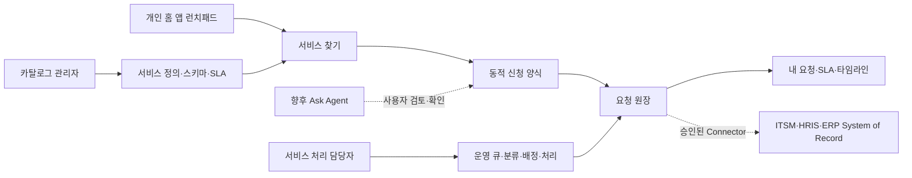
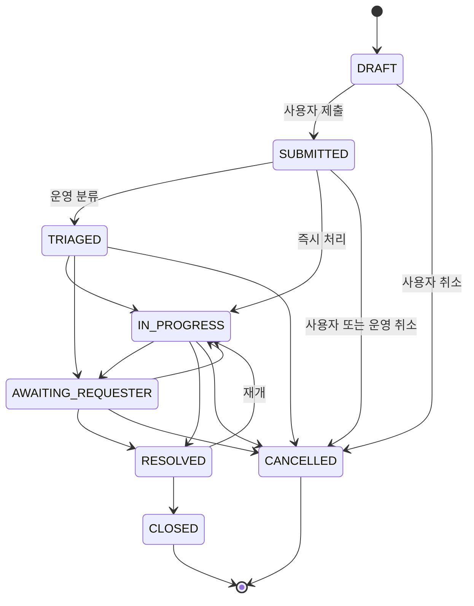

# R1 Employee Services and Service Request Orchestration ADR

- 상태: Accepted
- 결정일: 2026-08-14
- 범위: 구성원용 서비스 센터, 테넌트 서비스 카탈로그, 서비스 요청 운영

## 1. 결정

DWP의 다음 공통 앱은 **서비스 센터(Services)** 로 구축한다. 서비스 센터는 단순 문의 게시판이나 IT 전용 티켓 화면이 아니라 IT, People, Workplace, Finance, Procurement를 같은 요청 계약으로 연결하는 엔터프라이즈 서비스 진입점이다.

1. 구성원 제품 표면은 `/services` 독립 앱과 전용 업무 셸로 제공한다.
2. 서비스 정의는 테넌트별 카테고리, 다국어 이름, 담당 조직, SLA, 데이터 등급, 버전형 동적 신청 스키마로 관리한다.
3. 요청은 제출 시 서비스 이름·스키마·데이터 등급을 스냅샷으로 보존한다. 이후 카탈로그가 변경되어도 과거 요청의 의미와 증적은 변하지 않는다.
4. 임시 저장은 불완전한 입력을 허용하고 제출 시점에만 필수값·유형·선택값을 서버에서 검증한다. 초안 편집과 제출은 하나의 트랜잭션과 API 호출로 처리해 저장 성공 후 제출만 실패하는 중간 상태를 만들지 않는다.
5. 사용자와 운영자 상태 변경은 명시적 상태 머신, optimistic locking, 멱등성 키, append-only 타임라인과 감사 이벤트를 사용한다. 타임라인의 수정·삭제는 애플리케이션 규칙뿐 아니라 DB Trigger에서도 거부한다.
6. 서비스 설계와 요청 처리를 각각 `SERVICE_CATALOG_MANAGER`, `SERVICE_AGENT` 역할로 분리한다.
7. 외부 ITSM·HRIS·ERP가 준비되면 DWP 요청은 오케스트레이션 원장으로 남고, 실제 System of Record 작업은 승인된 Connector Port로 전달한다.

## 2. 외부 모범사례 비교

| 관찰 대상                               | 검증된 원리                                                            | DWP 적용                                                  | 복제하지 않은 부분                    |
| --------------------------------------- | ---------------------------------------------------------------------- | --------------------------------------------------------- | ------------------------------------- |
| ServiceNow Employee Center              | 구성원이 여러 부서 서비스를 단일 진입점에서 찾고 요청·진행 상태를 확인 | 도메인 공통 카탈로그, 내 요청, 처리 타임라인              | 제품별 탐색 구조와 시각 스타일        |
| ServiceNow Catalog Request              | 카탈로그 정의와 요청 레코드 분리, 요청 상태·담당 그룹·SLA 관리         | `svc_definitions`, `svc_requests`, 스키마 스냅샷, 운영 큐 | 특정 ITSM 테이블 모델과 워크플로 엔진 |
| Atlassian Enterprise Service Management | IT 외 HR·시설·법무 등 서비스 팀으로 요청 관리 확장                     | People·Workplace·Finance·Procurement 카테고리             | Jira 프로젝트·이슈 유형 중심 정보구조 |
| Atlassian Service Request Management    | 검색 가능한 셀프서비스, 표준화된 접수, SLA와 자동화                    | 검색·카테고리 탐색, 동적 양식, SLA 위험도                 | 벤더 고유 자동화 규칙 문법            |

근거:

- [ServiceNow Employee Center requests](https://www.servicenow.com/docs/r/employee-service-management/employee-experience-foundation/employee-center-requests-page-configuration.html)
- [ServiceNow submit a catalog request](https://www.servicenow.com/docs/r/it-service-management/submit-cat-request-native-ai-itsm.html)
- [Atlassian Enterprise Service Management](https://www.atlassian.com/software/jira/service-management/product-guide/getting-started/enterprise-service-management)
- [Atlassian Service Request Management](https://www.atlassian.com/software/jira/service-management/product-guide/getting-started/service-request-management)
- [Atlassian service management templates](https://www.atlassian.com/software/jira/templates/service-management)

외부 제품과의 차별점은 DWP 홈 앱 권한, 다국어·테넌트 정책, 감사·API 이력, 향후 Ask Agent의 승인형 실행 계약을 처음부터 같은 플랫폼 경계에 둔 것이다.

## 3. 제품 구조

## 4. 상태 머신

- 구성원 취소는 `DRAFT`, `SUBMITTED`, `TRIAGED`까지만 허용한다.
- 운영자는 서버가 허용한 다음 상태만 선택한다. UI 표시 제어만으로 상태 무결성을 보장하지 않는다.
- 모든 변경은 버전 충돌을 감지하고, 타임라인과 `PlatformAuditService`에 동일 상관관계 ID로 남긴다.

## 5. 데이터 경계

| 테이블                 | 책임                                                                                      |
| ---------------------- | ----------------------------------------------------------------------------------------- |
| `svc_categories`       | 테넌트별 서비스 분류·다국어 표시·정렬·수명주기                                            |
| `svc_definitions`      | 서비스 정의, 동적 스키마, 담당 조직, SLA, 데이터 등급, 검색 태그                          |
| `svc_requests`         | 사용자 요청, 서비스·스키마 스냅샷, 멱등성, 상태, 배정, SLA, optimistic version            |
| `svc_request_timeline` | 사용자·운영자·시스템 상태 변경의 append-only 처리 증적. DB Trigger가 UPDATE·DELETE를 거부 |

모든 PK 조회는 `tenant_id`를 동반한다. `svc_request_timeline`은 테넌트와 요청의 복합 외래키로 교차 테넌트 연결을 차단한다.

## 6. 권한 경계

| 역할                              | 서비스 앱 | 카탈로그 조회·편집 | 요청 운영 |
| --------------------------------- | --------: | -----------------: | --------: |
| `WORKSPACE_MEMBER`                |         O |                  - |         - |
| `SERVICE_CATALOG_MANAGER`         |         O |                  O |         - |
| `SERVICE_AGENT`                   |         O |                  - |         O |
| `TENANT_ADMIN` / `PLATFORM_ADMIN` |         O |                  O |         O |

리소스 계약:

- `APP.EMPLOYEE_SERVICES:VIEW`
- `ADMIN.SERVICE_CATALOG:{VIEW,CREATE,UPDATE,MANAGE}`
- `ADMIN.SERVICE_OPERATIONS:{VIEW,UPDATE,MANAGE}`

Gateway 세션 권한 조회, 플랫폼 필터, 프론트 라우트와 메뉴가 모두 같은 리소스 키를 사용한다.

## 7. AI와 외부 시스템 경계

Ask Agent는 향후 “노트북 로그인 문제가 있어” 같은 자연어에서 서비스를 추천하고 필드를 **미리 채울 수만** 있다. 제한·기밀 데이터 전송, 최종 제출, 취소와 운영 상태 변경은 다음 조건을 만족해야 한다.

1. 사용자 또는 책임 운영자가 구조화된 실행 계획을 확인한다.
2. 서버가 현 세션 권한과 최신 스키마를 다시 검증한다.
3. 멱등성 키와 상관관계 ID를 생성한다.
4. 실행 결과와 외부 System of Record ID를 감사 증적으로 남긴다.

LLM 출력이 DB 상태를 직접 변경하거나 임의 상태를 생성하는 경로는 허용하지 않는다.

## 8. 2026-08-14 내부 구현 증거

- Platform V62에서 5개 카테고리, 9개 서비스 정의와 요청·스키마 스냅샷·SLA 원장을 생성했다.
- Platform V63에서 운영 상태별 Seed, 복합 FK `ON DELETE RESTRICT`와 타임라인 불변 Trigger를 적용했다.
- Platform V64~V66에서 서비스센터·소식의 코드 계약과 위임 역할 투영을 공통 제어면에 등록했고, V67에서 역할 인식 홈 개인화 계약을 통합했다.
- 구성원 서비스 찾기·동적 양식·임시 저장·원자적 편집 제출·내 요청·타임라인을 실제 API와 연결했다.
- 관리 센터를 `서비스 카탈로그`와 `요청 운영`으로 분리하고 카탈로그 관리자와 처리 담당자의 직접 URL·API 상호 접근을 403으로 검증했다.
- 한국어·영어, 1440px Desktop과 390px Mobile을 브라우저에서 확인하고 서비스센터 E2E 4건을 포함한 핵심 제품 E2E 16건, Frontend 단위 130건, Backend 전체 Gradle Test와 Production Build를 통과했다.
- DB에서 실제 타임라인 UPDATE를 시도해 SQLSTATE `55000`으로 거부되는 것을 확인했다.

이 증거는 내부 Reference 구현의 완료 기준이다. 고객 ITSM·HRIS·ERP 연동, 실제 업무시간 SLA와 운영 보안 인프라의 출시 승인을 대신하지 않는다.

## 9. 확장 Gate

- 실제 ITSM·HRIS·ERP Connector, 자격증명, 재시도·보상·reconciliation SLA
- 조직·위치·고용유형에 따른 카탈로그 audience targeting
- 업무시간·휴일 캘린더를 반영한 SLA 계산기와 escalation worker
- 첨부 파일의 S3/KMS, 악성코드 검사, 보존·법적 보류
- 승인형 요청, 다단계 fulfilment task, 공급사 포털
- Ask Agent 추천·prefill·사용자 확인과 품질 평가 데이터셋

외부 시스템과 정책이 결정되기 전에는 가짜 Connector나 자동 승인을 활성화하지 않는다.
