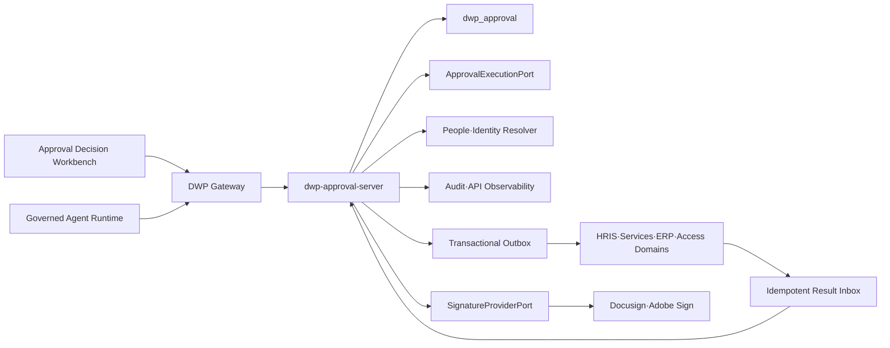
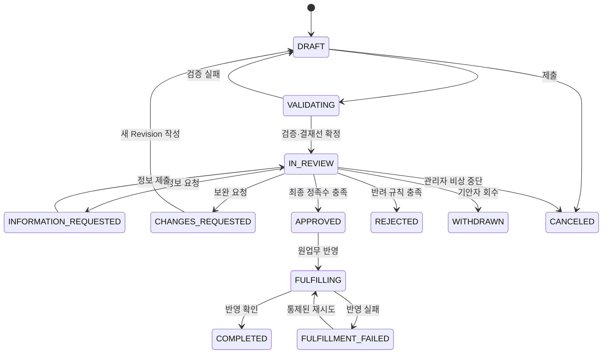

# R1 Enterprise Approval Decision Hub ADR

- 상태: Proposed
- 결정일: 2026-08-14
- 범위: DWP 내부 결재, 통합 결재함, Workflow 운영, 원업무 반영, 전자서명 Adapter
- Feature: `../05-features/DWP-R1-APR-001-enterprise-approval-decision-hub/`

## 1. Context

DWP에는 조직 시나리오 승인, Provider 운영 승인, 앱 접근 요청 등 도메인별 승인 기능이
이미 존재한다. 그러나 이 기능은 각 도메인의 독립 상태와 증적이며 다음 공통 역량을
제공하지 않는다.

- 구성원 관점의 통합 결재함
- 재사용 가능한 양식·Workflow·결재선 정책
- 위임·재지정·보완·정보요청의 일관된 의미
- 승인 이후 원업무 반영 상태와 복구
- 외부 전자서명과 완료 증명
- 업무 앱·Agent가 공통으로 사용하는 승인 계약

## 2. Decision

### 2.1 제품 경계

1. 사용자 표면은 `/approvals`의 독립 제품 Shell로 제공한다.
2. 앱 런치패드의 `업무 시작` 그룹에 `결재` 앱을 배치한다.
3. 개인 홈에는 대기 건수, 긴급 건과 처리 필요 시각만 요약한다.
4. 관리 표면은 관리 센터의 `업무 자동화 > 결재 관리`에 둔다.
5. DWP는 내부 권한 부여·예산·인사·서비스·Agent 실행의 **결정 원장**을 소유한다.
6. 계약 당사자 서명·인증서·전자직인은 전문 전자서명 Provider Adapter로 연결한다.

### 2.2 데이터 소유권

| 데이터                                       | System of Record                                       |
| -------------------------------------------- | ------------------------------------------------------ |
| 인사 발령, 구매 요청, 서비스 요청, 접근 권한 | 해당 업무 도메인                                       |
| 양식·Workflow·결재 정책 Version              | Approval bounded context                               |
| 제출 시점 업무 Snapshot·Hash                 | Approval bounded context                               |
| Task·결정·위임·의견·Timeline                 | Approval bounded context                               |
| 원업무 반영 결과                             | 원업무 도메인, Approval에는 결과 Projection            |
| 서명 원본·완료 인증서                        | 전자서명 Provider/Object Store, Approval에는 참조·Hash |

Approval 서비스는 다른 도메인 DB를 직접 갱신하지 않는다. 승인 완료 후 Outbox를 통해
원업무 Command를 발행하고, 원업무가 멱등 처리 결과를 회신한다.

## 3. Target Architecture

- Backend는 신규 `dwp-approval-server` 모듈과 별도 `dwp_approval` Database를 사용한다.
- Frontend는 `features/approvals`, `layouts/approvals-layout`, 독립 Navigation과 i18n
  Namespace를 사용한다.
- Agent는 Gateway의 동일 API와 권한·멱등·감사 계약만 사용하며 DB에 접근하지 않는다.
- 장기 실행 Timer·Retry·복구는 `ApprovalExecutionPort` 뒤의 검증된 Durable Workflow
  Engine에 맡긴다. 임의 Thread·메모리 Scheduler로 구현하지 않는다.
- Engine 선택은 운영 Topology·라이선스·BPMN 가시성을 비교하는 Build Gate에서
  확정하되, DWP 업무 모델과 API가 특정 Engine 객체를 노출하지 않게 한다.

## 4. Process Model

### 4.0 현재 런타임 경계

로컬 R1 기준선은 순서가 있는 다단계와 단계별 역할 후보 Queue를 구현한다. 각 단계는
후보 역할을 가진 한 Task이며, 자격이 있는 한 명이 결정하면 단계가 완료되는 `ANY`만
게시할 수 있다. `ALL`, `COUNT`, `PERCENT`와 활성 시점 개인 후보 Snapshot은 아래 Target
Architecture에 포함되지만 아직 런타임 계약이 아니며 관리자 UI와 API에서 거부한다.

이 경계는 데이터 Column에 값을 저장하는 것과 실제 정족수 집계를 혼동하지 않기 위한
fail-closed 결정이다. 고급 정족수는 후보별 불변 Decision, 조직 유효일 Snapshot,
중복·위임·SoD 규칙과 동시성 시험을 함께 구현한 뒤 ADR을 갱신하고 활성화한다.

### 4.1 제출

1. 양식과 원업무 Payload를 검증한다.
2. 원본 Revision·ETag·Hash와 데이터 등급을 고정한다.
3. 조직·직책·Role·금액·조건으로 결재선 Preview를 계산한다.
4. 자기 승인, SoD, 순환, 후보 부재와 중복 요청을 차단한다.
5. Idempotency Key로 한 번만 Instance를 시작한다.

### 4.2 결재선 해석

| Mode                    | 동작                                    | 사용 기준                       |
| ----------------------- | --------------------------------------- | ------------------------------- |
| `FREEZE_AT_SUBMISSION`  | 제출 시 모든 후보를 Snapshot            | 재무·권한·인사 등 고위험 기본값 |
| `RESOLVE_AT_ACTIVATION` | Stage 활성 시 유효일 조직으로 후보 확정 | 장기 저위험 Process             |

두 Mode 모두 규칙 Version, 해석 입력과 최종 후보를 증적으로 저장한다. 활성 시 Preview와
후보가 달라지면 Timeline에 남기고 정책에 따라 운영자 검토를 요구한다.

### 4.3 Step과 정족수

- Step: `APPROVAL`, `CONSENT`, `REVIEW`, `SIGNATURE`, `FYI`, `ACKNOWLEDGEMENT`,
  `AUTOMATION`, `TIMER`, `SUBPROCESS`
- Routing: 사용자, 그룹, 역할, 직책, Manager Chain, Data Owner, Resource Owner
- Quorum: `ANY`, `ALL`, `COUNT`, `PERCENT`
- Action: 승인, 반려, 보완 요청, 정보 요청, Claim, Release, 위임, 재지정, 회수, 취소

### 4.4 위임과 재지정

- 위임은 원 권한자의 책임을 유지하고 대리 행위자와 위임자를 모두 기록한다.
- 재지정은 Task 책임자를 변경하며 권한 있는 운영자 또는 정책만 수행한다.
- 부재 위임은 시작·종료 시각, 업무 범주, 대상과 제외 조건을 가진다.
- 위임을 통해 자기 요청을 승인하거나 SoD를 우회할 수 없다.

## 5. 불변 규칙

1. 게시된 Workflow·Form Version은 수정하지 않는다.
2. 결정된 Request Revision은 수정·삭제하지 않는다.
3. 동일 Task Version에 대한 최종 결정은 한 번만 기록한다.
4. 결정 권한은 `standing permission + active task candidacy + scope + SoD`를 모두 만족해야 한다.
5. 최종 승인과 원업무 반영 완료를 같은 상태로 취급하지 않는다.
6. Timeline과 Decision은 Append-only이며 정정도 새 Event다.
7. 민감 업무는 자동 승인하지 않는다. 만료 시 기본 동작은 에스컬레이션 또는 중단이다.
8. Tenant 관리자라도 기밀 본문을 기본 열람하지 못한다. Break-glass는 사유·승인·만료를 요구한다.
9. Agent는 승인·반려·위임·재지정의 최종 행위자가 될 수 없다.
10. UI에 보이지 않는 직접 API 요청도 같은 정책을 서버에서 검증한다.

## 6. 권한 모델

| 역할                         | 책임                    | 분리 원칙                        |
| ---------------------------- | ----------------------- | -------------------------------- |
| `APPROVAL_REQUESTER`         | 기안·제출·회수          | 자신의 Request 범위              |
| `APPROVAL_PARTICIPANT`       | 활성 Task 판단          | 영구 Role이 아니라 Task에서 파생 |
| `APPROVAL_TEMPLATE_DESIGNER` | 양식·Workflow 초안      | 게시 불가                        |
| `APPROVAL_POLICY_MANAGER`    | Routing·SLA·SoD 정책    | 자신의 정책 승인 불가            |
| `APPROVAL_PUBLISHER`         | Version 검토·게시       | 초안 수정 불가                   |
| `APPROVAL_OPERATOR`          | 장애·재시도·Task 재지정 | 업무 판단 불가                   |
| `APPROVAL_AUDITOR`           | Metadata·증적 조회      | 본문은 별도 Content Scope 필요   |
| `APPROVAL_SIGNATURE_ADMIN`   | Provider·인증 정책      | 내부 결재 정책 변경 불가         |

## 7. UX Architecture

### 7.1 사용자 Shell

| 메뉴           | Route                    | 목적                         |
| -------------- | ------------------------ | ---------------------------- |
| 내 결재함      | `/approvals/inbox`       | 처리할 Task와 SLA            |
| 기안하기       | `/approvals/new`         | Form·업무 앱 기반 새 Request |
| 임시 저장      | `/approvals/drafts`      | 미제출 Revision              |
| 내가 올린 문서 | `/approvals/submitted`   | 진행·보완·반영 상태          |
| 참조·열람      | `/approvals/fyi`         | FYI와 확인 요청              |
| 완료 문서      | `/approvals/archive`     | 결정·증적 검색               |
| 위임 설정      | `/approvals/delegations` | 기간·범주형 부재 위임        |

### 7.2 관리 센터

- Workflow Studio
- Form Library
- Routing·SoD Policy
- SLA·Business Calendar
- 운영 Queue·복구
- 서명 Provider
- 분석·감사 연결

관리 메뉴는 사용자 결재함에 섞지 않는다.

## 8. AI 경계

AI가 허용되는 작업은 다음으로 제한한다.

- 원문 필드와 첨부를 인용한 Decision Brief
- 이전 Revision과 현재 Revision의 변경점 요약
- 누락 증거, 정책 충돌과 예상 결재선 설명
- 양식 추천, 초안 작성과 결재선 Preview 준비
- 정보 요청·의견 문구 Draft

AI는 승인 가능 여부나 승인자를 새로 결정하지 않으며, 고위험 의사결정을 추천 점수 하나로
축약하지 않는다. 사용자가 제출·승인 Action을 명시적으로 확인해야 하며 실행 API는 사람
Session과 Step-up 결과를 검증한다.

## 9. Build Sequence

1. G0~G2 문서·위험·Workflow Engine Spike 승인
2. Database·State Machine·Outbox·권한 Foundation
3. Inbox·Detail·Draft·Submitted와 4개 Reference Form
4. Workflow·Form·Policy Admin
5. HRIS·Employee Services·Access Request Reference Adapter
6. Home·Work·Activity·Notification Projection
7. 규모·복구·접근성·보안 Gate
8. 외부 전자서명 Provider Sandbox
9. Agent Decision Brief와 Governed Draft

## 10. Gate

- Workflow Engine 운영·라이선스 결정
- 전자서명 Provider, 지역별 법적 요구와 인증 수준
- Object Storage·KMS·Malware Scan·WORM 보존
- 고객별 전결·대결·후결·직인 정책
- 실제 ERP·구매·계약 System of Record Adapter
- Mobile Push와 외부 Action Card의 재인증 정책

Gate가 닫힌 기능은 UI에서 성공을 가장하지 않고 `구성 필요` 또는 비활성 상태로 둔다.
