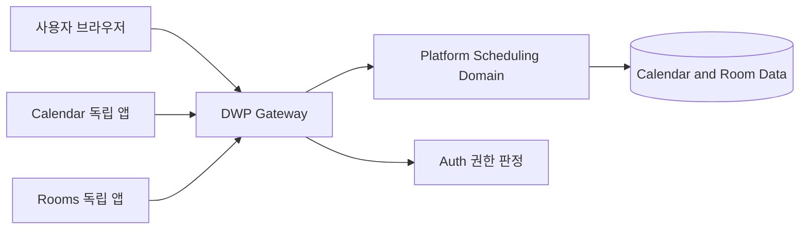

# R1 Enterprise Calendar and Rooms Architecture

## 1. 목적

캘린더와 회의실을 단순 조회 화면이 아니라 사용자가 실제로 일정을 만들고 변경하며,
운영자가 공간 자원과 정책을 통제할 수 있는 독립 제품으로 정의한다.

- Calendar: 개인·팀 일정의 생성, 편집, 드래그 이동, 길이 조정, 참석 응답과 가용 시간 탐색
- Rooms: 회의실 검색, 실시간 가용성 확인, 예약, 참석자 초대, 예약 변경·취소
- Rooms Administration: 회의실 인벤토리, 운영 상태, 승인 큐와 예약 정책 관리
- 공통 원칙: 브라우저는 Gateway만 호출하며 Calendar와 Rooms 프론트엔드는 서로의 feature 구현을 import하지 않는다.

## 2. 글로벌 제품 벤치마크

2026-08-19 기준 공식 제품 문서에서 반복적으로 검증되는 기능만 채택 후보로 삼았다.

| 제품              | 검증한 강점                                                | DWP 반영                            |
| ----------------- | ---------------------------------------------------------- | ----------------------------------- |
| Google Calendar   | 집중 시간, 자동 응답, 가용성 보호                          | 집중 시간 빠른 생성과 일정 유형     |
| Microsoft Outlook | Scheduling Assistant, Room Finder, 참석자·회의실 동시 탐색 | 가용 시간 탐색과 별도 Rooms 앱      |
| Notion Calendar   | 팀 가용성 공유, 예약 링크, 여러 캘린더 통합                | 가용성 중심 정보 구조               |
| Calendly          | 예약 워크플로, 라우팅, 후속 자동화                         | 예약 정책과 향후 알림 워크플로 경계 |
| Reclaim           | 집중 시간·습관·업무의 스마트 스케줄링                      | 집중 시간과 정책 기반 자동화 확장점 |
| Motion            | 우선순위 기반 자동 재배치                                  | 충돌 감지와 향후 자동 재계획 확장점 |
| Robin             | 회의실 예약, 체크인, 디스플레이, 공간 운영                 | 실시간 가용성, 예약, 운영 메뉴 분리 |
| Skedda            | 공간 지도, 예약 규칙, 체크인·자동 해제                     | 중앙 예약 정책과 운영 상태 모델     |
| Eptura            | 층·설비 검색, 룸 패널, 노쇼 관리                           | 사업장·층·수용 인원·설비 필터       |
| Envoy Rooms       | 현장 예약, 체크인, 자동 해제, 분석                         | 운영 승인 큐와 향후 체크인 수명주기 |

공식 근거:

- Google Calendar: <https://support.google.com/calendar/answer/11190973>
- Microsoft Outlook: <https://support.microsoft.com/en-us/outlook/use-the-scheduling-assistant-and-room-finder-for-meetings-in-outlook>
- Notion Calendar: <https://www.notion.com/help/notion-calendar-for-teams>
- Calendly: <https://calendly.com/features/>
- Reclaim: <https://help.reclaim.ai/en/articles/6210740-features-in-reclaim>
- Motion: <https://www.usemotion.com/help/time-management/auto-scheduling>
- Robin: <https://support.robinpowered.com/hc/en-us/articles/4416639332621-Robin-Platform-Overview>
- Skedda: <https://www.skedda.com/>
- Eptura: <https://eptura.com/our-platform/eptura-engage/room-booking/>
- Envoy: <https://envoy.com/workplace-management/envoy-workplace-platform>

## 3. 제품 경계

### 3.1 프론트엔드

- Calendar 배포 단위는 `/calendar/**`, Rooms 배포 단위는 `/rooms/**`이다.
- Rooms는 `apps/dwp-rooms/project.json`의 독립 Nx 제품이며 자체 route, shell context,
  navigation, 번역 namespace와 bundle budget을 가진다.
- 두 앱은 `libs/shared-utils`의 계약형 API client와 공용 design system만 공유한다.
- Rooms 화면에서 `/calendar/**` API를 호출하지 않는다. 공유 일정 도메인은 서버 내부
  구현 세부사항이고 브라우저 계약은 `/api/platform/v1/rooms/**`로 분리한다.

### 3.2 백엔드

- Calendar와 Rooms는 시간 충돌, 참석자, 반복 일정이라는 동일한 scheduling aggregate를
  사용한다.
- 외부 API와 권한은 분리하되 내부 도메인 규칙을 중복 구현하지 않는다.
- Rooms endpoint는 `ROOM` 자원과 해당 자원의 booking만 처리하도록 서버에서 재검증한다.
  임의 event ID로 일반 캘린더 일정을 수정할 수 없다.

## 4. 권한 모델

| 권한 리소스      | 대상               | 주요 권한                           |
| ---------------- | ------------------ | ----------------------------------- |
| `APP.CALENDAR`   | 일반 캘린더 사용자 | `VIEW`, `CREATE`, `UPDATE`          |
| `ADMIN.CALENDAR` | 캘린더 정책 운영자 | 일정 운영 현황과 캘린더 정책        |
| `APP.ROOMS`      | 일반 회의실 사용자 | 가용성 조회, 예약, 변경, 응답, 취소 |
| `ADMIN.ROOMS`    | 회의실 운영자      | 인벤토리, 정책, 승인 큐 관리        |

- 일반 구성원에게 Rooms 관리 권한을 암묵적으로 부여하지 않는다.
- `TENANT_ADMIN`은 Rooms 관리 화면을 조회할 수 있으나 일상 운영 변경 권한은
  `CALENDAR_ADMIN`에 위임한다.
- 프론트 route guard, Gateway permission mapping, Platform security filter가 동일한
  리소스 키를 사용한다.
- Auth V64는 `APP.ROOMS`, V65는 `ADMIN.ROOMS`를 별도 migration으로 추가한다. 이미
  적용된 migration의 checksum을 변경하거나 repair하지 않는다.

## 5. Calendar UX와 동작

- FullCalendar React Standard(MIT) 기반의 일·주·월·목록 보기
- 빈 시간 드래그로 일정 생성
- 단일 비반복 일정의 drag and drop 이동과 resize
- 이동 실패 시 optimistic UI를 즉시 revert
- 상세 패널에서 제목, 시간, 장소, 공개 범위, 참석자, 반복 규칙 편집
- 참석 요청 수락·미정·거절과 일정 취소
- 집중 시간 빠른 생성
- 현재 시각, 업무 시간, 충돌 상태와 접근 가능한 키보드 레이블

FullCalendar 공식 React 문서: <https://fullcalendar.io/docs/react>

반복 일정은 occurrence scope(`THIS`, `THIS_AND_FOLLOWING`, `SERIES`) 계약이 없는 상태에서
임의 drag를 허용하지 않는다. 현재는 상세 편집·취소는 가능하지만 drag는 단일 일정에만
허용한다. 이는 기능 누락이 아니라 반복 일정을 전체 series로 잘못 변경하는 데이터 손상을
막기 위한 명시적 안전 정책이다.

## 6. Rooms UX와 동작

### 6.1 구성원

- 사업장, 층, 수용 인원, 설비, 예약 길이 기준 검색
- 08:00~20:00의 30분 단위 privacy-safe 가용 시간표
- 빈 슬롯 선택 후 제목, 안건과 참석자를 입력해 즉시 예약
- 참석자 검색과 초대 응답 요청
- 내가 주최한 예약과 초대받은 예약 구분
- 예정·지난 예약 조회, 변경·취소, 참석 수락·거절
- 모바일에서 가로 시간표만 내부 스크롤하며 document overflow는 발생하지 않음

### 6.2 운영자

- 운영 KPI와 승인 대기 예약 큐
- 승인 필요 회의실의 승인·반려와 운영 메모
- 회의실 코드, 다국어 이름, 사업장, 층, 수용 인원, 설비, 시간대 등록·수정
- `AVAILABLE`, `MAINTENANCE`, `INACTIVE` 운영 상태
- 근무 시간, 사전 예약 가능 일수, 앞뒤 buffer, 최소·최대 예약 시간,
  안건·외부 참석자 정책

## 7. 데이터 보호와 동시성

- 가용성 API는 예약 제목, 안건, 주최자, 참석자 정보를 반환하지 않는다.
- 점유 응답은 `resourceId`, 시작·종료, `PENDING|CONFIRMED` 상태만 노출한다.
- 생성·변경 시 자원 단위 advisory lock과 충돌 query를 함께 사용한다.
- event와 booking의 version으로 optimistic concurrency를 적용한다.
- 서버는 UI와 독립적으로 비활성 회의실, 시간 역전, 예약 기간, 충돌, 권한을 검증한다.
- 모든 앱 호출은 same-origin Gateway `/api/**`를 통하며 브라우저가 서비스 토큰을 알 수 없다.

## 8. 알림 정책

현재 구현은 참석자 record와 응답 요청을 캘린더/회의실 도메인에 저장하고, 초대받은 사용자가
내 예약에서 응답할 수 있게 한다. 외부 이메일, 모바일 push, Teams 메시지를 실제로 보냈다고
표시하지 않는다. 다중 채널 전달은 Notification Platform의 outbox, 사용자 선호, 재시도,
dead-letter, 감사 계약이 활성화된 뒤 연결한다.

## 9. 의도적으로 가짜 UI를 만들지 않은 기능

다음 항목은 상위 제품의 유효한 기능이지만 현재 백엔드 수명주기와 장치 계약 없이 버튼만
노출하면 데모 화면이 된다. 구현 전까지 UI에 활성 기능처럼 표시하지 않는다.

- 층별 지도와 좌석/회의실 도면 편집
- 현장 QR·패널 체크인, 노쇼 감지와 자동 해제
- 회의실 디스플레이·센서 device fleet 관리
- 점유율, 노쇼, 에너지·공간 최적화 장기 분석
- 자동 대체 회의실 추천과 다중 시간대 AI 재계획

후속 도입 순서는 `CHECK_IN lifecycle -> auto-release worker -> device integration -> analytics`
이며, 각 단계는 감사 로그와 운영자 override를 먼저 정의한다.

## 10. 검증 기준

- TypeScript typecheck와 Calendar/Rooms ESLint 통과
- Calendar/Rooms 단위 테스트와 API client route 테스트 통과
- 독립 앱, feature import, Gateway API boundary 검사 통과
- Calendar와 Rooms 독립 product build 및 bundle budget 통과
- Chromium E2E: 일정 drag 이동, 회의실 예약, 관리자 운영, axe 접근성 통과
- Mobile E2E: 전체 핵심 콘텐츠와 내부 시간표 스크롤, document overflow 없음
- 실제 로그인 브라우저: 캘린더 일정과 회의실 6개/점유 구간 렌더링, 콘솔 오류 없음
- Auth/Platform/Gateway health `UP`, Rooms API 실제 응답 HTTP 200
