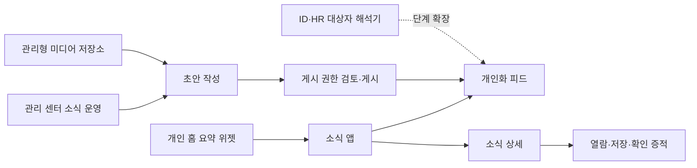

# R1 Enterprise Communications and Newsroom ADR

- 상태: Accepted
- 결정일: 2026-08-13
- 범위: DWP 소식 앱, 개인 홈 요약, 테넌트 관리 센터의 소식 운영

## 1. 결정

DWP의 공지사항을 단순 게시판이 아닌 **구성원 커뮤니케이션 bounded context**로 확장한다.

1. 구성원용 제품 표면은 `/communications`의 독립 앱으로 제공한다.
2. 개인 홈에는 최대 3건의 요약 위젯과 읽지 않은 건수만 제공한다.
3. 원문 열람, 저장, 숨김, 관련 작업, 필수 확인은 소식 앱에서 수행한다.
4. 테넌트 관리 센터는 콘텐츠 작성과 게시 권한을 분리한다.
5. 노출과 열람을 서로 다른 증적으로 기록한다. 화면에 보였다는 이유만으로 읽음 처리하지 않는다.
6. 필수 소식의 확인은 별도 시각과 증적 시각을 기록하며 숨김을 허용하지 않는다.
7. 원문 언어와 번역본을 분리하여 언어 추가가 기본 테이블 변경으로 이어지지 않게 한다.
8. 미디어는 현재 관리형 `/media/communications` 경로를 사용하고, 저장소 포트를 통해 향후 S3로 교체한다.
9. 게시된 콘텐츠는 수정할 수 없다. 정정은 새 초안과 재게시로 수행해 열람·확인 증거가 참조한 원문을 보존한다.
10. 댓글은 moderation·retention·legal hold가 결정되기 전에는 제공하지 않고, 사용자별 단일 반응만 제한적으로 제공한다.

## 2. 제품 구조

앱 런치패드의 `소통·협업` 그룹 첫 위치에 `소식`을 배치한다. 업무용 소식은 메일보다 먼저 확인할 수 있지만, 개인 홈 자체를 업무 사이드바로 바꾸지는 않는다.

## 3. 권한 경계

| 역할                          |    조회 | 초안 생성·수정 | 게시 | 보관 |
| ----------------------------- | ------: | -------------: | ---: | ---: |
| WORKSPACE_MEMBER              |      앱 |              - |    - |    - |
| COMMUNICATIONS_EDITOR         | 앱·운영 |              O |    - |    - |
| COMMUNICATIONS_PUBLISHER      | 앱·운영 |              - |    O |    O |
| TENANT_ADMIN / PLATFORM_ADMIN |    전체 |              O |    O |    O |

리소스 계약은 `APP.COMMUNICATIONS:VIEW`와 `ADMIN.COMMUNICATIONS:{VIEW,CREATE,UPDATE,APPROVE,MANAGE}`를 사용한다. 프론트 표시 제어와 플랫폼 서버 강제 검증은 같은 리소스 계약을 사용한다.

## 4. 데이터 경계

| 테이블                              | 책임                                              |
| ----------------------------------- | ------------------------------------------------- |
| `adm_announcements`                 | 원문, 분류, 미디어, 대상, 게시 창, 필수 확인 정책 |
| `adm_announcement_localizations`    | 언어별 제목·요약·본문·작업 이름                   |
| `sys_announcement_engagements`      | 노출, 열람, 저장, 숨김, 작업, 확인 증적           |
| `sys_announcement_reactions`        | 사용자별 현재 반응과 유형별 집계                  |
| `sys_code_sets` / `sys_code_values` | 콘텐츠 유형과 확장 가능한 주제 분류 계약          |

테넌트 ID는 모든 업무 데이터에 포함한다. 사용자별 상태는 콘텐츠와 분리하여 같은 소식에 대한 개인화가 원문 버전을 오염시키지 않게 한다.

## 5. 이벤트 의미

| 이벤트         | 의미                              | 읽음 변경 |
| -------------- | --------------------------------- | --------: |
| `IMPRESSION`   | 콘텐츠의 55% 이상이 뷰포트에 노출 |    아니오 |
| `OPEN`         | 사용자가 상세를 의도적으로 열람   |        예 |
| `ACTION`       | 연결 작업 실행                    |    아니오 |
| `SAVED`        | 개인 라이브러리에 저장            |    아니오 |
| `DISMISSED`    | 개인화 피드에서 숨김              |    아니오 |
| `ACKNOWLEDGED` | 필수 콘텐츠 확인 증적 생성        |        예 |

`OPEN`과 `ACKNOWLEDGED`를 분리해 읽은 사실과 정책 확인을 혼동하지 않는다.

## 6. 확장 포트

- Audience Resolver: 현재 `ALL`, `ROLE`; 이후 HR 조직, 직무, 위치, 그룹, 동적 세그먼트를 같은 판정 포트에 추가한다.
- Notification Connector: 인앱 피드가 기준 원장이며 이메일, Teams, 모바일 푸시는 전달 채널 어댑터로 연결한다.
- Media Store: 로컬 관리 경로에서 S3 호환 저장소와 CDN으로 전환하되 DB에는 관리형 URL만 저장한다.
- Localization Workflow: 기본 언어 원문과 번역 리비전의 검토·승인은 기존 다국어 Studio 계약과 연계한다.

## 7. 근거

- [Microsoft Viva Connections announcements](https://learn.microsoft.com/en-us/viva/connections/announcements-viva-connections): 대상 지정, 예약·만료, 해제 가능 여부와 다중 표면 전달을 제공한다.
- [Microsoft Viva Connections news notifications](https://learn.microsoft.com/en-us/viva/connections/viva-connections-news-notifications): 뉴스 게시와 알림 전달을 별도 경험으로 다룬다.
- [ServiceNow Horizon News Feed](https://horizon.servicenow.com/service-portal/widgets/news-feed-widget): 뉴스·이벤트, 대상화, 콘텐츠 거버넌스와 접근성을 하나의 피드 모델로 다룬다.
- [Workday Home](https://doc.workday.com/admin-guide/en-us/manage-workday/user-experience/people-experience/home-page/epj1594676779332.html): 역할과 시점에 맞는 카드와 공지를 개인 홈에 요약한다.
- [W3C WCAG 2.2](https://www.w3.org/TR/WCAG22/): 키보드, 초점, 대비, 동작 감소를 포함한 접근성 기준으로 사용한다.

## 8. 의도적으로 남긴 Gate

실 HR 조직 기반 대상자 계산, 외부 푸시 채널, S3/KMS, Figma 라이브러리 연결은 해당 인프라와 라이선스가 준비된 뒤 어댑터를 활성화한다. 현재 계약과 UI는 이 확장을 막지 않지만 준비되지 않은 외부 시스템을 가짜로 모사하지 않는다.
