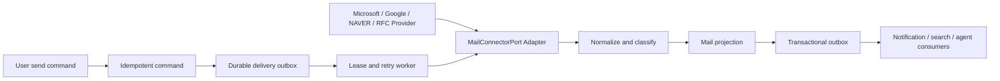
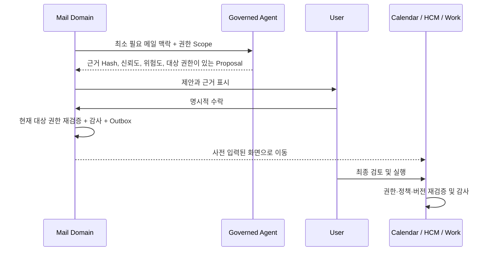

# ADR: R1 Enterprise Mail and Governed AI

- 상태: Accepted and implemented
- 기준일: 2026-08-19
- 기능 ID: `DWP-R1-MAIL-001`

## 1. 결정

DWP는 기존 외부 런처 `APP.MAIL_CALENDAR`를 폐기하고 메일 `APP.MAIL`과 일정
`APP.CALENDAR`를 독립된 제품, 권한, 데이터 경계로 운영한다. 메일은 공급사 원본의 단순
뷰어가 아니라 업무 우선순위, 공유 메일함 협업, 감사 가능한 실행 제안을 제공하는 네이티브
업무 도메인이다.

외부 공급사는 `MailConnectorPort`를 구현한다. Microsoft Graph, Gmail API, NAVER WORKS
Mail API, JMAP, IMAP4rev2/SMTP Submission을 같은 동기화·발송·푸시 계약 뒤에 둔다.
자격증명 원문은 저장하지 않고 승인된 Secret Store URI만 보관한다.

AI는 메일을 근거로 회신 초안, 회의, 휴가, 업무, 긴급 알림을 제안할 수 있지만 직접 실행할
수 없다. 제안 수락 시에도 현재 사용자 권한을 서버에서 확인하고, 최종 변경은 Calendar,
HCM, Work 등 대상 앱에서 다시 확인한다.

## 2. 벤치마크에서 수용한 원칙

| 제품        | 수용한 강점                                | DWP 적용                                           |
| ----------- | ------------------------------------------ | -------------------------------------------------- |
| Superhuman  | 키보드 우선, Split Inbox, 낮은 시각 노이즈 | `Cmd/Ctrl+K`, 단축키, 행동 기반 메일 구역          |
| Shortwave   | 이메일의 업무화, 대화 중심 스레드          | 긴 인용을 반복하지 않는 대화형 본문과 실행 제안    |
| Spark       | 공유 초안과 비공개 팀 의견                 | 외부 수신자와 분리된 내부 댓글 계층                |
| Front       | 공유 메일함, 담당자, SLA, 자동 분배        | Team Inbox, 담당 상태, 응답 목표와 초과 신호       |
| Missive     | 역할 기반 공유함과 협업                    | 공유함별 구성원 경계와 관리자 운영 화면            |
| Gmail       | 검색, 라벨, Snooze, 대규모 동기화 기대치   | 서버 검색, 나중에 알림, History/Push 어댑터 계약   |
| Outlook     | Focused Inbox와 Microsoft 365 연계         | 중요도·회신 필요 기반 Focus Queue, Graph 어댑터    |
| HEY         | 발신자 통제와 명확한 메일 흐름             | 외부 발신자 경고와 향후 발신자 허용 정책 확장점    |
| Proton Mail | 개인정보 보호와 원격 콘텐츠 통제           | 원격 이미지 기본 차단, 분류 등급, 최소 데이터 전달 |
| Zoho Mail   | 테넌트 관리, 보존, eDiscovery              | 보존 정책, 연결 상태, 관리자와 개인 메일 내용 분리 |

벤치마크의 시각 표현을 복제하지 않는다. DWP Design System의 밀도, 토큰, 공통 버튼·폼·
다이얼로그·상태 계약 안에서 기능 원칙만 재구성한다.

## 3. 사용자 경험 구조

| 화면        | 주요 목적                                                              |
| ----------- | ---------------------------------------------------------------------- |
| 메일 홈     | 읽지 않음, 긴급, 회신 필요, 실행 제안과 공유함 상태를 업무 신호로 요약 |
| 받은 메일   | 우선, 회신 필요, 담당, 업데이트 Split Inbox와 서버 검색                |
| 보낸 메일   | 발신 대화와 후속 응답 확인                                             |
| 임시 보관함 | 서버에 저장된 초안의 재진입 기반                                       |
| 공유 메일함 | 담당자, 내부 댓글, SLA를 포함한 팀 단위 처리                           |
| 연결된 계정 | 개인·공유 계정과 동기화 상태 확인                                      |
| 메일 운영   | 공급자 연결, 공유함 운영, 보안·AI 정책을 개인 본문 노출 없이 관리      |

본문은 모바일에서는 목록과 상세를 단계적으로 전환하고, 데스크톱에서는 안정적인 2열
메일 워크벤치로 표시한다. 액션은 익숙한 아이콘과 툴팁을 사용하고 위험 행동은 확인 단계를
거친다. HTML 메일 원문은 현재 텍스트로 안전하게 투영하여 임의 스크립트 실행을 차단한다.

## 4. 모듈 경계

| 계층                     | 소유 책임                                                      |
| ------------------------ | -------------------------------------------------------------- |
| Frontend `features/mail` | 사용자·관리자 정보 구조, Query cache, 명령 팔레트, 반응형 화면 |
| Shared API               | Provider 중립 DTO와 Gateway 호출 계약                          |
| Design System            | Button, IconButton, Form, Dialog, Empty/Error/Loading 상태     |
| Platform `mail`          | 메일 Projection, 협업, 정책, 실행 제안, Outbox와 감사          |
| Platform Contracts       | 공급사 동기화·발송·푸시 Port와 Secret Reference 규칙           |
| Auth                     | `APP.MAIL`, `ADMIN.MAIL`, `MAIL_ADMIN`과 테넌트 위임           |
| Agent                    | 근거·신뢰도·위험도·권한을 포함한 비자동 실행 제안 계약         |
| 대상 앱                  | Calendar/HCM/Work의 최종 입력, 권한, 정책과 감사               |

## 5. 데이터 소유권

| 테이블                      | 역할                                                      |
| --------------------------- | --------------------------------------------------------- |
| `mail_tenant_policies`      | 외부 콘텐츠, 공유함, AI, 보존, 첨부 정책                  |
| `mail_provider_connections` | 공급사, 도메인, Secret Reference, 상태와 동기화 건강도    |
| `mail_accounts`             | 사용자·공유 메일 계정 Projection과 불투명 Provider cursor |
| `mail_folders`              | 표준·사용자 폴더 Projection                               |
| `mail_thread_folders`       | 한 대화의 Inbox·Sent 등 다중 폴더 멤버십                  |
| `mail_shared_inboxes`       | 공유 주소, 목적, 응답 목표와 수명주기                     |
| `mail_shared_inbox_members` | 공유함 단위 구성원과 역할                                 |
| `mail_threads`              | 검색·분류·담당·Snooze를 위한 대화 Projection              |
| `mail_messages`             | 공급사 메시지의 안전한 본문·첨부 메타데이터 Projection    |
| `mail_internal_comments`    | 외부 발신자에게 노출되지 않는 팀 협업                     |
| `mail_action_proposals`     | 근거와 권한을 가진 사람 승인형 AI 제안                    |
| `mail_delivery_outbox`      | lease·재시도·멱등 키·Provider receipt를 가진 발송 큐       |
| `mail_domain_events`        | 재시도 가능한 Transactional Outbox                        |
| `mail_audit_events`         | 테넌트·행위자·상관관계가 있는 변경 증거                   |

테넌트 ID는 모든 조회와 변경 조건에 포함한다. 공유 메일함은 활성 구성원만 조회할 수 있고,
개인 메일함은 소유 사용자만 조회한다. 관리 API는 연결과 운영 수치만 제공하며 개인 본문을
반환하지 않는다.

## 6. 동기화 및 발송

- Graph change notification + delta, Gmail push + history, NAVER WORKS polling cursor, JMAP state,
  IMAP IDLE + UID cursor를 각각 불투명 cursor로 저장한다.
- Push 누락을 전제로 주기적 reconciliation을 수행하고 cursor 만료 시 제한된 범위로 다시
  동기화한다.
- 발송은 사용자 idempotency key와 Provider message reference를 함께 보관하여 중복 전송을
  막는다.
- 신규 작성·회신·초안 발송의 재요청은 영속 idempotency key로 원 결과를 반환한다. Worker는
  `FOR UPDATE SKIP LOCKED` lease와 제한된 재시도를 사용하고 Provider acceptance 이후에만
  `SENT`를 표시한다.
- 회신은 Provider thread reference를 유지한다. 대화는 단일 primary folder와 별개로 다중
  folder membership을 보관하므로 같은 스레드를 Inbox와 Sent에서 모두 조회할 수 있다.
- 첨부 원문은 향후 악성코드 검사와 Object Storage 격리 후 제공한다. R1 씨드는 메타데이터만
  사용한다.

## 7. AI 실행 경계

DB는 `ai_auto_execute_enabled = FALSE`를 Check Constraint로 강제한다. Agent 계약도
`humanConfirmationRequired=true`, `automaticExecutionAllowed=false`를 Literal로 강제한다.
휴가 제안은 최소 HIGH, 일정·업무 제안은 최소 MEDIUM 위험도로 분류한다.

Agent와 Platform은 각각 독립된 `MailActionPolicy`·`MailAiActionCatalog`로 액션의 대상
리소스, 필요 권한, 허용 경로 prefix, 최소 위험도와 교차 앱 여부를 검증한다. 따라서 Agent
출력이 변조되거나 잘못 구성되어도 Platform 승인 단계에서 거부된다. 메일 내부의 긴급 알림은
`APP.MAIL` 경계에 남고, Calendar·HCM·Work만 교차 앱 정책의 영향을 받는다.

AI 처리는 다음 세 계층으로 분리한다. `Insight`는 요약·긴급도·의도 추출처럼 업무 데이터를
바꾸지 않는 읽기 전용 분석이고, `Proposal`은 회신 초안이나 일정·휴가·업무의 구조화된 입력
제안이며, `Execution`은 대상 앱이 소유하는 최종 변경이다. Insight는 정책 범위에서 비동기로
계산할 수 있지만 Proposal은 실행이 아니며, Execution은 메일 Agent가 직접 수행하지 않는다.
긴급 메일 알림도 분석 결과와 알림 정책을 분리하여 오탐·중복·알림 피로를 통제한다.

새 AI 기능은 다음 계약을 모두 갖춘 경우에만 추가한다.

| 확장 계약   | 필수 내용                                                           |
| ----------- | ------------------------------------------------------------------- |
| 분석 신호   | 최소 메일 맥락, 근거 메시지 ID·관찰 시각·본문 Hash, 신뢰도          |
| 실행 제안   | 고유 액션 키, 버전이 있는 구조화 payload, 위험도, 만료 시각         |
| 권한 경계   | 대상 리소스·권한·허용 route를 Agent와 Platform 양쪽 카탈로그에 등록 |
| 사용자 통제 | 명시적 승인, 승인 시점 권한 재검증, 대상 앱에서 최종 검토           |
| 전달 신뢰성 | Proposal ID 기반 멱등성, Transactional Outbox, 실행 결과 회신       |
| 운영 안전   | 감사 증적, 테넌트 정책, 실패 격리·재시도, 민감정보 최소 전달        |

요약·긴급도 탐지·일정/휴가 의도 추출은 읽기 전용 분석 신호로 취급하고, 회신 발송·일정
생성·휴가 신청·업무 생성·알림 발송은 별도의 실행 제안으로 승격한다. 분석 결과가 곧바로
업무 변경으로 이어지지 않으므로 향후 모델이나 공급사를 교체해도 핵심 권한 경계는 유지된다.
현재 액션 계약은 `actionContractVersion=1`이며 Agent와 Platform이 액션별 필수 payload와
`requiresConfirmation=true`를 각각 검증한다. 지원하지 않는 버전은 실행 대기열에 넣지 않고
거부한다. DB는 양의 계약 버전을 보관할 수 있어 롤링 업그레이드 중 v1·v2를 함께 저장할 수
있지만, 각 Runtime은 자신이 명시적으로 등록한 버전만 처리하므로 기존 제안의 의미가 바뀌지
않는다. 근거·확인 표시·대상 권한·경로·만료 시각은 DB에서도 필수다.

## 8. 권한 모델

- `WORKSPACE_MEMBER`: `APP.MAIL`의 조회·작성·변경
- `MAIL_ADMIN`: `APP.MAIL` 및 `ADMIN.MAIL` 관리
- `TENANT_ADMIN`: 메일 운영 현황 조회만 가능하며 `MAIL_ADMIN` 없이 연결·정책 변경 불가
- 공유 메일함 접근: 전역 역할이 아니라 `mail_shared_inbox_members` 구성원 경계 적용
- 교차 앱 제안: Proposal의 `requiredResourceKey:permissionCode`를 수락 시 검증

## 9. 로컬 검증과 실제 딜리버리 경계

SKAX 전체 구성원에게 DWP Sandbox 개인 계정을 생성하고, 공유 메일함·대화·메시지·내부
댓글·실행 제안을 DB 씨드로 제공한다. 프론트에는 Mock 배열을 두지 않는다.

외부 공급자 연결 정보, 정책 UI, Provider-neutral Port와 Runtime Adapter Registry는 구현되어
있다. 관리 화면과 서버는 지원 계약과 배포된 실행 어댑터를 구분한다. 실제 Microsoft,
Google, NAVER 또는 회사 서버 전송은 고객 테넌트의 OAuth App 등록, callback URL,
Secret Store, 도메인 검증과 관리자 동의가 있어야 활성화한다. 자격증명 없이 연결을 정상으로
표시하거나 외부 발송 성공을 가장하지 않는다.

## 10. 구현 후 품질 게이트

- Backend: 컴파일, Mail Service·권한·Contract 테스트, 빈 DB Flyway 적용
- Agent: 제안 정책, 권한 혼동, 자동 실행 차단, 최소 컨텍스트 테스트
- Frontend: i18n 대칭, TypeScript, ESLint, source-size, production build
- Runtime: 일반 구성원과 `MAIL_ADMIN` 계정 API·메뉴 경계 검증
- Visual: 데스크톱·모바일, 빈 상태·오류·로딩·긴 제목·한글·영문·키보드 접근 검증

## 11. 근거 자료

- [Superhuman Split Inbox](https://help.superhuman.com/hc/en-us/articles/46005793275277-Structure-Your-Inbox)
- [Shortwave team collaboration](https://www.shortwave.com/blog/team-email-collaboration-sharing-comments/)
- [Spark shared drafts](https://sparkmailapp.com/teams/shared_drafts)
- [Front shared inbox](https://help.front.com/en/articles/2194)
- [Missive team inboxes](https://missiveapp.com/docs/core-features/team-spaces/team-inboxes/)
- [Microsoft Graph change notifications](https://learn.microsoft.com/en-us/graph/outlook-change-notifications-overview)
- [Gmail synchronization](https://developers.google.com/workspace/gmail/api/guides/sync)
- [Gmail sending](https://developers.google.com/workspace/gmail/api/guides/sending)
- [Gmail push notifications](https://developers.google.com/workspace/gmail/api/guides/push)
- [Microsoft Graph delta query](https://learn.microsoft.com/en-us/graph/delta-query-overview)
- [JMAP Mail RFC 8621](https://www.rfc-editor.org/info/rfc8621/)
- [NAVER WORKS Mail API](https://developers.worksmobile.com/kr/docs/mail)
- [Microsoft Copilot in Outlook](https://support.microsoft.com/en-us/outlook/frequently-asked-questions-about-copilot-in-outlook)
- [Microsoft Copilot meeting agenda](https://support.microsoft.com/en-US/Outlook/copilot-outlook/create-a-meeting-agenda-with-copilot-in-outlook)
- [Gemini in Gmail](https://support.google.com/mail/answer/14355636)
- [NIST Generative AI Risk Management Profile](https://nvlpubs.nist.gov/nistpubs/ai/NIST.AI.600-1.pdf)
