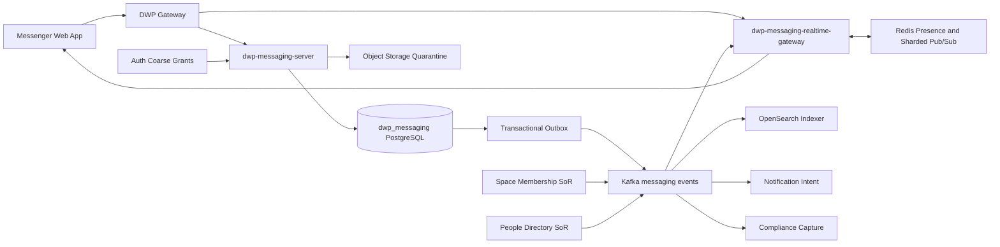
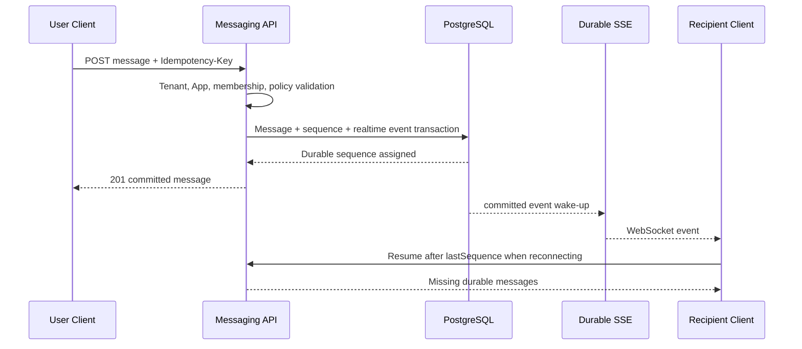
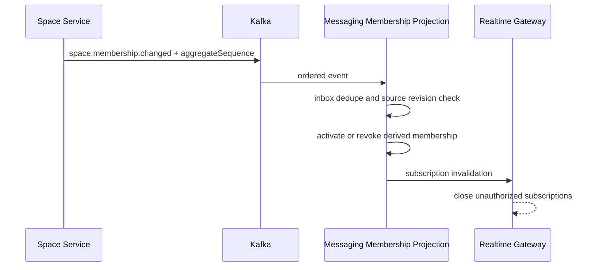

# ADR: R1 Enterprise Messaging Platform

- 상태: Accepted, R1 core implemented; production scale gates open
- 기준일: 2026-08-19
- 기능 ID: `DWP-R1-MSG-001`
- 영향 대상: Workspace, Space, People, Auth, Notification, Calendar, Agent, Gateway

## 1. 결정

DWP는 메신저를 Space나 Platform의 하위 기능이 아닌 독립 Bounded Context로 구축한다.
제품 Route는 `/messages`, App Resource는 `APP.MESSAGING`, 백엔드 원장은 신규
`dwp_messaging` Database가 소유한다.

메시지 전송은 다음 원칙을 따른다.

1. REST Command가 현재 권한과 멤버십을 검증한다.
2. 메시지, 대화별 Sequence, durable realtime event를 PostgreSQL의 같은 Transaction에 영속화한다.
3. 성공 응답 이후 resumable SSE가 현재 Client에 변경 신호를 전달한다.
4. Redis Pub/Sub은 다중 인스턴스의 wake-up 신호에만 사용하고 장애 시 원장 조회로 복구한다.
5. 재연결 시 durable event cursor 이후의 Event를 재생해 유실을 복구한다.

Kafka와 Redis를 메시지 원장으로 사용하지 않는다. 현재 검색은 PostgreSQL에서 ACL을 먼저
제한하는 R1 구현이며, OpenSearch 도입 후에도 파생 색인 결과를 Messaging Service가 다시
검증한다.

### 1.1 구현된 배포 기준선

- `dwp-messaging-server`: REST command/query, PostgreSQL 18, Flyway, durable event log, SSE
- `dwp-gateway`: 인증된 `/api/messaging/**` 경로 전달
- `Redis 7.4`: 다중 인스턴스 실시간 wake-up과 일시 신호; 원장 역할 금지
- `LiveKit 1.12`: Provider 추상화 뒤의 음성·영상 회의, 사전 장치 점검과 권한 토큰
- `React 19 + TanStack Query`: 3-pane 대화, Thread, Later, 검색, 설정, 반응형 화면

Kafka consumer fanout, 전용 WebSocket Gateway, OpenSearch, Object Storage/Scanner,
Compliance WORM은 목표 아키텍처다. 해당 운영 Gate를 통과하기 전에는 구현 완료로 간주하지 않는다.

## 2. 목표 시스템 경계

아래 그림은 대규모 운영 Gate 이후의 목표 구성이다. 현재 R1 개발 기준선은 API 안의 resumable
SSE와 Redis wake-up을 사용하며, Search와 파일 계층은 아직 별도 Deployable로 활성화하지 않았다.

| 구성 요소                        | 책임                                                         | 금지 사항                        |
| -------------------------------- | ------------------------------------------------------------ | -------------------------------- |
| `dwp-messaging-server`           | Command, History, Policy, Membership, Retention, Outbox      | 장기 WebSocket Session 보유      |
| `dwp-messaging-realtime-gateway` | WebSocket, 구독, Resume, Presence, Typing, Backpressure      | 메시지 영속 원장 역할            |
| PostgreSQL                       | 대화·메시지·정책·읽음·감사 원장                              | 첨부 Binary 저장                 |
| Kafka                            | 순서 있는 Domain Event와 파생 처리                           | 사용자 History 조회 원장         |
| Redis                            | 연결 Registry, Presence, Typing, Sharded Pub/Sub, Rate Limit | 메시지·읽음·Legal Hold 원장      |
| OpenSearch                       | ACL 필터가 적용되는 검색 Projection                          | 직접 사용자 접근, 최종 권한 판정 |
| Object Storage                   | 격리 첨부, 검사 완료 파일, Compliance WORM                   | 실행 가능한 미검사 파일 제공     |
| Notification                     | 오프라인 멘션·DM·Digest 전달                                 | 실시간 채팅 본문 원장            |

## 3. 배포 경계

현재 R1은 핵심 신뢰성을 먼저 검증하기 위해 `dwp-messaging-server` 한 Deployable이 REST와 SSE를
함께 제공한다. Socket 수와 Presence·Typing 부하가 분리 Gate를 넘으면 같은 제품 도메인 안에
두 번째 Deployable을 둔다.

- `dwp-messaging-server`: 기존 Java 21, Spring Boot 3.5, JDBC, Flyway, Outbox 패턴을 유지한다.
- `dwp-messaging-realtime-gateway`(후속 Gate): Spring WebFlux와 Reactor Netty로 Socket
  수명주기를 독립 확장한다.

기존 DWP Gateway는 인증, Origin, Tenant, Route를 검증한다. 전용 Gateway를 도입할 때는
WebSocket Upgrade를 해당 Deployable로 Proxy하며, 로컬 통합 Dev Command로 함께 기동해
개발자의 프로세스 수를 늘리지 않는다.

## 4. 메시지 전송과 복구

- 순서는 Conversation 단위로만 보장한다. 전역 순서를 만들지 않는다.
- `sequence`는 단조 증가하며 연속일 필요는 없다.
- Client는 `eventId`, `messageId`, `sequence`로 중복 제거와 재정렬을 수행한다.
- SSE Session은 timeout과 emitter 정리를 적용한다. 전용 WebSocket Gateway 단계에서는 Session
  Queue 상한을 두고 느린 Client의 Presence·Typing은 합치거나 버린다.
- 송신 UI는 Optimistic Pending을 표시하되 REST Commit 응답 전에는 `전송됨`으로 표시하지 않는다.

## 5. 실시간 Fanout

현재 구현은 다음 구조를 사용한다.

1. Command Transaction이 `msg_realtime_events`에 본문 없는 변경 Event를 기록한다.
2. Commit 이후 인스턴스 로컬 Stream과 Redis Pub/Sub에 wake-up 신호를 보낸다.
3. 각 인스턴스는 신호를 받으면 PostgreSQL의 durable cursor 이후 Event를 읽어 SSE Client에 보낸다.
4. Redis Pub/Sub 유실과 장애는 허용한다. 원장은 PostgreSQL이며 Client는 cursor로 복구한다.
5. Presence와 Typing은 TTL이 있는 일시 Event로만 처리하고 Message 원장에 남기지 않는다.

Kafka 기반 파생 처리와 전용 Realtime Gateway를 도입하더라도 Redis에는 wake-up/ephemeral
신호만 두며, Client 복구 계약은 같은 durable cursor를 유지한다.

WebTransport는 2026년에 최신 Browser에서 사용 가능해졌지만 구형 사내 Browser, Proxy,
HTTP/3 운영 경로가 아직 변수다. R1은 폭넓게 검증된 WebSocket을 사용하고 Transport Adapter와
실사용 Telemetry를 확보한 뒤 WebTransport를 선택적으로 시험한다.

## 6. 저장소 결정

| 후보                       | 장점                                                   | 비용·위험                                       | 결정                   |
| -------------------------- | ------------------------------------------------------ | ----------------------------------------------- | ---------------------- |
| PostgreSQL 18 Partitioning | 현재 운영 역량, Transaction, Retention, Backup, 단순성 | 초대형 Hot Channel과 수십억 Row에서 재검토      | R1 Message SoR         |
| ScyllaDB                   | 매우 큰 Write/History Scale, 낮은 Tail Latency         | 별도 운영 역량, Repair·Compaction·Capacity 비용 | 부하 Gate 이후 후보    |
| Kafka Log                  | 순서와 Consumer 확장                                   | 사용자 Query, 수정·삭제·Hold 원장에 부적합      | Event Plane만 사용     |
| Redis                      | 매우 낮은 지연                                         | 영속성·보존·감사 원장에 부적합                  | Ephemeral Plane만 사용 |

Control Plane과 Message Store는 `MessageStorePort` 뒤에서 분리한다. 향후 Message Body를
ScyllaDB로 옮겨도 대화, 정책, 멤버십, 보존, 앱, 감사 Metadata는 PostgreSQL이 계속 소유한다.
R1에서는 이 Port를 실제로 두 저장소에 이중 구현하지 않는다.

## 7. Space와 People 연동

Space 연결 대화는 `msg_conversation_bindings`에 `binding_type=SPACE`와 `space_id`를 저장한다.
Space 메시지를 `spc_*` Table에 저장하지 않는다.

- Space Role은 Messaging Role로 명시적으로 Mapping한다.
- 기본 Space Channel은 `전체`, `공지`, Template Channel로 구성할 수 있다.
- 채널은 `MIRRORED` 또는 `SCOPED_SUBSET` Membership Mode를 가진다.
- 이력 노출은 `FULL_HISTORY`, `FROM_JOIN`, `NO_HISTORY` 정책으로 분리한다.
- Space 탈퇴·비활성화 Event가 오면 검색 ACL과 Socket 구독도 함께 폐기한다.
- Person 검색은 People Directory를 호출하고 메시징 DB에는 안정 식별자와 최소 Snapshot만 둔다.
- 1:1 DM은 Tenant 안에서 정렬된 두 Principal의 HMAC Fingerprint를 Unique Key로 사용해 중복
  대화를 만들지 않는다.

## 8. 검색과 파일

### 검색

- OpenSearch Index에는 `tenantId`, `conversationId`, `messageId`, `sequence`, 분류, 안전한
  본문 Projection만 저장한다.
- Browser는 OpenSearch에 직접 접근하지 않는다.
- Messaging Service가 현재 Conversation Membership 목록으로 Query Filter를 만들고 결과를
  반환하기 전에 Message ACL을 다시 확인한다.
- 삭제·보존 Event는 Tombstone으로 색인을 제거한다. 색인이 지연돼도 재검증으로 본문 누출을
  막는다.
- Semantic Search는 같은 ACL Pipeline을 재사용할 수 있을 때만 추가한다.

### 파일

1. Client가 Quarantine용 짧은 수명의 Pre-signed Upload URL을 받는다.
2. Upload 완료 후 AV, DLP, MIME Sniffing, Archive Bomb, 필요 시 CDR 검사를 수행한다.
3. 검사 완료 전에는 다운로드 URL을 발급하지 않는다.
4. 정상 파일만 Immutable Object Key로 승격하고 DB에는 Metadata와 Object Reference만 저장한다.
5. Legal Hold Export는 Versioning과 WORM/Object Lock을 지원하는 별도 Bucket에 보관한다.

Object Storage는 S3 호환 Port로 추상화하되, 규정 준수 배포는 실제 공급자의 WORM과 KMS 동작을
인증해야 한다. 개발용 MinIO가 곧 규정 준수 증거라는 주장은 하지 않는다.

## 9. 암호화와 보안

- TLS 1.3 우선 전송 암호화와 저장 장치 암호화를 기본으로 한다.
- Secret 원문을 DB에 저장하지 않고 승인된 Secret Store Reference만 저장한다.
- Tenant Key와 Envelope Encryption 확장점을 두고 Customer-managed Key는 R3 후보로 둔다.
- 기본 E2EE는 채택하지 않는다. E2EE는 검색, DLP, Retention, Legal Hold, AI와 상충하므로
  `Confidential Conversation`으로 별도 기능 제한을 명시해야 한다.
- HTML을 저장·렌더링하지 않고 Versioned Message Content Schema를 사용한다.
- Link Preview Worker는 SSRF 차단, 사설 주소 차단, Size·Timeout 제한, 안전한 Cache를 적용한다.
- Unicode Bidi Control, Spoofed Domain, Executable Attachment, Mass Mention, Spam을 방어한다.
- 관리자, Provider Support, 운영자는 개인 메시지 본문을 기본 조회할 수 없다.

## 10. 권한 결정

Auth는 App과 관리자 기능의 저빈도 Coarse Grant만 소유한다. 대화별 권한을 Auth Grant로 모두
전개하면 Cardinality와 Revocation 지연이 커지므로 Messaging이 Local Membership ABAC를
판정한다.

- `APP.MESSAGING`: `VIEW`, `CREATE`
- `ADMIN.MESSAGING_POLICY`: `VIEW`, `MANAGE`
- `ADMIN.MESSAGING_OPERATIONS`: `VIEW`, `MANAGE`
- `ADMIN.MESSAGING_COMPLIANCE`: `SEARCH`, `HOLD`, `EXPORT`
- `ADMIN.MESSAGING_INTEGRATIONS`: `VIEW`, `MANAGE`
- `ADMIN.MESSAGING_AI`: `VIEW`, `MANAGE`

`MESSAGING_ADMIN`은 정책과 운영 Metadata를 관리하지만 본문 권한이 없다.
`MESSAGING_COMPLIANCE`는 Case, 사유, 기간, 대상, JIT 승인, 감사가 있는 경우에만 보존본을
검색·내보낸다. 두 역할은 기본적으로 분리한다.

## 11. AI 확장 결정

R1의 핵심 메시징은 AI 장애와 무관하게 동작해야 한다. 향후 AI는 다음 세 계층으로만 확장한다.

- `Insight`: 요약, 미답변, 긴급도, 결정·할 일 후보
- `Proposal`: 회신 초안, 일정, 휴가, 업무, 결재 입력 제안
- `Execution`: 사용자가 대상 앱에서 확인하고 대상 앱 권한으로 수행

Agent는 DB에 직접 연결하지 않고 현재 사용자와 Conversation ACL이 포함된 Retrieval API만
사용한다. 결과는 Message ID 인용과 정책 버전을 포함하며, 학습 사용 금지, 지역, 보존,
분류 정책을 따른다. 자동 전송·삭제·구성원 초대는 허용하지 않는다.

## 12. 비기능 목표

| 항목               | R1 목표                                    |
| ------------------ | ------------------------------------------ |
| 메시지 REST Commit | 지역 내 p95 250ms 이하, p99 500ms 이하     |
| 온라인 Fanout      | Commit 후 p95 500ms 이하, p99 1.5초 이하   |
| 첫 History Page    | p95 200ms 이하                             |
| 검색               | p95 800ms 이하, 색인 지연 p95 5초 이하     |
| 가용성             | 핵심 송수신 월 99.95% 목표                 |
| Durability         | 성공 응답 메시지 유실 0, 지역 HA RPO 0     |
| 접근 해지          | Restricted p95 15초, 일반 p95 60초 이내    |
| 접근성             | WCAG 2.2 AA, Keyboard-only, Reduced Motion |

수치는 설계 목표이며 Wave 0 Capacity Test를 통과해야 약속 가능한 SLO가 된다.

## 13. 프로덕션과 로컬 인프라

| 계층          | 로컬 개발                     | 프로덕션                                          |
| ------------- | ----------------------------- | ------------------------------------------------- |
| PostgreSQL    | 기존 18 Container, 신규 DB    | Multi-AZ, PITR, Runtime/Migration Role 분리       |
| Kafka         | 기존 단일 Broker              | 3 Broker 이상, RF 3, min ISR 2, TLS/SASL/ACL      |
| Redis         | 기존 7.4                      | Cluster 또는 HA, Sharded Pub/Sub, TLS             |
| Search        | Profile 기반 단일 OpenSearch  | Multi-node, 암호화, Snapshot, Service-only Access |
| Object        | MinIO Quarantine·Clean Bucket | KMS, Versioning, WORM, Lifecycle, DLP/AV          |
| Realtime      | 단일 Gateway                  | 다중 Pod, Zone 분산, Connection Drain             |
| Observability | 기존 OpenTelemetry            | Trace, Metric, SLO, Payload-free Log              |

## 14. 보류한 대안

- Space Service에 채팅을 내장: 수명주기와 확장 부하가 다르고 데이터 소유권이 흐려져 제외
- 모든 통신을 WebSocket Command로 처리: 멱등·재시도·감사·API 운영이 어려워 제외
- SSE 단독 사용: 양방향 고빈도 Presence·Typing에 부적합해 제외
- ScyllaDB 선도입: 검증되지 않은 Scale보다 운영 복잡성이 커서 제외
- 메시지당 사용자별 복사본 저장: 저장 비용과 일관성 문제가 커서 단일 Conversation 원장 채택
- 관리자 본문 열람 Console: 내부자 위험과 역할 분리 원칙에 위배되어 제외

## 15. 확정 결정과 남은 운영 Gate

다음 제품 결정은 확정됐으며 구현 기준으로 사용한다.

1. 제품명 `메신저`, Route `/messages`, Resource `APP.MESSAGING`
2. R1은 내부 사용자 전용이며 외부 공유 채널은 후속 단계
3. PostgreSQL R1 원장과 ScyllaDB Capacity Gate
4. 기본 Retention은 코드가 아닌 Tenant Policy로 관리
5. 자체 음성·영상 엔진을 만들지 않고 Calendar/Rooms/Provider에 연결
6. E2EE가 아닌 KMS 기반 엔터프라이즈 보안을 기본값으로 채택
7. 관리자와 Compliance 역할 분리
8. 목표 사용자 수, 동시 연결, Peak Message, 데이터 지역 요구사항은 배포 고객별 Capacity Gate에서 확정

프로덕션 전에는 실제 고객 규모의 부하, TLS/WSS와 TURN, Redis HA, DB PITR, 첨부 Quarantine과
AV/DLP, Search 장애·복구, 보존·Legal Hold, 감사 Log Redaction을 별도 증적으로 통과해야 한다.
