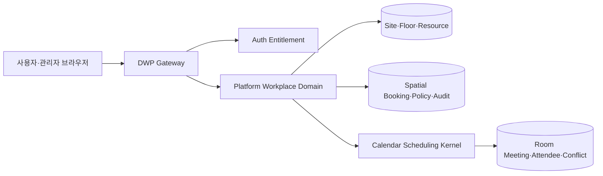

# R1 Enterprise Workplace and Spatial Booking ADR

> 상태: Accepted and Implemented v1.0
>
> 기준일: 2026-08-19
>
> 적용 저장소: `dwp-frontend`, `dwp-backend`

## 1. 결정

DWP의 기존 `회의실` 제품을 **근무 공간(Workplace)** 으로 확장한다. 본사, 위성 오피스,
공유오피스와 고객사 근무지를 하나의 멀티테넌트 공간 카탈로그로 관리하고, 층별 지도에서
회의실, 좌석, 사물함, 주차면, 집중 부스, 전화 부스와 공용 장비를 탐색·예약한다.

- 사용자 제품명: `근무 공간` / `Workplace`
- 기본 경로: `/workplace/**`
- 호환 경로: 기존 `/rooms/**`는 `/workplace/explore`로 전환
- 사용자 권한: `APP.WORKPLACE`
- 관리자 권한: `ADMIN.WORKPLACE`
- 프론트 배포 경계는 기존 독립 제품 `dwp-rooms`를 유지해 다른 앱과의 의존성을 늘리지 않는다.

`Spaces`는 협업 커뮤니티, `Workplace`는 물리 공간이라는 명확한 용어 경계를 가진다.

## 2. 글로벌 제품 비교

2026-08-19 기준 공식 문서에서 확인한 공통 기능을 DWP 기준으로 정규화했다.

| 제품             | 검증한 강점                                                       | DWP 반영                                |
| ---------------- | ----------------------------------------------------------------- | --------------------------------------- |
| Microsoft Places | 건물·층 계층, 예약·워크인·지정·사용불가 좌석, 예약 기간·자동 해제 | 공간 계층, 예약 모드, 테넌트 정책       |
| Robin            | 층 지도, 좌석·주차·사물함·Neighborhood·POI, QR/NFC                | 통합 자원 모델, 지도·목록 이중 탐색     |
| Envoy            | 부분일 예약, 지정 좌석과 대여, 편의시설·Neighborhood              | 지정석 차단, 설비·구역 필터             |
| Skedda           | SVG 지도와 편집 가능한 Hotspot                                    | 정규화 좌표 기반 Layout Editor          |
| Eptura Engage    | 회의실·좌석·사물함·주차, 체크인·센서·자동 해제                    | 체크인 수명주기와 확장 가능한 자원 유형 |
| OfficeSpace      | CAD/PDF 도면, 지정석·Hoteling, 제한·Heatmap·Wayfinding            | 검증된 도면 수집과 분석 확장 경계       |
| Kadence          | 좌석·실·개인실·사물함·부스·주차, 반복 예약                        | 공통 예약 Aggregate와 자원 Catalog      |
| WorkInSync       | 층 지도, 좌석·회의실·주차·Kiosk·Check-in                          | 현장 접점 확장 가능한 API 경계          |
| deskbird         | 이미지/SVG 도면, 접근 그룹, 반복·자동 해제·Privacy                | 도면 등록, 정책·Privacy 분리            |
| Joan             | 좌석·회의실·장비·주차, 주·월 탐색, QR/NFC·Geolocation             | 기간 탐색과 장치 연계 확장점            |

공식 근거:

- Microsoft Places: <https://learn.microsoft.com/en-us/microsoft-365/places/places-overview>
- Robin: <https://support.robinpowered.com/hc/en-us/articles/204474124-Get-started-setting-up-your-workplace>
- Envoy: <https://envoy.help/en/articles/4374428-set-up-desks>
- Skedda: <https://support.skedda.com/en/articles/5349028-floor-plans-maps-settings-overview>
- Eptura: <https://eptura.com/our-platform/eptura-engage/desk-booking/>
- OfficeSpace: <https://www.officespacesoftware.com/features/desk-booking/>
- Kadence: <https://kadence.co/desk-booking-software/>
- WorkInSync: <https://workinsync.io/pricing>
- deskbird: <https://help.deskbird.com/hc/en-us/articles/9983699701521-Floor-plans>
- Joan: <https://support.getjoan.com/knowledge/instructions-for-joan-users>

## 3. 도메인 경계

Workplace가 소유하는 것은 물리 공간 계층, 층 지도, 예약 정책, 비회의 자원 예약과 공간 감사다.
회의실은 참석자·초대·반복·충돌·승인이라는 기존 Calendar Aggregate를 계속 사용한다. 회의실을
일반 좌석 예약 API로 우회 생성할 수 없도록 서버가 `ROOM` 유형을 거부한다.

## 4. 데이터 모델

| Aggregate | 핵심 내용                                                                                    |
| --------- | -------------------------------------------------------------------------------------------- |
| Site      | 테넌트별 본사·공유오피스·위성·고객사 근무지, 주소·시간대·전체 층수                           |
| Floor     | 층 번호, 운영 상태, 논리 캔버스 크기, 검증된 도면 Asset                                      |
| Resource  | 유형, 예약 모드, 상태, 수용 인원, 설비, 접근성, 구역, 정규화 좌표·크기·회전                  |
| Policy    | 예약 가능 기간, 동시 예약 한도, 최소·최대 시간, 연속일, 근무 시간, 체크인·자동 해제, Privacy |
| Booking   | 사용자, 시간 구간, 목적, 공개 여부, 예약·체크인·해제·취소 수명주기                           |
| Audit     | Actor, Correlation ID, 변경 Snapshot을 가진 Append-only 사건                                 |

예약 모드는 `RESERVABLE`, `DROP_IN`, `ASSIGNED`, `UNAVAILABLE`다. 지정석은 기본적으로 지정된
사용자만 예약할 수 있고, 테넌트가 지정석 공유를 명시적으로 허용한 경우에만 비어 있는 시간대를
다른 구성원이 예약할 수 있다. 유지보수·퇴역 자원은 UI 상태와 무관하게 서버에서 예약을 거절한다. 활성 예약은
PostgreSQL GiST exclusion constraint로 시간 중복을 최종 차단한다.

## 5. 지도와 공간 등록

현재 기준 모델은 **검증된 2D 배경 도면 + 정규화된 자원 좌표**다.

1. 관리자가 PNG/JPEG 층 도면을 등록한다.
2. 서버는 확장자가 아니라 Magic Byte와 실제 Decode로 파일을 검증하고, 10MB·4천만 Pixel을
   초과하면 거부한다.
3. 파일은 공개 경로가 아닌 Tenant Media Storage에 저장하며 SHA-256, MIME, 크기를 기록한다.
4. 관리자는 Pointer·Keyboard Drag로 자원을 배치하고, `0..100` 좌표와 Version을 일괄 저장한다.
5. 사용자는 동일 Layout을 반응형 지도와 접근 가능한 목록으로 탐색한다.

브라우저에서 가짜 원근 3D 도면을 그리지 않는다. 향후 CAD/DWG·PDF·SVG·IFC/BIM은 별도 Ingestion
Worker가 원본을 격리 검사하고 2D 운영 모델로 변환한다. 3D는 BIM 원본과 Wayfinding 요구가 모두
있는 사업장에 한해 읽기 전용 보조 Surface로 제공하며 예약의 기준 좌표는 계속 2D다.

## 6. 사용자 경험

- 근무장소·층·일자·시간·이용 시간·자원 유형·설비·검색어를 조합해 탐색
- 지도와 목록 보기, 가용·사용 중·내 예약·지정·워크인·사용불가 상태 범례
- 좌석·사물함·주차·부스·장비 예약, 내 예약 체크인·조기 해제·취소
- 회의실 선택 시 기존 고급 회의 예약 Dialog와 참석자 초대 흐름 사용
- 지정석은 회사의 공유 정책과 배정자 여부를 함께 적용하고 워크인 좌석은 현 시점 예약만 허용
- 작은 화면은 목록 보기를 기본으로 하며 문서 수평 Overflow 없이 모든 기능 제공
- 점유 현황은 공개 정책을 적용하고 다른 구성원의 비공개 예약 목적을 노출하지 않음

## 7. 관리자 경험

- 근무장소와 층 생성·수정, 층 도면 업로드
- 회의실·좌석·사물함·주차·집중 부스·전화 부스·장비 등록
- 지정석 대상 구성원 검색, 운영 상태·예약 모드·설비·접근성 설정
- 층 지도에서 자원 Drag 배치와 낙관적 잠금 기반 일괄 저장
- 7·14·30·60·90일 예약 Window, 동시 예약 수, 최소·최대 시간, 연속 예약일,
  근무 시간, 체크인·자동 해제, 지정석 공유, 구성원 이름 공개 정책 관리
- 회의실 운영·승인·회의 정책은 Calendar 관리자 흐름으로 연결

지정석 공유는 사용자 지도와 서버 권한 판정에 같은 정책을 적용한다. 반복 예약은 DB 정책 필드를
먼저 마련했지만 완전한 Series/예외 수명주기가 구현되기 전까지 활성 Toggle을 노출하지 않는다.
동작하지 않는 데모 기능을 만들지 않는 원칙이다.

## 8. 보안·격리·감사

- 브라우저는 Gateway `/api/platform/v1/workplace/**`만 호출한다.
- Gateway와 Platform Filter가 사용자·관리자 권한을 각각 다시 검증한다.
- 모든 Query와 Mutation은 인증 Header가 아니라 검증된 Tenant Context를 사용한다.
- 관리자 API, 도면 Asset, 사용자 예약 API는 모두 Tenant 조건을 강제한다.
- 다른 사용자의 예약자 이름은 Tenant Privacy 정책이 허용할 때만 반환한다.
- Floor·Resource·Policy는 Version 기반 `409` 충돌을 반환하고 관리자 변경은 감사 사건을 남긴다.
- 도면 파일은 실행 불가능한 Raster만 허용하고 SVG·HTML·스크립트 업로드를 차단한다.

## 9. 단계별 고도화

1. 현재: 멀티사이트 Catalog, 2D 지도, 일반 자원 예약, 회의실 Calendar 연계, Tenant 정책
2. 다음: Scheduler 기반 No-show 자동 해제, QR/NFC 체크인, 관리자 Override·알림 Outbox
3. 확장: CAD/BIM Ingestion, Sensor/Device Gateway, Kiosk·Wayfinding
4. 분석: 익명화 점유율, 수요 Heatmap, 공간 비용·에너지 최적화, 정책 실험

각 단계는 UI보다 먼저 수명주기, 감사, 장치 신뢰, 개인정보 보존 기간과 장애 복구 계약을 정의한다.

## 10. 검증 Gate

- Flyway Migration, Platform·Auth·Gateway 단위 테스트와 OpenAPI 계약 검증
- TypeScript, ESLint, i18n, 독립 앱·Gateway API Boundary 검사
- 실제 로그인 브라우저에서 지도·목록·예약·체크인·취소·관리자 배치·정책 저장 검증
- Desktop·Tablet·Mobile의 수평 Overflow 0, Keyboard 접근, Reduce Motion 검증
- 다른 Tenant 접근, 지정석 우회, 중복 예약, 만료 Version, 악성 도면 Upload 거부 테스트
