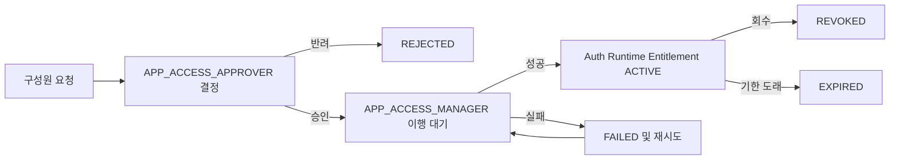

# R1 권한 계층 및 앱 접근 거버넌스 ADR

- 상태: Accepted
- 최종 검증: 2026-08-14
- 적용 범위: Auth, Platform, Provider, Gateway, DWP Frontend

## 1. 결정 요약

DWP의 권한은 `프로바이더 > 회사 관리자 > 앱 관리자 > 구성원`처럼 권한이 자동
상속되는 하나의 계층으로 만들지 않는다. 조직상 책임 관계는 맞지만 시스템 권한은
다음 네 개의 독립된 권한면으로 분리한다.

| 권한면                  | 책임                                              | 대표 권한                                                        | 데이터 경계                                                            |
| ----------------------- | ------------------------------------------------- | ---------------------------------------------------------------- | ---------------------------------------------------------------------- |
| Provider Control Plane  | 테넌트 개통, 구독, 서비스 운영, 지원, 승인과 감사 | `PROVIDER_*`                                                     | 모든 고객의 운영 메타데이터. 고객 데이터는 승인된 지원 세션에서만 접근 |
| Tenant Governance       | 회사 설정, 위임, 플랫폼 정책                      | `TENANT_ADMIN`, `IDENTITY_ADMIN`, `APP_CATALOG_ADMIN`, `AUDIT_*` | 단일 테넌트                                                            |
| Resource Responsibility | 특정 앱의 소유·설정·접근 결정·이행·검토           | `APP_*@APP.KEY`                                                  | 명시된 리소스 세트                                                     |
| Workforce Access        | 구성원이 사용할 실제 앱과 업무 권한               | `WORKSPACE_MEMBER`와 런타임 Entitlement                          | 자신 또는 자신이 속한 그룹에 부여된 리소스                             |

`TENANT_ADMIN`은 테넌트의 책임 관리자이지만 모든 HR 데이터, 감사 설정, 앱 데이터에
자동 접근하지 않는다. `PROVIDER_ADMIN`도 고객 테넌트의 상시 슈퍼 사용자로 사용하지
않는다. 광범위한 역할은 로컬 검증과 비상 복구용이며 일상 운영은 분리된 전문 역할을
사용한다.

이 결정은 역할을 업무 책임과 범위에 묶고, 관리 범위를 제한하는
[Microsoft Entra administrative units](https://learn.microsoft.com/en-us/entra/identity/role-based-access-control/administrative-units),
요청·승인·전달·만료를 구분하는
[Entra entitlement management lifecycle](https://learn.microsoft.com/en-us/entra/id-governance/entitlement-management-process),
정적·동적 직무 분리를 포함하는
[NIST RBAC](https://csrc.nist.gov/Projects/role-based-access-control/faqs)을 기준으로 삼는다.

## 2. 역할과 위임 경계

### 2.1 구성원과 테넌트 역할

| 역할                       | 허용 책임                                               | 명시적 금지                                                    |
| -------------------------- | ------------------------------------------------------- | -------------------------------------------------------------- |
| `WORKSPACE_MEMBER`         | 개인 홈, 할당 앱, 본인 요청·취소                        | 관리 센터, 프로바이더 영역                                     |
| `TENANT_ADMIN`             | 회사 설정, 허용된 테넌트 역할 위임, 앱·ID 거버넌스 총괄 | 프로바이더 영역, HR 원천 데이터 자동 접근, 자기 승인·자기 이행 |
| `IDENTITY_ADMIN`           | 사용자·그룹·SCIM/HRIS ID 프로비저닝                     | 고권한 역할 부여, 앱 접근 결정·이행, 감사 설정                 |
| `APP_CATALOG_ADMIN`        | 앱 소유권과 앱 범위 책임자 구성, 요청 큐 전체 조회      | 앱 요청 승인·이행·회수, 앱 업무 데이터                         |
| `HR_ADMIN`, `PEOPLE_ADMIN` | HRIS 운영 기능                                          | 테넌트·앱·감사 관리 자동 접근                                  |
| `AUDITOR`                  | 감사 조회와 조사                                        | 운영 데이터 변경, ID·앱 관리자 겸직                            |
| `AUDIT_ADMIN`              | 감사 정책과 증적 거버넌스                               | 일반 운영 역할과 무제한 결합                                   |

테넌트 관리자가 직접 위임할 수 있는 역할은 활성 정책
`sys_role_assignment_policies`에 등록된 항목으로 제한한다. 자기 자신, 동급 이상,
통제면 역할, 충돌 역할은 직접 변경할 수 없다. 성공과 거부 모두 감사 증거를 남기고,
성공 시 대상 사용자의 세션을 무효화한다.

### 2.2 앱 범위 책임

앱 관리자는 하나의 역할이 아니라 다음 책임으로 분리한다. 모든 책임은
`책임 코드 + 리소스 세트 + 유효 기간`으로 부여한다.

| 책임                  | 메뉴와 동작                                | 위임 규칙                                   |
| --------------------- | ------------------------------------------ | ------------------------------------------- |
| `APP_OWNER`           | 앱 거버넌스, 책임자 구성, 주기적 검토 책임 | Tenant/App Catalog Admin만 소유자 지정·회수 |
| `APP_CONFIG_ADMIN`    | 해당 앱 설정·Connector 관리                | App Owner가 자기 앱 범위에 위임 가능        |
| `APP_ACCESS_APPROVER` | 해당 앱 요청 승인·반려                     | 요청자 본인 결정 금지                       |
| `APP_ACCESS_MANAGER`  | 승인된 요청의 권한 적용·재시도·회수        | 요청자 및 동일 요청 승인자의 이행 금지      |
| `APP_ACCESS_REVIEWER` | 해당 앱 접근 현황·정기 검토                | 이행 담당자와 겸직 금지                     |

`APP_CATALOG_ADMIN`은 요청 큐를 읽을 수 있지만 승인·이행 버튼은 사용할 수 없다.
`APP_ACCESS_APPROVER`와 `APP_ACCESS_MANAGER`는 서로의 API를 호출할 수 없다. 광범위한
테넌트 관리자도 앱 요청 큐를 자동으로 열거나 승인자와 이행자를 겸할 수 없다. 요청
조회·결정·이행·회수는 앱 범위 책임 또는 `APP_CATALOG_ADMIN`의 읽기 책임으로만 연다.

### 2.3 프로바이더 역할

| 역할                          | 일상 책임                            |
| ----------------------------- | ------------------------------------ |
| `PROVIDER_TENANT_PROVISIONER` | 고객 테넌트 개통·활성화              |
| `PROVIDER_ENTITLEMENT_ADMIN`  | 계약·구독 Entitlement 변경           |
| `PROVIDER_CHANGE_APPROVER`    | 고위험 운영 변경 독립 승인           |
| `PROVIDER_OPERATOR`           | 서비스 운영·장애·유지보수 실행       |
| `PROVIDER_SUPPORT`            | 승인·시간·범위가 있는 고객 지원 세션 |
| `PROVIDER_AUDITOR`            | 프로바이더 감사·사후 검토            |
| `PROVIDER_RELEASE_APPROVER`   | 제품 배포 독립 승인                  |
| `PROVIDER_DATA_APPROVER`      | 데이터 정책 독립 승인                |
| `PROVIDER_ADMIN`              | 로컬 검증·비상 복구용 광범위 역할    |

테넌트 생성자, 상용 권한 변경자, 변경 승인자를 분리한다. 프로바이더 계정은 고객
관리 센터에 직접 들어가지 않으며, 지원 접근 요청·고객 승인·범위·만료가 유효한
지원 세션에서만 허용된 테넌트 기능을 위임받는다.

## 3. 앱 접근 수명주기

승인은 권한 부여 성공을 의미하지 않는다. Platform이 요청·결정·이행 Workflow를
소유하고 Auth가 실제 런타임 Entitlement를 소유한다. 내부 서비스 호출은 전용
Identity Sync Token, Tenant, Source Reference, Actor와 Correlation ID로 보호한다.
`source_ref`는 멱등성과 감사 연결 키이며, 같은 키를 다른 사용자·앱·권한에 재사용할
수 없다.

Gateway는 매 API 요청에서 현재 Auth 컨텍스트를 다시 확인하므로 권한 적용·회수 후
재로그인 없이 다음 요청부터 효력이 반영된다. UI의 메뉴 숨김은 편의 기능일 뿐이며
Gateway, 서비스 필터, 서비스 메서드가 Tenant·역할·리소스 범위·행위자를 다시 검증한다.

## 4. 데이터 소유권

| 서비스   | 핵심 테이블                                                                               | 소유 정보                                              |
| -------- | ----------------------------------------------------------------------------------------- | ------------------------------------------------------ |
| Auth     | `com_roles`, `com_role_members`, `com_role_permissions`                                   | 테넌트 역할과 기본 권한                                |
| Auth     | `com_admin_resource_sets`, `com_admin_resource_set_members`, `com_admin_role_assignments` | 앱 범위 책임과 유효 기간                               |
| Auth     | `com_principal_resource_grants`                                                           | 사용자·그룹의 실제 런타임 Entitlement와 출처·회수·만료 |
| Platform | `usr_workspace_app_access_requests`                                                       | 요청, 결정, 이행, 실패·재시도, 회수 Workflow           |
| Provider | `prv_operators`, `prv_operator_role_assignments`, 지원·승인 테이블                        | 프로바이더 운영자 권한과 통제 수명주기                 |

역할과 앱 접근 Workflow를 한 테이블에 합치지 않는다. 요청 삭제로 권한 증거를 지우지
않고, 권한 회수로 요청의 결정 이력을 덮어쓰지 않는다.

## 5. 기본 배포와 선택 배포

- 테넌트 기본 앱 묶음은 `WORKSPACE_MEMBER`의 Role Permission으로 배포한다.
- 선택 앱은 요청·승인·이행 또는 승인된 그룹 Access Package 정책으로 배포한다.
- 앱 관리자가 임의로 승인 절차를 우회하는 직접 부여 UI는 제공하지 않는다.
- SKAX 기준 `전체 구성원`은 메일·협업·지식, 전문 그룹은 ERP·레거시 운영을
  `GROUP + ACCESS_PACKAGE` 출처로 받는다. 선택 앱은 `WORKSPACE_MEMBER`에 직접 넣지 않는다.
- 제품 Entitlement가 앱을 비활성화하면 활성 사용자·그룹 Grant와 대기·활성 앱 책임을
  회수한다. 재활성화 시 소유자가 없는 앱에는 프로비저닝 소유자를 다시 만든다.
- 고객별 Access Package 운영 UI와 외부 IAM Reconciliation은 D-16 완료 후 연다.

### 5.1 테넌트 프로비저닝 계약

- `sys_tenant_resource_templates`가 제품 권한별 표준 리소스를 정의한다.
- `sys_tenant_role_permission_templates`가 내장 역할의 명시적 허용 행렬을 정의한다.
- 초기 관리자는 `TENANT_ADMIN`과 `WORKSPACE_MEMBER`를 함께 받는다.
- 모든 활성 앱은 독립 리소스 세트와 `APP_OWNER`를 가져야 한다.
- 고객이 만든 Custom Role과 Custom Resource는 표준 템플릿 동기화에서 삭제하지 않는다.

## 6. 외부 IAM 경계

DWP Auth에 대한 내부 Entitlement 부여·회수·만료·실패 재시도는 구현되어 있다.
Microsoft Entra, Okta 등 외부 IAM으로의 Assignment Mapping, 고객별 Credential,
Sandbox E2E, Drift Reconciliation과 SLA는 `D-16` 외부 Gate다. 외부 Adapter가 없어도
DWP 내부 권한을 가짜 성공으로 표시하지 않으며, 외부 시스템 권한까지 적용됐다고
표현하지 않는다.

## 7. 필수 불변식

1. 모든 관리 API는 Tenant를 신뢰 가능한 Gateway Header에서 받고 서비스에서 재검증한다.
2. 역할·책임은 기본 거부이며 UI 노출만으로 권한을 부여하지 않는다.
3. 요청자, 승인자, 이행자는 동일 요청에서 필요한 직무 분리를 지킨다.
4. 역할과 Entitlement는 유효 기간, Revision, Actor, 사유, Correlation ID를 보존한다.
5. 회수·만료된 권한은 동적 권한 계산에서 즉시 제외한다.
6. Provider와 Tenant 역할은 서로의 Control Plane 진입 권한으로 사용하지 않는다.
7. HR 운영, 감사, ID, 앱, Provider 권한은 명시적 겸직 정책 없이 합성하지 않는다.
8. Agent가 향후 권한 도구를 호출하더라도 같은 승인 Token, Scope, 멱등성, 감사와
   보상·회수 규칙을 우회할 수 없다.

## 8. 수용 기준

- 일반 구성원, 테넌트 전문 관리자, 앱 범위 담당자, 프로바이더 전문 역할의 메뉴가
  각자의 권한과 일치한다.
- 직접 URL과 API 호출도 동일한 허용·거부 결과를 낸다.
- App Catalog Admin은 요청 큐 읽기만 가능하다.
- Tenant Admin은 앱 요청 큐와 승인·이행·회수 API에 403이어야 한다.
- Approver는 결정만, Access Manager는 이행·재시도·회수만 가능하다.
- 승인자와 동일한 사용자는 같은 요청을 이행할 수 없다.
- 권한 적용·회수 후 `/api/auth/me`와 다음 API 요청의 Effective Permission이 재로그인
  없이 바뀐다.
- 모든 성공·실패·거부가 감사 이벤트와 Correlation ID로 추적된다.
