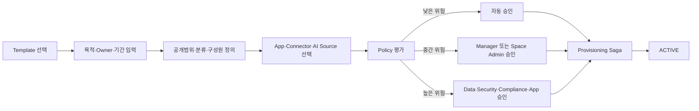

# R2 Enterprise Space Platform ADR

- 상태: Implemented as local reference baseline
- 적용일: 2026-08-18
- 대상: Space App, Tenant Control Center, Approval Hub, IAG, App Registry, Agent Runtime

## 1. 결정 배경

현재 Global Header의 `DWP Workspace`는 단일 하드코딩 Label이며 실제 Context 선택이나
권한 범위를 바꾸지 않는다. 반면 DWP가 확장되면 사용자는 개인 업무 집계와 프로젝트·조직·
TF·운영·커뮤니티 같은 목적별 협업 Context를 오가게 된다. 이를 Tenant, App, Space가
섞인 하나의 Workspace 개념으로 처리하면 보안 경계, URL, 권한, 검색과 Agent Grounding이
모호해진다.

따라서 Space를 별도 Product와 Bounded Context로 정의한다.

## 2. 핵심 결정

1. `Tenant`는 회사의 보안·계약·데이터 격리 경계이며 Space가 아니다.
2. `Digital Workplace`는 Tenant가 사용하는 DWP 전체 제품 경험이다.
3. `My Work`는 여러 App과 Space의 개인 업무를 집계하는 가상 Context이며 Membership을
   갖는 Space Entity로 저장하지 않는다.
4. `Space`는 목적, Owner, Membership, Policy, 연결 자원과 수명주기를 가진 Tenant 내부
   업무 Context다.
5. Space 운영은 구성원용 App, Space Owner Studio, Tenant Control Center의 세 Surface로
   분리한다.
6. Space 생성·가입·콘텐츠·앱 연결은 위험 기반 Policy로 결정하며 고위험 Command만 기존
   Approval Decision Hub에 결재를 요청한다.
7. Provider는 상품 Plan, 기본 Template Pack, 호환성, 상태만 관리하며 Tenant Content와
   Membership을 기본적으로 열람하지 않는다.

## 3. 용어와 Context 계층

| 개념              | 의미                        | 보안 경계                    | UI 표현                       |
| ----------------- | --------------------------- | ---------------------------- | ----------------------------- |
| Provider          | DWP 운영사                  | Provider Plane               | Provider Control Plane        |
| Tenant            | 고객 회사                   | 강한 데이터 격리             | Home의 회사 Brand·현재 Tenant |
| Digital Workplace | Tenant의 DWP 전체           | Tenant와 동일                | Product Identity              |
| My Work           | 개인 업무 Aggregation       | 사용자 Effective Access      | Context Selector 기본값       |
| Space             | 목적별 협업·업무 Context    | Tenant 안의 Resource Scope   | Context Selector와 Space App  |
| App               | 실행 가능한 업무 Capability | Entitlement + Resource Scope | Launcher·Navigation           |

Header Context Selector의 Label은 더 이상 일반 문자열 `DWP Workspace`를 사용하지 않는다.
기본값은 `내 작업`이고 Space를 선택하면 해당 Space 이름과 분류를 표시한다. Selector는
Context만 바꾸며 권한을 부여하지 않는다.

## 4. Space 분류

Space Type은 Reference Data와 Template로 확장하며 코드에 계층을 고정하지 않는다.

| 기본 Type    | 대표 목적                   | 기본 수명주기                |
| ------------ | --------------------------- | ---------------------------- |
| `ORG`        | 조직·사업 단위 협업         | HR 조직 유효기간과 연계 가능 |
| `PROJECT`    | 프로젝트·TF·고객 Engagement | 시작·종료일 필수             |
| `OPERATIONS` | 서비스·현장·교대 운영       | 지속형, Owner 정기 검토      |
| `COMMUNITY`  | 직무·관심사·CoP             | 활동 기반 갱신               |
| `INCIDENT`   | 장애·위기 대응              | 단기, 종료 후 증적 보존      |
| `CUSTOM`     | Tenant 확장 유형            | Template Policy에 따름       |

`parent_space_id`는 선택 사항이다. Space 계층은 Tree, Matrix, 독립형을 모두 허용하고 HR
조직 Depth나 `부문/본부/팀`을 Column으로 만들지 않는다.

## 5. 운영 Surface

### Member Space App

- Route: `/spaces`, `/spaces/:spaceKey/*`
- My Spaces, Discover, Requests, Favorites와 최근 Context를 제공한다.
- 선택한 Space 안에서 Overview, Activity, Content, Tasks, People, Apps & Tools, Agent를
  제공한다.

### Space Owner Studio

- Route: `/spaces/:spaceKey/settings/*`
- Owner·공동 Owner, Membership, Content Policy, App·Connector, AI·Knowledge,
  Insight, Lifecycle을 해당 Space Scope에서 관리한다.
- Owner는 Tenant 정책을 완화할 수 없고 허용 범위 안에서만 강화할 수 있다.

### Tenant Control Center

- Route: `/admin/spaces/*`
- Overview, Requests, Directory, Templates, Policies, Content Governance,
  Apps & Connectors, Lifecycle, Access Reviews, Audit를 관리한다.
- 운영 화면은 위험 Queue와 Detail Workspace 중심이며 단순 Table Dump로 만들지 않는다.

## 6. Bounded Context와 서비스 책임

| Context·Service     | 소유 책임                                                                 | 소유하지 않는 것                          |
| ------------------- | ------------------------------------------------------------------------- | ----------------------------------------- |
| `dwp-space-server`  | Space·Template·Request·Membership 의미·Content Metadata·Binding·Lifecycle | 계정 원장, App 정의, 결재 엔진, 외부 원문 |
| Auth / IAG          | Principal, Effective Grant, Resource Scope, Access Review                 | Space UI·Content                          |
| Platform / Registry | App·Connector·Navigation·Home Registration                                | Space Membership                          |
| Approval Server     | 위험 Command의 Workflow·Task·Decision Evidence                            | Space 상태의 최종 SoR                     |
| Audit               | 변경 불가 감사, 탐지, 조사, 보존                                          | 업무 Transaction                          |
| Agent Runtime       | Plan·Tool 실행·Citation·Evaluation                                        | Space ACL 원장                            |
| Search Projection   | 권한 필터 Search·Index                                                    | 원본 Content SoR                          |

Space 전용 Backend Module을 새로 두고 Table Prefix는 `spc_`를 사용한다. 기존
`/v1/workspace`는 개인 Work Hub 집계 API이므로 새 Domain에 재사용하지 않는다. 신규
계약은 `/v1/spaces`와 `/v1/admin/spaces`를 사용하고 기존 API는 향후
`/v1/me/work-hub`로 명확화하는 별도 Migration을 검토한다.

## 7. 권한 모델

권한은 아래 교집합으로 평가한다.

```text
Tenant Session
∩ App Entitlement
∩ Space Membership or Scoped Responsibility
∩ Connected Source ACL
∩ Object Policy and Data Classification
```

### Space 내부 역할

| 역할          | 범위  | 주요 Capability                    |
| ------------- | ----- | ---------------------------------- |
| `VIEWER`      | Space | 조회·검색                          |
| `CONTRIBUTOR` | Space | 일반 Content 생성·댓글             |
| `EDITOR`      | Space | Content 편집·구조화                |
| `MODERATOR`   | Space | 신고 처리·게시 제어                |
| `OWNER`       | Space | 설정·Membership·위임·수명주기 책임 |
| `GUEST`       | Space | 제한된 외부 협업                   |

### Tenant 운영 책임

- `SPACE_GOVERNANCE_ADMIN`: Tenant 정책·예외·전체 Directory·수명주기
- `SPACE_TEMPLATE_ADMIN`: Template Draft·Version·Publish
- `SPACE_COMPLIANCE_REVIEWER`: 민감·외부·공식 게시 검토
- `SPACE_ACCESS_REVIEWER`: 정기 Membership·Owner 검토

이 책임은 기존 `com_admin_resource_sets`, `com_admin_role_assignments`의 Scoped
Responsibility 모델을 확장한다. Space가 별도 Role 원장을 만들지 않으며 Resource Type
`SPACE`와 Resource Key `SPACE.<key>`를 IAG에 등록한다. Owner와 승인자는 가능하면 분리한다.

Auth V61·V62에서 다음 계약을 적용했다.

- `com_resource_type_catalog`에 `SPACE` 등록
- Scoped Resource Set의 `APP` 전용 Check를 Catalog FK 기반 `APP·SPACE` 계약으로 확장
- `SPACE_GOVERNANCE_ADMIN`, `SPACE_TEMPLATE_ADMIN`, `SPACE_COMPLIANCE_REVIEWER`,
  `SPACE_ACCESS_REVIEWER` Tenant 운영 역할 등록
- Principal Grant Source에 `SPACE_MEMBERSHIP`, `SPACE_ACCESS_REQUEST` 추가
- `APP.SPACES`, `ADMIN.SPACE_*`와 Space Coarse Resource의 Permission Seed
- 각 Space 운영 역할에 `APP.ADMINISTRATION:VIEW`를 부여하되 세부 관리 화면은 전용
  `ADMIN.SPACE_*` Permission으로 다시 제한
- 기존 App Responsibility의 위임·SoD 검증을 Space Resource Set에도 일반화

Platform V126은 Space Service의 enum형 DB 계약을 중앙 `sys_code_sets`,
`sys_code_values`, `sys_code_bindings`에 등록한다. Space가 사용하는 33개 의미 Code Set과
42개 실제 Column Binding을 `dwp-space-server` 소유로 관리하며, Auth의
`AUTH.SCOPED_ADMIN.RESOURCE_TYPE`과 `AUTH.RESOURCE_GRANT.SOURCE_TYPE`에는 각각
`SPACE`, `SPACE_MEMBERSHIP·SPACE_ACCESS_REQUEST`를 병합한다. 따라서 DB Check,
관리 화면, API·Agent Tool이 같은 코드 의미와 한·영 Label을 사용한다.

Space 내부 Contributor·Editor·Moderator Capability Mapping은 Space Service가 소유하고 Auth는
Principal·Group, App Entitlement, Space Coarse Grant와 관리 책임을 소유한다. 세부 Role마다
동일 Permission Row를 반복 생성하지 않아 Grant 폭증을 억제한다.

### 구성원 집계 계약

Space 요약의 `memberCount`는 중첩될 수 있는 Directory Group의 인원수를 더한 값이 아니라
현재 활성 상태인 사용자·그룹 **접근 주체 수**다. 실제 고유 인원수는 향후 Auth/SCIM의
Effective Membership Projection이 제공할 때 별도 지표로 노출한다. 불확실한 Cardinality를
사용자 수로 표시하지 않는다.

## 8. 생성과 승인

### 처리 순서



- 사용자는 제출 전에 예상 승인 경로와 정책 이유를 확인한다.
- `SPACE_CREATE` 업무 유형을 Approval Decision Hub에 등록하고 별도 결재 엔진을 만들지
  않는다.
- 승인 결과는 Space Service가 Idempotent Command로 반영한다.
- Provisioning은 Membership, 기본 Page, App Binding, Search Scope, Agent Context를
  단계적으로 만들고 보상 동작을 기록한다.

## 9. 콘텐츠와 연결 자원

- DWP가 직접 작성한 Page·Announcement·Decision Note의 Metadata와 Revision은 Space
  Service가 소유한다.
- SharePoint, Teams, Slack, Jira, ServiceNow, SAP, 외부 문서는 원본 시스템에 남기고
  `spc_resource_bindings`가 ID, URL, Connector, ACL 전략과 동기화 상태만 저장한다.
- Binary는 Object Storage Port 뒤에 저장한다. Local 개발 Adapter와 S3 Adapter는 같은
  계약을 사용하며 DB BLOB를 운영 기본값으로 삼지 않는다.
- Upload는 Malware Scan, MIME 검증, DLP, Classification을 통과해야 한다.
- 공식 지식, Tenant 전체, 외부 공개는 게시 승인 대상으로 분류하고 일반 협업 Content는
  즉시 게시와 Moderation을 사용한다.

## 10. Lifecycle

```text
DRAFT → SUBMITTED → POLICY_EVALUATED → APPROVAL_PENDING → APPROVED
      → PROVISIONING → ACTIVE → SUSPENDED → ARCHIVED
      → DELETION_PENDING → DELETED → PURGED
```

- `REJECTED`, `FAILED`, `CANCELLED`는 독립 종료 상태로 기록한다.
- 활동이 있는 Space는 자동 갱신 후보가 되고 비활성 Space는 Owner에게 검토를 요청한다.
- Owner가 없으면 자동으로 Governance Queue에 Escalation한다.
- 삭제 전 Legal Hold, Retention, Connected Source 상태와 Export 요구를 확인한다.
- Soft Delete 복구 기간 이후 원문, Search Index, Vector, Cache와 Connector Token을
  순서대로 삭제하고 증적은 정책 기간만 보존한다.

## 11. AI·검색 계약

- 검색과 Agent는 `tenant_id`, `space_id`, `principal_id`, `source_acl_hash`,
  `classification` Filter를 강제한다.
- 사용자가 Space를 전환하면 진행 중 Conversation은 명시적으로 새 Context를 시작하거나
  사용자의 확인을 받아야 한다.
- Agent가 Space 생성·구성원 초대·App 연결·공식 게시를 수행할 때 Plan Preview, 정책 평가,
  Human Approval과 Audit ID를 제공한다.
- Retrieval 결과는 Source Citation, Freshness와 Access Basis를 표시한다.
- Space Content를 Model 재학습에 사용하지 않는다.

## 12. Event 계약

- `space.requested.v1`
- `space.policy-evaluated.v1`
- `space.approved.v1`
- `space.provisioning-started.v1`
- `space.activated.v1`
- `space.membership-changed.v1`
- `space.content-submitted.v1`
- `space.content-published.v1`
- `space.lifecycle-review-due.v1`
- `space.archived.v1`

Transactional Outbox와 Consumer Inbox를 사용하고 Event에 원문·PII를 넣지 않는다.

## 13. 대안과 기각 이유

| 대안                                        | 결정 | 이유                                           |
| ------------------------------------------- | ---- | ---------------------------------------------- |
| Tenant를 Workspace라고 표시                 | 기각 | 회사 경계와 목적별 협업 Context가 혼동됨       |
| 모든 Space를 중앙 관리자가 생성             | 기각 | 셀프서비스·확장성 저하, 승인 병목              |
| 모든 Content 사전 승인                      | 기각 | 일상 협업 속도 저하, 형식적 검토 증가          |
| Space를 Platform Server 안의 Table로만 추가 | 기각 | 수명주기·콘텐츠·연결·AI 경계가 빠르게 비대해짐 |
| Space별 독립 RBAC 엔진                      | 기각 | IAG와 권한 Drift, 감사 단절                    |
| 외부 원문 전량 복제                         | 기각 | ACL·삭제·보존·지역 정책 불일치                 |

## 14. 구현 순서와 Gate

1. G0: 용어·Product Boundary·Route·Role 계약 승인
2. G1: Prototype와 Space Creation Policy Simulation 검증
3. G2: `dwp-space-server`, Data Model, IAG Resource Scope, Approval Workflow 구현
4. G3: Member App·Owner Studio·Tenant Admin·Audit·Search 통합
5. G4: Connector·Agent Context·Lifecycle Automation과 Pilot

Figma License, S3, KMS, DLP Provider는 외부 Gate다. Interface와 Local Adapter를 먼저
정의하되 실제 Provider가 준비되기 전 Production Ready로 표시하지 않는다.

## 15. 구현 기준선과 잔여 Gate

2026-08-18 Local 기준선에는 Member Space App, Owner Studio, Tenant Control Center,
독립 Database·Service·Gateway, Auth/IAG 역할과 Seed, 한·영 UI가 구현되어 있다.
Desktop·Tablet·320/390px, Dark·High Contrast, 역할별 메뉴·직접 URL 경계를 검증했다.

다음 항목은 설계 누락이 아니라 외부 환경이 필요한 Release Gate다.

- Object Storage·KMS·Malware Scan·DLP와 Legal Hold/Purge Receipt
- SharePoint·Teams·Slack·Jira 등 Connector와 원본 ACL Reconciliation
- Search·Vector·Agent Runtime의 Effective Principal Projection과 Red Team Eval
- Production 부하·침투·장애 주입·Data Residency·Pilot 검증
- Figma License 준비 후 Design Source of Truth와 고정 Visual Baseline 승인

## 16. 운영 제어면과 비상 복구 결정

2026-08-19에 다음 운영 계약을 구현 기준선으로 확정했다.

1. Tenant의 `ADMIN.SPACE_GOVERNANCE` 책임은 Space 포트폴리오 메타데이터, 수명주기,
   드리프트와 복구 제어면에만 적용한다. 이 책임만으로 비공개 Space 본문, Draft 또는
   Owner Studio 권한을 상속하지 않는다.
2. `MODERATOR`는 Content 조회·작성·게시 제어를 수행하지만 Membership·Policy·App 설정을
   관리하지 않는다. 해당 설정은 유효한 `OWNER` Membership만 수행한다.
3. 소유자 없는 Space는 일반 Owner Studio Route로 우회하지 않는다. Control Center의
   운영 발견사항에서 활성 Tenant 구성원을 검색하고, 최소 10자의 복구 사유를 기록한 뒤
   전용 Command로 복구한다.
4. 복구 Command는 Auth/IAG의 내부 Principal Validation을 먼저 호출한다. 활성·동일 Tenant
   사용자가 아니면 Space DB를 변경하지 않는다.
5. 성공한 복구 Membership은 `membership_source=RECOVERY`로 저장하고 공통 Audit,
   `SPACE_OWNER_RECOVERY` Policy Evaluation과 `RECOVERY` Reconciliation Run을 남긴다.
6. Membership에서 중앙 권한으로의 전달은 요청 Thread에서 직접 완료하지 않는다.
   `spc_entitlement_sync_items` Desired-state Queue가 재시도·Dead Letter를 관리하고,
   운영 화면에서 상태·오류·재시도를 제공한다.
7. Space→Auth 호출은 Service Identity Token, Timeout, Circuit Breaker, Retry 계약을 사용한다.
   Auth는 계정과 Effective Grant의 SoR이며 Space는 Membership Intent의 SoR다.

적용 Migration은 Space V3~~V5, Auth V61~~V62, Platform V127·V129·V130이다. 외부 IAG,
Object Storage, KMS, DLP, Connector와 Search ACL Projection은 기존 Release Gate를 유지한다.
