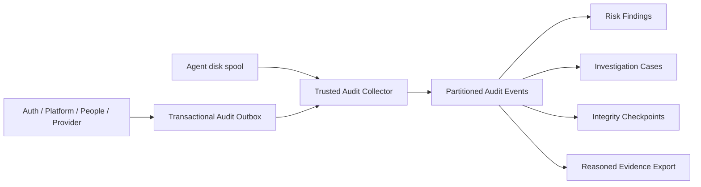

# 04 데이터 설계

## 저장 경계

각 도메인 DB의 같은 Transaction에서 `sys_audit_outbox`에 기록하고 Relay가 Platform
Collector로 전달한다. 중앙 증적은 `dwp_platform`에 저장한다. API 성능 이력
`sys_api_history`는 운영 Telemetry이며 감사 증적과 결합 저장하지 않는다.

## 중앙 Table

| Table                             | 책임                                                             |
| --------------------------------- | ---------------------------------------------------------------- |
| `sys_audit_events`                | 월 Partition Append-only 원장, Event·Actor·Target·정책·Diff·Hash |
| `sys_audit_findings`              | 위험 Rule 결과, 상태·담당·Case 연결                              |
| `sys_audit_cases`                 | 조사 Case와 Owner·Severity·Resolution·Lifecycle                  |
| `sys_audit_case_events`           | Case와 Partition Event의 시간 포함 연결                          |
| `sys_audit_saved_searches`        | 소유권·공유 범위를 가진 사용자별 상대 기간 재사용 Filter         |
| `sys_audit_export_jobs`           | 요청자·조건·Format·사유·행 수·Content SHA-256                    |
| `sys_audit_retention_policies`    | Tenant별 보존·반출·무결성·Risk 임계값                            |
| `sys_audit_integrity_checkpoints` | 일별 Root Hash·서명·검증 결과                                    |
| `sys_audit_source_health`         | Source별 마지막 Event와 전달 상태                                |

## 조사 워크스페이스 확장

감사 Case는 단순 상태 레코드가 아니라 누가 무엇을 판단했고 어떤 증거와 대상을 근거로
조사했는지 재현할 수 있는 작업 공간이어야 한다.

| Table                       | 책임                                                           |
| --------------------------- | -------------------------------------------------------------- |
| `sys_audit_cases.due_at`    | Severity 기반 조사 SLA와 지연·위험 상태 계산                   |
| `sys_audit_case_entities`   | 사용자·서비스·자원·앱·데이터·AI Agent와 사건 내 관계·위험 범위 |
| `sys_audit_case_activities` | 메모·상태·배정·증적·작업 변경의 Append-only 조사 저널          |
| `sys_audit_case_tasks`      | 우선순위·담당자·기한·완료 상태를 가진 조사 조치                |

- Case SLA 기본값은 Critical 4시간, High 1일, Medium 3일, Low 7일이다.
- Entity는 Case와 Tenant를 함께 저장하고 `(entity_type, entity_id)`로 영향 범위를 탐색한다.
- Activity는 Update·Delete Trigger를 차단해 조사 판단의 사후 변경을 막는다.
- Task 완료 시각과 상태의 정합성을 Check Constraint로 강제한다.
- Finding의 최초 Event, Actor, Target, Source는 Migration과 Case 생성 시 자동으로 증적·
  Entity 범위에 편입한다.

## Event 계약

필수 Category는 `ADMIN_CHANGE`, `AUTHENTICATION`, `AUTHORIZATION`, `DATA_ACCESS`,
`DATA_EXPORT`, `PROVISIONING`, `AI_ACTION`, `POLICY_DENIED`, `SYSTEM_EVENT`다.
Event ID, 발생·수집 시각, Tenant, Action, Outcome, Severity, Risk, Actor, Source, Target,
Correlation, 정책·승인, Before/After, 변경 Field, Metadata, Retention Class와 Record Hash를
저장한다.

## 불변식과 성능

- `(occurred_at, event_id)` Partition Key로 Idempotency를 보장한다.
- Update·Delete는 Session-local Maintenance Flag 없이는 Trigger가 거부한다.
- Tenant와 시간 범위가 모든 조회 Index의 선두 조건이다.
- Outbox는 Lease, `SKIP LOCKED`, 지수 Backoff와 Dead 상태를 사용한다.
- 4xx 데이터 거절은 배치 분할로 문제 Event만 격리하고 5xx·Network는 배치 재시도한다.
- Standard·Extended·Legal Hold 보존 Class를 분리한다.
- 저장 검색은 `(tenant_id, owner_actor_id, name)`으로 멱등 갱신하고 소유자만 삭제한다.

## Privacy와 생산 환경 Gate

Secret·Token·Password·Raw Body·Raw IP·Raw User-Agent는 Sanitizer가 제거한다. Production은
Workload Identity 또는 mTLS, KMS/HSM 서명, Object Lock WORM Archive, SIEM Export,
PostgreSQL RLS와 별도 감사자 운영 권한을 Release Gate로 요구한다.
