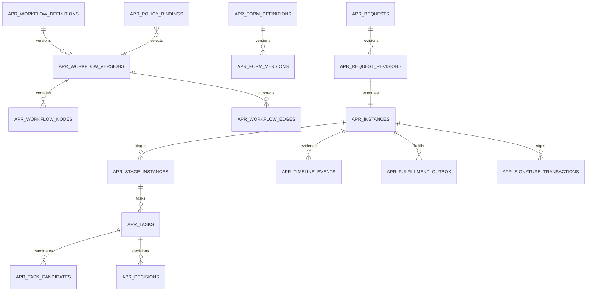

# DWP-R1-APR-001 데이터 설계

## Ownership

- System of Record: 결재 정의·Task·Decision·Evidence는 `dwp-approval-server`
- Database: 별도 PostgreSQL Database `dwp_approval`
- 원업무: HRIS·Employee Services·Access·ERP 등 각 Domain
- Data Owner: Tenant별 Approval Process Owner, Platform은 운영 Metadata만 관리
- Tenant 경계: 모든 Tenant Entity에 `tenant_id`, 모든 FK에 Tenant 일치 강제
- 기밀등급: Metadata는 `INTERNAL`, Form Payload·첨부는 최대 `RESTRICTED`
- Table Prefix: `apr_`

## 모델 원칙

1. 정의와 실행을 분리한다.
2. 게시된 Form·Workflow·Policy Version은 수정하지 않는다.
3. Request는 안정 ID, Revision은 불변 업무 Snapshot이다.
4. Instance·Stage·Task는 실행 상태, Decision·Timeline은 Append-only 증적이다.
5. 원업무 반영은 Outbox·Inbox로 연결하고 교차 Database Transaction을 만들지 않는다.
6. `tenant_id` 없는 PK 참조를 허용하지 않고 Composite FK로 교차 Tenant 연결을 차단한다.
7. Restricted Payload는 KMS Envelope Encryption과 Object Storage Gate 전까지 운영에
   활성화하지 않는다.

## 현재 구현 Schema

현재 로컬 R1 기준선은 Flyway `V1`~`V11`과 다음 물리 Table을 사용한다. 아래의 상세
Target Model과 이름이 다른 항목은 구현 완료로 간주하지 않는다.

| 영역        | 물리 Table                                                                                   | 현재 책임                                                           |
| ----------- | -------------------------------------------------------------------------------------------- | ------------------------------------------------------------------- |
| Tenant      | `apr_tenants`                                                                                | Approval bounded context의 Tenant 경계                              |
| Workflow    | `apr_workflow_definitions`, `apr_workflow_versions`                                          | Draft·Published 버전, 정의 Hash, 순서형 단계                        |
| Form        | `apr_form_categories`, `apr_forms`, `apr_form_versions`                                      | 계층 분류, 한영 Metadata와 동적 Field Schema 버전                   |
| Binding     | `apr_form_workflow_bindings`                                                                 | 양식별 기본·조건부 Workflow 연결과 적용 기간                        |
| Request     | `apr_requests`, `apr_request_payloads`, `apr_request_payload_versions`, `apr_request_events` | 초안·상신 상태, 현재 Payload와 불변 수정 이력, Append-only Timeline |
| Runtime     | `apr_steps`, `apr_tasks`                                                                     | 순차 단계 활성화와 역할 후보 Task                                   |
| Governance  | `apr_policy_rules`, `apr_policy_rule_versions`, `apr_delegations`                            | 정책 변경안·불변 게시 이력과 기간·Workflow 범위 위임                |
| Integration | `apr_integration_outbox`, `apr_signature_providers`                                          | 원업무 전달과 Provider 준비 상태                                    |
| Evidence    | `sys_audit_outbox`, `sys_domain_event_*`                                                     | 감사·Domain Event 전달과 복구                                       |

현재 `apr_tasks.candidate_role`은 역할 후보 큐다. 후보 개인 Snapshot과 후보별 Decision
원장이 없으므로 `ANY`만 지원하며, `ALL/COUNT/PERCENT`를 데이터 값만으로 흉내 내지 않는다.
향후 정족수 확장은 `apr_task_candidates`, 후보별 Task 또는 Vote, 활성 시점 조직 Snapshot,
결정 Unique Constraint를 먼저 도입한 뒤 활성화한다.

`apr_form_categories`는 `parent_category_id` 자기 참조로 깊이를 고정하지 않는다. API는
교차 Tenant 부모, 자기 참조와 자손을 부모로 지정하는 Cycle을 거부한다. 카테고리를
비활성화하면 신규 기안 카탈로그에서 해당 분류의 게시 양식을 제외하지만 기존 요청,
고정된 Form Version과 감사 증적은 유지한다.

`apr_form_workflow_bindings`는 양식과 프로세스를 독립 자산으로 유지한다. R1 실행 경로는
양식당 활성 `DEFAULT` Binding 하나를 강제하고, `CONDITIONAL`·우선순위·유효기간 Column은
향후 검증된 Decision Table 도입을 위한 확장 계약이다. 현재 Runtime에서 지원하지 않는
조건 분기를 UI 값만으로 흉내 내지 않는다.

## 관계

## 공통 Column

| Column           | Type        | 의미·제약                                      |
| ---------------- | ----------- | ---------------------------------------------- |
| `tenant_id`      | uuid        | Tenant 소유 Entity 필수, Composite FK 선두     |
| `<entity>_id`    | uuid        | 서버 생성 UUIDv7 계열, URL 노출 가능           |
| `created_at`     | timestamptz | Database 시각, UTC                             |
| `created_by`     | uuid        | 실제 Principal, Service는 Service Principal ID |
| `updated_at`     | timestamptz | Mutable Entity만 사용                          |
| `row_version`    | bigint      | 낙관적 잠금, 갱신마다 증가                     |
| `correlation_id` | uuid        | API·Audit·Domain Event 연결                    |

## Definition Table

| Table                      | 주요 Column                                                                                                             | 책임·제약                                         |
| -------------------------- | ----------------------------------------------------------------------------------------------------------------------- | ------------------------------------------------- |
| `apr_workflow_definitions` | `workflow_id`, `workflow_key`, `name_key`, `owner_domain`, `lifecycle`                                                  | Tenant 내 안정 Workflow identity, key unique      |
| `apr_workflow_versions`    | `workflow_version_id`, `workflow_id`, `version_no`, `status`, `effective_from/to`, `definition_hash`, `published_by/at` | `PUBLISHED` 이후 update/delete 금지               |
| `apr_workflow_nodes`       | `node_id`, `workflow_version_id`, `node_key`, `node_type`, `config_jsonb`                                               | 승인·조건·서명·자동화 등 Typed node, key unique   |
| `apr_workflow_edges`       | `edge_id`, `from_node_id`, `to_node_id`, `condition_rule_id`, `priority`                                                | 같은 Version 내부 연결, cycle 정책 검증           |
| `apr_routing_rules`        | `routing_rule_id`, `rule_key`, `version_no`, `candidate_source`, `resolution_mode`, `expression_ast`, `status`          | 임의 Script 금지, 검증된 Typed AST·Decision Table |
| `apr_quorum_rules`         | `quorum_rule_id`, `mode`, `threshold_value`, `reject_mode`                                                              | ANY·ALL·COUNT·PERCENT와 반려 의미                 |
| `apr_form_definitions`     | `form_id`, `form_key`, `owner_domain`, `lifecycle`                                                                      | 안정 Form identity                                |
| `apr_form_versions`        | `form_version_id`, `version_no`, `schema_jsonb`, `ui_schema_jsonb`, `schema_hash`, `status`                             | JSON Schema 기반, 게시 후 불변                    |
| `apr_form_localizations`   | `form_version_id`, `locale`, `content_jsonb`, `status`                                                                  | Locale 추가가 Table 변경을 만들지 않음            |
| `apr_policy_bindings`      | `binding_id`, `source_app`, `request_type`, `risk_tier`, `form_version_id`, `workflow_version_id`, `priority`           | 어떤 요청에 어떤 Version을 적용하는지 결정        |
| `apr_sla_policies`         | `sla_policy_id`, `policy_key`, `risk_tier`, `due_expression`, `reminder_policy`, `escalation_policy`                    | Business Calendar reference 포함                  |

`expression_ast`는 허용 Operator, Attribute와 Function을 Registry에서 검증한다. Database나
외부 URL에 접근하는 임의 코드, 정규식 폭주와 동적 Reflection을 허용하지 않는다.

## Runtime Table

| Table                      | 주요 Column                                                                                                                                                                           | 책임·제약                                                   |
| -------------------------- | ------------------------------------------------------------------------------------------------------------------------------------------------------------------------------------- | ----------------------------------------------------------- |
| `apr_requests`             | `request_id`, `request_key`, `source_app`, `source_entity_type/id`, `requester_id`, `latest_revision_no`                                                                              | 안정 업무 요청, Source tuple unique 선택 가능               |
| `apr_request_revisions`    | `revision_id`, `request_id`, `revision_no`, `form_version_id`, `title`, `summary_jsonb`, `payload_jsonb`, `restricted_payload_ref`, `source_version`, `source_hash`, `classification` | 제출된 Revision 불변, payload 저장 정책 분리                |
| `apr_instances`            | `instance_id`, `revision_id`, `workflow_version_id`, `state`, `risk_tier`, `current_stage_key`, `due_at`, `fulfillment_state`, `row_version`                                          | Revision당 실행, 상태 전이 제약                             |
| `apr_stage_instances`      | `stage_instance_id`, `instance_id`, `node_id`, `sequence_no`, `state`, `activated_at`, `completed_at`, `quorum_snapshot_jsonb`, `routing_input_hash`                                  | Runtime Stage와 적용 규칙 Snapshot                          |
| `apr_tasks`                | `task_id`, `stage_instance_id`, `task_type`, `state`, `assignee_id`, `candidate_mode`, `due_at`, `claimed_by/at`, `row_version`                                                       | 활성 판단 단위, 단일 최종 결과                              |
| `apr_task_candidates`      | `task_id`, `candidate_type/id`, `resolution_reason`, `effective_from/to`, `is_excluded`                                                                                               | 해석된 후보 Snapshot과 SoD 제외 이유                        |
| `apr_participants`         | `instance_id`, `principal_id`, `participant_role`, `represented_principal_id`, `source_rule_id`                                                                                       | 요청자·결재자·위임자·참조자 관계                            |
| `apr_decisions`            | `decision_id`, `task_id`, `task_version`, `outcome`, `reason_code`, `comment`, `actor_id`, `represented_id`, `auth_context_jsonb`, `evidence_hash`, `decided_at`                      | Append-only, `(task_id, task_version)` final outcome unique |
| `apr_information_threads`  | `thread_id`, `instance_id`, `task_id`, `thread_type`, `state`, `requested_from`, `due_at`                                                                                             | 정보·보완 요청을 일반 댓글과 분리                           |
| `apr_information_messages` | `message_id`, `thread_id`, `author_id`, `body`, `attachment_count`                                                                                                                    | Append-only Q&A                                             |
| `apr_comments`             | `comment_id`, `instance_id`, `author_id`, `visibility`, `body`, `parent_id`                                                                                                           | 공개 범위와 Mention 분리, 수정은 정정 Event                 |
| `apr_attachments`          | `attachment_id`, `revision_id`, `object_key`, `file_name`, `media_type`, `size_bytes`, `sha256`, `scan_state`, `classification`, `retention_policy_id`                                | 파일 Binary는 DB에 저장하지 않음                            |
| `apr_delegation_rules`     | `delegation_id`, `delegator_id`, `delegate_id`, `category_scope`, `starts_at`, `ends_at`, `state`, `reason`                                                                           | 겹침·자기 위임·SoD 제약                                     |
| `apr_timeline_events`      | `event_id`, `instance_id`, `event_type`, `actor_id`, `payload_redacted_jsonb`, `occurred_at`, `previous_hash`, `event_hash`                                                           | 월 Partition, Append-only Hash chain                        |

## Integration·Evidence Table

| Table                        | 주요 Column                                                                                                                                               | 책임·제약                                |
| ---------------------------- | --------------------------------------------------------------------------------------------------------------------------------------------------------- | ---------------------------------------- |
| `apr_fulfillment_outbox`     | `message_id`, `instance_id`, `command_type`, `destination`, `payload_ref`, `idempotency_key`, `state`, `attempt_count`, `next_attempt_at`                 | 최종 결정 후 원업무 Command              |
| `apr_integration_inbox`      | `consumer`, `message_id`, `payload_hash`, `processed_at`, `result`                                                                                        | 중복 Event 차단                          |
| `apr_idempotency_records`    | `scope`, `idempotency_key`, `request_hash`, `response_ref`, `expires_at`                                                                                  | 제출·결정·재시도 멱등성                  |
| `apr_signature_transactions` | `signature_id`, `instance_id`, `provider`, `envelope_id`, `state`, `recipient_snapshot`, `document_hash`, `certificate_object_key`, `provider_updated_at` | 내부 결재와 외부 서명 연결               |
| `apr_webhook_receipts`       | `provider`, `provider_event_id`, `received_at`, `signature_valid`, `payload_hash`, `processing_state`                                                     | Signature Webhook 재전송·검증            |
| `apr_audit_export_requests`  | `export_id`, `requester_id`, `scope_jsonb`, `state`, `artifact_ref`, `expires_at`                                                                         | 권한형 Evidence 반출, 감사 시스템과 연결 |

## Key와 Index

| 이름                           | Column                                                                     | Unique | Query 근거               |
| ------------------------------ | -------------------------------------------------------------------------- | ------ | ------------------------ |
| `uq_apr_workflow_key`          | `tenant_id, workflow_key`                                                  | O      | 정의 조회                |
| `uq_apr_workflow_version`      | `tenant_id, workflow_id, version_no`                                       | O      | Version publish          |
| `uq_apr_request_source`        | `tenant_id, source_app, source_entity_type, source_entity_id, request_key` | O      | Source 중복 제출 방지    |
| `ix_apr_inbox_candidate`       | `tenant_id, state, due_at, task_id` + candidate join                       | X      | 개인 Queue Cursor paging |
| `ix_apr_tasks_assignee`        | `tenant_id, assignee_id, state, due_at`                                    | X      | 직접 할당 Queue          |
| `ix_apr_instances_requester`   | `tenant_id, requester_id, state, created_at desc`                          | X      | 내가 올린 문서           |
| `ix_apr_instances_source`      | `tenant_id, source_app, source_entity_type, source_entity_id`              | X      | 원업무 Deep Link         |
| `ix_apr_timeline_instance`     | `tenant_id, instance_id, occurred_at, event_id`                            | X      | Timeline                 |
| `uq_apr_decision_task_version` | `tenant_id, task_id, task_version`                                         | O      | 중복 최종 결정 차단      |
| `uq_apr_idempotency`           | `tenant_id, scope, idempotency_key`                                        | O      | 멱등 Command             |

목록은 Offset이 아닌 서명 Cursor를 사용한다. Queue 정렬 Key는 `priority_bucket,
due_at, created_at, task_id`로 고정해 동점 이동을 방지한다.

## Lifecycle와 무결성

- Definition Draft는 `row_version`으로 충돌을 제어한다.
- Publish Transaction은 Validation 결과, Reviewer와 Definition Hash를 함께 저장한다.
- 제출된 Revision, Decision, Timeline, 처리된 Webhook은 update/delete Trigger로 차단한다.
- Request 회수·취소는 상태 Event이며 데이터 삭제가 아니다.
- 결재선 변경은 기존 Task를 `CANCELED`하고 새 Task와 경로 변경 Event를 생성한다.
- PII 삭제 요청은 법정·계약 보존과 충돌 평가 후 표시 정보 최소화·가명화로 처리한다.
- Legal Hold가 존재하면 Retention Worker가 Artifact를 삭제하지 않는다.

## 동기화

- Event Envelope: `eventId`, `eventType`, `version`, `tenantId`, `actor`, `subject`,
  `occurredAt`, `correlationId`, `causationId`, `dataClassification`, `payload`
- Event: `approval.request.submitted.v1`, `approval.task.activated.v1`,
  `approval.decision.recorded.v1`, `approval.instance.approved.v1`,
  `approval.fulfillment.requested.v1`, `approval.fulfillment.completed.v1`,
  `approval.fulfillment.failed.v1`, `approval.signature.completed.v1`
- Retry: 지수 Backoff + Jitter, 최대 시도 후 DLQ·운영 Queue
- Conflict: Source ETag가 달라지면 제출·Fulfillment를 중단하고 Diff 검토
- Reconciliation: 승인 Instance와 원업무 상태를 주기적으로 대조하되 원업무를 덮어쓰지 않음

## Migration

- Migration ID: `dwp-approval-server`의 `V1__create_approval_decision_hub.sql`~
  `V11__default_legacy_forms_to_governed_category.sql`
- Forward: Definition → Runtime → Evidence → Seed 순서
- Product Seed: 4개 Reference Form·Workflow, 한영 Label, Code Contract
- Local 업무 Seed: `db/local-seed/R__seed_skax_approval_data.sql`; `devctl.py`로 시작한
  로컬 환경에서만 활성화하고 운영 기본 Flyway Location에서는 제외한다.
- Rollback: 운영 데이터가 생성되기 전만 Drop 허용, 이후 Forward-only 보정 Migration
- Lock: 대용량 Index는 운영 전 생성, 운영 후에는 Concurrent Strategy 검토
- 빈 DB와 기존 DB Upgrade를 모두 Testcontainer Gate에서 검증

### V5 양식 카탈로그 무결성

- `(tenant_id, category_key)`와 `(tenant_id, category_id)`를 안정 식별자로 사용한다.
- `apr_forms.category_id`는 같은 Tenant의 카테고리만 참조한다.
- 활성 기본 결재선은 양식당 하나만 허용하는 Partial Unique Index로 보호한다.
- 양식 게시 시 게시된 기본 Workflow 존재와 설계자·게시자 분리를 Transaction에서 검증한다.
- 기안 시 Form ID와 Workflow ID가 활성 Binding으로 연결됐는지 서버에서 다시 검증한다.
- 게시 양식 목록은 `PUBLISHED` 양식, 활성 카테고리, 활성 Binding, 게시 Workflow를 모두
  만족할 때만 노출한다.

### V6~V11 운영·증적 보강

- `V6`은 위임 대상의 Person·표시명·이메일·위임 역할 Snapshot과 실제 결정자·원 위임자
  Column을 추가한다.
- `V7`은 정책 변경안을 현재 게시값과 분리해 저장하고 maker-checker 검토 전에는 실행
  정책에 반영하지 않는다.
- `V8`은 게시 정책 Version을 append-only로 보존하고 통합 전달 수동 재처리 횟수·행위자·
  시각을 남긴다.
- `V9`은 Draft 생성·수정과 보완요청 수정마다 `apr_request_payload_versions`를 추가한다.
  현재 Payload는 조회 최적화용이며 감사 기준은 요청별 증가 Revision과 Hash다.
- `V10`은 미분류 양식을 Tenant별 `GENERAL` 카테고리로 먼저 보정하고 검증한 뒤
  `apr_forms.category_id`를 `NOT NULL`로 강화한다. 양식은 반드시 관리형 분류에 속한다.
- `V11`은 신규 Tenant에서 카탈로그를 양식보다 먼저 초기화하고, 명시적 카테고리를
  지원하지 않는 레거시 Writer만 해당 Tenant의 `GENERAL`로 보정한다. 관리 API는 계속
  명시적 카테고리를 요구하며 카테고리 없는 Row는 저장되지 않는다.

`apr_request_events.event_data`는 결정 시점의 `actorDisplayName`, `stepName`,
`stepSequence`, `delegated`를 함께 보존한다. 화면은 이 Snapshot으로 단계·실제 처리자·대리
여부를 설명하고, `actor_id`는 원장 상관관계 식별자로 유지한다.

### 로컬 데이터 기준선

- Auth에 실제 활성화된 SKAX `@sk.com` 계정 21명의 `user_id`, `person_public_id`, 이름,
  조직과 직책 Snapshot을 사용한다. People Directory에만 있고 Auth 계정이 아직 없는
  사람은 결재 Principal이 아니므로 요청자·결재자로 만들지 않는다.
- 구성원마다 Draft, 진행 중, 추가정보 요청, 완료·반려·회수 중 하나를 포함한 요청 4건을
  생성하며, 현재 결재 Task와 정보 요청 Task를 다른 구성원에게 순환 배정한다.
- Form Payload, `apr_steps`, `apr_tasks`, `apr_request_events`, `apr_delegations`까지 함께
  생성하므로 목록과 상세·Timeline·운영 지표가 동일한 PostgreSQL 원장을 조회한다.
- ID는 입력값 기반 결정적 UUID이고 `reference_seed_key`가 Tenant 내 중복을 막는다.
  Repeatable migration을 재실행해도 요청·Task·Event는 중복 생성되지 않는다.
- `V1`의 로그인 시점 `Current user`·가상 `100xxx` 거래 생성 함수는 `V4`에서 제거했다.
  조회 API는 더 이상 데이터를 생성하지 않는다.

## Search·Vector

- R1 Search는 제목, 요청자, Source, 상태, 기간과 허용된 구조화 Field만 Index한다.
- Restricted 본문·첨부를 기본 Vector화하지 않는다.
- AI 요약은 요청 시 권한 필터를 통과한 Snapshot에서 생성하며 Citation은 Field·첨부
  Revision을 가리킨다.
- 향후 Vector 도입 시 원문 삭제·권한 변경·보존 만료가 Index에 전파되는 Gate가 먼저다.
