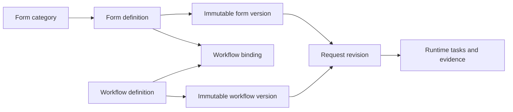

# DWP-R1-APR-001 양식 카탈로그와 결재선 운영 설계

- 상태: implemented baseline
- 기준일: 2026-08-19
- 범위: 전자결재 양식 분류·설계·결재선 연결·게시·기안

## 판단

전자결재 양식은 파일 목록이 아니라 업무 시작점이자 통제 자산이다. DWP는 양식을
`카테고리 → 양식 정의 → 불변 버전 → 결재선 Binding → 검토·게시 → 기안 시 고정`으로
관리한다. 양식과 Workflow를 한 레코드로 합치지 않아 같은 결재선을 여러 양식이 재사용할
수 있고, 양식만 바뀌거나 프로세스만 바뀌어도 독립적으로 검토할 수 있다.

## 대표 10개 제품에서 채택한 원칙

`Top 10`은 공인 순위가 아니라 대규모 업무 승인, 문서 서명, 프로세스 자동화와 DWP
적합성을 기준으로 고른 대표 벤치마크 집합이다.

| 제품                     | 양식·경로 관련 관찰                                           | DWP 적용                                     |
| ------------------------ | ------------------------------------------------------------- | -------------------------------------------- |
| Microsoft Power Automate | 승인 유형, 단계, 조건과 승인자를 재사용 가능한 Process로 관리 | 양식과 Workflow 분리, 기본 결재선 Binding    |
| ServiceNow               | Catalog item 입력과 Flow를 연결하고 레코드 문맥에서 승인      | 업무 카테고리와 동적 Field Schema            |
| SAP My Inbox             | 업무 객체, Task와 Action을 한 Inbox에 투영                    | 양식은 기안용, 실행은 통합 결재함으로 분리   |
| Oracle Fusion            | 규칙·승인 그룹과 업무 유형별 승인 운영                        | 소유 역할, SLA, 게시 책임 분리               |
| Workday                  | Business Process와 보안 그룹·조직 역할 Routing                | 사람 이름 대신 역할 기반 기본 결재선         |
| Salesforce               | Record 제출과 후속 업무 자동화를 분리                         | 원업무 SoR과 결재 원장 분리                  |
| Jira Service Management  | Request type Form과 Workflow 승인 상태 연결                   | 사용자는 승인된 양식 카탈로그에서 시작       |
| Docusign                 | Template이 필드와 수신자 Routing을 재사용                     | 외부 서명은 별도 Provider Adapter Gate       |
| Adobe Acrobat Sign       | Workflow별 입력·문서·수신자·권한을 관리                       | 양식 Metadata와 경로를 한 Inspector에서 검토 |
| Nintex                   | Form Task, 다중 참여자, 기한·알림·에스컬레이션                | 동적 필드와 단계별 SLA, 운영 신호            |

## 정보 모델

### 카테고리

- 테넌트 소유이며 부모 자기 참조로 깊이를 고정하지 않는다.
- 한영 이름·설명, 아이콘 키, 표시 순서, 활성·비활성 상태를 가진다.
- 상위 분류 선택 시 모든 하위 분류의 양식을 함께 검색한다.
- Cycle, 교차 Tenant 부모와 비활성 부모 연결을 서버에서 거부한다.
- 비활성화는 신규 기안 노출만 중단하고 기존 요청과 증적을 삭제하지 않는다.

### 양식

- 안정 `form_key`, 카테고리, 한영 이름·설명, 소유 역할과 유형을 가진다.
- Field는 키, 한영 Label·도움말, 타입, 필수 여부와 선택값으로 구성한다.
- 게시된 Version은 덮어쓰지 않는다.
- 기본 결재선이 없거나 연결 Workflow가 게시되지 않으면 게시할 수 없다.

### 결재선 Binding

- R1은 양식당 활성 `DEFAULT` Binding 하나를 실행한다.
- 양식 상세와 기안 화면에서 단계 순서, 후보 역할과 단계 SLA를 미리 보여준다.
- 기안 시 서버가 `form_id`와 `workflow_id`의 활성 Binding을 재검증한다.
- 조건부 Routing Column은 확장 계약이며 Decision Table·Expression 검증 전에는 실행하지
  않는다.

## 사용자 여정

1. 기안자는 게시된 양식만 보이는 카탈로그에서 업무 양식을 고른다.
2. 화면은 양식 설명, 프로세스 버전, 전체 SLA와 단계별 결재선을 먼저 보여준다.
3. 동적 업무 필드를 작성하고 임시 저장하거나 상신한다.
4. 상신 시 양식·Workflow Version, Payload Hash와 결재 단계가 고정된다.
5. 이후 양식 또는 결재선이 바뀌어도 진행 중 요청은 당시 Version으로 재현된다.

## 관리자 여정과 권한

| Persona                | 허용                                             | 금지                      |
| ---------------------- | ------------------------------------------------ | ------------------------- |
| Form·Workflow Designer | 카테고리 생성·편집, 양식·Workflow 초안 생성·편집 | 자신이 만든 초안 게시     |
| Approval Publisher     | 필드·경로·Diff 검토, 양식·Workflow 게시          | 초안 내용 수정            |
| Approval Operator      | 지연·전달 실패·위임 상태 모니터링                | 양식 설계, 승인 결과 변경 |
| Auditor                | 버전·게시자·실행 증적 조회                       | 제한 본문 무조건 열람     |

화면은 상단 운영 지표, 좌측 계층 카테고리, 중앙 검색 목록, 우측 양식·결재선 Inspector의
세 영역으로 구성한다. 생성·편집·게시 권한이 없으면 같은 화면을 검토 전용으로 사용한다.

## 현재 구현

- DB: `apr_form_categories`, `apr_forms`, `apr_form_versions`,
  `apr_form_workflow_bindings`
- Migration: `V5__govern_approval_form_catalog.sql`
- 사용자 API: `GET /v1/catalog/forms`,
  `GET /v1/catalog/forms/{formId}/template`
- 관리자 API: 카테고리 조회·생성·수정, 양식 조회·초안 생성·수정·게시
- UI: 계층 카테고리·하위 집계, 검색, 한영 Metadata, Field Builder, 기본 결재선과 단계
  Preview, 게시 준비 상태, 설계자·게시자 SoD
- 데이터: 기존 Reference 양식은 Migration에서 카테고리와 기본 결재선을 보정한다.

## 의도적으로 남긴 Production Gate

다음 기능은 단순 UI만 추가하지 않고 Runtime·감사·복구 계약과 함께 구현해야 한다.

1. 게시 양식의 새 Revision 생성, Version Diff, 승인된 Retire·복원 Command
2. 조건부 결재선 Decision Table과 Explainable Routing
3. 병렬·혼합 단계, `ALL/COUNT/PERCENT` 후보별 독립 Task·Decision
4. 첨부 Object Storage, Malware Scan, KMS와 보존 정책
5. 운영자 재지정·Fulfillment 재시도·중단 Command와 멱등 원장
6. Docusign·Adobe Provider 자격 증명, Webhook 검증과 완료 인증서

## 공식 근거

- [Microsoft preset approvals](https://learn.microsoft.com/en-us/power-automate/guidance/business-approvals-templates/configure-preset-approvals)
- [ServiceNow approval rules](https://www.servicenow.com/docs/r/build-workflows/approvals/c_ApprovalRules.html)
- [SAP My Inbox](https://help.sap.com/docs/build-process-automation/sap-build-process-automation/my-inbox-for-process-participants)
- [Oracle approval groups](https://docs.oracle.com/en/cloud/saas/supply-chain-and-manufacturing/25d/faicf/create-approval-groups.html)
- [Atlassian approvals](https://support.atlassian.com/jira-service-management-cloud/docs/what-are-approvals/)
- [Docusign eSignature features](https://www.docusign.com/products/electronic-signature/features)
- [Adobe custom workflow designer](https://helpx.adobe.com/sign/fedramp/templates/custom-workflow-overview.html)
- [Nintex Assign a task](https://help.nintex.com/en-US/nwc/Content/Designer/Actions/AssignaTask.htm)
