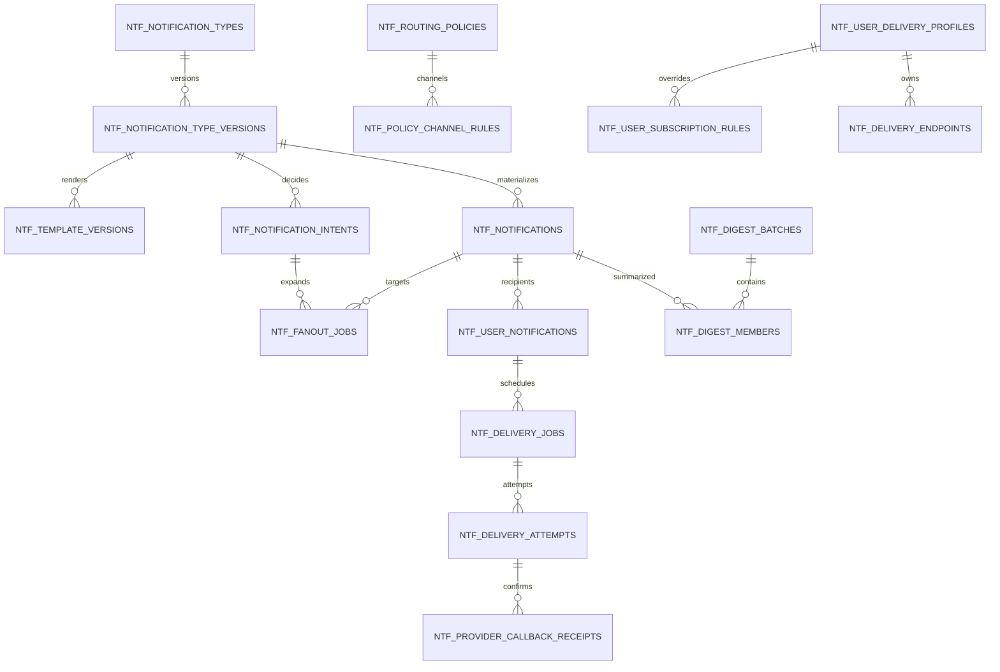

# DWP-R1-CORE-005 데이터 설계

## Ownership

- System of Record: 신규 `dwp-notification-server`, PostgreSQL Database `dwp_notification`,
  `public` Schema
- 업무 사실 원천: 각 Domain Service와 `dwp.domain-events.v1`
- 사용자·조직 원천: Auth·People. Notification DB는 Public ID와 최소 Snapshot만 저장한다.
- 외부 Channel Connector·Secret 원천: Product Registry·Secret Manager. Notification DB는 승인된
  Connector Instance Public ID와 Route 정책만 저장한다.
- Tenant 경계: 모든 Runtime Table·Unique Key·Query Predicate에 `tenant_id` 필수. Global Catalog
  Row는 `scope_type=PROVIDER`와 Provider `scope_id`, Tenant 확장은 `scope_type=TENANT`와
  `tenant_id`를 사용하며 같은 Query Path에서 암묵적으로 섞지 않는다.
- 기밀등급: 기본 Metadata. 민감 Type은 안전한 문구와 원업무 Reference만 보존한다.
- Cross-database Foreign Key: 금지
- 방어 계층: Application Tenant Guard와 PostgreSQL `FORCE ROW LEVEL SECURITY`를 함께 사용한다.
  Migration Owner, API Runtime, Background Worker Role을 분리하고 Runtime Role은 Owner·Superuser·
  `BYPASSRLS` 권한을 갖지 않는다.

## 저장 원칙

1. Kafka는 Event Log이며 사용자 Inbox Query Store가 아니다.
2. PostgreSQL은 Notification Contract·정책·상태·전달 증적의 원장이다.
3. Redis는 Live Hint만 가지며 제목, 본문, PII와 읽음 원장을 저장하지 않는다.
4. JSONB는 Event의 검증된 변수, Provider Redacted Metadata, 복합 Schedule처럼 유연성이 필요한
   부분에만 사용한다.
5. Filter·정렬·정책 합성·Join에 쓰는 Type, State, Channel, Priority, Time은 정규 Column이다.
6. Published Contract·Template·Policy Version은 Immutable하다. 변경은 새 Version Row다.
7. 사용자별 App·Type·Channel 설정은 `usr_personal_preferences` JSONB에 숨기지 않는다.

## Aggregate와 Table

아래는 목표 논리 모델이며 한 Migration에서 모두 만들지 않는다. `Foundation`은 In-app Pilot에
필요한 원장만, `Governance`는 정책 운영 승인 후, `Omnichannel`은 실제 Provider 계약 후 생성한다.
실제 Query·불변조건·Retention 책임이 없는 편의 Table은 추가하지 않는다.

| 단계               | 생성 대상                                                                                                                                               |
| ------------------ | ------------------------------------------------------------------------------------------------------------------------------------------------------- |
| Foundation         | Type·Type Version·In-app Template, Routing Policy·Channel Rule, Intent·Notification·Fan-out·User Projection·Counter, Delivery Profile·Subscription Rule |
| Governance         | Operational Suppression, Delivery Job·Attempt, Code Contract와 운영 View                                                                                |
| Omnichannel        | Channel Route, Endpoint, Destination Suppression, Provider Callback Receipt, Digest Batch·Member와 외부 Adapter Index                                   |
| Capacity Gate 이후 | `LAZY_BROADCAST`용 Audience Publication 모델. 실제 임계치 전 생성 금지                                                                                  |

### Contract·정책

| Table                            | 책임                                                            | 핵심 Column·제약                                                                                                                                                                           |
| -------------------------------- | --------------------------------------------------------------- | ------------------------------------------------------------------------------------------------------------------------------------------------------------------------------------------ |
| `ntf_notification_types`         | Type의 안정적 ID, App Owner, Lifecycle                          | `scope_type/id`, `tenant_id` when Tenant, `type_key`, `owner_app_key`, `owner_team`, `lifecycle_state`; `UNIQUE(scope_type, scope_id, type_key)`; Global Type은 Provider Scope로 배포      |
| `ntf_notification_type_versions` | Source Event, 변수 Schema, Audience, Deep Link, Dedupe Contract | `type_id`, `version`, `source_event_type`, `min/max_schema_version`, `priority`, `urgency`, `thread_key_expression`, `data_classification`, `contract_payload`; `UNIQUE(type_id, version)` |
| `ntf_template_versions`          | Type·Channel·Locale별 Immutable Template                        | `type_version_id`, `channel`, `locale`, `version`, `title_template`, `preview_template`, `body_template`, `action_payload`, `state`, `checksum`; 게시 후 Update 금지                       |
| `ntf_routing_policies`           | Provider·Tenant·App·Type Scope의 Versioned Policy               | `scope_type`, `scope_key`, `version`, `state`, `mandatory`, `quiet_hours_bypass`, `digest_mode`, `effective_from/to`; Published Overlap 금지                                               |
| `ntf_policy_channel_rules`       | Policy별 Channel 허용·Mode·Override·빈도                        | `policy_id`, `channel`, `enabled`, `default_mode`, `user_overridable`, `max_per_window`, `provider_route_key`; `UNIQUE(policy_id, channel)`                                                |
| `ntf_operational_suppressions`   | 장애 시 제한된 임시 차단·Circuit Breaker                        | `scope_type`, `scope_key`, `reason`, `starts_at`, `expires_at`, `created_by`; TTL 필수, 영구 정책 대체 금지                                                                                |

Global Package를 Tenant별로 물리 복제하지 않는다. Provider Catalog Version과 Tenant Override를
합성하고 Effective Policy Cache를 가진다. Tenant가 Global Type의 소유권을 변경할 수 없다.

### Runtime Inbox

| Table                      | 책임                                      | 핵심 Column·제약                                                                                                                                                                                                                                                                                                                                           |
| -------------------------- | ----------------------------------------- | ---------------------------------------------------------------------------------------------------------------------------------------------------------------------------------------------------------------------------------------------------------------------------------------------------------------------------------------------------------- |
| `ntf_notification_intents` | 소비 Event의 Idempotency와 정책 결정 증적 | `intent_id`, `source_event_id`, `source_event_type`, `source_schema_version`, `type_version_id`, `correlation_id`, `decision`, `reason_code`, `sanitized_variables`, `occurred_at`; `UNIQUE(tenant_id, source_event_id, type_version_id)`                                                                                                                  |
| `ntf_notifications`        | 사용자에게 보이는 논리 Thread·Publication | `notification_id`, `type_version_id`, `thread_key`, `actor_ref`, `actor_safe_snapshot`, `subject_ref`, `target_ref`, `sanitized_template_variables`, `first/last_activity_at`, `occurrence_count`, `closed_at`, `expires_at`, `version`; active `thread_key`만 Unique                                                                                      |
| `ntf_fanout_jobs`          | 조직·Role Audience의 기준시점 확장·재개   | `intent_id`, `notification_id`, `fanout_mode`, `audience_type/key`, `audience_as_of`, `source_snapshot_ref`, `page_cursor`, `resolved/created/skipped_count`, `recipient_checksum`, `state`, `next_attempt_at`, `lease_owner/until`, `created_at`; `UNIQUE(tenant_id, intent_id, audience_type, audience_key)`                                             |
| `ntf_user_notifications`   | 수신자별 Inbox Projection과 Triage State  | `notification_id`, `user_id`, `reason_code`, `effective_priority`, `action_required`, `due_at`, `locale`, `in_app_template_version_id`, `safe_title`, `safe_preview`, `search_text`, `inbox_state`, `read_at`, `saved_at`, `completed_at`, `snoozed_until`, `last_activity_at`, `change_version`, `version`; `UNIQUE(tenant_id, user_id, notification_id)` |
| `ntf_user_counters`        | Header·Sync용 Transactional Projection    | `user_id`, `unread_count`, `actionable_unread_count`, `urgent_count`, `counter_version`, `min_available_change_version`, `updated_at`; `UNIQUE(tenant_id, user_id)`                                                                                                                                                                                        |

`inbox_state`는 `ACTIVE`, `DONE` 두 Lifecycle만 가진다. Read, Saved, Snoozed는 서로 독립된
Timestamp다. 하나의 단일 Enum에 모든 조합을 넣어 상태 폭발을 만들지 않는다.

`safe_title`, `safe_preview`는 게시된 In-app Template과 검증된 변수로 생성한 표시 Snapshot이다.
검색과 과거 화면 재현에 사용하며 민감 원문을 포함하지 않는다. `change_version`은 사용자 Counter와
같은 Transaction에서 증가하여 Redis나 SSE Memory가 없어도 재연결 Gap을 복구한다.

### 개인 설정·Endpoint

| Table                         | 책임                                          | 핵심 Column·제약                                                                                                                                              |
| ----------------------------- | --------------------------------------------- | ------------------------------------------------------------------------------------------------------------------------------------------------------------- |
| `ntf_user_delivery_profiles`  | Global Channel, Timezone, Quiet Hours, Digest | `user_id`, `timezone`, `quiet_schedule`, `default_channels`, `digest_frequency`, `digest_local_time`, `version`; `UNIQUE(tenant_id, user_id)`                 |
| `ntf_user_subscription_rules` | App·Type·Thread별 사용자 Override             | `user_id`, `scope_type`, `scope_key`, `channel`, `delivery_mode`, `version`; `UNIQUE(tenant_id, user_id, scope_type, scope_key, channel)`                     |
| `ntf_delivery_endpoints`      | Browser·Mobile Push Endpoint                  | `user_id`, `endpoint_type`, `device_public_id`, `encrypted_endpoint`, `endpoint_fingerprint`, `last_seen_at`, `expires_at`, `revoked_at`; 원문 Token Log 금지 |
| `ntf_channel_suppressions`    | Hard Bounce·Complaint·철회 대상 차단          | `channel`, `destination_fingerprint`, `reason_code`, `source`, `starts_at`, `expires_at`, `released_at`; 활성 범위 Unique, 원문 주소 저장 금지                |

`usr_personal_preferences`에는 알림 센터 기본 View·Density와 검증된 Saved View Filter처럼 본인 UI에만
영향을 주는 Preference를 둔다. Saved View만을 위한 별도 Domain Table은 만들지 않는다. Delivery
Profile과 Subscription Rule은 정책 합성·감사·관리형 Lock 조회가 필요하므로 전용 Table을 사용한다.

### Delivery

| Table                            | 책임                               | 핵심 Column·제약                                                                                                                                                                                                                                                                                                       |
| -------------------------------- | ---------------------------------- | ---------------------------------------------------------------------------------------------------------------------------------------------------------------------------------------------------------------------------------------------------------------------------------------------------------------------- |
| `ntf_channel_routes`             | Scope·Channel별 Connector Route    | `route_key`, `scope_type/key`, `channel`, `connector_instance_ref`, `sender_ref`, `state`, `fallback_order`, `config_version`; `UNIQUE(scope_type, scope_key, channel, fallback_order)`; Secret 원문 금지                                                                                                              |
| `ntf_delivery_jobs`              | Channel 전달의 예약·Lease·Retry    | `job_id`, `notification_id`, `user_id`, `channel`, `qos_lane`, `template_version_id`, `endpoint_id`, `destination_ref/version`, `scheduled_at`, `state`, `dispatch_version`, `attempt_count`, `next_attempt_at`, `lease_owner/until`, `idempotency_key`, `rendered_content_hash`; `UNIQUE(tenant_id, idempotency_key)` |
| `ntf_delivery_attempts`          | Provider 호출별 Append-only 결과   | `job_id`, `attempt_no`, `provider_key`, `provider_message_ref`, `started/completed_at`, `result`, `outcome_confidence`, `failure_class`, `provider_code`, `redacted_metadata`; Update·Delete 금지                                                                                                                      |
| `ntf_provider_callback_receipts` | Provider Feedback Idempotency·증적 | `provider_key`, `provider_event_id`, `provider_message_ref`, `payload_sha256`, `result`, `received_at`, `processed_at`, `redacted_metadata`; `UNIQUE(provider_key, provider_event_id)`, 원문 Payload 장기 저장 금지                                                                                                    |
| `ntf_digest_batches`             | 사용자·주기별 Digest 상태          | `user_id`, `frequency`, `window_start/end`, `scheduled_at`, `state`, `delivery_job_id`; Window 중복 금지                                                                                                                                                                                                               |
| `ntf_digest_members`             | Digest와 Notification 관계         | `digest_batch_id`, `notification_id`, `included_at`; `UNIQUE(digest_batch_id, notification_id)`                                                                                                                                                                                                                        |

Channel Delivery Outbox와 Consumer Inbox·Replay·DLQ는 `dwp-core`의 `sys_domain_event_*` Ledger를
재사용한다. 같은 의미의 별도 Table을 만들지 않는다.

`ntf_delivery_jobs`가 예약·재시도·Terminal 상태의 유일한 원장이다. Due Scheduler가 Job을 Lease한
Transaction에서 QoS Dispatch Outbox를 기록하고, Kafka Worker는 `(job_id, dispatch_version)`을
Compare-and-set한 뒤 호출한다. Kafka Offset이나 Record 상태를 Job 상태로 간주하지 않는다.

Email은 Auth의 검증된 Contact Public ID와 Version을 `destination_ref/version`으로 참조하고
Worker가 단일 Tenant Transaction에서 실제 주소를 조회한다. 주소 원문은 Job·Attempt·Callback
Receipt에 복제하지 않는다. 요청 전송 뒤 결과를 확인할 수 없는 경우 Attempt를 `UNKNOWN`으로
기록하며 Provider 상태 조회나 검증된 Callback 없이 자동 성공·실패로 추측하지 않는다.

## ER



## 핵심 Index와 Query

| Index                        | Column                                                                                                 | 목적                  |
| ---------------------------- | ------------------------------------------------------------------------------------------------------ | --------------------- |
| `ix_ntf_user_feed`           | `(tenant_id, user_id, inbox_state, last_activity_at DESC, notification_id DESC)`                       | Keyset Inbox          |
| `ix_ntf_user_unread`         | `(tenant_id, user_id, last_activity_at DESC)` partial where `read_at IS NULL AND inbox_state='ACTIVE'` | Unread View           |
| `ix_ntf_user_snooze_due`     | `(snoozed_until, tenant_id, user_id)` partial where future Snooze                                      | Wake-up Scheduler     |
| `ix_ntf_notification_thread` | `(tenant_id, type_version_id, thread_key)`                                                             | Coalescing            |
| `ix_ntf_intent_source_event` | `(tenant_id, source_event_id)`                                                                         | Idempotency·Trace     |
| `ix_ntf_fanout_due`          | `(state, next_attempt_at, created_at)` partial for queued·retry                                        | Audience Worker       |
| `ix_ntf_jobs_due`            | `(state, next_attempt_at, scheduled_at)` partial for queued·retry                                      | Worker Lease          |
| `ix_ntf_attempt_job`         | `(tenant_id, job_id, attempt_no)`                                                                      | 운영 상세             |
| `ix_ntf_endpoint_user`       | `(tenant_id, user_id, endpoint_type)` partial where active                                             | Channel Route         |
| `ix_ntf_channel_suppression` | `(tenant_id, channel, destination_fingerprint)` partial where active                                   | Bounce·Complaint 차단 |
| `ix_ntf_provider_callback`   | `(provider_key, provider_message_ref, received_at)`                                                    | Feedback 처리         |
| `ix_ntf_user_sync`           | `(tenant_id, user_id, change_version, notification_id)`                                                | SSE·REST Catch-up     |
| `ix_ntf_user_safe_search`    | `GIN(search_text gin_trgm_ops)` with Tenant·User Predicate                                             | 한·영 Inbox 검색      |
| `ix_ntf_jobs_fair_due`       | `(qos_lane, state, next_attempt_at, tenant_id, scheduled_at)` partial for queued·retry                 | Fair Scheduler        |

Inbox API는 `OFFSET`을 금지하고 `(last_activity_at, notification_id)` Cursor를 사용한다. 모든 조회는
Retention 하한을 포함한다. Badge는 매 요청 `COUNT(*)`를 하지 않고 `ntf_user_counters`를 읽으며
Reconciliation Job이 Drift를 검사한다.

Sync API는 `change_version` Cursor를 사용한다. State 변경 Transaction은 Counter Row를
`FOR UPDATE`로 잠그고 다음 Version을 변경 Projection과 Counter에 함께 기록한다. Client Version이
`min_available_change_version`보다 작으면 Delta를 추측하지 않고 `RESET_REQUIRED`를 반환한다.
`pg_trgm` Extension을 사용할 수 없는 배포 Profile은 검색을 출시 기능으로 표시하지 않으며 별도
검색 Engine을 Foundation에 추가하지 않는다.

## Partition·Retention

### 초기 물리 설계

- `ntf_delivery_attempts`는 월 Range Partition을 기본 적용한다. Append-only이고 Retention 삭제가
  명확하기 때문이다.
- `ntf_notification_intents`와 `ntf_delivery_jobs`는 Pilot Capacity Test 결과에 따라 월 Partition을
  적용한다.
- `ntf_user_notifications`는 Global Unique, Update와 Saved Retention을 고려해 초기에는
  Unpartitioned로 시작한다. Row 수·Index Memory·Vacuum 지표가 임계치를 넘으면 온라인 전환한다.
- Tenant Hash Subpartition은 실제 Hot Tenant가 확인되기 전 만들지 않는다.

### 제안 보존

| Entity                             | 제안                       | 삭제 방식             |
| ---------------------------------- | -------------------------- | --------------------- |
| 일반 User Notification             | 180일                      | Batch/Partition       |
| Saved                              | 1년 또는 Tenant 정책       | 만료 예고 후 삭제     |
| Intent Sanitized Payload           | 90일                       | Partition             |
| Delivery Job                       | 90일                       | Terminal 후 Partition |
| Delivery Attempt                   | 90일                       | Partition Detach·Drop |
| Provider Callback Receipt          | 90일                       | Partition Detach·Drop |
| Endpoint                           | 철회 또는 장기 미사용 90일 | Token 폐기·Row 삭제   |
| Published Contract·Policy·Template | Retired 후 감사 정책       | Immutable Archive     |

최종 값은 `D-NTF-01` 승인 전 확정하지 않는다.

## Event → Projection Transaction

```text
validate event contract
check sys_domain_event_inbox idempotency
evaluate type + provider/tenant policy
insert intent or resolve duplicate
upsert notification thread
insert direct recipients or a resumable fanout job
lock each affected user counter and allocate change_version
write user projection + counter with the same change_version
complete consumer inbox
COMMIT

fanout worker:
resolve recipients from an approved People target-population API at audience_as_of
for each bounded page:
  compose user policy
  insert/update user notifications
  lock and update user counters + change_version
  insert delivery jobs and local outbox
  advance page cursor and counts
  COMMIT
  publish content-free Redis live hints after commit
```

대상 확장은 500~2,000 Row의 조정 가능한 Batch와 Checkpoint를 사용한다. 한 Transaction에서 전사
수신자를 모두 생성하지 않는다. 실패 Batch는 같은 Event·Audience Cursor로 재개한다. People
조회는 Notification DB Transaction 밖에서 수행하고 `audience_as_of`·`source_snapshot_ref`로
결과의 기준시점을 고정한다. `thread_key_expression`과 Audience 식은 등록된 Field Path·연산자만
허용하는 DSL이며 JavaScript·SQL·SpEL 같은 실행 코드를 저장하지 않는다.

## Tenant Isolation과 DB Role

| Role                         | 용도                                | 제한                                                                        |
| ---------------------------- | ----------------------------------- | --------------------------------------------------------------------------- |
| `dwp_notification_migrator`  | Flyway DDL·Policy 설치              | Runtime Pod에 Credential 미주입                                             |
| `dwp_notification_api`       | 본인 Inbox·Preference API           | `FORCE RLS`, Transaction-local Tenant·User, Provider Scope 접근 금지        |
| `dwp_notification_scheduler` | 전 Tenant Due Job 공정 Lease        | Scheduling Column·Dispatch Outbox만 Role 전용 RLS·Column 권한               |
| `dwp_notification_worker`    | Tenant 단위 Materialize·Fanout·전달 | Event·Job에서 얻은 단일 Tenant Context로 Transaction 실행, `BYPASSRLS` 금지 |
| `dwp_notification_operator`  | 안전한 운영 View·명령               | Base Table 직접 조회 금지, Redacted View·Stored Command만 허용              |
| `dwp_notification_provider`  | Provider Fleet API                  | Cross-tenant Redacted View·감사 Command만, 사용자 Content 접근 금지         |

RLS는 Application 권한 검사의 대체물이 아니라 누락 Predicate에 대한 방어 계층이다. Request가
시작되면 Session에서 검증한 Tenant·User를 `SET LOCAL`로 설정하고, Transaction Pool 반환 전에
자동 해제되는지 통합 시험한다. Worker는 여러 Tenant를 한 Transaction에서 처리하지 않는다.

## System Code Contract

다음 Code Set을 기존 `sys_code_sets`, `sys_code_values`, `sys_code_bindings`에 등록하고 Service
Startup Contract가 허용 값을 검증한다.

```text
NTF_PRIORITY
NTF_URGENCY
NTF_INBOX_STATE
NTF_DELIVERY_CHANNEL
NTF_DELIVERY_MODE
NTF_DELIVERY_STATE
NTF_DELIVERY_OUTCOME_CONFIDENCE
NTF_FAILURE_CLASS
NTF_SUPPRESSION_REASON
NTF_CALLBACK_STATE
NTF_POLICY_SCOPE
NTF_TEMPLATE_STATE
NTF_TYPE_LIFECYCLE
NTF_REASON_CODE
NTF_DIGEST_FREQUENCY
NTF_ENDPOINT_TYPE
NTF_FANOUT_MODE
NTF_FANOUT_STATE
NTF_AUDIENCE_TYPE
NTF_ROUTE_STATE
NTF_QOS_LANE
```

Behavior-critical 값은 Java·TypeScript Typed Contract도 유지하되 DB Code와 자동 Contract Test로
Drift를 차단한다. Runtime마다 원격 Code 조회를 하지 않고 Versioned Cache와 변경 Event를 사용한다.

## Migration 계획

Migration ID는 구현 착수 시 해당 Service의 V1부터 시작한다. 기존 Platform DB에 Notification
Domain Table을 추가하지 않는다.

1. Database·분리 Role·RLS Policy와 Service Bootstrap
2. Catalog·Policy·Template·Channel Route
3. Intent·Notification·Fan-out·User Projection·Counter·Version Sync
4. Preference·Endpoint·Suppression
5. Delivery·Provider Callback Receipt·Digest와 Partition Maintenance
6. Code Contract Seed와 최소 Pilot Type

Rollback은 Published Data를 Drop하지 않는다. Feature Flag로 Producer 소비와 Channel Delivery를
중단하고 Forward Fix한다. 대용량 Backfill은 Online Batch, Rate Limit, Pause·Resume Checkpoint와
Reconciliation Report를 가진다.
