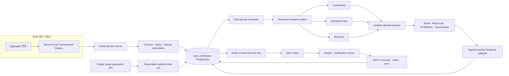

# DWP-R1-CORE-005 최종 아키텍처·UX 검토

> 상태: `foundation-pilot-implemented`; 내부 Hardening과 Production 출시 증거는 진행 중
>
> Production 출시: `D-NTF-01`부터 `D-NTF-09` 승인과 G4 증거 필요
>
> 검토일: 2026-08-21

## 검토 범위와 방법

이번 검토는 기존 문서의 표현을 다듬는 작업이 아니라 다음 관점에서 처음부터 다시 반증했다.

1. 분산 시스템: 이중 쓰기, 중복, 순서, Backpressure, 재처리, 예약·재시도
2. 인프라·SRE: HA, QoS, Noisy Neighbor, Region·Cell, DR, 관측성, 비용
3. 보안·개인정보: Tenant 격리, 최소 권한, 민감정보, Push·Connector Egress
4. 데이터: 원장 구분, Sync Cursor, 검색, 보존, Partition, 감사 증적
5. 제품 UX: 주의력 보호, Triage, 설정, 관리자·Provider 운영, Mobile
6. 접근성: 실시간 변화, Focus·Scroll, Virtualization, Zoom, Reduced Motion

검토 근거는 Apache Kafka, PostgreSQL, Redis, AWS SaaS Lens, WHATWG, IETF Web Push,
OpenTelemetry, W3C WAI-ARIA의 공식 기술 문서와 Apple, Microsoft Teams, GitHub, Slack의 공식
제품·디자인 지침이다. 외부 제품의 화면을 복제하지 않고 검증 가능한 원칙만 채택했다.

## 2026-08-21 완료성 재감사

| 영역                | 판정            | 실제 증거와 남은 경계                                                                                                                                                                         |
| ------------------- | --------------- | --------------------------------------------------------------------------------------------------------------------------------------------------------------------------------------------- |
| 메신저 첫 Producer  | 동작 확인       | 두 계정 메시지의 Outbox·Kafka·Materialize·수신 Inbox를 검증하고 생성자 주입·Lease Timestamp 결함 수정                                                                                         |
| 사용자 Inbox·Header | Foundation 완료 | Count, Glance, Center, Triage, 검색·필터, Thread 병합이 실제 데이터로 동작                                                                                                                    |
| 실시간 도착         | Pilot 보완      | 등록 선행·페이지 Catch-up·재연결 Cursor·409 Cross-tab Reset·변경 원인·v2 Leader 상태 공유·SSE/JDBC 분리를 구현하고 실제 Messenger→Chrome 무새로고침 도착을 확인. Browser 전체 Matrix는 미완료 |
| 개인 설정           | Foundation 완료 | Privacy, Banner, In-app Channel, Quiet Hours, App·Type Override 자동 저장. 409·DST·권한 회수 회귀는 미완료                                                                                    |
| Tenant 거버넌스     | Foundation 완료 | 계약·정책·템플릿·전달 운영·억제와 4-eyes 경계 구현. Simulation 동등성·제한 Replay는 미완료                                                                                                    |
| 외부 채널·Digest    | 비활성          | 설정·Capability 계약만 준비. Scheduler, Provider Adapter·Callback과 실제 전달은 구현 완료로 보지 않음                                                                                         |
| 조직·Role Audience  | 비활성          | People Target Population Snapshot Contract 이후 구현·활성화                                                                                                                                   |
| Production 운영     | 준비 전         | Fair QoS 분리 Worker, 전수 보안·부하·장애·DR·Browser·접근성 증거와 외부 결정 필요                                                                                                             |

## 재검증에서 발견한 개선점

| 심각도 | 기존 설계의 빈틈                                          | 최종 보완                                                                      |
| ------ | --------------------------------------------------------- | ------------------------------------------------------------------------------ |
| P0     | SSE 재연결의 “DB Cursor”가 실제 영속 상태와 연결 안 됨    | 사용자별 `change_version`, 보존 Watermark, `/sync`, Reset Contract 추가        |
| P0     | PostgreSQL Delivery Job과 Kafka Record의 상태 책임 모호   | Job이 유일한 원장, Kafka는 Versioned Dispatch Trigger로 제한                   |
| P0     | 전사 Bulk가 승인·보안 알림을 막을 수 있음                 | Critical·Interactive·Bulk QoS Lane, 독립 Worker와 Critical 예약 용량           |
| P0     | `tenant_id` Predicate만으로 격리 주장                     | Application Guard + `FORCE RLS` + DB Role 분리 + Pool Context Test             |
| P0     | RLS 강제 시 전 Tenant Fair Scheduler의 조회 권한이 모호   | Scheduling Metadata 전용 Role·RLS·Column 권한, Provider Redacted Role 분리     |
| P0     | Provider 수락 뒤 응답 유실을 성공·실패로 단정할 위험      | `UNKNOWN`, Provider Idempotency·상태 조회·Callback 전 맹목 재시도 금지         |
| P1     | Multi-region·Residency·DR 토폴로지 부재                   | Tenant Home Region·Cell, Regional HA, Warm Standby, Pool·Silo Profile          |
| P1     | Redis·SSE 장애 시 실제 저하 방식 불명확                   | Content-free Hint, Version Sync, 가시 탭 Polling Fallback, Ingress Drain       |
| P0     | 장기 SSE 요청이 Open EntityManager를 통해 DB Pool을 고갈  | Notification 서비스 Open-in-view 비활성화, Catch-up 후 JDBC Lease 반환 검증    |
| P1     | 구버전 Tab의 Web Lock이 새 실시간 규약을 차단할 수 있음   | Versioned `v2` Lock·Broadcast Namespace와 명시적 Leader/Follower 상태 공유     |
| P1     | 대량 Provider Retry가 장애를 증폭할 수 있음               | Tenant·Channel Token Bucket, `Retry-After`, Backoff·Jitter, Traffic Smoothing  |
| P1     | 검색·과거 표시의 Locale Snapshot이 데이터에 없음          | Immutable Template Version, Safe Rendered Snapshot, 한·영 Trigram Search       |
| P1     | 공개 People 검색 API를 조직 수신자 결정에 재사용할 위험   | 내부 Target Population Snapshot Contract를 EAGER Audience 선행조건으로 고정    |
| P1     | Email 발신 인증·반송·수신거부 Feedback 계약 부재          | SPF·DKIM·DMARC, 서명 Callback, Suppression, 선택형 One-click Unsubscribe 추가  |
| P1     | Badge 숫자와 실제 미확인 총량이 다르면 발견 가능성이 저하 | 시각 Badge는 전체 Unread, 접근성 Label에서 조치 필요 수와 분리 설명            |
| P1     | 실시간 항목별 Live Region이 Screen Reader를 방해할 위험   | Burst 집계 `role=status`, 극소수 Critical만 `role=alert`, Focus·Scroll 보존    |
| P1     | 공유 Thread의 최신 본문이 다른 수신자의 Inbox를 바꿀 위험 | 본문·행동·발신자·횟수를 사용자 Projection Snapshot으로 격리                    |
| P1     | 인증 Producer가 다른 App 계약이나 Mandatory 사유를 오용   | Producer→Owner App Binding과 Published Policy만 Mandatory로 인정               |
| P1     | Lease가 만료된 Outbox Worker가 최신 상태를 덮어쓸 위험    | Worker ID·고유 Lease Token·유효 시간으로 완료·실패 결과 Fencing                |
| P2     | 관리자 화면이 발송량 증가를 성공으로 오해할 수 있음       | 중복률·Mute·Unsubscribe·Noise·Action 완료를 Guardrail KPI로 고정               |
| P2     | 초기 우선순위가 불투명 Ranking으로 발전할 위험            | 등록된 결정표와 표시 가능한 이유만 허용, 민감정보 Profiling·숨은 AI Score 금지 |

## 최종 아키텍처

### 변하지 않는 원장 구분

| 사실·상태                    | 유일한 원장                         |
| ---------------------------- | ----------------------------------- |
| 원업무 사실                  | 각 Domain Service DB                |
| 서비스 간 업무 Event         | Service Outbox + Kafka Retained Log |
| 알림 정책·Inbox·Triage       | `dwp_notification` PostgreSQL       |
| 예약·Retry·Delivery Terminal | `ntf_delivery_jobs`·attempts        |
| 실시간 연결                  | SSE Node + Redis TTL Registry       |
| Redis·SSE Hint               | 원장 아님                           |
| 외부 Provider Receipt        | Delivery Attempt의 Redacted 증적    |

## 현재 저장소 적합성 재검증

- 로컬 Baseline은 PostgreSQL 18.4, Redis 7.4, Kafka 4.3.1과
  `dwp.domain-events.v1`·Transactional Outbox/Inbox를 이미 제공하므로 새 Broker를 도입하지 않는다.
- `settings.gradle`과 Gateway에는 독립 Notification Module·Route가 등록되어 있고 Header Bell은
  실제 Summary·Inbox API를 사용한다.
- People Directory는 Signed Keyset Cursor와 `asOf` 조회를 제공하지만, 대규모 조직·Role 수신자
  결정에 필요한 불변 Snapshot·Cardinality·Service Principal 계약은 아직 없다.
- Direct Recipient 기반 Foundation Pilot은 구현 완료했으며, 조직·Role Fan-out은 People Target
  Population Contract가 구현·검증된 뒤 Feature Flag로 연다.
- 표준 Domain Event Consumer가 `notificationIntents[]`를 검증하고 등록 Producer만 허용한다.
  메신저는 Transactional Outbox로 1:1·명시적 그룹 전체 구독·멘션·답글을 연결했으며, 민감 대화
  Preview는 Source Outbox 전에 일반 문구로 치환한다.
- Tenant Policy Studio는 Effective Source, 영향도·최근 수신자 Preview, 불변 Draft, 작성자와
  승인자 분리 Publish를 제공한다. Policy Runtime은 `Type > App > Tenant > Provider`와 최신 Version을
  동일하게 적용한다.
- Email 외부 연결은 Auth Verified Contact Resolver와 Provider Callback Ingress가 준비된 뒤
  활성화한다. 주소 원문을 Notification Job에 복제하지 않는다.

## 최종 인프라 Profile

### Local

- 현재 Docker Compose의 단일 PostgreSQL·Redis·Kafka를 개발·Contract Test에만 사용한다.
- Kafka Profile이 꺼져 있으면 Event Consumer는 비활성화 상태를 명확히 보고한다.
- 외부 Provider는 Sandbox Stub으로 대체하며 실제 발송 성공으로 표시하지 않는다.

### Production Regional Cell

- API/SSE, Materializer/Fan-out, Scheduler, QoS·Channel Worker를 독립 Deployment로 확장한다.
- Kafka는 3 Broker 이상, RF 3, Min ISR 2, TLS·인증·ACL·Client Quota를 사용한다.
- PostgreSQL은 Multi-AZ HA, PITR, 분리 DB Role, `FORCE RLS`를 사용한다.
- Redis는 HA이지만 비영속 Hint만 저장하므로 장애 시 데이터가 아닌 실시간성만 저하된다.
- Ingress는 SSE Buffering·Cache·Compression을 끄고 Heartbeat, Read Timeout, Connection Drain을
  검증한다.
- Tenant Home Region·Cell 밖에서 Payload를 처리하지 않는다. 정상 경로에 Cross-region 동기
  의존성을 두지 않는다.
- 규제 Tenant는 동일 Control Plane 아래 Notification Data Plane만 Silo로 배치할 수 있다.

## 최종 사용자 경험

### Header Glance

- Bell Badge는 전체 새 알림 수를 표시하고, Accessible Label과 Popover에서 그중 `조치 필요 미확인`을
  별도로 구분한다.
- `우선`, `전체` 두 View와 최대 6개 항목만 제공한다.
- 새 항목이 와도 열린 목록을 밀지 않고 `새 알림 N개` Control을 보여준다.
- Toast는 승인된 Urgent·High만 사용하고 같은 업무 화면을 보고 있으면 생략한다.
- 저장 완료 Hint만 SSE·BroadcastChannel로 전달하고, Toast 내용은 권한 검증된 Detail API로 다시
  조회한다. 최대 5건 Queue와 Reduce Motion을 적용하며 현재 열린 메신저 대화는 조용히 갱신한다.

### 알림 센터

- `우선 / 전체 / 멘션 / 저장됨 / 나중에 / 완료`의 Triage 구조를 사용한다.
- 기본 화면은 카드 Dashboard가 아니라 연속 목록, Preview, 간결한 Attention Summary다.
- Thread Coalescing, Read·Saved·Done·Snooze의 독립 상태, Bulk Action, 수신 이유를 제공한다.
- `우선`은 기한·조치·긴급·직접 멘션의 결정표만 사용하며 이유를 표시한다.
- 사용자에게 “많이 읽기”를 유도하지 않고 중요한 일을 놓치지 않고 끝내는 경험을 최적화한다.

### 설정·운영

- 사용자 설정은 Global → App → Type → Channel 예외로 구현했다. Quiet Hours, Digest, Device와
  외부 채널은 실제 Provider Capability가 열리기 전까지 읽기 전용 안내로 표시한다.
- Tenant 정책 작성자, Template Editor, 독립 Policy Approver, Notification Operator와 Auditor를
  분리한다. Tenant Admin이 모든 권한을 자동 상속하거나 작성자가 자기 Draft를 Publish할 수 없다.
- Provider는 Region·Cell·Tenant Metadata, QoS, Quota, Provider 장애만 보고 본문은 기본 차단한다.
- Mandatory·Urgent·Broadcast·Replay는 Preview, 영향 범위, 4-eyes 승인과 감사 증적을 요구한다.

## 구현 및 출시 판정

| 항목                       | 판정            | 비고                                                                                       |
| -------------------------- | --------------- | ------------------------------------------------------------------------------------------ |
| 제품 범위·Persona·IA       | 구현 완료       | 사용자·계정 설정·Tenant 운영 Route와 Sidebar 분리                                          |
| 서비스·인프라 경계         | Pilot 구현      | Kafka·PostgreSQL·Redis·SSE Hybrid와 저하 모드                                              |
| 데이터·Sync·보존 Interface | Foundation 완료 | V1-V18, 수신자 Snapshot·Legacy Redaction, 영속 Version, RLS·Runtime Role, 외부 보존은 Gate |
| API·권한·Tenant 격리       | Foundation 완료 | Producer 소유 App Binding, Intent 검증, 정책 4-eyes, Tenant/User Scope                     |
| Desktop·Mobile UX          | Pilot 증거      | Chrome Desktop·390x844 반응형 확인, 전체 Browser·접근성 Matrix는 Gate                      |
| Provider 실제 연결         | 비활성          | Provider·Credential·Callback·운영 검증 후 Capability 활성화                                |
| 조직·Role Audience         | 비활성          | People Target Population Snapshot Contract 이후 활성화                                     |
| Production 출시            | 준비 전         | G4 Load·Failure·Security·Visual 증거와 D-NTF 승인 필요                                     |

따라서 **Direct Recipient 기반 In-app Foundation, 메신저 첫 Producer 통합, 사용자 설정과 Tenant
정책 통제는 파일럿 범위에서 동작**한다. 이것은 내부 잔여가 없거나 Production 준비가 끝났다는
의미가 아니다. 먼저 상태 조합·Counter Reconciliation·재시작 Catch-up·409/DST·권한 회수·Policy
Simulation·Replay·격리·전체 Browser·접근성 회귀를 닫고, 이후 People Audience Contract와 외부
Channel을 Gate 순서로 연다. 실제 연결 전에는 UI·API Capability를 열지 않는다. Provider Global
Package·Fleet 제어는 Tenant 화면에 섞지 않고 별도 Control Plane 계약이 준비될 때까지 출시 Gate로
유지한다.

## 구현 중 변경 통제

- ADR의 원장 구분, QoS, Tenant 격리, Sync Version을 바꾸는 변경은 새 ADR 승인이 필요하다.
- Table·Topic·서비스를 편의상 추가하지 않고 각 Query·불변조건·Retention Owner를 증명한다.
- UI는 Figma·Storybook·Playwright Screenshot과 접근성 결과가 명세와 일치해야 완료다.
- Capacity 수치가 임계치를 넘을 때만 `LAZY_BROADCAST`, 추가 Partition, Reactive SSE 분리를
  활성화한다. 추측으로 복잡성을 선행 도입하지 않는다.

## 공식 검토 근거

- [Apache Kafka Design](https://kafka.apache.org/43/design/design/)
- [Kafka Multi-tenancy](https://kafka.apache.org/43/operations/multi-tenancy/)
- [AWS Transactional Outbox](https://docs.aws.amazon.com/prescriptive-guidance/latest/cloud-design-patterns/transactional-outbox.html)
- [AWS SaaS Lens](https://docs.aws.amazon.com/wellarchitected/latest/saas-lens/general-design-principles.html)
- [PostgreSQL Row Security](https://www.postgresql.org/docs/18/ddl-rowsecurity.html)
- [Redis Pub/Sub Delivery Semantics](https://redis.io/docs/latest/develop/pubsub/)
- [WHATWG Server-Sent Events](https://html.spec.whatwg.org/multipage/server-sent-events.html)
- [NGINX Proxy Module](https://nginx.org/en/docs/http/ngx_http_proxy_module.html)
- [RFC 8030 Web Push](https://www.rfc-editor.org/rfc/rfc8030.html)
- [RFC 8291 Web Push Encryption](https://www.rfc-editor.org/info/rfc8291/)
- [RFC 6376 DKIM](https://www.rfc-editor.org/rfc/rfc6376.html)
- [RFC 7208 SPF](https://www.rfc-editor.org/rfc/rfc7208.html)
- [RFC 7489 DMARC](https://www.rfc-editor.org/rfc/rfc7489.html)
- [RFC 8058 One-click Unsubscribe](https://www.rfc-editor.org/rfc/rfc8058.html)
- [OpenTelemetry Messaging Conventions](https://opentelemetry.io/docs/specs/semconv/messaging/messaging-spans/)
- [Firebase FCM Scale Guidance](https://firebase.google.com/docs/cloud-messaging/scale-fcm)
- [Microsoft Teams Activity Best Practices](https://learn.microsoft.com/en-us/graph/teams-activity-feed-notifications-best-practices)
- [GitHub Inbox Filters](https://docs.github.com/en/subscriptions-and-notifications/reference/inbox-filters)
- [Slack Notification Preferences](https://slack.com/help/articles/201355156-Configure-your-Slack-notifications)
- [Apple Notification HIG](https://developer.apple.com/design/human-interface-guidelines/notifications/)
- [WAI-ARIA Status Messages](https://www.w3.org/WAI/WCAG21/Techniques/aria/ARIA19)
