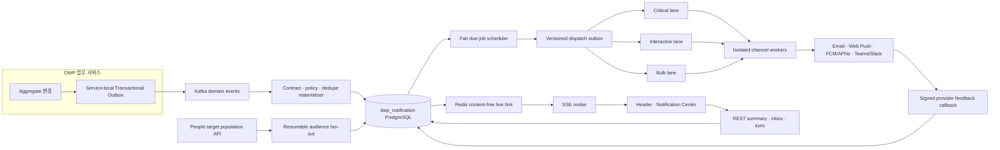

# DWP-R1-CORE-005 최종 아키텍처·UX 검토

> 상태: `build-ready`; Final Candidate Review 완료, 내부 구현 착수 가능
>
> Production 출시: `D-NTF-01`부터 `D-NTF-09` 승인과 G4 증거 필요
>
> 검토일: 2026-08-19

## 검토 범위와 방법

이번 검토는 기존 문서의 표현을 다듬는 작업이 아니라 다음 관점에서 처음부터 다시 반증했다.

1. 분산 시스템: 이중 쓰기, 중복, 순서, Backpressure, 재처리, 예약·재시도
2. 인프라·SRE: HA, QoS, Noisy Neighbor, Region·Cell, DR, 관측성, 비용
3. 보안·개인정보: Tenant 격리, 최소 권한, 민감정보, Push·Connector Egress
4. 데이터: 원장 구분, Sync Cursor, 검색, 보존, Partition, 감사 증적
5. 제품 UX: 주의력 보호, Triage, 설정, 관리자·Provider 운영, Mobile
6. 접근성: 실시간 변화, Focus·Scroll, Virtualization, Zoom, Reduced Motion

검토 근거는 Apache Kafka, PostgreSQL, Redis, AWS SaaS Lens, WHATWG, IETF Web Push,
OpenTelemetry, W3C WAI-ARIA의 공식 기술 문서와 Apple, Microsoft Teams, GitHub, Slack의 공식
제품·디자인 지침이다. 외부 제품의 화면을 복제하지 않고 검증 가능한 원칙만 채택했다.

## 재검증에서 발견한 개선점

| 심각도 | 기존 설계의 빈틈                                        | 최종 보완                                                                      |
| ------ | ------------------------------------------------------- | ------------------------------------------------------------------------------ |
| P0     | SSE 재연결의 “DB Cursor”가 실제 영속 상태와 연결 안 됨  | 사용자별 `change_version`, 보존 Watermark, `/sync`, Reset Contract 추가        |
| P0     | PostgreSQL Delivery Job과 Kafka Record의 상태 책임 모호 | Job이 유일한 원장, Kafka는 Versioned Dispatch Trigger로 제한                   |
| P0     | 전사 Bulk가 승인·보안 알림을 막을 수 있음               | Critical·Interactive·Bulk QoS Lane, 독립 Worker와 Critical 예약 용량           |
| P0     | `tenant_id` Predicate만으로 격리 주장                   | Application Guard + `FORCE RLS` + DB Role 분리 + Pool Context Test             |
| P0     | RLS 강제 시 전 Tenant Fair Scheduler의 조회 권한이 모호 | Scheduling Metadata 전용 Role·RLS·Column 권한, Provider Redacted Role 분리     |
| P0     | Provider 수락 뒤 응답 유실을 성공·실패로 단정할 위험    | `UNKNOWN`, Provider Idempotency·상태 조회·Callback 전 맹목 재시도 금지         |
| P1     | Multi-region·Residency·DR 토폴로지 부재                 | Tenant Home Region·Cell, Regional HA, Warm Standby, Pool·Silo Profile          |
| P1     | Redis·SSE 장애 시 실제 저하 방식 불명확                 | Content-free Hint, Version Sync, 가시 탭 Polling Fallback, Ingress Drain       |
| P1     | 대량 Provider Retry가 장애를 증폭할 수 있음             | Tenant·Channel Token Bucket, `Retry-After`, Backoff·Jitter, Traffic Smoothing  |
| P1     | 검색·과거 표시의 Locale Snapshot이 데이터에 없음        | Immutable Template Version, Safe Rendered Snapshot, 한·영 Trigram Search       |
| P1     | 공개 People 검색 API를 조직 수신자 결정에 재사용할 위험 | 내부 Target Population Snapshot Contract를 EAGER Audience 선행조건으로 고정    |
| P1     | Email 발신 인증·반송·수신거부 Feedback 계약 부재        | SPF·DKIM·DMARC, 서명 Callback, Suppression, 선택형 One-click Unsubscribe 추가  |
| P1     | Badge 숫자가 전체 Unread로 오해될 수 있음               | 시각 Badge는 Actionable Unread, 접근성 Label에서 전체 새 알림과 분리 설명      |
| P1     | 실시간 항목별 Live Region이 Screen Reader를 방해할 위험 | Burst 집계 `role=status`, 극소수 Critical만 `role=alert`, Focus·Scroll 보존    |
| P2     | 관리자 화면이 발송량 증가를 성공으로 오해할 수 있음     | 중복률·Mute·Unsubscribe·Noise·Action 완료를 Guardrail KPI로 고정               |
| P2     | 초기 우선순위가 불투명 Ranking으로 발전할 위험          | 등록된 결정표와 표시 가능한 이유만 허용, 민감정보 Profiling·숨은 AI Score 금지 |

## 최종 아키텍처

### 변하지 않는 원장 구분

| 사실·상태                    | 유일한 원장                         |
| ---------------------------- | ----------------------------------- |
| 원업무 사실                  | 각 Domain Service DB                |
| 서비스 간 업무 Event         | Service Outbox + Kafka Retained Log |
| 알림 정책·Inbox·Triage       | `dwp_notification` PostgreSQL       |
| 예약·Retry·Delivery Terminal | `ntf_delivery_jobs`·attempts        |
| 실시간 연결                  | SSE Node + Redis TTL Registry       |
| Redis·SSE Hint               | 원장 아님                           |
| 외부 Provider Receipt        | Delivery Attempt의 Redacted 증적    |

## 현재 저장소 적합성 재검증

- 로컬 Baseline은 PostgreSQL 18.4, Redis 7.4, Kafka 4.3.1과
  `dwp.domain-events.v1`·Transactional Outbox/Inbox를 이미 제공하므로 새 Broker를 도입하지 않는다.
- `settings.gradle`에는 Notification Module이 없고 Header Bell은 정적 Prototype이므로 구현 완료로
  오인하지 않는다.
- People Directory는 Signed Keyset Cursor와 `asOf` 조회를 제공하지만, 대규모 조직·Role 수신자
  결정에 필요한 불변 Snapshot·Cardinality·Service Principal 계약은 아직 없다.
- 따라서 Direct Recipient 기반 Foundation Pilot은 즉시 착수 가능하고, 조직·Role Fan-out은 People
  Target Population Contract가 구현·검증된 뒤 Feature Flag로 연다.
- Email 외부 연결은 Auth Verified Contact Resolver와 Provider Callback Ingress가 준비된 뒤
  활성화한다. 주소 원문을 Notification Job에 복제하지 않는다.

## 최종 인프라 Profile

### Local

- 현재 Docker Compose의 단일 PostgreSQL·Redis·Kafka를 개발·Contract Test에만 사용한다.
- Kafka Profile이 꺼져 있으면 Event Consumer는 비활성화 상태를 명확히 보고한다.
- 외부 Provider는 Sandbox Stub으로 대체하며 실제 발송 성공으로 표시하지 않는다.

### Production Regional Cell

- API/SSE, Materializer/Fan-out, Scheduler, QoS·Channel Worker를 독립 Deployment로 확장한다.
- Kafka는 3 Broker 이상, RF 3, Min ISR 2, TLS·인증·ACL·Client Quota를 사용한다.
- PostgreSQL은 Multi-AZ HA, PITR, 분리 DB Role, `FORCE RLS`를 사용한다.
- Redis는 HA이지만 비영속 Hint만 저장하므로 장애 시 데이터가 아닌 실시간성만 저하된다.
- Ingress는 SSE Buffering·Cache·Compression을 끄고 Heartbeat, Read Timeout, Connection Drain을
  검증한다.
- Tenant Home Region·Cell 밖에서 Payload를 처리하지 않는다. 정상 경로에 Cross-region 동기
  의존성을 두지 않는다.
- 규제 Tenant는 동일 Control Plane 아래 Notification Data Plane만 Silo로 배치할 수 있다.

## 최종 사용자 경험

### Header Glance

- Bell Badge는 `조치 필요 미확인`만 표시하고 전체 새 알림 수는 Accessible Label과 Popover에서
  구분한다.
- `우선`, `전체` 두 View와 최대 6개 항목만 제공한다.
- 새 항목이 와도 열린 목록을 밀지 않고 `새 알림 N개` Control을 보여준다.
- Toast는 승인된 Urgent·High만 사용하고 같은 업무 화면을 보고 있으면 생략한다.

### 알림 센터

- `우선 / 전체 / 멘션 / 저장됨 / 나중에 / 완료`의 Triage 구조를 사용한다.
- 기본 화면은 카드 Dashboard가 아니라 연속 목록, Preview, 간결한 Attention Summary다.
- Thread Coalescing, Read·Saved·Done·Snooze의 독립 상태, Bulk Action, 수신 이유를 제공한다.
- `우선`은 기한·조치·긴급·직접 멘션의 결정표만 사용하며 이유를 표시한다.
- 사용자에게 “많이 읽기”를 유도하지 않고 중요한 일을 놓치지 않고 끝내는 경험을 최적화한다.

### 설정·운영

- 사용자 설정은 Global → App → Type → Channel 예외, Quiet Hours, Digest, Device로 구성한다.
- Tenant Admin은 Contract, Policy, Template, Delivery, Audit을 위임 Role로 운영한다.
- Provider는 Region·Cell·Tenant Metadata, QoS, Quota, Provider 장애만 보고 본문은 기본 차단한다.
- Mandatory·Urgent·Broadcast·Replay는 Preview, 영향 범위, 4-eyes 승인과 감사 증적을 요구한다.

## 구현 착수 판정

| 항목                       | 판정      | 비고                                                        |
| -------------------------- | --------- | ----------------------------------------------------------- |
| 제품 범위·Persona·IA       | 준비 완료 | 사용자·Tenant Admin·Provider·Contract Owner 분리            |
| 서비스·인프라 경계         | 준비 완료 | Hybrid, Regional Cell, QoS, Degraded Mode 확정              |
| 데이터·Sync·보존 Interface | 준비 완료 | Scheduler Role·UNKNOWN·Callback 포함, 보존 수치는 외부 Gate |
| API·권한·Tenant 격리       | 준비 완료 | RLS·Idempotency·Sync Reset·Support Session 포함             |
| Desktop·Mobile UX 명세     | 준비 완료 | Prototype·Screenshot·접근성 증거는 Build 단계 산출물        |
| Provider 실제 연결         | 보류 가능 | Provider·Credential 결정 전 Adapter SPI·Stub까지만 구현     |
| 조직·Role Audience         | 조건부    | People Target Population Snapshot Contract 완료 후 활성화   |
| Production 출시            | 준비 전   | G4 Load·Failure·Security·Visual 증거와 D-NTF 승인 필요      |

따라서 **Direct Recipient 기반 Foundation 구현을 시작할 준비는 완료**되었다. 다만 문서 완료를
제품 완료로 표시하지 않으며, 구현 순서는 Service·DB Role/RLS → Contract Consumer →
Inbox·Version Sync → SSE → Header·알림 센터 → Preference·Governance → QoS Delivery →
People Audience Contract → 외부 Channel 순서를 고정한다.

## 구현 중 변경 통제

- ADR의 원장 구분, QoS, Tenant 격리, Sync Version을 바꾸는 변경은 새 ADR 승인이 필요하다.
- Table·Topic·서비스를 편의상 추가하지 않고 각 Query·불변조건·Retention Owner를 증명한다.
- UI는 Figma·Storybook·Playwright Screenshot과 접근성 결과가 명세와 일치해야 완료다.
- Capacity 수치가 임계치를 넘을 때만 `LAZY_BROADCAST`, 추가 Partition, Reactive SSE 분리를
  활성화한다. 추측으로 복잡성을 선행 도입하지 않는다.

## 공식 검토 근거

- [Apache Kafka Design](https://kafka.apache.org/43/design/design/)
- [Kafka Multi-tenancy](https://kafka.apache.org/43/operations/multi-tenancy/)
- [AWS Transactional Outbox](https://docs.aws.amazon.com/prescriptive-guidance/latest/cloud-design-patterns/transactional-outbox.html)
- [AWS SaaS Lens](https://docs.aws.amazon.com/wellarchitected/latest/saas-lens/general-design-principles.html)
- [PostgreSQL Row Security](https://www.postgresql.org/docs/18/ddl-rowsecurity.html)
- [Redis Pub/Sub Delivery Semantics](https://redis.io/docs/latest/develop/pubsub/)
- [WHATWG Server-Sent Events](https://html.spec.whatwg.org/multipage/server-sent-events.html)
- [NGINX Proxy Module](https://nginx.org/en/docs/http/ngx_http_proxy_module.html)
- [RFC 8030 Web Push](https://www.rfc-editor.org/rfc/rfc8030.html)
- [RFC 8291 Web Push Encryption](https://www.rfc-editor.org/info/rfc8291/)
- [RFC 6376 DKIM](https://www.rfc-editor.org/rfc/rfc6376.html)
- [RFC 7208 SPF](https://www.rfc-editor.org/rfc/rfc7208.html)
- [RFC 7489 DMARC](https://www.rfc-editor.org/rfc/rfc7489.html)
- [RFC 8058 One-click Unsubscribe](https://www.rfc-editor.org/rfc/rfc8058.html)
- [OpenTelemetry Messaging Conventions](https://opentelemetry.io/docs/specs/semconv/messaging/messaging-spans/)
- [Firebase FCM Scale Guidance](https://firebase.google.com/docs/cloud-messaging/scale-fcm)
- [Microsoft Teams Activity Best Practices](https://learn.microsoft.com/en-us/graph/teams-activity-feed-notifications-best-practices)
- [GitHub Inbox Filters](https://docs.github.com/en/subscriptions-and-notifications/reference/inbox-filters)
- [Slack Notification Preferences](https://slack.com/help/articles/201355156-Configure-your-Slack-notifications)
- [Apple Notification HIG](https://developer.apple.com/design/human-interface-guidelines/notifications/)
- [WAI-ARIA Status Messages](https://www.w3.org/WAI/WCAG21/Techniques/aria/ARIA19)
