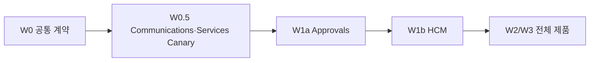
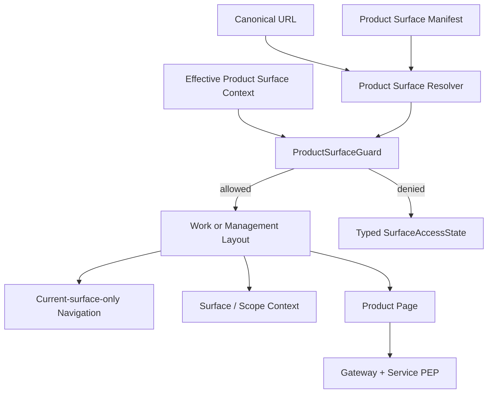

# DWP-R1-CORE-006 Pilot 구현 설계

## 1. 목적

이 문서는 Common Contract, Technical Canary, Approvals와 HCM을 순서대로 구현·승격하도록 변경
단위와 검증 증거를 고정하는 living blueprint다. 2026-08-25 승인된 기술 작업 범위에 따라
W0~W3 소스·계약·Fail-closed Rollout 준비를 DRAFT/default-off로 구현했다. 이 기술 작업 승인은
Product·Security·Privacy Owner의 운영 활성화 승인을 대신하지 않으며, 그 전에는 활성 Bundle
Pointer나 Production Flag를 변경하지 않는다.



Approvals와 HCM은 공식 대표 Pilot이며 운영 승격과 관찰은 반드시 Approvals → HCM 순서를
지킨다. HCM은 공통 Shell 문제 외에 Reporting Relation, HR Field Mask, Support Scope와
Granular Capability 문제를 포함한다. 기술 코드는 검증을 위해 준비되어도 두 Pilot을 동시에
Production 활성화하지 않는다.

## 2. Target Runtime



Surface Resolver는 URL, Manifest와 Router Definition에서 생성한 Registered Route Catalog만
사용한다. Guard는 서버 Context와 Direct Route Decision을 사용한다. Layout은 권한을 만들지 않고
Page/API는 Every-request 인가를 다시 수행한다.

## 3. W0 공통 구현 Backlog

### `PS-W0-01` Product Manifest v2

변경 후보:

- `apps/dwp/src/components/product-manifest.ts`
- `apps/dwp/src/components/product-manifest.test.ts`
- `apps/dwp/src/features/work/work-navigation.ts`
- `apps/dwp/src/features/activity/activity-navigation.ts`
- `apps/dwp/src/features/dwaion/dwaion-navigation.ts`
- `apps/dwp/src/features/communications/communications-navigation.ts`
- `apps/dwp/src/features/services/services-navigation.ts`
- `apps/dwp/src/features/notifications/notification-navigation.ts`
- `apps/dwp/src/features/calendar/calendar-navigation.ts`
- `apps/dwp/src/features/rooms/rooms-navigation.ts`
- `apps/dwp/src/features/mail/mail-navigation.ts`
- `apps/dwp/src/features/messaging/messaging-navigation.ts`
- `apps/dwp/src/features/approvals/approval-navigation.ts`
- `apps/dwp/src/features/spaces/space-navigation.ts`
- `apps/dwp/src/features/hcm/hcm-navigation.ts`
- `apps/dwp/src/features/admin/admin-navigation.ts`
- `apps/dwp/src/features/provider/provider-navigation.ts`
- `apps/dwp/src/features/account/settings-navigation.ts`
- `apps/dwp/src/features/approvals/approval-navigation.test.ts`
- `apps/dwp/src/features/hcm/hcm-navigation.test.ts`
- `apps/dwp/src/features/dwaion/dwaion-navigation.test.ts`
- `apps/dwp/src/routes/product-menu-manifest.ts`
- `apps/dwp/src/routes/product-menu-manifest.test.ts`
- 신규 `apps/dwp/src/routes/product-route-contract-source.ts`: Router가 소유하는 PAGE ID·Pattern·
  Product·Surface와 Legacy Source만 선언
- 신규 `tools/generate-product-route-contracts.mjs`에서 `product-route-catalog`·
  `product-route-key-projection`·`product-legacy-redirect-registry`만 생성
- 신규 Backend Canonical Bundle에서 동기화하는
  `apps/dwp/src/routes/product-route-authorization-contracts.generated.ts`; Router Source가 Access
  Profile·Capability·Predicate·API Binding을 생성하지 않음
- 신규 `apps/dwp/src/routes/product-route-contracts.generated.test.ts`와 Cross-repository CI

완료 계약:

- `surfaces`, `plane`, `taskKinds`, Segment-safe `routeMatchers`, `indexPath`, `navigation`, Typed
  `supportedScopeKinds`와 Discriminated `entryAccess` 추가
- Capability Entry는 `entryCapabilityMode: ANY|ALL`, Non-empty `requiredCapabilityContractKeys`,
  `requiresProductEntitlement`를 필수화하고 Policy Entry는 `accessPolicyKey` 사용
- 모든 Navigation Item은 하나의 Access Union Member를 사용한다. 단일 Exact Capability, 또는
  `type: capability-expression` + `mode: ANY|ALL` + Non-empty `capabilityContractKeys`, 또는 Policy
  Key 중 하나다.
- 기존 `adminMode`는 Ownership 호환값으로 읽되 Surface가 우선
- 169 Menu Golden Count와 `navigationContextId`, 업무 앱 121개의 단일 Product Surface,
  Route/Navigation 존재와 중복 정적 검사
- 나머지 비제품 48개는 `productSurfaceId` 필드가 없어야 하며 Product Surface Projection 시 Build Fail
- Legacy Redirect Definition은 Source Matcher, Static/Path-map/Registered-suffix Target,
  Query·Hash 보존, `maxHops=1`, Unknown Target 404를 명시
- Notifications는 논리 Product로 고정하고 물리 `platformFeature` 배포에는 명시적 Adapter

### `PS-W0-02` Pure Surface Resolver

신규 후보:

- `apps/dwp/src/features/shell/product-surface-resolver.ts`
- `apps/dwp/src/features/shell/product-surface-resolver.test.ts`
- `apps/dwp/src/features/shell/product-root-resolver.ts`
- `apps/dwp/src/features/shell/product-root-resolver.test.ts`
- Router Definition에서 생성하는 `apps/dwp/src/routes/product-route-catalog.generated.ts`
- Backend Canonical Bundle JSON에서 `scripts/sync-product-authorization-contract.mjs`가 생성하는
  `apps/dwp/src/routes/product-route-authorization-contracts.generated.ts`
- Router Definition에서 생성하는 `apps/dwp/src/routes/product-legacy-redirect-registry.generated.ts`
- 생성 Artifact의 Stale·Cycle·Unknown Target을 막는 Build Script·CI Test

API 의미:

```ts
resolveProductSurface(pathname, manifests, registeredProductRouteCatalog):
  | { type: 'product-entry'; productId: string }
  | { type: 'known-route'; productId: string; surfaceId: string }
  | { type: 'unknown-surface-path'; productId: string; surfaceId: string }
  | { type: 'unknown-product-path'; productId: string }
  | { type: 'outside-product' };
```

Query와 Local State를 입력으로 받지 않는다. Normalize 후 Exact 또는
`pathname === prefix || pathname.startsWith(prefix + '/')`인 Segment Boundary에서 Longest
Match한다. 정확한 `ProductManifest.basePath`는 Matcher보다 먼저 중립 `product-entry`로
반환해 Product Root Resolver가 서버 Context를 평가한다. `routeMatchers`는 Surface 소유 경계를,
Router Definition에서 생성한 Catalog는 실제 Page 존재를 판정한다. Backend Bundle에서 동기화한
Authorization Contract와 Router Catalog는 CI에서 양방향 대조하고 둘 중 어느 쪽에도 수기 복제본을
허용하지 않는다. Surface Index(`/hr/manage` 포함), Trailing Slash, Legacy Alias, Dynamic Child와
Surface-local 404를 Test로 고정한다.

Generated Catalog Record는 다음 결속을 가진다.

```ts
type RegisteredProductRouteBase = {
  productId: string;
  surfaceId: string;
  routeContractKey: string;
};

type RegisteredProductRoute = RegisteredProductRouteBase &
  (
    | { routeKind: 'PAGE'; routeId: string; pattern: string }
    | { routeKind: 'DATA' | 'ACTION'; routeId?: never; pattern?: never }
  );
```

Surface 소유 Matcher로 `surfaceId`를 먼저 확정한 뒤 같은
`productId + surfaceId`이면서 `routeKind=PAGE`인 Catalog Pattern만 URL Resolver에서 대조한다.
`DATA/ACTION` Record는 Direct API Method 계약에서만 평가하며 Browser Path의 `known-route`를 만들 수
없다. 따라서
`/communications/admin/foo`를 Work의 Dynamic `:view/:storyId`로 재해석할 수 없다. Catalog의
Route Key는 Backend Route Authorization Registry와 동일하고, Unknown·Retired·Cross-surface·
Method Mismatch를 CI·Direct Evaluation에서 거부한다.

`DATA/ACTION`-only Pattern으로 Browser URL을 판정하면 Generator Test를 실패시키고
`unknown-surface-path`를 반환한다.

### `PS-W0-03` Effective Product Surface Context Client

변경 후보:

- 신규 `dwp-backend/dwp-auth-server/src/main/java/com/dwp/services/auth/dto/ProductSurfaceAuthorityDtos.java`
- 신규 `dwp-backend/dwp-auth-server/src/main/java/com/dwp/services/auth/service/ProductSurfaceAuthorityService.java`
- 신규 Internal-only `dwp-backend/dwp-auth-server/src/main/java/com/dwp/services/auth/controller/ProductSurfaceAuthorityController.java`
- 신규 `dwp-backend/dwp-auth-server/src/main/java/com/dwp/services/auth/dto/GovernedRouteAuthorityDtos.java`
- 신규 `dwp-backend/dwp-auth-server/src/main/java/com/dwp/services/auth/service/GovernedRouteAuthorityService.java`
- 신규 Internal-only `dwp-backend/dwp-auth-server/src/main/java/com/dwp/services/auth/controller/GovernedRouteAuthorityController.java`
- `dwp-backend/dwp-auth-server/src/main/java/com/dwp/services/auth/service/AuthService.java`
- `dwp-backend/dwp-auth-server/src/main/java/com/dwp/services/auth/service/AppGovernanceService.java`
- `dwp-backend/dwp-gateway/src/main/java/com/dwp/gateway/security/AuthSessionVerifier.java`의
  Scope-aware Trusted Context
- 신규 `dwp-backend/dwp-gateway/src/main/java/com/dwp/gateway/security/ProductSurfaceContextAggregationService.java`
- 신규 `dwp-backend/dwp-gateway/src/main/java/com/dwp/gateway/productsurface/ProductSurfaceContextHandler.java`
- 신규 `dwp-backend/dwp-gateway/src/main/java/com/dwp/gateway/productsurface/ProductSurfaceContextRouterConfiguration.java`
- 신규 `dwp-backend/dwp-gateway/src/main/java/com/dwp/gateway/productsurface/ProductSurfaceContextDtos.java`
- 신규 Gateway Internal Client
  `dwp-backend/dwp-gateway/src/main/java/com/dwp/gateway/productsurface/ProductSurfaceAuthorityClient.java`,
  `dwp-backend/dwp-gateway/src/main/java/com/dwp/gateway/productsurface/ProductSurfaceEligibilityClient.java`,
  `dwp-backend/dwp-gateway/src/main/java/com/dwp/gateway/productsurface/GovernedRouteAuthorityClient.java`
- 신규 `dwp-backend/dwp-gateway/src/main/java/com/dwp/gateway/productsurface/GovernedRouteAccessEvaluationService.java`
- 기존 `dwp-backend/dwp-gateway/src/main/java/com/dwp/gateway/security/ProviderSupportSessionVerifier.java`,
  `dwp-backend/dwp-gateway/src/main/java/com/dwp/gateway/security/SupportSessionVerifier.java`,
  `dwp-backend/dwp-gateway/src/main/java/com/dwp/gateway/security/VerifiedSupportAccess.java`와
  `dwp-backend/dwp-gateway/src/main/java/com/dwp/gateway/filter/SupportSessionContextFilter.java`를 Product Surface Support Adapter로 재사용
- 신규 `dwp-backend/dwp-people-server/src/main/java/com/dwp/services/people/security/ProductSurfaceEligibilityController.java`·
  `dwp-backend/dwp-people-server/src/main/java/com/dwp/services/people/security/ProductSurfaceEligibilityDtos.java`·
  `dwp-backend/dwp-people-server/src/main/java/com/dwp/services/people/security/ProductSurfaceEligibilityService.java`와 Internal Contract Test
- 기존 `dwp-backend/dwp-provider-server/src/main/java/com/dwp/services/provider/support/ProviderSupportAccessController.java`,
  `dwp-backend/dwp-provider-server/src/main/java/com/dwp/services/provider/support/ProviderSupportAccessService.java`,
  `dwp-backend/dwp-provider-server/src/main/java/com/dwp/services/provider/support/ProviderSupportAccessPolicy.java`,
  `dwp-backend/dwp-provider-server/src/main/java/com/dwp/services/provider/support/ProviderSupportRequestRepository.java`,
  `dwp-backend/dwp-provider-server/src/main/java/com/dwp/services/provider/ProviderDtos.java`,
  `dwp-backend/dwp-provider-server/src/main/java/com/dwp/services/provider/ProviderEstateRepository.java`와
  Test/OpenAPI를 확장하고 새 중복 Support Owner를 만들지 않음
- `dwp-backend/dwp-gateway/src/main/resources/application.yml`
- `dwp-backend/dwp-gateway/src/main/java/com/dwp/gateway/filter/VerifiedIdentityFilter.java`
- `dwp-backend/dwp-gateway/src/main/java/com/dwp/gateway/filter/CsrfProtectionFilter.java`
- `dwp-backend/contracts/openapi/auth.json`
- `dwp-backend/contracts/openapi/gateway-public.json`
- `dwp-backend/scripts/export-openapi-contracts.py`
- `dwp-frontend/libs/api-contracts/openapi/gateway-public.json`
- `dwp-frontend/scripts/sync-openapi-contract.mjs` 및 `npm run openapi:check`
- `libs/shared-utils/src/api/auth-api.ts`
- `libs/shared-utils/src/api/auth-api.test.ts`
- 신규 `libs/shared-utils/src/auth/product-surface-context-provider.tsx`
- 신규 `apps/dwp/src/routes/governed-route-access-guard.tsx`와
  `apps/dwp/src/routes/governed-route-access-guard.test.tsx`
- 신규 Auth Service/Controller Contract Test,
  신규 `dwp-backend/dwp-auth-server/src/test/java/com/dwp/services/auth/controller/GovernedRouteAuthorityControllerTest.java`,
  신규 `dwp-backend/dwp-auth-server/src/test/java/com/dwp/services/auth/service/GovernedRouteAuthorityServiceTest.java`,
  `dwp-backend/dwp-gateway/src/test/java/com/dwp/gateway/AuthSessionVerifierTest.java`,
  신규 `dwp-backend/dwp-gateway/src/test/java/com/dwp/gateway/ProductSurfaceContextRouterConfigurationTest.java`,
  `dwp-backend/dwp-gateway/src/test/java/com/dwp/gateway/VerifiedIdentityFilterTest.java`,
  `dwp-backend/dwp-gateway/src/test/java/com/dwp/gateway/CsrfProtectionFilterTest.java`,
  `dwp-backend/dwp-gateway/src/test/java/com/dwp/gateway/SupportSessionContextFilterTest.java`

완료 계약:

- 허용 목록 `GET /api/auth/product-surface-contexts`와 Direct Guard 평가
  `POST /api/auth/product-surface-access/evaluate`
- 비제품 Assigned Work 평가 `POST /api/auth/governed-route-access/evaluate`; Product Context를
  생성하지 않고 `navigationContextId + routeContractKey`를 독립 검증
- Context 하나는 Product·Surface·서버가 결정한 Active Access Mode 하나를 표현하고
  `CAPABILITY | POLICY` Effective Grant가 Contract/Policy·Responsibility·Scope·Read-only·Validity를 결속
- Active Support Session에서는 같은 Session의 `NORMAL` Context를 평가·반환하지 않음
- Direct Request는 필수 `routeContractKey`를 서버 Registry와 대조하고 Child Exact
  Capability/Policy까지 평가
- Direct Decision은 Route Deny·Scope Selection·Expiry·Activation·Step-up·SoD·Unavailable 상태를
  Exhaustive하게 반환
- Auth·Policy·Relationship·Target Population·Support를 포함한 `decisionRevision` 변경 즉시
  `tenant+actor+activeAccessMode` Invalidation
- Auth 장애 시 Cached Allow로 Mutation하지 않음
- Responsibility와 `ADMIN.*`를 Frontend에서 합성하지 않음

`ProductSurfaceAuthorityBridge`는 로그인 시 전체 11개 제품 PAGE를 선평가하지 않는다. 현재 URL을
PAGE Catalog, Product Manifest의 Base/Surface Index, 공식 Legacy Redirect Registry 순서로 해석해
소유 제품 하나의 PAGE만 Direct Evaluation Plan에 넣는다. Router와 동일하게 소유권 비교는
대소문자를 구분하지 않지만 원 URL·Query·Hash는 보존한다. Legacy Alias는 Target Product뿐 아니라
정확한 Target PAGE Contract도 해석한다. 명시 `scope`는 현재 Exact PAGE 또는 공식 Legacy Alias의
Target PAGE 한 건에만 전달하며 같은 Surface의 Sibling PAGE에는 전파하지 않는다. Base/Surface
Index는 Shell Guard 전에 Scope 없는 Sibling 판정으로 첫 허용 Child를 선택하고 Query·Hash·Scope를
보존해 Redirect한 뒤 Exact PAGE에서 평가한다. 요청 Scope가 있으면 그 Scope와 일치하는 ALLOWED
Child 또는 해당 Scope Grant가 있는 `scope-selection-required` Child만 선택한다. 같은 Surface의
Sidebar 이동은 Target의 신뢰 가능한 Scope Key 집합에 현재 Scope가 포함될 때만 이를 유지한다.
따라서 전역 화면과
`000/100`은 0건, `110/111`은 현재 계약 기준 제품별 6~25건이며 다른 제품 Decision은 Location 변경
전까지 요청하지 않는다. React Query Key는 Tenant·Actor·Access Mode·Decision Revision·Scope를
계속 결속하고, 새 제품으로 이동하면 해당 제품 Plan으로 교체해 기존 Fail-closed 의미를 유지한다.

Public Path가 `/api/auth/**`여도 합성 Owner는 Gateway다. Auth Service는 Role·Entitlement·
Responsibility·Capability·JIT Source Decision을, People/HCM 등 Product Service는 Relationship·
Target Population Revision을, Provider는 Support Decision을 Internal Contract로 제공한다. Gateway는
이를 Opaque Composite `decisionRevision`으로 합성하되 각 Service의 Product API PEP 권위를
이전받지 않는다.

Gateway `application.yml`은 위 세 Exact Path를 기존 `/api/auth/**` StripPrefix Proxy보다 먼저
Gateway-owned Route로 등록한다. 같은 `ProductSurfaceContextHandler`와 Router Configuration이
Product Context 목록, Product Direct Evaluation, Governed Context Direct Evaluation을 서로 다른
DTO Union으로 소유한다. `VerifiedIdentityFilter`는 세 Path를 인증 우회 목록에서 제거하고 검증된
Session/Actor/Tenant를 주입한다. `CsrfProtectionFilter`는 GET Context 목록은 Safe Method, 두 POST
Evaluation은 기존 CSRF Token 정책을 적용한다. Catch-all Auth Proxy, 익명 호출 또는 Route 순서
변경으로 어느 Handler든 우회되면 Contract Test를 실패시킨다.

`auth-api.ts`는 `evaluateProductSurfaceAccess`와 `evaluateGovernedRouteAccess`를 별도 Method로
노출하고 Response Union을 섞지 않는다. `governed-route-access-guard.tsx`는 Work Queue Detail과
Decision에서만 후자를 호출하며 Product/Surface Key를 만들어 보내지 않는다. Gateway Router,
Filter, CSRF, DTO Serialization, Frontend Client/Guard Contract Test는 세 Exact Path와 Subject
Union의 교차 입력을 모두 Fail Closed로 검증한다.

Internal Contract는 mTLS/서비스 Identity로만 열린 다음 타입을 사용한다.

- Auth `POST /internal/auth/v1/product-surface-authority/evaluate`: Tenant·Actor·Product·
  Surface·Active Mode를 받아 Entitlement·Capability·Responsibility·JIT Decision과
  `authRevision`, `policyRevision`을 반환
- Auth `POST /internal/auth/v1/governed-route-authority/evaluate`: Tenant·Actor·
  `navigationContextId`·Route Contract·Active Mode·Opaque Target Ref·Expected Object Version을 받아 Assigned
  Relationship·Policy·Predicate Decision과 `authRevision`, `policyRevision`을 반환. Product·Surface
  입력은 금지하며 Named Reviewer Assignment와 Campaign Validity는 Auth가 판정
- People `POST /internal/people/v1/product-surface-eligibility/evaluate`: Actor·Surface·As-of·
  Candidate Scope를 받아 Relationship·Target Population Decision과
  `productRelationshipRevision`, `targetPopulationRevision`을 반환
- Provider `POST /internal/provider/v1/product-surface-support/evaluate`: Session ID·Tenant·
  Product·Surface를 받아 승인 Scope·Read-only·Validity·`supportRevision`을 반환

각 Response는 Allow/Deny·Source Revision·Opaque Evidence Ref만 합성 계층으로 제공하고
Product Row Data나 보호된 Scope Label을 Auth/Gateway Cache에 복제하지 않는다. Timeout·Unknown
Policy·Revision 누락은 Fail Closed다.

### `PS-W0-04` Capability Registry와 Contract CI

Backend에 Immutable Authorization Bundle, Versioned Capability Descriptor, Governed Access Policy,
Entitlement Expression과 Governed Route Authorization Contract Registry를 추가한다. Frontend
Manifest·Generated Route Key, Public Gateway Binding과 Service PEP Binding을 Cross-repository Test로
검증한다.

Backend 변경 후보:

- 신규 `dwp-backend/dwp-auth-server/src/main/resources/db/migration/V87__create_product_surface_authorization_registry.sql`
- 신규 Canonical Source `dwp-backend/contracts/product-authorization/product-surfaces-v1.yaml`
- 신규 Backend Generator `dwp-backend/scripts/generate-product-authorization-contracts.py`
- 생성 Artifact `dwp-backend/contracts/product-authorization/product-surfaces-v1.json`
- 생성 Auth Seed `dwp-backend/dwp-auth-server/src/main/resources/product-authorization/product-surfaces-v1.generated.json`
- 신규 `dwp-backend/dwp-auth-server/src/main/java/com/dwp/services/auth/config/ProductAuthorizationSeedLoader.java`
- 신규 `dwp-backend/dwp-auth-server/src/main/java/com/dwp/services/auth/dto/ProductAuthorizationContractDtos.java`
- 신규 Auth Entity
  `dwp-backend/dwp-auth-server/src/main/java/com/dwp/services/auth/entity/ProductAuthorizationBundleEntity.java`,
  `dwp-backend/dwp-auth-server/src/main/java/com/dwp/services/auth/entity/ProductCapabilityContractEntity.java`,
  `dwp-backend/dwp-auth-server/src/main/java/com/dwp/services/auth/entity/GovernedAccessPolicyEntity.java`,
  `dwp-backend/dwp-auth-server/src/main/java/com/dwp/services/auth/entity/ProductEntitlementExpressionEntity.java`,
  `dwp-backend/dwp-auth-server/src/main/java/com/dwp/services/auth/entity/ProductPredicatePolicyEntity.java`,
  `dwp-backend/dwp-auth-server/src/main/java/com/dwp/services/auth/entity/GovernedRouteContractEntity.java`
- 신규 `dwp-backend/dwp-auth-server/src/main/java/com/dwp/services/auth/repository/ProductAuthorizationContractRepository.java`
- 신규 `dwp-backend/dwp-auth-server/src/main/java/com/dwp/services/auth/service/ProductAuthorizationContractService.java`
- 신규 `dwp-backend/dwp-auth-server/src/main/java/com/dwp/services/auth/service/ProductAuthorizationContractValidator.java`
- 신규 Internal-only `dwp-backend/dwp-auth-server/src/main/java/com/dwp/services/auth/controller/ProductAuthorizationContractController.java`
- 신규 `dwp-frontend/architecture/product-surface-authorization.v1.json`
- 신규 `dwp-frontend/scripts/sync-product-authorization-contract.mjs`
- `dwp-backend/contracts/openapi/auth.json`,
  `dwp-backend/contracts/openapi/gateway-public.json`, Product Service OpenAPI와
  `dwp-backend/scripts/export-openapi-contracts.py`
- `dwp-backend/dwp-platform-server/src/main/java/com/dwp/services/platform/security/PlatformSecurityFilter.java`
- `dwp-backend/dwp-approval-server/src/main/java/com/dwp/services/approval/security/ApprovalSecurityFilter.java`
- `dwp-backend/dwp-people-server/src/main/java/com/dwp/services/people/security/PeopleSecurityFilter.java`
- 신규 Product-owned Predicate Evaluator와 Test:
  `dwp-backend/dwp-platform-server/src/main/java/com/dwp/services/platform/security/PlatformRoutePredicateEvaluator.java`,
  `dwp-backend/dwp-approval-server/src/main/java/com/dwp/services/approval/security/ApprovalRoutePredicateEvaluator.java`,
  `dwp-backend/dwp-people-server/src/main/java/com/dwp/services/people/security/PeopleRoutePredicateEvaluator.java`,
  `dwp-backend/dwp-auth-server/src/main/java/com/dwp/services/auth/security/IdentityRoutePredicateEvaluator.java`,
  `dwp-backend/dwp-platform-server/src/test/java/com/dwp/services/platform/security/PlatformRoutePredicateEvaluatorTest.java`,
  `dwp-backend/dwp-approval-server/src/test/java/com/dwp/services/approval/security/ApprovalRoutePredicateEvaluatorTest.java`,
  `dwp-backend/dwp-people-server/src/test/java/com/dwp/services/people/security/PeopleRoutePredicateEvaluatorTest.java`,
  `dwp-backend/dwp-auth-server/src/test/java/com/dwp/services/auth/security/IdentityRoutePredicateEvaluatorTest.java`
- Auth Repository/Service/Validator/Controller/Seed Test, Bundle Activation·Rollback Test,
  각 Product Filter·Predicate Evaluator Contract Test와 Gateway `AuthSessionVerifierTest`

`05-API 권한 계약.md`는 Descriptor Schema·평가 의미를, `10-Pilot 권한 Registry Seed.md`는 승인된
Capability·Policy·Predicate·PAGE/DATA/ACTION Row를 정의한다. 구현 시 두 문서를 정확히 한 번
`product-surfaces-v1.yaml`로 전사하고, 그 뒤 Machine-readable Source는 이 YAML 하나뿐이다.
Frontend Router, Auth Migration, Product Filter, Fixture가 별도 Capability·Profile·Predicate Seed를
소유하면 Build를 실패시킨다. 파일명의 `v1`은 Contract Schema Family이고 아래 Bundle Version과
다르다.

| Bundle Key         | Version | Immutable Snapshot                                            | Promotion Gate                           |
| ------------------ | ------: | ------------------------------------------------------------- | ---------------------------------------- |
| `product-surfaces` |       1 | W0 Registry + Named Reviewer + Communications·Services Canary | Auth V87·V88, Canary OpenAPI/PEP/E2E     |
| `product-surfaces` |       2 | Version 1 전체 + Approvals                                    | Auth V89·V90·V91, Approvals Contract/E2E |
| `product-surfaces` |       3 | Version 2 전체 + HCM 계약 Snapshot                            | DRAFT only, HCM Runtime/활성화 없음      |

세 Wave가 다른 `bundleKey`를 만들거나 이전 Version의 Row를 참조해 Cross-bundle 조합하지 않는다. 각
Version은 직전 승인 Snapshot을 포함하는 완전한 Immutable Snapshot이고 Active Pointer는 같은
`bundleKey` 안에서만 CAS 전환한다.

Backend Generator가 YAML에서 Backend JSON과 Auth Seed를 만들며 생성 결과를 손으로 수정하지 않는다.
Frontend는 기존 OpenAPI 방식과 같이 승인 Backend JSON을 `--sync`로 Snapshot하고 `--check`에서
Schema/Checksum과 Generated Type을 검증한다. 같은 Bundle 안
Foreign Key, 고유 Profile Precedence, Non-empty Binding, Product/Surface/Navigation Context,
OpenAPI Method·Path와 PEP 양방향 대조가 하나라도 실패하면 Build를 중단한다.

Predicate Descriptor의 Registry Owner는 Auth이고, `ownerServiceKey`, 허용 Target Kind, Evidence
Schema Hash, Typed Parameter, 소비 Route Allowlist를 저장한다. 실제 Evidence와 Allow/Deny 판정은
Descriptor의 Owner Service에 있는 위 Evaluator가 소유한다. Gateway와 Frontend가
Self·Assigned/Candidate·Relationship·Target Population·Config Scope·SoD Predicate를 다시 계산하거나
Raw Predicate Parameter를 받지 않는다. Unknown Key, Owner Service 불일치, Route Allowlist 밖 사용,
Evidence Schema Hash 불일치는 Product API 진입 전에 Fail Closed다.

Backend CI는 Generator 재실행 Diff 0을, Frontend CI는 Snapshot/Generated Diff 0을 검사한다.
Release Integration Gate는 Backend Artifact와 Frontend Snapshot의 `bundleKey + version + sha256`
일치를 입력 Artifact로 대조하며 Workspace의 형제 Directory를 암묵 참조하지 않는다. Sync PR은
Backend 승인 Bundle URL/Checksum을 Commit Metadata에 남긴다.

최초 Seed 내용은 [Pilot 권한 Registry Seed](10-Pilot%20권한%20Registry%20Seed.md)와 1:1이어야
하며 이 문서에 없는 Active Route·Profile·Binding을 추가하면 Security Review를 다시 연다.

#### Pilot Fixture Single Source와 Test Adapter

[Pilot 권한 Fixture](09-Pilot%20권한%20Fixture.md)의 승인 Schema·Component·Persona·Negative Case는
정확히 한 번 `dwp-backend/contracts/product-authorization/pilot-fixtures.v1.yaml`로 전사한다. 그 뒤
실행 Test의 유일한 Machine Source는 이 YAML이며 Markdown 표를 Parsing하거나 Test별 Persona·Grant를
복제하지 않는다. Fixture YAML은 `product-surfaces-v1.yaml`의 `bundleKey + version + sha256`과 Stable
Contract Key만 참조하고 Capability Code·Profile·Predicate를 재정의할 수 없다.

단, Production Active Descriptor로 만들면 안 되는 `PS-G006`의 Entitlement AND와 `PS-G010`의
JIT 미활성 상태는 별도 서명된
`dwp-backend/contracts/product-authorization/pilot-test-registry-overrides.v1.yaml`만 사용한다.
이 Test Bundle은 정확히 `test.management-and-app.v1`과 `test.services-catalog-jit.v1`, 각각의
`route.test.*` Contract·Test PEP만 포함하고 `profile=contract-test`에서만 Loader가 허용한다.
Production/Profile-less Loader, Release Checksum, Migration Seed, OpenAPI와 Effective Runtime
Context는 `test.*` Key가 한 건이라도 있으면 시작을 실패시킨다. Fixture Generator는 두 Test ID만
`testRegistryOverrideRef`를 가질 수 있게 Schema로 제한하고 임의 Capability/Profile/Predicate
재정의는 계속 금지한다.

Canonical Fixture 변경 후보:

- 신규 `dwp-backend/contracts/product-authorization/pilot-fixtures.v1.yaml`
- 신규 `dwp-backend/contracts/product-authorization/pilot-fixtures.v1.schema.json`
- 신규 `dwp-backend/contracts/product-authorization/pilot-test-registry-overrides.v1.yaml`과
  `pilot-test-registry-overrides.v1.schema.json`; Auth/Security 서명 Hash와 정확히 두 Test Descriptor
- 신규 `dwp-backend/contracts/product-authorization/README.md`: Auth/Security Contract Owner,
  Product Evidence Owner, 승인·변경 경계
- 신규 `dwp-backend/scripts/generate-product-authorization-fixtures.py`
- 생성 Artifact `dwp-backend/contracts/product-authorization/pilot-fixtures.v1.generated.json`
- 생성 Test Artifact
  `dwp-backend/contracts/product-authorization/pilot-test-registry-overrides.v1.generated.json`
- `dwp-backend/build.gradle`: `pilotFixturesGenerate`, `pilotFixturesCheck`, Generator Diff 0
- `dwp-backend/dwp-auth-server/build.gradle`, `dwp-backend/dwp-gateway/build.gradle`,
  `dwp-backend/dwp-platform-server/build.gradle`, `dwp-backend/dwp-provider-server/build.gradle`,
  `dwp-backend/dwp-approval-server/build.gradle`, `dwp-backend/dwp-people-server/build.gradle`:
  위 Generated JSON을 Read-only Test Resource로 결속
- 신규 Backend Test Adapter
  `dwp-backend/dwp-auth-server/src/test/java/com/dwp/services/auth/support/PilotAuthorizationFixtureAdapter.java`,
  `dwp-backend/dwp-gateway/src/test/java/com/dwp/gateway/support/PilotAuthorizationFixtureAdapter.java`,
  `dwp-backend/dwp-platform-server/src/test/java/com/dwp/services/platform/support/PilotAuthorizationFixtureAdapter.java`,
  `dwp-backend/dwp-provider-server/src/test/java/com/dwp/services/provider/support/PilotAuthorizationFixtureAdapter.java`,
  `dwp-backend/dwp-approval-server/src/test/java/com/dwp/services/approval/support/PilotAuthorizationFixtureAdapter.java`,
  `dwp-backend/dwp-people-server/src/test/java/com/dwp/services/people/support/PilotAuthorizationFixtureAdapter.java`
- 신규 Auth Contract-test 전용
  `dwp-backend/dwp-auth-server/src/test/java/com/dwp/services/auth/support/TestProductAuthorizationOverrideLoader.java`와
  `TestProductAuthorizationOverrideLoaderTest.java`; 다른 Spring Profile·Main Source Set에서 Classpath
  접근 불가를 검증
- 생성 Frontend Snapshot `dwp-frontend/architecture/pilot-fixtures.v1.generated.json`
- 신규 `dwp-frontend/scripts/sync-product-authorization-fixtures.mjs`
- 생성 `dwp-frontend/libs/shared-utils/src/test-utils/pilot-authorization-fixtures.generated.ts`
- 신규 `dwp-frontend/libs/shared-utils/src/test-utils/pilot-authorization-fixture-adapter.ts`
- 신규 `dwp-frontend/libs/shared-utils/src/test-utils/pilot-authorization-fixture-adapter.test.ts`
- 신규 `dwp-frontend/e2e/support/pilot-authorization-fixtures.ts`
- `dwp-frontend/package.json`: `fixtures:sync`, `fixtures:check`, Frontend Snapshot/Type Diff 0

Generator는 Fixed Clock, Actor Rebind, Scope Default Cardinality, Source Revision, MODE_BRANCH Exclusive
Grant, Object-party Evidence, Command-bound Step-up·Nonce와 Expected Decision을 확정한다. Backend
Adapter는 같은 Fixture ID를 Auth Context, Gateway, Platform, Provider와 Product PEP Test DTO로만
투영하고, Frontend Adapter는 Menu·Route·Access State·E2E Session DTO로만 투영한다. Adapter가 Allow를
추론하거나 새 Grant·Scope·Relationship·Challenge를 만들면 Build를 실패시킨다. Reference Publish와
Secret Rotate는 Reserved Negative Case로만 출력하고 Active Grant·Challenge·Route Fixture를 만들지
않는다.

필수 선행 정리:

- `apps/dwp/src/layouts/product-area-permissions.ts`의 전역 `MANAGE` Fallback은 Legacy Adapter에
  격리하고 v2 Pilot에서는 호출 금지
- `apps/dwp/src/layouts/product-area-permissions.test.ts`에 Legacy Adapter 경계와 Pilot 호출 금지
  Test 추가
- Product별 Mapping·Shadow Delta 승인 후에만 Legacy Fallback 제거
- `APPROVE`, `PUBLISH`, `EXECUTE`, `EXPORT`, Grant/Revoke 분리
- 퇴역 `ADMIN.DWAION`을 Agent PEP에서도 제거
- Empty Permission Payload의 신규 Product Fail-closed
- `libs/shared-utils/src/auth/app-entitlements.ts`의 Legacy Empty-payload Fail-open을 신규 Surface
  Guard가 사용하지 않도록 격리하고 Contract Test 추가
- `libs/shared-utils/src/auth/app-entitlements.test.ts`에 신규 Surface Empty-payload Fail-closed
  Matrix 추가

### `PS-W0-05` ProductSurfaceGuard

변경 후보:

- `apps/dwp/src/routes/route-support.tsx`
- 신규 `apps/dwp/src/routes/product-surface-guard.tsx`
- 신규 `apps/dwp/src/components/product-surface-access-state.tsx`
- 신규 `apps/dwp/src/components/product-surface-access-state.test.tsx`
- 신규 `apps/dwp/src/routes/product-surface-guard.test.tsx`

결과 Type:

```ts
type SurfaceDecision =
  | {
      state: 'allowed';
      context: EffectiveProductSurfaceContext;
      routeGrantRef: string;
      scope: EffectiveScope;
      effectiveReadOnly: boolean;
      revalidateAt: string;
    }
  | { state: 'app-denied' }
  | { state: 'surface-denied' }
  | { state: 'route-denied' }
  | { state: 'scope-selection-required' }
  | { state: 'scope-invalid' }
  | { state: 'expired' }
  | { state: 'activation-required' }
  | { state: 'step-up-required' }
  | { state: 'sod-conflict' }
  | { state: 'support-scope-denied' }
  | { state: 'authority-unavailable' };
```

Work `AppRouteGuard`와 Management Guard를 Sibling Route로 둔다. Manifest가 명시한 경우에만
둘을 AND 한다. 서버의 알 수 없는 Decision은 `authority-unavailable`로 Fail Closed한다.

### `PS-W0-06` Product Layout 분리

변경 후보:

- `apps/dwp/src/layouts/product-area-layout.tsx`
- `apps/dwp/src/layouts/product-area-permissions.ts`
- 신규 `apps/dwp/src/layouts/product-management-layout.tsx`
- `apps/dwp/src/components/product-admin-surface.tsx`
- `apps/dwp/src/components/shell-header.tsx`
- `apps/dwp/src/features/shell/shell-registry.ts`
- `apps/dwp/src/features/shell/desktop-navigation.tsx`

완료 계약:

- Work Layout은 Work Navigation만, Management Layout은 Management Navigation만 수신
- Header Native Link Surface Navigation
- Scope, Read-only, Expiry와 Support Context
- Work Return 또는 App Catalog Fallback
- Mobile Drawer·Focus·200% Zoom

### `PS-W0-07` Entry Point

변경 후보:

- `apps/dwp/src/components/account-menu.tsx`
- `apps/dwp/src/components/workspace-composer/app-launchpad-model.ts`
- `apps/dwp/src/pages/apps.tsx`
- `apps/dwp/src/features/home/app-launchpad.tsx`
- `apps/dwp/src/layouts/admin-layout.tsx`

결정:

- Account Menu의 `회사 관리`는 Tenant Governance Capability에만 사용
- App Manager 진입은 App Header와 관리 가능한 App Card의 보조 Action
- App Owner·Access Responsibility의 중앙 Governance Workflow는 `/admin/identity/**`에 유지
- `APP_CONFIG_ADMIN`만 있다는 이유로 Tenant Admin Navigation 전체를 열지 않음
- Multi-app Admin은 관리 가능한 App 목록에서 Product Management로 Deep Link

### `PS-W0-08` Telemetry와 Feature Flag

기존 Web Vitals Endpoint는 CLS/INP/LCP 전용이므로 재사용하지 않고 별도 UX Telemetry Pipeline을
구현한다.

변경 후보:

- 신규 `apps/dwp/src/observability/product-surface-telemetry.ts`
- 신규 `apps/dwp/src/observability/product-surface-telemetry.test.ts`
- `libs/shared-utils/src/api/observability-api.ts`
- 신규 `libs/shared-utils/src/api/observability-api.test.ts`
- 신규 `dwp-backend/dwp-platform-server/src/main/java/com/dwp/services/platform/observability/ProductSurfaceTelemetryDtos.java`
- 신규 `dwp-backend/dwp-platform-server/src/main/java/com/dwp/services/platform/observability/ProductSurfaceTelemetryController.java`
- 신규 `dwp-backend/dwp-platform-server/src/main/java/com/dwp/services/platform/observability/ProductSurfaceTelemetryService.java`
- 신규 `dwp-backend/dwp-platform-server/src/main/java/com/dwp/services/platform/observability/ProductSurfaceTelemetryRepository.java`
- 신규 `dwp-backend/dwp-platform-server/src/main/java/com/dwp/services/platform/observability/ProductSurfaceTelemetryMaintenance.java`
- 신규 `dwp-backend/dwp-platform-server/src/test/java/com/dwp/services/platform/observability/ProductSurfaceTelemetryControllerTest.java`
- 신규 `dwp-backend/dwp-platform-server/src/test/java/com/dwp/services/platform/observability/ProductSurfaceTelemetryServiceTest.java`
- 신규 `dwp-backend/dwp-platform-server/src/test/java/com/dwp/services/platform/observability/ProductSurfaceTelemetryMaintenanceTest.java`
- 신규 `dwp-backend/dwp-platform-server/src/test/java/com/dwp/services/platform/observability/ProductSurfaceTelemetryPrivacyContractTest.java`
- 신규 `dwp-backend/dwp-platform-server/src/main/resources/db/migration/V177__create_product_surface_ux_telemetry.sql`
- `dwp-backend/contracts/openapi/platform.json`,
  `dwp-backend/contracts/openapi/gateway-public.json`,
  `dwp-frontend/libs/api-contracts/openapi/gateway-public.json`,
  `dwp-frontend/scripts/sync-openapi-contract.mjs`

수집은 `POST /api/platform/v1/observability/product-surface-events` → Service PEP
`POST /v1/observability/product-surface-events` 하나로 고정한다. Event Allowlist, 회전 가능한
비식별 `attemptId`, Route ID, Surface, Scope Kind, Device Class와 Duration만 Client에서 받으며
Raw URL, Query, Actor/Person/Object/Scope Key와 자유문자열을 거부한다. Audit와 별도
`plt_product_surface_ux_event`, `plt_product_surface_ux_daily` Store·Access Role을 사용한다.
Gateway/Platform이 검증 Session에서 Tenant와 서버 평가 Cohort를 덧붙여 Client Spoofing을 막는다.
Maintenance가 Daily Rollup 후 Raw 30일, Aggregate 180일을 Purge한다.
Privacy Owner 승인 전 Production 수집 Flag는 Off다.

수집 차원은 수기 문자열 목록이 아니라 DRAFT v2 Registry에서 생성한 exact projection을 사용한다.
Startup에서 v2 Registry와 projection checksum, `productKey → surfaceKey → uiRouteId` 소속 관계를
검증하고 Missing·Corrupt·v3 참조를 Fail-fast한다. 임의·PII 유사 값, Cross-product/Surface Route와
HCM 차원은 수집 Flag가 Off여도 먼저 거부한다. Maintenance는 Raw 30일·Daily 180일 backlog를
완전히 drain하고 잠금 실패·정지·재유입을 운영 실패로 노출한다.

Rollout은 기존 Provider Feature Rollout 원장을 재사용하되 Tenant 앱이 Admin Evaluate API를
직접 호출하지 않는다.

- 기존 `dwp-backend/dwp-provider-server/src/main/java/com/dwp/services/provider/rollout/FeatureRolloutController.java`,
  `dwp-backend/dwp-provider-server/src/main/java/com/dwp/services/provider/rollout/FeatureRolloutService.java`,
  `dwp-backend/dwp-provider-server/src/main/java/com/dwp/services/provider/rollout/FeatureRolloutRepository.java`,
  `dwp-backend/dwp-provider-server/src/main/java/com/dwp/services/provider/rollout/FeatureRolloutDtos.java` 확장
- 신규 mTLS 전용 `dwp-backend/dwp-provider-server/src/main/java/com/dwp/services/provider/rollout/FeatureRolloutInternalEvaluationController.java`
- 신규 `dwp-backend/dwp-provider-server/src/main/java/com/dwp/services/provider/rollout/FeatureRolloutDecisionEventPublisher.java`
- 신규 `dwp-backend/dwp-provider-server/src/main/java/com/dwp/services/provider/rollout/FeatureRolloutDecisionOutboxRepository.java`
- 신규 `dwp-backend/dwp-provider-server/src/main/java/com/dwp/services/provider/rollout/FeatureRolloutOutboxRelay.java`
- 신규 `dwp-backend/dwp-provider-server/src/main/resources/db/migration/V35__seed_product_surface_rollout_flags_and_outbox.sql`
- 신규 `dwp-backend/dwp-provider-server/src/main/resources/db/migration/V37__seed_product_surface_capability_enforcement_flags.sql`
- 신규 `dwp-backend/dwp-provider-server/src/main/resources/db/local-seed/R__activate_core006_local_pilot_rollouts.sql`
- 신규 `dwp-backend/dwp-gateway/src/main/java/com/dwp/gateway/productsurface/FeatureRolloutEvaluationClient.java`
- 신규 `dwp-backend/dwp-gateway/src/main/java/com/dwp/gateway/productsurface/FeatureRolloutDecisionCache.java`
- 신규 `dwp-backend/dwp-gateway/src/main/java/com/dwp/gateway/productsurface/FeatureRolloutInvalidationConsumer.java`
- 신규 `dwp-backend/dwp-gateway/src/main/java/com/dwp/gateway/productsurface/ProductSurfaceRolloutSafetyLatch.java`
- 신규 `dwp-backend/dwp-gateway/src/main/java/com/dwp/gateway/productsurface/RedisProductSurfaceRolloutSafetyLatch.java`
- 신규 `dwp-backend/dwp-provider-server/src/test/java/com/dwp/services/provider/rollout/FeatureRolloutInternalEvaluationControllerTest.java`
- 신규 `dwp-backend/dwp-provider-server/src/test/java/com/dwp/services/provider/rollout/FeatureRolloutOutboxRelayTest.java`
- 신규 `dwp-backend/dwp-gateway/src/test/java/com/dwp/gateway/ProductSurfaceFeatureRolloutContractTest.java`
- 신규 `dwp-backend/dwp-gateway/src/test/java/com/dwp/gateway/productsurface/RedisProductSurfaceRolloutSafetyLatchTest.java`
- 신규 `dwp-backend/dwp-provider-server/src/test/java/com/dwp/services/provider/rollout/Core006LocalPilotRolloutSeedPostgresTest.java`
- `dwp-backend/contracts/openapi/provider.json`,
  `dwp-backend/contracts/openapi/gateway-public.json`과 Route Precedence Contract 갱신

Internal Evaluator는 `tenantId + flagKey`만 받고 Operator `FEATURE_ROLLOUT_READ` 권한을 요구하지
않는 대신 mTLS Service Identity를 강제한다. Gateway가 Context 응답에 평가 결과와 Opaque Rollout
Revision을 합성한다. Cache Key는 Tenant+Flag+Revision, TTL 최대 60초이고 Pause/Rollback Event로
즉시 무효화한다. Gateway는 `S`를 Tenant-global로 한 번 평가하고 각 제품의 `E_p/U_p`를 별도로
평가한다. Context Envelope는 `S` bit·revision만 제품 간 같아야 하며 `E_p/U_p` 동등성을 요구하지
않는다. Mutation 인가는 Flag와 무관하게 신규 PEP를 유지한다.

짧은 Cache와 별도로 Redis Durable Safety Latch v2를 `tenant+product`별로 둔다. Provider가
`S/E_p`를 모두 권위 있게 반환했을 때만 `schema=2`, Product Key, 두 bit와 두 Opaque Revision을
TTL 없이 원자 저장한다. 낮은 Revision은 저장 Snapshot을 반환하고 같은 Revision의 다른 bit는
Conflict다. Provider 장애에서 Snapshot `FOUND`면 마지막 `S/E_p`를 복원하고 `U_p=0`으로 계산해
`111→110`만 허용한다. v2와 Legacy v1이 모두 없는 신규 Tenant·Product의 `MISSING`만 `000`이다.
v2가 없고 Legacy v1이 있으면 `MIGRATION_REQUIRED`, Corrupt·Unavailable·Revision Conflict는
503이며 `110→100/000` 자동 강등이나 Legacy 인가 Fallback은 없다.
Redis Cluster Cross-slot을 피하기 위해 v2와 Legacy Key를 같은 Lua에 넣지 않는다. `v2 LOAD →
MISSING이면 Legacy 단일-key probe → v2 재조회`로 Race를 닫고, 두 번째 v2의
`FOUND/CORRUPT/UNAVAILABLE`를 우선한다. v2가 두 번 모두 `MISSING`일 때만 Legacy 결과를 사용한다.

Provider는 Admin 변경과 같은 Transaction에서 `feature-rollout.decision.changed` Outbox Event를
기록하고 Relay가 Tenant·Flag·Opaque Revision·State만 발행한다. Gateway Consumer는 일치 Cache를
삭제한다. 중복·Out-of-order Event는 Revision 비교로 무시하며 Delivery 장애 때도 TTL 상한을
넘기지 않는다.

V35는 Audit Outbox와 분리된 `prv_feature_rollout_decision_outbox`를 생성하며 Event ID,
Tenant, Flag Key, Opaque Revision, State, created/published time, attempt와 next-attempt만 저장한다.
`FeatureRolloutDecisionOutboxRepository`가 Admin 변경 Transaction에 Insert하고 Relay가
At-least-once 전송한다. UX Event나 보안 Audit Payload를 이 운영 Invalidation Stream에 넣지 않는다.

Flag는 Tenant-global `S=access.product-surfaces.context-shadow.v1`, 제품별
`E_p=access.product-surfaces.capability-enforcement.<product>.v1`, 제품별
`U_p=ux.product-surfaces.<product>.v1` 세 축이며 각 제품의 허용 조합은 `000`, `100`, `110`,
`111`뿐이다. `E_p⇒S`, `U_p⇒E_p`를 강제한다. 기존 전역
`access.product-surfaces.capability-enforcement.v1`은 전환 증거용으로 등록 상태만 보존하고 신규
합성에는 사용하지 않는다. Baseline, Cohort, Health Gate, Pause·명시적 Rollback Dashboard와 각
조합·Latch 장애의 Rehearsal Test를 제공한다.

### `PS-W0-09` Assigned Review Surface 보정

변경 후보:

- `apps/dwp/src/features/admin/admin-navigation.ts`
- `apps/dwp/src/features/admin/admin-access-policy.ts`
- `apps/dwp/src/routes/administration-routes.tsx`
- `apps/dwp/src/pages/admin.tsx`
- `apps/dwp/src/features/work/work-navigation.ts`와 Work Queue Dispatcher
- `apps/dwp/src/pages/work.tsx`
- `apps/dwp/src/routes/work-routes.tsx`
- 신규 `apps/dwp/src/pages/work.test.tsx`, `apps/dwp/src/routes/work-routes.test.tsx`
- `libs/shared-utils/src/api/workspace-api.ts`
- 신규 `libs/shared-utils/src/api/access-review-work-api.ts`와
  `libs/shared-utils/src/api/access-review-work-api.test.ts`
- `dwp-backend/dwp-platform-server/src/main/java/com/dwp/services/platform/workspace/WorkspaceController.java`
- `dwp-backend/dwp-platform-server/src/main/java/com/dwp/services/platform/workspace/WorkspaceService.java`
- `dwp-backend/dwp-platform-server/src/main/java/com/dwp/services/platform/workspace/WorkspaceDtos.java`
- `dwp-backend/dwp-platform-server/src/main/java/com/dwp/services/platform/workspace/WorkspaceRepository.java`
- `dwp-backend/dwp-auth-server/src/main/java/com/dwp/services/auth/controller/AccessReviewController.java`
- 신규 Non-admin
  `dwp-backend/dwp-auth-server/src/main/java/com/dwp/services/auth/controller/AccessReviewWorkController.java`
- `dwp-backend/dwp-auth-server/src/main/java/com/dwp/services/auth/dto/AccessReviewDtos.java`
- `dwp-backend/dwp-auth-server/src/main/java/com/dwp/services/auth/service/AccessReviewService.java`
- `dwp-backend/dwp-auth-server/src/main/java/com/dwp/services/auth/security/IdentityRoutePredicateEvaluator.java`
- `dwp-backend/dwp-auth-server/src/main/java/com/dwp/services/auth/config/JwtConfig.java`: 신규
  Non-admin `/auth/work/access-review-items/**` 인증 경계
- `dwp-backend/contracts/openapi/auth.json`,
  `dwp-backend/contracts/openapi/gateway-public.json`,
  `dwp-backend/scripts/export-openapi-contracts.py`
- `dwp-frontend/libs/api-contracts/openapi/gateway-public.json`,
  `dwp-frontend/scripts/sync-openapi-contract.mjs`
- 신규 `dwp-backend/dwp-auth-server/src/main/java/com/dwp/services/auth/service/AccessReviewWorkItemOutboxPublisher.java`
- 신규 `dwp-backend/dwp-auth-server/src/main/resources/db/migration/V88__outbox_access_review_work_items.sql`
- 신규 `dwp-backend/dwp-platform-server/src/main/java/com/dwp/services/platform/workspace/IdentityGovernanceWorkItemConsumer.java`
- 신규 `dwp-backend/dwp-platform-server/src/main/resources/db/migration/V175__add_review_workspace_work_items.sql`
- `dwp-backend/dwp-platform-server/src/main/resources/db/migration/V28__register_workspace_runtime_code_contracts.sql`
- 신규 `dwp-backend/dwp-auth-server/src/test/java/com/dwp/services/auth/controller/AccessReviewWorkControllerTest.java`
- `dwp-backend/dwp-auth-server/src/test/java/com/dwp/services/auth/service/AccessReviewServiceTest.java`
- 신규 `dwp-backend/dwp-auth-server/src/test/java/com/dwp/services/auth/security/IdentityRoutePredicateEvaluatorTest.java`
- 관련 Admin Navigation·Route와 Work Queue Test
- Outbox Publisher/Consumer, Workspace Repository와 Migration Contract Test

- `/admin/identity/access-reviews`는 Campaign 생성·활성·종료만 소유
- Named Reviewer Decision은 기존 `/work/queue?item=<opaque-work-item-id>`로 통합하고 정적 Menu는
  추가하지 않음
- Workspace Work Item Contract에 `REVIEW` Type과 Identity Governance Source를 추가하고,
  Detail·Decision Mutation은 기존 Identity Service의 Named Reviewer Predicate를 재검사
- `reviewerAccessible=true` Boolean과 Pathname 예외 제거
- `RELATIONSHIP` Authority Mode와 Backend Reviewer Predicate 재사용
- Identity Service가 `access-review.item.assigned|decided|revoked` Outbox Event를 발행하고
  Platform Workspace Consumer가 `source_system=IDENTITY_GOVERNANCE`,
  `source_reference=<opaque-review-item-key>`로 `wrk_items` REVIEW Projection을 Idempotent Upsert한다.
  Identity가 Review Object·Decision 권위를, Platform이 Queue Projection을 소유한다.
- Platform V175 Migration이 `wrk_items.work_type` CHECK에 `REVIEW`를 추가하고 V28 Code
  Contract를 같이 갱신한다. Event·Projection Contract Test는 중복, Out-of-order,
  Revoke, Tenant Mismatch를 포함한다.

신규 Non-admin API는 다음 두 개로 고정한다. Admin Controller의 Campaign ID·Item ID Path를
Frontend에 노출하거나 Work Queue가 Admin API를 호출하지 않는다.

| Route Contract                                    | Public Gateway                                                  | Auth Service                                                | 판정                                                                             |
| ------------------------------------------------- | --------------------------------------------------------------- | ----------------------------------------------------------- | -------------------------------------------------------------------------------- |
| `route.context.work__work.review-detail.data`     | `GET /api/auth/work/access-review-items/{workItemRef}`          | `GET /auth/work/access-review-items/{workItemRef}`          | Named Reviewer Assignment·Campaign Validity·Object Version, Read-only Projection |
| `route.context.work__work.review-decision.action` | `PUT /api/auth/work/access-review-items/{workItemRef}/decision` | `PUT /auth/work/access-review-items/{workItemRef}/decision` | 같은 Assignment 재검사 + Expected Version                                        |

`AccessReviewWorkController`가 Opaque `workItemRef`를 Campaign·Review Item으로 서버에서 Resolve하고
`IdentityRoutePredicateEvaluator`가 `predicate.named-reviewer-assigned-item.v1`을 판정한다. Work Queue
Projection에서 받은 Source ID, Query String이나 `reviewerAccessible` Boolean은 권한 증거가 아니다.
자기 Item Detail·Decision Positive, 다른 Reviewer·만료 Campaign·Revoked Assignment·Stale Version,
Admin Campaign Route 403/404를 Auth Controller/Service, Gateway, Frontend Contract Test가 함께
검증한다. 두 Method·Path가 Auth와 Gateway OpenAPI, Canonical Authorization Bundle에 같은 Release로
없으면 Bundle Version 1을 활성화하지 않는다.

이 항목은 App Pilot과 독립이지만 공통 Plane 정의의 회귀를 막기 위해 W0 계약에 포함한다.

### `PS-W0-10` Scope·Revision·Cache 계약

- Scope 1개는 Canonicalize, 복수 Scope는 서버 `isDefault`가 정확히 1개일 때만 자동 선택
- 기본 Scope가 없으면 `scope-selection-required`에서 Product Query·Mutation 시작 금지
- Opaque Scope는 OpenAPI `contextScopeKey` Parameter로만 전달하고 Client Scope Header 금지
- 모든 민감 Query Key에 tenant, actor, product, surface, scope, decisionRevision을 포함하고
  `meta.accessSensitive=true`
- Invalidation 순서는 `cancel → content clear → cache remove → last-route clear → context refetch`
- `BroadcastChannel` 또는 동등 수단으로 같은 Tenant·Actor·Mode의 Tab에 Revision 전파
- Mutation은 자동 Retry 금지, Idempotent GET만 Context 갱신 뒤 1회 Retry
- `expectedDecisionRevision`을 State-changing Request에 전달하고 Domain Mutation 전 409 처리

## 4. W0.5 Technical Canary

### 대상

- Communications: Work 5 + Management 1, 승인 Support Context 포함
- Services: Work 4 + Management Operations 1 + Administration 1, Legacy Redirect 포함

### 검증 목적

- 기존 Canonical URL 변경 없이 Layout·Guard만 전환
- Header Entry, Return, Direct Link와 Mobile Drawer
- Product Management가 Work App Entitlement Parent에서 독립
- 중앙 Legacy Redirect가 같은 Management Surface로 이동
- Support Context가 일반 Permission과 합산되지 않음
- `U_p` Off Compatibility Rollback과 더 높은 승인 `E_p=false` 운영 Rollback의 분리

Canary에서 제품 페이지 기능은 바꾸지 않는다. 공통 Shell 문제만 검증한다.

### 4.1 Surface 계약

| Product        | Surface ID                  | Plane / Task                              | Matcher·Index                                                         | Entry Access                                                                                   | Scope / Shell                         | Navigation              |
| -------------- | --------------------------- | ----------------------------------------- | --------------------------------------------------------------------- | ---------------------------------------------------------------------------------------------- | ------------------------------------- | ----------------------- |
| Communications | `communications.work`       | `work / work`                             | Prefix `/communications`, index `/communications/home`                | Policy `communications.work-access.v1`, Product Entitlement 필수                               | `SELF` / `product-work`               | 기존 Work 5개           |
| Communications | `communications.management` | `management / operations`                 | Prefix `/communications/admin`, index `/communications/admin/content` | Policy `communications.management-entry.v1`: Exact Content Read 또는 승인 Support Session      | `RESOURCE_SET` / `product-management` | 콘텐츠 및 게시 1개      |
| Services       | `services.work`             | `work / work`                             | Prefix `/services`, index `/services/home`                            | Policy `services.work-access.v1`, Product Entitlement 필수                                     | `SELF` / `product-work`               | 기존 Work 4개           |
| Services       | `services.management`       | `management / operations, administration` | Prefix `/services/admin`, index `/services/admin`                     | Capability ANY `services.catalog.read`, `services.operations.read`; Product Entitlement 불필요 | `RESOURCE_SET` / `product-management` | 카탈로그 1개 + 운영 1개 |

Longest Match로 Management가 Work Prefix보다 우선한다. `communications.management-entry.v1`은
`evaluationType=MODE_BRANCH`이다. NORMAL Capability와 승인 Support Session을 하나의
Context에 합치지 않고 Active Access Mode에
따라 정확히 하나만 반환한다. Services Navigation Item은 `services.catalog.read`,
`services.operations.read` Capability Contract를 각각 검사한다. Communications Child의 Route·
Navigation은 `communications.content-route-access.v1` Policy를 사용한다. 이 Policy는
NORMAL에서 `communications.content.read` + Responsibility를, SUPPORT에서 해당
Configuration Session Scope를 평가하며 두 Branch를 합산하지 않는다.

### 4.2 Route·파일 변경

```text
communications (Auth + neutral product context)
├── index → ProductRootResolver(work → first management → access state)
├── admin/** → ProductSurfaceGuard → CommunicationsManagementLayout
└── pathless work branch → AppRouteGuard
    ├── home|for-you|all|required|saved
    └── for-you/:storyId|all/:storyId|required/:storyId|saved/:storyId

services (Auth + neutral product context)
├── index → ProductRootResolver(work → first management → access state)
├── admin
│   └── ProductSurfaceGuard → ServicesManagementLayout
│       ├── index → firstAllowed catalog|operations
│       └── catalog|operations
└── pathless work branch → AppRouteGuard
    ├── home|discover|my|drafts
    └── my/:requestId|drafts/:requestId
```

기존 Generic `:view`·`:view/:id` Route는 위 정적 View Allowlist와 Dynamic PAGE 4+2개로 확장한다.
등록 계약은 정확히 다음과 같다.

| Product        | Dynamic PAGE Contract                           | Pattern                             |
| -------------- | ----------------------------------------------- | ----------------------------------- |
| Communications | `route.communications.work.for-you-story.page`  | `/communications/for-you/:storyId`  |
| Communications | `route.communications.work.all-story.page`      | `/communications/all/:storyId`      |
| Communications | `route.communications.work.required-story.page` | `/communications/required/:storyId` |
| Communications | `route.communications.work.saved-story.page`    | `/communications/saved/:storyId`    |
| Services       | `route.services.work.my-detail.page`            | `/services/my/:requestId`           |
| Services       | `route.services.work.draft-detail.page`         | `/services/drafts/:requestId`       |

변경 대상:

- `apps/dwp/src/features/communications/communications-navigation.ts`
- `apps/dwp/src/routes/communications-routes.tsx`
- `apps/dwp/src/pages/communications.tsx`
- 신규 `apps/dwp/src/features/communications/communications-product-manifest.ts`
- 신규 `apps/dwp/src/routes/communications-routes.test.tsx`
- `apps/dwp/src/features/services/services-navigation.ts`
- `apps/dwp/src/routes/services-routes.tsx`
- `apps/dwp/src/pages/services.tsx`
- 신규 `apps/dwp/src/features/services/services-product-manifest.ts`
- 신규 `apps/dwp/src/routes/services-routes.test.tsx`
- `apps/dwp/src/routes/product-route-contract-source.ts`, 생성 Catalog·Authorization Snapshot과
  `apps/dwp/src/routes/product-route-contracts.generated.test.ts`
- `dwp-backend/dwp-platform-server/src/main/java/com/dwp/services/platform/communication/CommunicationController.java`,
  `CommunicationService.java`, `CommunicationDtos.java`
- `dwp-backend/dwp-platform-server/src/main/java/com/dwp/services/platform/announcement/AdminAnnouncementController.java`,
  `AnnouncementService.java`, `AnnouncementRepository.java`, `AnnouncementDtos.java`
- `dwp-backend/dwp-platform-server/src/main/java/com/dwp/services/platform/servicecenter/ServiceCenterController.java`,
  `AdminServiceCenterController.java`, `ServiceCenterService.java`, `ServiceCenterRepository.java`,
  `ServiceCenterDtos.java`, `ServiceCenterTypes.java`
- `dwp-backend/dwp-platform-server/src/main/java/com/dwp/services/platform/security/PlatformSecurityFilter.java`와
  신규 `PlatformRoutePredicateEvaluator.java`: Communication Visibility/Reader, Announcement
  Object Version, Catalog Object Version, Assigned Service Request·Transition State Evidence를
  Owner Repository에서 재검사
- `dwp-backend/dwp-platform-server/src/test/java/com/dwp/services/platform/communication/CommunicationServiceTest.java`,
  `dwp-backend/dwp-platform-server/src/test/java/com/dwp/services/platform/announcement/AnnouncementServiceTest.java`,
  `dwp-backend/dwp-platform-server/src/test/java/com/dwp/services/platform/servicecenter/ServiceCenterServiceTest.java`,
  `dwp-backend/dwp-platform-server/src/test/java/com/dwp/services/platform/security/PlatformSecurityFilterTest.java`,
  신규 Canary Controller·`PlatformRoutePredicateEvaluatorTest.java`
- `dwp-backend/contracts/openapi/platform.json`,
  `dwp-backend/contracts/openapi/gateway-public.json`,
  `dwp-frontend/libs/api-contracts/openapi/gateway-public.json`과 양방향 Contract Test

Route Test는 위 6개가 각 Work Surface의 `known-route`가 되는지, Story/Request Detail API가 해당
Object Predicate를 다시 평가하는지 검증한다. `/communications/admin/foo`,
`/communications/bogus/ID`, `/communications/home/ID`, `/services/admin/foo`,
`/services/bogus/ID`, `/services/discover/ID`는 Generic Work Dynamic Route로 포획하지 않고 소유
Surface의 404여야 한다. DATA/ACTION Pattern은 Browser `known-route`를 만들지 않는다. 중앙
`/admin`의 Communications 1개, Services 2개 Legacy Alias는 생성 Registry를 통해 Query·Hash를
보존해 한 번만 Canonical Route로 이동한다.

### 4.3 Canary Persona·Gate

| ID        | 조건                                             | 기대                                                       |
| --------- | ------------------------------------------------ | ---------------------------------------------------------- |
| `PS-C001` | Communications Work Entitlement만                | Work 5개, Management 403                                   |
| `PS-C002` | Content Read + 책임 Scope, Work Entitlement 없음 | Management 1개, Work 403                                   |
| `PS-C003` | 승인된 Configuration Support Session             | Session Scope의 Management만, NORMAL Write 합산 금지       |
| `PS-C004` | Provider이나 Support Session 없음                | Product 403                                                |
| `PS-C005` | Services Work Entitlement만                      | Work 4개, Management 403                                   |
| `PS-C006` | Catalog Read만                                   | Catalog만, Operations Direct Route Deny                    |
| `PS-C007` | Operations Read만                                | Operations만, Catalog Direct Route Deny                    |
| `PS-C008` | 두 Services Capability, Work Entitlement 없음    | Management 2개, Work 403                                   |
| `PS-C009` | Communications Editor + Work                     | Reader Action + Content Create/Update, Publish 403         |
| `PS-C010` | Communications Publisher                         | Publish/Archive만, Create/Update 403                       |
| `PS-C011` | Services Catalog Editor                          | Catalog Create/Update만                                    |
| `PS-C012` | Services Operations Agent                        | 본인 할당 Request Transition만; 타 담당·Stale Version Deny |

각 Persona는 [Pilot 권한 Fixture](09-Pilot%20권한%20Fixture.md)의 `PS-C001`~`PS-C012`를
단일 Source로 사용해 Exact Contract, Scope, Mode와 Validity를 생성한다. Canary Gate는 메뉴 수,
Sibling Guard, Management-only Root, Dynamic PAGE 4+2 Allowlist와 위 6개 404 Control, Direct Route
Deny, Assigned Request·Version Predicate, Legacy 한 Hop, Refresh·Back·새 Tab, Support Exclusive
Mode, 제품별 `(S,E_p,U_p)` 네 상태와 Latch v2·명시적 Rollback Rehearsal을 모두 통과해야 한다.

## 5. W1a Approvals Pilot

### 5.1 Manifest

```ts
const APPROVAL_SURFACES = [
  {
    id: 'approvals.work',
    plane: 'work',
    labelKey: 'approvals.surface.work',
    taskKinds: ['work'],
    routeMatchers: [
      { kind: 'exact', path: '/approvals/home' },
      { kind: 'exact', path: '/approvals/inbox' },
      { kind: 'exact', path: '/approvals/completed' },
      { kind: 'prefix', path: '/approvals/requests' },
      { kind: 'exact', path: '/approvals/delegations' },
    ],
    indexPath: '/approvals/home',
    navigation: APPROVAL_WORK_NAVIGATION,
    entryAccess: {
      type: 'policy',
      accessPolicyKey: 'approvals.work-access.v1',
      requiresProductEntitlement: true,
    },
    supportedScopeKinds: ['SELF'],
    shellProfile: 'product-work',
  },
  {
    id: 'approvals.admin',
    plane: 'management',
    labelKey: 'approvals.surface.management',
    taskKinds: ['operations', 'administration'],
    routeMatchers: [{ kind: 'prefix', path: '/approvals/admin' }],
    indexPath: '/approvals/admin',
    navigation: APPROVAL_MANAGEMENT_NAVIGATION,
    entryAccess: {
      type: 'capability',
      entryCapabilityMode: 'ANY',
      requiredCapabilityContractKeys: [
        'approvals.operations.read',
        'approvals.design.read',
        'approvals.policy.read',
        'approvals.signature.read',
        'approvals.audit.operations.read',
        'approvals.oversight.overview.read',
        'approvals.oversight.design.read',
        'approvals.oversight.policy.read',
        'approvals.oversight.operations.read',
        'approvals.oversight.signature.read',
      ],
      requiresProductEntitlement: false,
    },
    supportedScopeKinds: ['RESOURCE_SET'],
    shellProfile: 'product-management',
  },
];
```

Surface의 `plane`이 Work/Management Shell Profile을 고르고, `taskKinds`는 그 Surface 안에서
허용하는 Menu 분류다. 각 Menu는 `operations`, `administration` 중 정확히 하나를 가진다.

### 5.2 Route Tree

```text
approvals (Auth + Workspace/Support context)
├── index → ProductRootResolver(work → first management → access state)
├── admin
│   └── ProductSurfaceGuard(approvals.admin)
│       └── ApprovalManagementLayout
│           ├── index → firstAllowed
│           └── overview|workflows|forms|policies|operations|signatures
└── pathless work branch
    └── AppRouteGuard(APP.APPROVALS)
        └── ApprovalWorkLayout
            └── home|inbox|completed|requests/**|delegations
```

### 5.3 Frontend 변경 후보

- `apps/dwp/src/features/approvals/approval-navigation.ts`: Work/Management Collection 물리 분리
- `apps/dwp/src/features/approvals/approval-navigation.test.ts`
- 신규 `apps/dwp/src/features/approvals/approval-product-manifest.ts`
- 신규 `apps/dwp/src/features/approvals/approval-product-manifest.test.ts`
- `apps/dwp/src/features/approvals/use-approval-experience.ts`: Raw `MANAGE` Fallback 제거,
  Surface Context·Route Grant만 소비
- `apps/dwp/src/layouts/approval-layout.tsx`: Work Layout로 축소
- 신규 `apps/dwp/src/layouts/approval-management-layout.tsx`
- 신규 `apps/dwp/src/layouts/approval-management-layout.test.tsx`
- `apps/dwp/src/routes/approvals-routes.tsx`: Sibling Guard Route Tree
- 신규 `apps/dwp/src/routes/approvals-routes.test.tsx`
- `apps/dwp/src/pages/approvals.tsx`: Work Dispatcher와 Management Dispatcher 분리 또는 Typed Surface 입력
- `apps/dwp/src/features/approvals/approval-home.tsx`: 운영 Health·Admin Metric 제거
- `apps/dwp/src/features/approvals/approval-inbox.tsx`
- `apps/dwp/src/features/approvals/approval-requests.tsx`
- `apps/dwp/src/features/approvals/approval-delegations.tsx`
- `apps/dwp/src/features/approvals/approval-admin.tsx`
- `apps/dwp/src/features/approvals/approval-workflow-studio.tsx`
- `apps/dwp/src/features/approvals/approval-form-studio.tsx`
- `apps/dwp/src/features/approvals/approval-policy-studio.tsx`
- `apps/dwp/src/features/approvals/approval-ui.tsx`: Header가 Surface Context와 중복하지 않도록 정리
- `libs/shared-utils/src/api/approval-api.ts`, `libs/shared-utils/src/api/approval-api.test.ts`
- `libs/shared-utils/src/api/home-preference-api.ts`, 신규
  `libs/shared-utils/src/api/home-preference-api.test.ts`
- `libs/shared-i18n/src/locales/ko/approvals.json`,
  `libs/shared-i18n/src/locales/en/approvals.json`: `결재 업무`, `결재 관리`, 관리 Group,
  Return·Access State

현재 UI 호출을 닫기 위해 다음 Cross-service DATA/ACTION도 Version 2 Bundle과 같은 변경에 포함한다.

| Route Contract                                        | Public ↔ Service                                                                                                                                                  | Access/Profile                                                                                                                   |
| ----------------------------------------------------- | ----------------------------------------------------------------------------------------------------------------------------------------------------------------- | -------------------------------------------------------------------------------------------------------------------------------- |
| `route.approvals.work.home-preference.data`           | `GET /api/platform/v1/home-preferences/surfaces/{surfaceKey}` ↔ `GET /v1/home-preferences/surfaces/{surfaceKey}`, fixed `surfaceKey=approval-home`                | `full-work`: `approvals.work-access.v1`, `SELF`, Approvals+Platform 공동 Owner                                                   |
| `route.approvals.work.home-preference-update.action`  | `PUT /api/platform/v1/home-preferences/surfaces/{surfaceKey}` ↔ `PUT /v1/home-preferences/surfaces/{surfaceKey}`, fixed `surfaceKey=approval-home`                | `full-work`: `approvals.work-access.v1`, `SELF`, Expected Version                                                                |
| `route.approvals.admin.forms-workflow-reference.data` | `GET /api/approvals/v1/admin/workflows`, `GET /api/approvals/v1/admin/workflows/{workflowId}` ↔ `GET /v1/admin/workflows`, `GET /v1/admin/workflows/{workflowId}` | `full-management`: `approvals.design.read`; `legacy-oversight`: `approvals.oversight.design.read` + Workflow Metadata Projection |

`apps/dwp/src/features/approvals/approval-home.tsx`는 Home Preference 두 Key를,
`apps/dwp/src/features/approvals/approval-form-studio.tsx`는 Form Page Key가 아니라 Workflow Reference
DATA Key를 제출한다. `libs/shared-utils/src/api/home-preference-api.ts`의 Generic `surfaceKey`만으로 Product
Route Key를 추론하지 않고 호출자가 Generated Route Key를 전달한다. Platform
`HomePreferenceController/Service`와 Approval Workflow Query는 Public·Service Binding과 fixed Parameter,
Profile Projection을 다시 검사한다.

### 5.4 권한 선행 작업

Backend 변경 후보:

- `dwp-backend/dwp-approval-server/src/main/java/com/dwp/services/approval/api/ApprovalController.java`
- `dwp-backend/dwp-approval-server/src/main/java/com/dwp/services/approval/api/ApprovalAdminController.java`
- `dwp-backend/dwp-approval-server/src/main/java/com/dwp/services/approval/domain/ApprovalDtos.java`
- `dwp-backend/dwp-approval-server/src/main/java/com/dwp/services/approval/domain/ApprovalService.java`
- `dwp-backend/dwp-approval-server/src/main/java/com/dwp/services/approval/domain/ApprovalCommandRepository.java`
- `dwp-backend/dwp-approval-server/src/main/java/com/dwp/services/approval/domain/ApprovalQueryRepository.java`
- `dwp-backend/dwp-approval-server/src/main/java/com/dwp/services/approval/security/ApprovalSecurityFilter.java`
- 신규 `dwp-backend/dwp-approval-server/src/main/java/com/dwp/services/approval/security/ApprovalRoutePredicateEvaluator.java`
- 신규 `dwp-backend/dwp-approval-server/src/main/java/com/dwp/services/approval/security/StepUpChallengeVerifier.java`
- 신규 `dwp-backend/dwp-approval-server/src/main/java/com/dwp/services/approval/domain/StepUpChallengeReplayRepository.java`
- 신규 `dwp-backend/dwp-approval-server/src/main/resources/db/migration/V12__add_step_up_challenge_replay_ledger.sql`
- 신규 `dwp-backend/dwp-auth-server/src/main/resources/db/migration/V89__seed_approval_product_management_capabilities.sql`
- `dwp-backend/dwp-platform-server/src/main/java/com/dwp/services/platform/home/preference/HomePreferenceController.java`
- `dwp-backend/dwp-platform-server/src/main/java/com/dwp/services/platform/home/preference/HomePreferenceDtos.java`
- `dwp-backend/dwp-platform-server/src/main/java/com/dwp/services/platform/home/preference/HomePreferenceService.java`
- `dwp-backend/dwp-platform-server/src/main/java/com/dwp/services/platform/home/preference/HomePreferenceRepository.java`
- `dwp-backend/dwp-platform-server/src/main/java/com/dwp/services/platform/security/PlatformSecurityFilter.java`
- 신규 `dwp-backend/dwp-platform-server/src/main/java/com/dwp/services/platform/security/PlatformRoutePredicateEvaluator.java`
- `dwp-backend/contracts/openapi/approval.json`,
  `dwp-backend/contracts/openapi/platform.json`,
  `dwp-backend/contracts/openapi/gateway-public.json`,
  `dwp-frontend/libs/api-contracts/openapi/gateway-public.json`과 Frontend OpenAPI Sync Contract
- `dwp-backend/dwp-approval-server/src/test/java/com/dwp/services/approval/security/ApprovalSecurityFilterTest.java`,
  신규 `dwp-backend/dwp-approval-server/src/test/java/com/dwp/services/approval/security/ApprovalRoutePredicateEvaluatorTest.java`
- `dwp-backend/dwp-approval-server/src/test/java/com/dwp/services/approval/domain/ApprovalServiceTest.java`,
  `dwp-backend/dwp-approval-server/src/test/java/com/dwp/services/approval/domain/ApprovalCommandRepositoryTest.java`,
  `dwp-backend/dwp-approval-server/src/test/java/com/dwp/services/approval/domain/ApprovalQueryRepositoryTest.java`
- `dwp-backend/dwp-platform-server/src/test/java/com/dwp/services/platform/home/preference/HomePreferenceServiceTest.java`
- 신규 `dwp-backend/dwp-platform-server/src/test/java/com/dwp/services/platform/security/PlatformRoutePredicateEvaluatorTest.java`
- 신규 Approval Replay/Route Profile/Projection Contract Test

#### W1a Scoped Duty 전환

W1a의 최소 안전 전환은 기존 Migration을 수정하지 않고 Auth Forward Migration
`V91__scope_approval_specialist_duties.sql`로 구현한다. V90은 Canonical Resource Set Key
Normalization만 소유하고 Duty Schema/Seed를 포함하지 않는다.

V91은 다음 Runtime-owned 구조를 추가한다.

- `sys_admin_scoped_duty_catalog`: Duty·Product Root·Permission Resource·Audit Exception·Risk·
  Lifecycle·Version
- `sys_admin_scoped_duty_capabilities`: Duty→Canonical Contract→Permission Catalog FK와 Generated
  Resolved Capability
- `sys_admin_scoped_duty_conflicts`: 충돌 Pair·SoD Policy·Lifecycle·Version
- `com_admin_scoped_duty_assignments`: USER/GROUP Principal, Resource Set, 정확한 Responsibility
  Assignment Link, Source, Validity, Review Due, Request/Approval/Revoke Evidence, Lifecycle과 Version
- `com_admin_scoped_duty_reviews`: Scope를 입증할 수 없는 Legacy 전문 Role과 모든 Legacy Auditor의
  Fail-closed Owner Review Queue
- `auth_effective_scoped_duties`: Active User/Group, Duty, Resource Set Member, 같은 Effective
  User+Set의 `APP_CONFIG_ADMIN`, Exact Capability와 Evidence Revision의 Server Projection

`ScopedAdminDutyAssignmentService`는 Request→Independent Approve→Revoke Lifecycle과 Expected
Version CAS를 소유한다. `ScopedAdminDutyEvidenceService`는 Exact Permission과
`SCOPED_<contract+resolvedCapability hash>@<resourceSetKey>`를 만들고,
`ProductAuthorizationIdentityEvidenceService`와 `AuthService`는 이를 기존 Evidence에 병합하되
Explicit DENY 우선순위를 보존한다. `ProductAuthorizationAuthorityAdapter`는 Approvals
Management에서 Scoped Duty가 없으면 Global 전문 Role/Permission과 Config Responsibility가 있어도
거부한다.

Audit 외 Duty는 같은 Effective User와 같은 Set의 활성 `APP_CONFIG_ADMIN`을 요구한다. Duty와
책임의 Direct/Group Source가 달라도 User+Set Intersection으로 결속하며 다른 Principal/Set의
증거를 조합하지 않는다. Scoped Audit Duty는 독립성 Policy Exception으로 Config와 Global
`AUDITOR` Role을 요구하지 않지만 Exact Audit Mapping과 Resource Set은 필수다.

Static SoD Overlap은 같은 Set ID 또는 공유 활성 비-Product Child로 계산한다. 서로 다른 Set의
공통 `APP.APPROVALS` Root만으로는 겹치지 않는다. Assignment와 Group/User/Resource Set Membership·
상태·Conflict Policy 변경은 Tenant Advisory Lock + Deferred Constraint로 다시 검사하므로 숨은
Direct/Group 충돌이 Commit되지 않는다. Recovery Auditor는 Event `RS_APPROVALS`와 겹치는 Scoped
Audit Duty만 사용하고 Originator와 겹치는 Scoped Operator를 제외하며, Audit/Operator의 Canonical
Grant와 Explicit DENY·Evidence Revision을 Fail Closed로 확인한다.

전환 Truth Table은 다음과 같다.

| Rollout | 실제 인가 Authority                                                                                      | Global Conflict Policy                                             |
| ------- | -------------------------------------------------------------------------------------------------------- | ------------------------------------------------------------------ |
| `000`   | 기존 Role/Permission Compatibility 또는 Exact Scoped Duty(+ non-audit same-set Config); Cross-grant 금지 | 유지                                                               |
| `100`   | 실제 결정은 000과 동일, v2 Shadow Delta 기록; Scoped Authority의 Exact Action 유지                       | 유지                                                               |
| `110`   | v2 Context/PEP가 Scoped Duty + Canonical Exact Mapping 필수, UI는 분리 Compatibility Shell               | 유지하되 Scoped Duty가 Global Role을 요구하지 않아 False Deny 없음 |
| `111`   | 110 인가 + Native Surface UI                                                                             | 동일                                                               |

Global Role Conflict는 Legacy Fallback 제거와 더 높은 승인 `E_p=false` Revision을 사용하는
제품별 `110→100` 운영 Rollback Rehearsal 완료 전 Retire하지 않는다. 이 명시적 Rollback은 Scoped
Assignment/Audit를 삭제하지 않고 `S=1` Compatibility 인가로 되돌린다. Provider·Latch 장애는
`110→100/000`을 자동 수행하지 않는다. Approval Delivery Retry의 Governed Overload는 Expected
Version CAS를 유지하며, Legacy Overload는 Tenant+Outbox+FAILED/DEAD 상태의 단일 Atomic Update로
version을 증가시켜 명시적 Governed→Legacy 운영 Rollback 뒤에도 재시도가 막히지 않는다.

#### Approval Non-root DB Compatibility Fence

Approval의 Non-root Management Scope 쓰기와 `110`·`111` 승격은 단순 Migration 적용 여부가 아니라
Cluster 전체 Binary 호환성 확인 뒤에만 허용한다. 다음 두 Backend Readiness Flag는 모든 환경에서
기본값 `false`이며 외부 Owner 승인과 운영 확인 없이 변경하지 않는다.

- `dwp.approval.management-scope-cluster-fence-confirmed`
  (`DWP_APPROVAL_MANAGEMENT_SCOPE_CLUSTER_FENCE_CONFIRMED`)
- `dwp.approval.management-scope-writes-enabled`
  (`DWP_APPROVAL_MANAGEMENT_SCOPE_WRITES_ENABLED`)

승격 순서는 모든 신규 Binary Pod가 Non-root Schema/Read/Write Capability를 광고하는지 확인하고,
Cluster Assertion에서 Old Pod 수가 정확히 `0`인지 검증한 다음
`management-scope-cluster-fence-confirmed=true`로 전환하는 것이다. 그 뒤
`dwp.approval.product-authorization-v2-enabled=true`를 먼저 확인하고 마지막으로
`management-scope-writes-enabled=true`를 적용한다. 이 조건을 모두 충족하기 전에는 Non-root Row를
생성·변경하지 않고 `110`·`111`로 승격하지 않는다.

DB의 `apr_management_scope_schema_fence.non_root_writes_activated_at` Marker는 배포 증거와 감사용
상태다. 새 Binary는 Marker가 기록된 뒤 `management-scope-writes-enabled=false`로 기동하면
Fail Closed하지만, Marker 자체가 Old Binary의 SQL `SELECT`/`UPDATE`를 DB Engine 수준에서 강제로
차단한다고 간주하지 않는다. 따라서 최초 Non-root Row 생성 이후에는 Old Binary로 Rollback할 수
없다. 이 시점 이후 `100`은 새 Binary를 유지한 채 Root-safe UI/Runtime으로 되돌리는 호환
Rollback만 의미하며, Schema와 이미 생성된 Non-root Data는 삭제·역변환하지 않고
Forward-fix-only로 복구한다. 이 문서 변경은 Fence 계약만 고정하며 외부 승인, Flag 활성화, 실제
Non-root 쓰기와 `110`·`111` 승격은 수행하지 않는다.

Auth가 서명한 Challenge는 Approval Service가 검증하고 `(challenge_id, nonce)` Unique Ledger
Insert, Object Version·SoD 재검사와 Publish/Recovery Mutation을 같은 Approval DB Transaction으로
Commit한다. Legacy `APPROVE/MANAGE` Mapping은 Shadow 단계에서만 비교하고 v2 Route는 Registry의
PUBLISH/EXECUTE Exact Contract를 사용한다.

Auth OIDC Step-up은 Provider별 exact lowercase closed AMR Mapping을 사용한다. 실제 AMR이
Provider Allowlist의 Subset이고 `pwd+otp`, `hwk`, `webauthn`, `fido`, `fido2` 또는
명시 `mfa`를 충족할 때만 원본 Token + Canonical `mfa` + `OIDC_STEP_UP`
Provenance로 승격한다. 일반 Login의 원본 AMR는 literal `mfa`를 포함해도
Challenge Authority로 사용하지 않고, `pwd` Only·미지·대소문자 변형·불완전한 Provider
Mapping은 Fail Closed한다. Production Readiness는 모든 활성 Step-up Provider가 유효한
강도 조합을 표현하는지 검증한다.

- Approvals Designer, Publisher, Operator와 Auditor의 기존 Effective Allow를 승인된 Legacy→v2
  Mapping과 Shadow Delta로 보존한 뒤 Exact Action으로 전환
- Tenant Admin의 기존 명시적 Product `VIEW`는 Capability·Route·API·Field·Scope Allowlist와
  Owner·Sunset이 있는 `LEGACY_OVERSIGHT`만 처리
- Approvals v2 Route의 Global `MANAGE` Fallback 호출 금지, Legacy Product는 Adapter 유지
- Workflow/Form/Policy의 Maker-checker와 Publish Exact Action 검증
- Pilot Signature API는 현재 Read-only로 유지하고 신규 변경·Secret Rotation은 별도 설계로 이관

### 5.5 Approvals Test

- `PS-A001`~`PS-A018`
- Work 9 / Management 6 Menu Count
- `product-surfaces` Version 2가 승인된 Version 1 전체를 포함하고 Approvals Row만 추가하는지,
  다른 Bundle Key·Cross-version FK가 없는지 검사
- Approval Home Preference GET/PUT의 fixed `approval-home`, Forms Studio Workflow Reference
  DATA의 list/detail Binding·Profile·Projection과 Direct Route Key 검사
- `PS-A015` Candidate/Delegated Task Claim, `PS-A016` Decision, `PS-A017` Self-decision SoD와
  다른 Assignment·Stale Version의 Mutation 0 검사
- `PS-A018` Own Request 상태별 Create·Update·Submit·Withdraw·Information Response와
  Delegation Create·Revoke를 독립 Contract로 검사하고 Other-owned Object는 404
- 모든 `/approvals/admin/**`에서 Management Shell
- Management-only 사용자
- Query Deep Link, Back/Forward, 새 Tab
- 권한 회수 중 Draft·Mutation
- `U_p` Off 시 기존 Canonical URL·분리 Shell 유지, `E_p`는 장애로 자동 Off 금지
- Scoped Duty same/disjoint/partial-overlap, Direct↔Group 책임 교차 Source, Membership Mutation
  DB Reject, Concurrent Activation one-wins, Expiry/Revoke와 Legacy Review Queue
- V91의 11개 Canonical Approvals Management Contract/13개 Duty Association이 Generated v2
  `resolvedCapabilityCode`와 Exact Match하고 Drift 시 Build 실패
- 000/100 Scoped-only Exact Action, 110/111 Global Role-only Deny, 더 높은 승인 `E_p=false`의
  110→100 운영 Rollback, Provider 장애 시 111→110과 연속 Delivery Failure/Legacy Retry의 version 증가
- Recovery Auditor가 겹치는 Scoped Audit Duty만 사용하고 Originator·겹치는 Operator·Explicit
  DENY·비정규 Audit/Operator Mapping·Evidence Drift를 Fail Closed하는지 검사
- OIDC LOGIN `pwd+otp`·literal `mfa`→Continuation, STEP_UP `pwd+otp`·`hwk`→Canonical
  `mfa` + `OIDC_STEP_UP` Session→실제 Auth RS256 Challenge→Approval 검증,
  `pwd` Only·Unknown→승격·서명 0
- Provider accepted AMR Mapping의 Unknown·Case Variant·중복·최소 강도 미충족이
  Production Readiness를 실패시키는지 검사

Approvals Gate가 통과하기 전 HCM Shell 구현을 시작하지 않는다.

## 6. W1b HCM Pilot

### 6.1 Manifest

```ts
const HCM_SURFACES = [
  {
    id: 'hcm.personal',
    plane: 'work',
    labelKey: 'hcm.surface.personal',
    taskKinds: ['work'],
    routeMatchers: [
      { kind: 'exact', path: '/hr/home' },
      { kind: 'exact', path: '/hr/me' },
      { kind: 'exact', path: '/hr/time' },
      { kind: 'exact', path: '/hr/absence' },
      { kind: 'exact', path: '/hr/benefits' },
      { kind: 'exact', path: '/hr/pay' },
      { kind: 'exact', path: '/hr/talent' },
      { kind: 'exact', path: '/hr/services' },
      { kind: 'exact', path: '/hr/directory' },
      { kind: 'exact', path: '/hr/organization' },
    ],
    indexPath: '/hr/home',
    navigation: HCM_PERSONAL_NAVIGATION,
    entryAccess: {
      type: 'policy',
      accessPolicyKey: 'hcm.personal-access.v1',
      requiresProductEntitlement: false,
    },
    supportedScopeKinds: ['SELF'],
    shellProfile: 'product-work',
  },
  {
    id: 'hcm.team',
    plane: 'work',
    labelKey: 'hcm.surface.team',
    taskKinds: ['team'],
    routeMatchers: [{ kind: 'prefix', path: '/hr/team' }],
    indexPath: '/hr/team',
    navigation: HCM_TEAM_NAVIGATION,
    entryAccess: {
      type: 'policy',
      accessPolicyKey: 'hcm.team-access.v1',
      requiresProductEntitlement: false,
    },
    supportedScopeKinds: ['TEAM', 'ORG_UNIT', 'TARGET_POPULATION'],
    shellProfile: 'product-work',
  },
  {
    id: 'hcm.operations',
    plane: 'management',
    labelKey: 'hcm.surface.operations',
    taskKinds: ['operations'],
    routeMatchers: [{ kind: 'prefix', path: '/hr/operations' }],
    indexPath: '/hr/operations',
    navigation: HCM_OPERATIONS_NAVIGATION,
    entryAccess: {
      type: 'policy',
      accessPolicyKey: 'hcm.operations-access.v1',
      requiresProductEntitlement: false,
    },
    supportedScopeKinds: ['ORG_UNIT', 'LEGAL_ENTITY', 'TARGET_POPULATION', 'SUPPORT_SESSION'],
    shellProfile: 'product-management',
  },
  {
    id: 'hcm.management',
    plane: 'management',
    labelKey: 'hcm.surface.management',
    taskKinds: ['operations', 'administration'],
    routeMatchers: [
      { kind: 'exact', path: '/hr/manage' },
      { kind: 'prefix', path: '/hr/design' },
      { kind: 'prefix', path: '/hr/data' },
    ],
    indexPath: '/hr/manage',
    navigation: HCM_MANAGEMENT_NAVIGATION,
    entryAccess: {
      type: 'capability',
      entryCapabilityMode: 'ANY',
      requiredCapabilityContractKeys: [
        'hcm.org-design.read',
        'hcm.reference.read',
        'hcm.integration.read',
        'hcm.controlled-export.read',
      ],
      requiresProductEntitlement: false,
    },
    supportedScopeKinds: ['RESOURCE_SET', 'RESOURCE', 'LEGAL_ENTITY', 'POLICY_NODE'],
    shellProfile: 'product-management',
  },
];
```

Personal은 Explicit Path Set으로 정의하고 Catch-all로 만들지 않는다. 모든 Prefix는 Segment
Boundary Longest Matcher를 사용하며 `/hr/manage`는 Management Surface의 Exact Entry Path다.

### 6.2 Route Tree

```text
hr (Auth + neutral HCM context)
├── index → ProductRootResolver(work → first management → access state)
├── manage|design/**|data/**
│   └── ProductSurfaceGuard(hcm.management)
│       └── HcmManagementLayout
│           ├── manage index → firstAllowed management child
│           └── design/**|data/**
├── operations/**
│   └── ProductSurfaceGuard(hcm.operations)
│       └── HcmOperationsLayout
├── team/**
│   └── HcmTeamGuard(relationship + domain predicate)
│       └── HcmTeamLayout
└── explicit personal routes
    └── HcmPersonalGuard(person + app/data policy)
        └── HcmPersonalLayout
```

### 6.3 Frontend 변경 후보

- `apps/dwp/src/features/hcm/hcm-navigation.ts`: 네 Collection과 Typed Predicate로 분리
- `apps/dwp/src/features/hcm/hcm-navigation.test.ts`
- 신규 `apps/dwp/src/features/hcm/hcm-product-manifest.ts`
- 신규 `apps/dwp/src/features/hcm/hcm-product-manifest.test.ts`
- `apps/dwp/src/features/hcm/use-hcm-experience.ts`: `canOperate` Boolean을 Surface Decision으로 대체
- `apps/dwp/src/features/hcm/hcm-experience-model.ts`
- `apps/dwp/src/layouts/hcm-layout.tsx`: Neutral Resolver 또는 제거
- 신규 `apps/dwp/src/layouts/hcm-personal-layout.tsx`
- 신규 `apps/dwp/src/layouts/hcm-team-layout.tsx`
- 신규 `apps/dwp/src/layouts/hcm-operations-layout.tsx`
- 신규 `apps/dwp/src/layouts/hcm-management-layout.tsx`
- 신규 `apps/dwp/src/layouts/hcm-layouts.test.tsx`
- `apps/dwp/src/routes/hcm-routes.tsx`: Explicit Surface Branch와 `/hr/manage`
- 신규 `apps/dwp/src/routes/hcm-routes.test.tsx`
- `apps/dwp/src/pages/hcm.tsx`: Silent Home Redirect 제거, Typed Access State
- `apps/dwp/src/features/hcm/hcm-home.tsx`: Local `나/내 팀/HR 운영` Toggle을 Route Link로 승격
- `apps/dwp/src/features/hcm/my-hr-profile.tsx`
- `apps/dwp/src/features/hcm/my-team.tsx`
- `apps/dwp/src/features/hcm/hr-time-workspace.tsx`
- `apps/dwp/src/features/hcm/hr-absence-workspace.tsx`
- `apps/dwp/src/features/hcm/hr-domain-components.tsx`
- `apps/dwp/src/features/hcm/hr-domain-operations.tsx`
- `apps/dwp/src/features/hcm/hr-benefits-pay-talent.tsx`
- `apps/dwp/src/features/hcm/hr-service-hub.tsx`
- `apps/dwp/src/features/workforce/workforce-overview.tsx`
- `apps/dwp/src/features/workforce/assignment-register.tsx`
- `apps/dwp/src/features/workforce/workforce-reference-data.tsx`
- `apps/dwp/src/features/workforce/hris-operations-workbench.tsx`
- `apps/dwp/src/features/workforce/workforce-export-center.tsx`
- `apps/dwp/src/features/people/directory/people-directory.tsx`
- `apps/dwp/src/features/people/organization/organization-chart-manager.tsx`: Role 문자열 Write 판정 제거
- `apps/dwp/src/features/people/organization/organization-scenario-drawer.tsx`
- `apps/dwp/src/features/people/organization/organization-scenario-position-editor.tsx`
- `apps/dwp/src/features/hcm/hcm-legacy-paths.ts`: Unknown Self Redirect 제거와 회귀 Test
- 신규 `apps/dwp/src/features/hcm/hcm-legacy-paths.test.ts`
- `libs/shared-utils/src/api/hr-api.ts`, `libs/shared-utils/src/api/hr-api.test.ts`
- `libs/shared-utils/src/api/people-admin-api.ts`, 신규
  `libs/shared-utils/src/api/people-admin-api.test.ts`
- `libs/shared-utils/src/api/workforce-api.ts`, 신규
  `libs/shared-utils/src/api/workforce-api.test.ts`
- `libs/shared-utils/src/api/workforce-export-api.ts`, 신규
  `libs/shared-utils/src/api/workforce-export-api.test.ts`
- `libs/shared-utils/src/api/home-preference-api.ts`, 신규
  `libs/shared-utils/src/api/home-preference-api.test.ts`
- `libs/shared-i18n/src/locales/ko/hcm.json`, `libs/shared-i18n/src/locales/en/hcm.json`:
  네 Surface, Scope, Access·Expiry·Policy State

두 신규 Read Contract의 호출 Owner를 다음처럼 고정한다.

| Consumer / Contract                                                                                                                     | Exact Public ↔ Service Binding                                                                       | Access·Projection                                                                                                    |
| --------------------------------------------------------------------------------------------------------------------------------------- | ---------------------------------------------------------------------------------------------------- | -------------------------------------------------------------------------------------------------------------------- |
| `apps/dwp/src/features/workforce/workforce-overview.tsx` / `route.hcm.operations.overview.page`                                         | `GET /api/people/v1/workforce/operations/overview` ↔ `GET /v1/workforce/operations/overview`         | NORMAL은 허용 Operations Read의 ANY + Target Population; SUPPORT는 `hcm.operations-overview-read.v1`, Read-only Mask |
| `apps/dwp/src/features/people/organization/organization-chart-manager.tsx` / `route.hcm.management.org-design.page`의 Candidate Binding | `GET /api/people/v1/workforce/organization/candidates` ↔ `GET /v1/workforce/organization/candidates` | `hcm.org-design.read` + Config Scope; Candidate 최소 Projection                                                      |

`libs/shared-utils/src/api/people-admin-api.ts`에 `getWorkforceOperationsOverview`와
`listOrganizationCandidates`를 추가하고
각 호출에 Generated Route Contract Key를 결속한다. Operations Overview는 기존 Organization
Scenario·HRIS 원문 호출을 대체하고, Organization Candidate는
`/api/auth/admin/identity/users`를 대체한다. 일반 Workforce/Support Profile이 Identity Admin API를
호출하거나 Candidate 응답에서 Email·Role·Credential을 받으면 Contract Test를 실패시킨다.

### 6.4 Backend 선행 작업

Backend 변경 후보:

- `dwp-backend/dwp-people-server/src/main/java/com/dwp/services/people/security/PeopleSecurityFilter.java`
- 신규 `dwp-backend/dwp-people-server/src/main/java/com/dwp/services/people/security/PeopleRoutePredicateEvaluator.java`
- `dwp-backend/dwp-people-server/src/main/java/com/dwp/services/people/hr/HrController.java`
- `dwp-backend/dwp-people-server/src/main/java/com/dwp/services/people/hr/HrDtos.java`
- `dwp-backend/dwp-people-server/src/main/java/com/dwp/services/people/hr/HrService.java`
- `dwp-backend/dwp-people-server/src/main/java/com/dwp/services/people/hr/HrDomainFoundationService.java`
- 신규 `dwp-backend/dwp-people-server/src/main/java/com/dwp/services/people/workforce/WorkforceOperationsOverviewController.java`
- 신규 `dwp-backend/dwp-people-server/src/main/java/com/dwp/services/people/workforce/WorkforceOperationsOverviewDtos.java`
- 신규 `dwp-backend/dwp-people-server/src/main/java/com/dwp/services/people/workforce/WorkforceOperationsOverviewService.java`
- 신규 `dwp-backend/dwp-people-server/src/main/java/com/dwp/services/people/workforce/WorkforceOperationsOverviewRepository.java`
- 신규 `dwp-backend/dwp-people-server/src/main/java/com/dwp/services/people/security/StepUpChallengeVerifier.java`
- 신규 `dwp-backend/dwp-people-server/src/main/java/com/dwp/services/people/security/StepUpChallengeReplayRepository.java`
- `dwp-backend/dwp-people-server/src/main/java/com/dwp/services/people/workforce/WorkforceOrganizationController.java`
- 신규 `dwp-backend/dwp-people-server/src/main/java/com/dwp/services/people/workforce/WorkforceCandidateDtos.java`
- 신규 `dwp-backend/dwp-people-server/src/main/java/com/dwp/services/people/workforce/WorkforceCandidateService.java`
- 신규 `dwp-backend/dwp-people-server/src/main/java/com/dwp/services/people/workforce/WorkforceCandidateRepository.java`
- `dwp-backend/dwp-people-server/src/main/java/com/dwp/services/people/organization/OrganizationScenarioController.java`
- `dwp-backend/dwp-people-server/src/main/java/com/dwp/services/people/organization/OrganizationScenarioService.java`
- `dwp-backend/dwp-people-server/src/main/java/com/dwp/services/people/organization/OrganizationScenarioRepository.java`
- `dwp-backend/dwp-people-server/src/main/java/com/dwp/services/people/workforce/WorkforceReferenceController.java`
- `dwp-backend/dwp-people-server/src/main/java/com/dwp/services/people/workforce/WorkforceReferenceDtos.java`
- `dwp-backend/dwp-people-server/src/main/java/com/dwp/services/people/workforce/WorkforceReferenceService.java`
- `dwp-backend/dwp-people-server/src/main/java/com/dwp/services/people/workforce/WorkforceReferenceRepository.java`
- `dwp-backend/dwp-people-server/src/main/java/com/dwp/services/people/integration/HrisOperationsController.java`
- `dwp-backend/dwp-people-server/src/main/java/com/dwp/services/people/integration/HrisDtos.java`
- `dwp-backend/dwp-people-server/src/main/java/com/dwp/services/people/integration/HrisImportService.java`
- `dwp-backend/dwp-people-server/src/main/java/com/dwp/services/people/integration/HrisConnectorExecutionService.java`
- `dwp-backend/dwp-people-server/src/main/java/com/dwp/services/people/integration/HrisIntegrationRepository.java`
- `dwp-backend/dwp-people-server/src/main/java/com/dwp/services/people/workforce/WorkforceExportController.java`
- `dwp-backend/dwp-people-server/src/main/java/com/dwp/services/people/workforce/WorkforceExportDtos.java`
- `dwp-backend/dwp-people-server/src/main/java/com/dwp/services/people/workforce/WorkforceExportService.java`
- `dwp-backend/dwp-people-server/src/main/java/com/dwp/services/people/workforce/WorkforceExportRepository.java`
- People `V44__bind_hcm_step_up_replay_and_sync_versions.sql`에 Step-up Replay Ledger와 대상
  Version 결속을 DRAFT/default-off Runtime으로 추가
- HCM Product Management Capability는 불변 `product-surfaces` v3 DRAFT에 유지하고 Active
  Pointer를 만들지 않음
- `dwp-backend/contracts/openapi/people.json`,
  `dwp-backend/contracts/openapi/gateway-public.json`,
  `dwp-backend/scripts/export-openapi-contracts.py`
- `dwp-frontend/libs/api-contracts/openapi/gateway-public.json`,
  `dwp-frontend/scripts/sync-openapi-contract.mjs`
- People Security/Predicate Evaluator, HR Team, Operations Overview, Organization Candidate,
  Organization Scenario, Reference, HRIS, Export, Replay Ledger와 Public/Service Binding Contract Test
- `dwp-backend/dwp-people-server/src/test/java/com/dwp/services/people/security/PeopleSecurityFilterTest.java`,
  신규 `dwp-backend/dwp-people-server/src/test/java/com/dwp/services/people/security/PeopleRoutePredicateEvaluatorTest.java`
- 신규 `dwp-backend/dwp-people-server/src/test/java/com/dwp/services/people/workforce/WorkforceOperationsOverviewControllerTest.java`,
  `dwp-backend/dwp-people-server/src/test/java/com/dwp/services/people/workforce/WorkforceOperationsOverviewServiceTest.java`,
  `dwp-backend/dwp-people-server/src/test/java/com/dwp/services/people/workforce/WorkforceCandidateServiceTest.java`
- `dwp-backend/dwp-people-server/src/test/java/com/dwp/services/people/hr/HrServiceTest.java`와
  신규 Team Endpoint Controller/Target Population Contract Test

Reference Publish는 현재 즉시 Update 모델에 Draft/Publication Aggregate가 없고 Integration Secret
Rotation은 승인 Secret Writer가 없으므로 둘 다 Pilot Non-goal/DRAFT로 고정한다. Active Route,
Challenge나 Grant를 만들지 않는다. 향후 Reference Change-set/Maker-checker Schema 또는
Vault/KMS Writer·Credential Version·Redaction·Rollback이 별도 ADR로 승인될 때만 새 Bundle에서
활성화한다. Org Publish는 기존 Scenario Publish, Integration Execute는 기존 Connector Executions, Export는
기존 `POST /v1/workforce/exports`에 Exact v2 계약을 결속한다. People Service는 서명 Challenge를
검증하고 Local Replay Ledger Insert·Object Version/SoD/Target Population 재검사·Mutation을 같은
Transaction으로 Commit한다.

따라서 현재 DRAFT `product-surfaces` Version 3에는 `hcm.reference.publish`,
`hcm.integration.rotate-secret`의 Capability Descriptor, Predicate, Route Row, Grant, Challenge와 SoD
결속이 0개여야 하며 HCM용 Auth Runtime Migration도 없다. 문서의 예약 이름은 Negative-only
Contract일 뿐 Seed Row가 아니며 현재 Canonical YAML에도 넣지 않는다. Connector Create·Update Request Projection은 Client가 보낸
`credentialReference` 생성·교체·삭제를 거부하고 `/sample-import`도 Active Route로 등록하지 않는다.

Export Create Request는 `datasetKey`, `datasetContractVersion`, Target Population Ref,
`contextScopeKey`, 사유, Watermark Policy와 Idempotency Key를 명시한다. Challenge는 서버가 나중에
생성하는 Request UUID가 아니라 이 Dataset Version·Population·Canonical Payload에 결속한다.
`WorkforceExportDtos`, Service와 Repository가 이를 같은 Transaction에서 재검증한다.

- Org Design은 `VIEW`, `CREATE`, `UPDATE`, `PUBLISH`, Controlled Export는 Exact `EXPORT`와 Step-up,
  Watermark·Audit 계약으로 분리
- Domain `VIEW`, `APPROVE`, `UPDATE`의 Navigation·Page·API 의미 정합화
- Team Time/Absence의 Reporting Relation + Target Population Predicate
- `WORKFORCE_READ` Support를 Operations Read-only로 제한
- Provider는 Active Support Session이 없으면 HCM 진입 403, Direct URL도 같은 Session Scope 재검사
- People Service Support를 광범위 GET Prefix가 아닌 승인된 Endpoint+Method Allowlist로 축소
- Gateway의 단일 `DATA.WORKFORCE` Mapping을 Org Design·Reference·Data Operations·Export Exact
  Capability+Method Mapping으로 분해
- Empty APP Permission Payload와 Unknown Capability는 HCM 신규 Surface에서 Fail Closed
- Role 문자열이 아닌 Exact Capability로 Organization Mutation 판정
- HR Field Mask와 권한 회수 후 Cache 제거 Test

### 6.5 HCM Test

- `PS-H001`~`PS-H024`
- Personal 10 / Team 3 / Operations 8 / Management 4 Menu Count
- `product-surfaces` Version 3가 승인된 Version 2 전체를 포함하고 HCM Row만 추가하는지,
  다른 Bundle Key·Cross-version FK가 없는지 검사
- 신규 Team 3개 Query/2개 Decision, Operations Overview, Organization Candidate의 Public·Service
  OpenAPI와 Generated Route Key·Predicate·Projection 양방향 검사
- `PS-H023` Org Approver는 `route.hcm.management.org-approval.action`에서 Approver≠Maker와
  Expected Object Version을 재검사하고 Create·Update·Publish를 거부
- `PS-H008` Preview/Cancel, `PS-H019` Create, `PS-H024` Retry를 서로 다른 Controlled Export
  Contract로 평가하고 다른 Request, Create/Retry Challenge 교차 사용, 소비 Nonce 재사용을 거부
- Person Binding 유무와 `/hr` Resolver
- Directory-only Entitlement에서 Directory·Organization 외 Personal Core·Services 차단
- Manager Role만 있고 실제 Target이 없는 경우
- Domain Admin의 다른 Domain 접근 거부
- Multi-scope, 만료 Scope와 Support Read-only
- Provider 무세션 HCM 403, Support Direct `/hr/me|pay|design/**` 차단
- People Service Support Endpoint+Method Allowlist 밖 GET/Mutation 차단
- Gateway Org Design·Reference·Integration·Export Exact Mapping
- `credentialReference` Create/Update Field Deny, `/sample-import`, Reference Publish와 Secret Rotate의
  Active Descriptor·Route·Grant·Challenge 0개
- Legacy Query/Hash, Unknown Path와 Self Redirect
- HR 민감 Data가 Surface 전환·만료 후 남지 않음

## 7. API·Route Migration Strategy

### Canonical URL

- Approvals 기존 Route 전부 유지
- HCM 기존 `/hr/operations/**`, `/hr/design/**`, `/hr/data/**` 유지
- 신규 `/approvals/admin`, `/hr/manage`는 Index Resolver만 제공
- 중앙 Product Admin Alias 14개 유지
- Legacy GET은 Canonical Route로 한 번만 Redirect
- `/rooms`는 `/workplace/home`, 알려진 `/rooms/<suffix>`만 같은 `/workplace/<suffix>`로
  Query·Hash 보존 Redirect하고 Unknown은 Workplace Surface 404
- 미등록 HCM `/people/**`, `/workforce/**`는 Self Redirect 대신 HCM Surface 404
- Legacy Mutation이 필요하면 동일 Domain Service와 PEP 사용

### Authorization Shadow Evaluation

1. 신규 Context Resolver를 Enforcement 없이 계산한다.
2. 기존 Route/Menu/API 허용과 신규 결정을 비식별 Difference로 집계한다.
3. 더 넓어진 Allow는 모두 Blocker다.
4. 의도적 Deny는 영향 사용자·Role·Route와 Product Owner 승인을 연결한다.
5. Canary Tenant에서 승인된 제품의 `E_p`만 켜되 분리 Compatibility Shell로 Route/API 정합성을
   먼저 확인한다. 다른 제품의 `E_p`는 Off를 유지한다.
6. 같은 제품의 `U_p`를 켜고 IA·사용성 지표를 확인한다.
7. UI Rollback은 분리 Compatibility Shell로, 인가 Rollback은 직전 승인 Capability Policy Version으로
   수행한다.

## 8. Feature Flag

| Control/Flag                                                       | Owner             | Default | Scope          | 합성 역할                                    |
| ------------------------------------------------------------------ | ----------------- | ------- | -------------- | -------------------------------------------- |
| `access.product-surfaces.context-shadow.v1`                        | Identity/Platform | off     | Tenant-global  | `S`; 11개 Product가 같은 bit·revision 사용   |
| `access.product-surfaces.capability-enforcement.v1`                | Security/Platform | off     | Legacy Tenant  | 전환 증거·구버전 호환만; 신규 합성 참조 금지 |
| `access.product-surfaces.capability-enforcement.approvals.v1`      | Approvals         | off     | Tenant+Product | Approvals `E_p`                              |
| `access.product-surfaces.capability-enforcement.calendar.v1`       | Calendar          | off     | Tenant+Product | Calendar `E_p`                               |
| `access.product-surfaces.capability-enforcement.communications.v1` | Shared Experience | off     | Tenant+Product | Communications `E_p`                         |
| `access.product-surfaces.capability-enforcement.dwaion.v1`         | DWAI·ON           | off     | Tenant+Product | DWAI·ON `E_p`                                |
| `access.product-surfaces.capability-enforcement.hcm.v1`            | HCM               | off     | Tenant+Product | HCM `E_p`                                    |
| `access.product-surfaces.capability-enforcement.mail.v1`           | Mail              | off     | Tenant+Product | Mail `E_p`                                   |
| `access.product-surfaces.capability-enforcement.messaging.v1`      | Messaging         | off     | Tenant+Product | Messaging `E_p`                              |
| `access.product-surfaces.capability-enforcement.notifications.v1`  | Notifications     | off     | Tenant+Product | Notifications `E_p`                          |
| `access.product-surfaces.capability-enforcement.services.v1`       | Shared Experience | off     | Tenant+Product | Services `E_p`                               |
| `access.product-surfaces.capability-enforcement.spaces.v1`         | Spaces            | off     | Tenant+Product | Spaces `E_p`                                 |
| `access.product-surfaces.capability-enforcement.workplace.v1`      | Workplace         | off     | Tenant+Product | Workplace `E_p`                              |
| `ux.product-surfaces.approvals.v1`                                 | Approvals         | off     | Tenant+Product | Approvals `U_p`                              |
| `ux.product-surfaces.calendar.v1`                                  | Calendar          | off     | Tenant+Product | Calendar `U_p`                               |
| `ux.product-surfaces.communications.v1`                            | Shared Experience | off     | Tenant+Product | Communications `U_p`                         |
| `ux.product-surfaces.dwaion.v1`                                    | DWAI·ON           | off     | Tenant+Product | DWAI·ON `U_p`                                |
| `ux.product-surfaces.hcm.v1`                                       | HCM               | off     | Tenant+Product | HCM `U_p`                                    |
| `ux.product-surfaces.mail.v1`                                      | Mail              | off     | Tenant+Product | Mail `U_p`                                   |
| `ux.product-surfaces.messaging.v1`                                 | Messaging         | off     | Tenant+Product | Messaging `U_p`                              |
| `ux.product-surfaces.notifications.v1`                             | Notifications     | off     | Tenant+Product | Notifications `U_p`                          |
| `ux.product-surfaces.services.v1`                                  | Shared Experience | off     | Tenant+Product | Services `U_p`                               |
| `ux.product-surfaces.spaces.v1`                                    | Spaces            | off     | Tenant+Product | Spaces `U_p`                                 |
| `ux.product-surfaces.workplace.v1`                                 | Workplace         | off     | Tenant+Product | Workplace `U_p`                              |

각 Product `p`가 지원하는 상태는 `(S,E_p,U_p)`의 다음 네 개로 고정한다. 제품 간 동등성을
요구하는 축은 `S`뿐이다.

| 상태  | `S` Context Shadow | `E_p` Capability Enforcement | `U_p` Native UI | UI와 인가                                       | `앱 관리` CTA    | W2/W3 DRAFT Route          |
| ----- | -----------------: | ---------------------------: | --------------: | ----------------------------------------------- | ---------------- | -------------------------- |
| `000` |                  0 |                            0 |               0 | 분리 Compatibility Shell + 기존 인가            | 기존 관리 권한자 | 인가 미등록, Legacy만 사용 |
| `100` |                  1 |                            0 |               0 | 같은 분리 Shell + Shadow Difference + 기존 인가 | 기존 관리 권한자 | 인가 미등록, Legacy만 사용 |
| `110` |                  1 |                            1 |               0 | 분리 Compatibility Shell + Exact 인가           | 서버 판정 권한자 | Fail Closed                |
| `111` |                  1 |                            1 |               1 | Native Surface UI + Exact 인가                  | 서버 판정 권한자 | Fail Closed                |

`E_p⇒S`, `U_p⇒E_p`를 위반하는 조합은 설정 검증에서 거부한다. 업무·관리 Sidebar 분리와 단일
진입점은 Flag가 아니라 공통 Shell 불변식이다. `U_p` 평가 실패는 분리 Compatibility Shell로
돌아갈 수 있지만 혼합 Sidebar로 회귀하지 않으며 Latch v2의 마지막 승인 `E_p=1`을 끄지 않는다.
Provider 장애에서 Snapshot이 있으면 `S/E_p`를 복원하고 `U_p=0`으로 계산해 `111→110`만 허용한다.
`110→100/000` 자동 강등, Legacy 전역 E 또는 `MANAGE`로 복귀는 금지한다. `E_p=false`인 더 높은
승인 Revision을 발행하는 명시적 제품 Rollback은 `S=1`에서 `110→100`이며 장애 Fallback과
분리한다. Compatibility Shell도 신규 Sibling Guard·Effective Context·PEP를 사용한다.

Local 전용 Seed의 정확한 제품 Truth Table은 다음과 같다.

| Local 제품군                                                   | `S` | `E_p` | `U_p` |  상태 | Authorization Bundle                |
| -------------------------------------------------------------- | --: | ----: | ----: | ----: | ----------------------------------- |
| Approvals·Communications·HCM·Services                          |   1 |     1 |     1 | `111` | 불변 v3에 Exact PAGE 58개 포함      |
| Calendar·DWAI·ON·Mail·Messaging·Notifications·Spaces·Workplace |   1 |     0 |     0 | `100` | W2/W3 DRAFT; Exact Authority 미평가 |

불변 v3에 없는 W2/W3 제품을 `110/111`로 만들면 Gateway는 503 Fail Closed한다. Local Seed는
Production Rollout이 아니며 신규 상태 합성에 참여하는 Production의 `S/E_p/U_p` 23개 Flag는 모두
default-off다. Local Auth v3 Active Pointer도 고정 Local Tenant의 검증용일 뿐 Production 승인
Evidence로 재사용하지 않는다. 외부
Product·Security·Privacy 승인 전 Production Flag, Active Pointer와 운영 Assignment를 변경하지
않는다. 제품별 네 조합의 Route·API Truth Table, Latch v2 Migration/Corruption/Outage와 명시적
Rollback Rehearsal을 Canary에서 통과한다.

## 9. Issue 분해와 의존성

| 순서 | Epic/Story                                                | 선행                 | 병렬 가능                        |
| ---- | --------------------------------------------------------- | -------------------- | -------------------------------- |
| 1    | Manifest v2 + Resolver + Golden Test                      | ADR 승인             | Capability API 설계와 병렬       |
| 2    | Capability Registry + Fixture Generator + Context OpenAPI | Security 승인        | Telemetry와 병렬                 |
| 3    | ProductSurfaceGuard + Access State                        | 1, 2                 | Layout과 일부 병렬               |
| 4    | Management Layout + Header/Scope                          | 1                    | 2와 병렬                         |
| 5    | Telemetry + Feature Flag                                  | Privacy 승인         | 1~4와 병렬                       |
| 6    | Communications·Services Canary + `product-surfaces` v1    | 1~5                  | 순차                             |
| 7    | Approvals Manifest·Route·Layout + 동일 Bundle v2 생성     | Canary/v1 통과       | Backend capability 정합화와 병렬 |
| 8    | Approvals E2E·Usability + v2 활성화                       | 7                    | 순차                             |
| 9    | HCM Granular Capability·Target Predicate                  | Security/HCM 승인    | 7~8과 준비만 가능                |
| 10   | HCM Manifest·Route·Layout + 동일 Bundle v3 생성           | Approvals/v2 Gate, 9 | 순차                             |
| 11   | HCM E2E·Security·Usability + v3 활성화                    | 10                   | 순차                             |
| 12   | W2/W3 Product Migration                                   | 두 Pilot 통과        | 제품별 병렬                      |

## 10. 위험과 대응

| 위험                                | 영향                             | 대응                                             |
| ----------------------------------- | -------------------------------- | ------------------------------------------------ |
| Responsibility/Permission 계약 공백 | 빈 관리 Shell 또는 과도한 Allow  | 서버 Context + Capability Registry               |
| Parent App Guard 결합               | 관리-only 사용자 차단            | Sibling Route Guard                              |
| Global `MANAGE` Fallback            | 고위험 Action 확대               | Exact Action·Implication Policy                  |
| HCM `canOperate` 재사용             | Support Read가 관리 Write로 확대 | Surface별 Typed Predicate                        |
| Named Reviewer Admin Shell 진입     | 일반 사용자를 관리자처럼 인식    | Assigned-work 분리                               |
| Legacy Deep Link 손실               | 운영 Bookmark·알림 실패          | Canonical Redirect Contract                      |
| Context Cache Stale                 | 회수 후 민감 Data 잔류           | Decision Revision + `revalidateAt` + Cache purge |
| Telemetry 부재                      | Rollout 판단 불가                | W0 선행 Pipeline                                 |
| 두 Pilot 동시 구현                  | 원인 분리 불가                   | Approvals → HCM 순차 Gate                        |
| Unsupported Scoped JIT              | ACTIVE지만 권한 무효 상태        | Activation Fail Closed                           |

## 11. 운영 활성화 판정

다음은 기술 구현 완료와 별개인 외부 승인 Gate다. 모두 체크되기 전에는 W1a 또는 W1b를
Production에서 활성화하지 않고 W2/W3의 DRAFT Route를 다음 승인 Bundle로 승격하지 않는다.

- [ ] 사용자·Product·Security Owner가 ADR, 169개 분류표와 `PS-01`~`PS-11` 승인
- [ ] Bound Context·Direct Evaluation·Reason Code OpenAPI와 Support/NORMAL Exclusive Mode 승인
- [ ] Capability Registry, Responsibility AND Capability, Permission-only 관리자 Backfill/Review 승인
- [ ] 05 Descriptor + 10 Seed를 전사한 단일 Canonical YAML, `product-surfaces` v1→v2→v3
      Immutable Snapshot·Checksum·Active Pointer 승인
- [ ] 09 Fixture를 전사한 `pilot-fixtures.v1.yaml`, Backend/Frontend Adapter와 Fixed Clock·
      Contract Bundle Checksum·Generated Diff 0 승인
- [ ] Predicate Registry의 Auth Owner와 Platform/Approval/People/Auth Evidence Evaluator,
      Route Allowlist·Evidence Schema Hash Contract 승인
- [ ] Tenant Admin Legacy Oversight의 Capability·Route·API·Field·Scope Allowlist, Owner·Sunset 승인
- [ ] Product Root·Registered Route Catalog·Sibling Guard·Management-only Truth Table 승인
- [ ] Composite Decision Revision·Trusted `contextScopeKey`·Cache·Multi-tab Invalidation 계약 승인
- [ ] v2 Exact Action과 Legacy `MANAGE` Compatibility Delta·Policy Version Rollback 승인
- [ ] HCM Org Design·Export, Target Population·Support Endpoint/Method Allowlist 승인
- [ ] Named Reviewer Non-admin API, Canary Dynamic 4+2, Approvals Home/Forms DATA,
      HCM Team·Overview·Candidate의 OpenAPI·PEP·Frontend Inventory 승인
- [ ] Tenant-only JIT, Scope-bound SoD·Step-up Freshness 정책 승인
- [ ] Telemetry Privacy·Retention·수집 Pipeline과 사전 등록 KPI·표본 Gate 승인
- [ ] Exact Fixture를 재사용하는 Canary·Pilot Unit·Contract·E2E Issue 연결
- [ ] Figma 또는 Storybook 핵심 Frame 승인
- [ ] Tenant-global `S` + 제품별 `E_p/U_p` Truth Table, Latch v2 장애·명시적 Rollback
      Rehearsal, Observation·Rollback Owner 지정

기술 구현은 검증 가능한 DRAFT Migration과 default-off Runtime으로 완료했다. 불변 v1~v3
Bundle의 바이트·Checksum은 보존하고, 11개 제품 Rollout 참여 목록은 별도 Checksummed Inventory로
관리한다. W2/W3의 73개 Page 계약은 제품별 권한 Owner 검토 전 Frontend DRAFT로 유지하며 다음
승인 Bundle에 포함되기 전에는 `110`과 `111` 모두에서 Gateway가 Fail Closed한다. `110`의
Compatibility UI는 기존 Route를 유지하기 위한 것이며 DRAFT Route를 활성화하는 우회 수단이
아니다. 승인 전에는 운영 Role Assignment, Active Pointer와 Production Flag를 변경하지 않는다.
