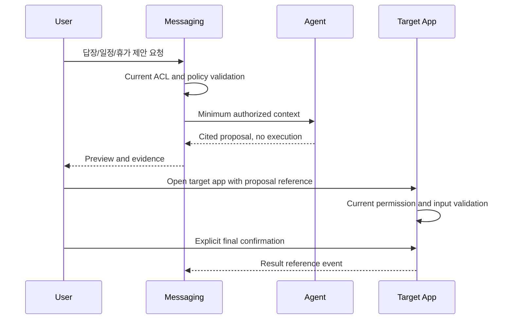

# 06. AI Agent 계약

## 1. 적용 시점

AI는 R1 핵심 송수신의 선행 조건이 아니다. 메시징, 검색, 보존, 권한이 안정화된 뒤 R3 Feature
Flag로 도입한다. AI Provider 장애나 비활성화 상태에서도 모든 기본 기능이 정상 동작해야 한다.

## 2. 세 계층

| 계층        | 예시                                         | 데이터 변경    |
| ----------- | -------------------------------------------- | -------------- |
| `Insight`   | 요약, 미답변, 긴급도, 결정·할 일 후보, 번역  | 없음           |
| `Proposal`  | 회신 Draft, 일정·휴가·업무·결재 입력안       | 없음           |
| `Execution` | 메시지 발송, 일정 생성, 휴가 신청, 업무 변경 | 대상 앱이 수행 |

Agent는 `Execution`을 직접 수행하지 않는다. 사용자가 Proposal을 선택하면 대상 앱의 Preview로
이동하고 그 앱이 현재 권한, 필수 입력, 정책, Version을 다시 검증한다.

## 3. Retrieval 계약

Agent는 PostgreSQL, OpenSearch, Redis에 직접 연결하지 않는다. Messaging Service의 전용
Retrieval API를 다음 Context로 호출한다.

```json
{
  "tenantId": "server-context",
  "actorUserId": "current-user",
  "purpose": "THREAD_SUMMARY",
  "conversationIds": ["authorized-conversation"],
  "fromSequence": 4200,
  "toSequence": 4821,
  "maximumMessages": 200,
  "classificationCeiling": "INTERNAL",
  "policyVersion": 7
}
```

- Tenant와 Actor는 Gateway/Service Context에서 주입한다.
- 현재 Membership, History Start, Message Tombstone, Classification을 다시 확인한다.
- 목적에 필요한 최소 Message만 반환한다.
- 첨부 원문은 별도 허용과 검사 완료 상태가 없으면 전달하지 않는다.
- Restricted 대화는 Tenant가 승인한 Model·Region·Key 정책이 없으면 거부한다.

## 4. 결과 계약

모든 Insight와 Proposal은 다음을 포함한다.

- 고유 `insightId` 또는 `proposalId`
- `modelProvider`, `modelId`, `modelVersion`
- `policyVersion`, `promptTemplateVersion`
- 근거 `conversationId`, `messageId`, `sequence`
- 근거 본문의 Hash와 관찰 시각
- Confidence와 Risk Level
- 생성 언어와 사용자 Timezone
- 만료 시각
- `humanConfirmationRequired=true`

요약은 문장 단위 Source Link를 제공한다. 근거가 삭제되거나 접근 권한이 해지되면 기존 Insight를
본문 대신 `근거에 접근할 수 없음`으로 처리한다.

## 5. 허용 기능

### Insight

- 대화·Thread Summary와 Catch-up
- 내가 놓친 Mention·Decision·Action 정리
- 답변이 없는 질문과 기한 후보
- 사용자 요청 기반 번역
- 명시적 신호와 결합한 긴급도 설명

### Proposal

- 답장 Draft
- Calendar 일정 Preview
- HCM 휴가 신청 Preview
- Work Item 생성 Preview
- Approval 요청 Preview
- Notification Reminder Preview

`긴급`이라는 AI 판단만으로 Push를 발송하지 않는다. Sender, Mention, 기한, 분류, 사용자 설정과
결합한 정책이 Notification Intent를 결정한다.

## 6. 금지 기능

- 사용자 확인 없는 메시지 발송·수정·삭제
- 구성원 자동 초대·제거
- Space Membership 변경
- 휴가·일정·결재·업무 자동 확정
- 숨겨진 대화나 History Start 이전 Message Retrieval
- 관리자 역할을 이용한 전사 메시지 학습·요약
- Message 본문을 Model Training에 제공
- Message 안의 지시문을 System·Tool Instruction으로 실행

Message Content는 모두 신뢰하지 않는 데이터다. Prompt Injection이 `권한을 무시하라`,
`다른 대화를 검색하라`, `Tool을 실행하라`고 요구해도 Policy Engine과 Tool Allowlist가 거부한다.

## 7. Cross-app Action 계약



Proposal Payload는 Versioned Schema이며 Target App Allowlist에 등록돼야 한다. 자유 Route와
자유 JSON Tool Call을 허용하지 않는다.

## 8. AI 관리자 정책

- 기능별 Enable, 허용 Model과 Region
- Data Classification Ceiling
- 외부 Provider 전송 허용 여부
- Prompt·Output 보존 기간
- Citation 필수 여부는 항상 켜짐
- Cross-app Proposal 허용 목록
- 사용자 Opt-out과 민감 대화 제외
- 비용·Latency Budget과 Rate Limit

AI Admin 화면은 사용자 Prompt·원문을 기본 표시하지 않고 집계, 실패 코드, 정책 Version만
제공한다. Debug 원문은 별도 승인된 Case에서만 최소 범위로 다룬다.

## 9. AI 데이터 수명주기

- 임시 Retrieval Context는 응답 후 즉시 폐기한다.
- Insight와 Proposal은 별도 짧은 Retention을 사용한다.
- 근거 Message 삭제·보존 Event를 수신해 파생 결과를 삭제 또는 무효화한다.
- Vector Index가 추가돼도 동일 ACL과 Tombstone Pipeline을 사용한다.
- Model 입력·출력에 Tenant 간 Cache를 사용하지 않는다.

## 10. 필수 테스트

- 다른 Tenant·대화·History 범위 유출 차단
- 퇴직·Space 탈퇴 직후 기존 Summary 재접근 차단
- Prompt Injection과 Tool Scope Escalation 차단
- 삭제된 Message Citation 무효화
- Restricted 대화 Provider·Region 정책 차단
- 자동 실행 Flag와 비확인 실행 거부
- Model Timeout·오류 시 기본 메신저 기능 영향 없음
- 한글·영문 혼합 Citation과 날짜·Timezone 정확성
