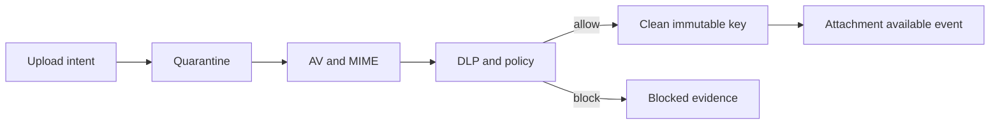

# 08. 인프라 운영 설계

## 1. 현재 기반과 추가 항목

현재 DWP는 PostgreSQL 18.4, Redis 7.4, Kafka 4.3.1, Java 21, Spring Boot 3.5.16,
Spring Cloud 2025.0.3, OpenTelemetry 기반을 갖고 있다. 이 버전을 메시징 때문에 전면 교체하지
않는다.

| 항목              | 현재                                | 추가 또는 변경                                             |
| ----------------- | ----------------------------------- | ---------------------------------------------------------- |
| PostgreSQL        | 서비스별 DB                         | `dwp_messaging`, Partition, PITR 정책                      |
| Kafka             | 로컬 단일 Broker, 공통 Domain Topic | Messaging 전용 고처리량 Topic, Production 3 Broker 이상    |
| Redis             | 단일 로컬 Instance                  | Presence, Session Registry, Sharded Pub/Sub, Production HA |
| Gateway           | Spring Cloud Gateway WebFlux        | WebSocket Route와 Connection 정책                          |
| Search            | 없음                                | OpenSearch Cluster와 ACL Indexer                           |
| Object Storage    | 없음                                | Quarantine, Clean, Compliance WORM Bucket                  |
| Malware/DLP       | 없음                                | 비동기 Scan Worker와 공급자 Port                           |
| Messaging Runtime | 없음                                | Command Server와 Realtime Gateway                          |

## 2. Environment 구성

### 로컬 개발

기본 개발자가 여러 Terminal에서 서버를 각각 실행하지 않게 한다.

- `infra`: PostgreSQL, Redis
- `events`: Kafka
- `messaging`: Messaging Server, Realtime Gateway
- `messaging-search`: OpenSearch
- `messaging-files`: MinIO, Scan Worker

최종 구현 시 Root Orchestrator의 단일 `dev up messaging` 명령이 필요한 Profile을 순서대로
시작하고 Health가 준비된 뒤 Frontend를 연다. 기존 서비스가 이미 실행 중이면 재사용한다.
무거운 OpenSearch·Scanner가 불필요한 Unit 개발은 Profile에서 제외할 수 있지만, E2E Gate는
전체 인프라로 수행한다.

### 프로덕션

- Tenant는 하나의 `home_region`에 고정한다.
- R1은 지역 내 Multi-AZ Active, 타 지역 Warm Standby를 기본으로 한다.
- Socket Gateway, API, Worker는 독립적으로 Horizontal Scale한다.
- PostgreSQL, Kafka, Redis, OpenSearch, Object Storage는 Managed 또는 검증된 HA 구성을 사용한다.
- Production Secret은 Secret Manager/Vault Reference로 주입한다.

초기부터 Multi-region Active-Active Message Write를 만들지 않는다. Conversation 순서,
External Tenant 보존, Conflict Resolution을 검증한 R3에서 별도 ADR로 결정한다.

## 3. Kafka 설계

| Topic                         | Key                   | 목적                                          | 기본 Retention        |
| ----------------------------- | --------------------- | --------------------------------------------- | --------------------- |
| `dwp.messaging-events.v1`     | `tenant:conversation` | Message·Reaction·Conversation Canonical Event | 짧은 운영 재처리 기간 |
| `dwp.messaging-membership.v1` | `tenant:conversation` | Membership·Access Invalidation                | 짧은 운영 재처리 기간 |
| `dwp.messaging-compliance.v1` | `tenant:case`         | Hold Capture와 증거 Event                     | 승인 정책 기간        |

Search, Realtime, Notification, Compliance는 서로 다른 Consumer Group을 쓴다. Message Event의
Conversation Key가 Partition 내 순서를 유지한다. Producer Idempotence를 사용하고 Production은
Replication Factor 3, `min.insync.replicas=2`, TLS, SASL, Topic ACL을 기본으로 한다.

Kafka Retention이 끝나도 사용자 Message는 PostgreSQL에 남는다. Projection 재구축은 DB Snapshot과
Projection Cursor로 수행하며 무한 Kafka 보존에 의존하지 않는다.

## 4. Redis 설계

Redis에는 TTL이 있는 일시 데이터만 둔다.

| Key 영역            | TTL·정책                    |
| ------------------- | --------------------------- |
| Connection Registry | Heartbeat + 짧은 Grace      |
| Presence            | 마지막 Heartbeat 후 수십 초 |
| Typing              | 8초, 갱신 없으면 자동 소멸  |
| WebSocket Ticket    | 30초, 단일 사용             |
| Rate Limit          | Window별 TTL                |
| Realtime Pub/Sub    | 저장 없음                   |

정확한 TTL은 사용자 상태 기대와 부하 시험 후 확정한다. Redis 장애 시 Presence·Typing과 즉시
Fanout은 Degraded되지만 REST Commit과 History는 계속 동작한다. Redis 복구 후 Client는 Resume한다.

Production은 Redis Cluster 또는 동등한 HA 구성과 Redis 7 Sharded Pub/Sub를 사용한다.
Key와 Channel 이름에 Message Body, Person Name, Email을 넣지 않는다.

## 5. OpenSearch 설계

- 월 또는 Size 기반 Rollover Index
- Alias: 활성 Read·Write Index를 분리
- Document ID: Tenant Scope가 포함된 Message ID
- TLS, Node-to-node Encryption, Audit, Service Account
- Browser와 일반 Admin의 직접 접근 금지
- Snapshot과 Restore Drill
- Tombstone Consumer와 Nightly Reconciliation

Index Mapping은 Version으로 관리한다. Breaking Mapping은 새 Index에 Reindex하고 Alias를
전환한다. Message 저장 성공은 Search Index 성공을 기다리지 않는다.

사용자별 OpenSearch Role을 생성하지 않는다. Messaging Service가 현재 Conversation ACL을
Query Filter로 주입하고 Result를 DB에서 재확인한다. DLS/FLS는 Tenant·운영 계층의 추가 방어다.

## 6. Object Storage와 검사

Bucket 또는 Container를 분리한다.

- `messaging-quarantine`: Client Upload, 외부 다운로드 금지, 짧은 Lifecycle
- `messaging-clean`: Scan 통과 Object, Private, 짧은 Pre-signed Download
- `messaging-compliance`: Versioning, WORM/Object Lock, 별도 Role

Scan Pipeline:

Open-source AV는 개발·기본 검사용으로 사용할 수 있으나 고객 규정에 따라 Enterprise DLP,
ICAP, CDR Adapter를 교체할 수 있어야 한다. Scan Engine Version과 Signature Version을 감사한다.

## 7. Realtime Gateway 운영

- Pod별 최대 Connection과 Memory Budget 설정
- Zone별 분산과 PodDisruptionBudget
- Deploy 전 `draining` 상태로 새 연결을 중단하고 Resume Hint 전송
- Idle Heartbeat, Proxy Timeout, Maximum Frame Size 설정
- Session별 Bounded Queue와 Slow Consumer Close
- Conversation Subscription 수와 Presence Fanout 제한
- Connection Ticket, Close Code, Resume Reason Metric

Gateway는 Payload를 Log하지 않는다. Trace에는 Event ID, Conversation Hash, Sequence, Latency만
남긴다. Conversation ID도 외부 관측 시스템으로 보낼 때 HMAC 또는 낮은 Cardinality Label을 쓴다.

## 8. 관측성

### 핵심 Metric

- `message_commit_latency`, `message_commit_errors`
- `outbox_oldest_age`, `kafka_consumer_lag`
- `realtime_fanout_latency`, `active_connections`, `slow_consumers`
- `resume_gap_count`, `duplicate_event_count`, `out_of_order_count`
- `search_index_lag`, `search_acl_recheck_drops`
- `membership_projection_lag`, `access_revocation_latency`
- `attachment_scan_age`, `blocked_attachment_count`
- `retention_backlog`, `hold_capture_lag`

Metric Label에 Tenant ID를 무제한 넣지 않는다. Tenant별 Support 분석은 승인된 내부 Query Surface와
Trace Correlation을 사용한다.

### SLO Alert

- Commit 성공률과 p99 Latency
- Fanout p95/p99와 Resume 폭증
- Access Revocation SLO 위반
- Outbox·Search·Hold Capture Lag
- DB Partition·Disk·Connection·Replication 상태
- Redis Pub/Sub·Kafka Partition Imbalance

## 9. Backup, Restore, DR

- PostgreSQL: Continuous Archive, PITR, 정기 Restore Drill
- Object Storage: Versioning, Replication, WORM 정책 검증
- OpenSearch: Snapshot, 재색인 가능하므로 SoR로 복구하지 않음
- Redis: Message DR 대상 아님, 재생성
- Kafka: Projection 복구 기간만 보존, DB Snapshot과 Outbox로 보완

R1 목표:

- 지역 HA: 성공 응답 Message RPO 0
- 지역 재해: 잠정 RPO 5분 이하, RTO 4시간 이하
- Compliance WORM: 정책이 정한 별도 RPO/RTO와 무결성 검증

실제 수치는 배포 환경과 법무 요구사항에 따라 승인한다.

## 10. Capacity Gate와 ScyllaDB

PostgreSQL 한계를 추측으로 선언하지 않는다. 다음 지표 중 하나가 반복되면 ScyllaDB Spike를
시작한다.

- 보존 Message가 지역당 10억 건 이상으로 증가
- 최적화 후에도 지속 Write 5,000/sec 또는 Commit p99 500ms 목표 실패
- 월 Data 증가가 Partition·Backup·Restore Window를 지속적으로 초과
- Hot Conversation 부하가 Counter·Partition의 안정 한계를 초과
- Retention Batch가 운영 Window 안에 끝나지 않음

수치는 초기 Trigger이며 Capacity Test 결과로 조정한다. Spike는 Dual Write부터 시작하지 않고
Replay 가능한 Snapshot, Shadow Read, 결과 Diff로 의미 동등성을 먼저 검증한다.

## 11. 운영 Runbook

반드시 준비할 Runbook:

- Message Commit 성공 후 Fanout 지연
- Outbox Relay 중단·Poison Event·DLQ Replay
- Redis 장애와 대규모 Reconnect
- OpenSearch 색인 누락·삭제 Tombstone 지연
- Space Membership Drift와 긴급 Access Revocation
- Malware Scan Queue 적체와 오탐 복구
- Retention 잘못 구성 시 즉시 중지와 영향 계산
- Legal Hold Capture 실패
- PostgreSQL Failover·PITR·Partition 관리
- Gateway Certificate·Ticket·Origin 장애

Retention Rule은 작은 대상에 Dry Run한 뒤 확장한다. 자동 삭제 Job에는 Global Kill Switch와
Rate Limit을 둔다.

## 12. 단계별 구축

### Wave 0: Architecture Spike

- Message Store Partition과 1억 건 History Test
- 2만 Socket, Resume, Slow Consumer Test
- Redis Sharded Pub/Sub Fanout
- OpenSearch ACL과 Revocation Leak Test
- Quarantine·AV·Object Lifecycle
- Threat Model, Data Classification, Retention Workshop

### Wave 1: Internal Messaging

- Command Server, Realtime Gateway, DB, Kafka, Redis
- DM, Group, Space Channel, Thread, Reaction, Search, File
- People·Space·Notification 연동
- Policy·Operations Admin과 Seed

### Wave 2: Work Graph

- Calendar Meeting Continuity
- Decision Trail, Action Capsule, App/Bot SDK
- Moderation·DLP·Advanced Notification

### Wave 3: Regulated Enterprise

- Legal Hold·eDiscovery Production Certification
- External Tenant Federation와 Data Ownership
- Multi-region·CMK·Confidential Mode
- Governed AI Retrieval와 Proposal

각 Wave는 이전 단계 수용 테스트를 통과한 뒤 진행한다. 인프라가 준비되지 않은 기능을 UI Mock으로
정상 표시하지 않는다.
