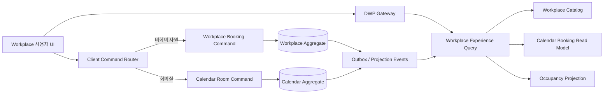

# DWP-R2-WPL-001 통합 탐색·예약 아키텍처

> 상태: Accepted / Increment 1 implemented / projection release-gated
>
> 기준일: 2026-08-27
>
> 적용 대상: DWP 근무 공간 사용자 Surface와 이를 지원하는 Gateway·Platform Projection
>
> 관련 문서: `01-제품 및 UX 설계.md`, `02-아키텍처 및 보안 계약.md`,
> `03-수용 테스트 및 잔여 Gate.md`, `R1 Enterprise Workplace and Spatial Booking ADR.md`

## 1. 목적과 결정

현재 근무 공간은 물리 공간을 소유하는 Workplace와 회의·참석자·캘린더를 소유하는 Calendar의
도메인 경계는 올바르게 분리되어 있다. 그러나 이 경계가 `공간 찾기`와 `회의실 찾기`,
`내 공간 예약`과 `내 회의 예약`처럼 사용자 메뉴와 조회 모델에 그대로 노출되어 동일한 장소가
서로 다른 제품처럼 보인다.

이 문서는 다음을 결정한다.

1. 일반 사용자 IA는 내부 도메인이 아니라 `오늘 계획`, `찾기 및 예약`, `내 예약`,
   `팀과 오피스`라는 JTBD를 기준으로 구성한다.
2. Workplace와 Calendar의 Write Model은 합치지 않는다. 대신 두 권위 원천을 조합하는
   사용자 전용 Search Projection과 Reservation Projection을 Gateway 뒤에 둔다.
3. 배치도 정적 데이터와 실시간 점유 상태를 분리한다. 정적 Floor Projection은 캐시하고,
   점유 변화는 순서가 보장된 Occupancy Delta로 전달한다.
4. `전체 사업장`, 결과 수, 가용 수는 실제 조회 범위와 항상 일치해야 한다. 한 층만 조회하면서
   전체 사업장 결과처럼 표시하는 호환 동작은 허용하지 않는다.
5. 배치도 원본이 없으면 가상의 벽·통로·출입구를 생성하지 않는다. 완전한 목록과
   `배치도 미등록` 상태를 제공한다.
6. Calendar 전용 회의실의 기존 동작은 영구 기본값이 아니라 명시적인 Legacy Compatibility
   정책으로 관리하고, 관리자 가시성·감사·종료 조건을 갖춘다.

## 2. 제품 원칙과 글로벌 비교 근거

| 제품                      | 공식 문서에서 확인한 모범사례                                                                           | DWP 채택 원칙                                                                |
| ------------------------- | ------------------------------------------------------------------------------------------------------- | ---------------------------------------------------------------------------- |
| Microsoft Places          | Building-Floor-Section-Resource 계층, Places Finder의 풍부한 공간 메타데이터, Work Plan·체크인·도면·POI | 하나의 위치 계층과 통합 Finder, 실제 도면 기반 상세, 오늘 계획과 체크인 연결 |
| Google Workspace Calendar | 회의 이벤트 안에서 참석자 기반 회의실 추천, 자원 캘린더 충돌 판정, 시간 변경 시 유사 회의실 재예약      | 회의실 Write Model은 Calendar가 계속 소유하고 충돌 시 대안을 제안            |
| Robin                     | 주간 근무 계획에서 좌석 예약, 공간 없는 회의, 동료 출근, 활동을 함께 제공                               | 홈을 단순 KPI가 아닌 근무일 계획 Surface로 구성                              |
| Envoy                     | 지도에서 사람·좌석·회의실·주차·POI를 통합 검색하고 부분일 예약과 모바일 현장 흐름 제공                  | 자원 유형은 메뉴가 아니라 Facet으로 제공하고 목록·지도 선택을 동기화         |
| Eptura/Condeco            | 좌석·회의실·사물함·주차·팀데이·QR 체크인을 하나의 모바일 경험으로 연결                                  | 예약 후 체크인·길찾기·동료 협업까지 동일한 수명주기로 연결                   |

공식 근거:

- Microsoft Places overview:
  <https://learn.microsoft.com/en-us/microsoft-365/places/places-overview>
- Microsoft Places building and bookable object cards:
  <https://learn.microsoft.com/en-us/microsoft-365/places/end-user/building-bookable-object-cards>
- Microsoft Places floorplans:
  <https://learn.microsoft.com/en-us/microsoft-365/places/end-user/configure-floorplans-maps>
- Microsoft Places desks:
  <https://learn.microsoft.com/en-us/microsoft-365/places/configure-desk-booking>
- Google Calendar room booking:
  <https://support.google.com/calendar/answer/143753>
- Google Calendar room decline and rebooking:
  <https://support.google.com/calendar/answer/16107253>
- Robin workweek and office presence:
  <https://support.robinpowered.com/hc/en-us/articles/8484864213133-How-to-plan-your-week-see-who-s-in-the-office>
- Robin desk policies:
  <https://support.robinpowered.com/hc/en-us/articles/360016230311-Set-desk-booking-policies>
- Envoy Workplace maps:
  <https://envoy.help/en/articles/6793105-setting-up-workplace-maps>
- Envoy web desk booking:
  <https://envoy.help/en/articles/5315159-booking-a-desk-web>
- Eptura Engage employee app:
  <https://eptura.com/our-platform/eptura-engage/employee-app/>
- Eptura Engage desk booking:
  <https://eptura.com/our-platform/eptura-engage/desk-booking/>
- Eptura Engage room booking:
  <https://eptura.com/our-platform/eptura-engage/room-booking/>

## 3. 일반 사용자 JTBD와 목표 IA

### 3.1 핵심 JTBD

1. 오늘 어느 사업장에서 일하고 어떤 예약에 체크인해야 하는지 확인한다.
2. 원하는 시간, 위치, 인원, 설비와 접근성 조건에 맞는 공간을 빠르게 찾아 확정한다.
3. 동료 근처 좌석이나 팀이 함께 출근할 날짜와 장소를 계획한다.
4. 예약을 변경·취소·반납하고 실제 공간까지 찾아간다.
5. 회의실 예약은 참석자, 일정, 의제와 화상회의까지 일관되게 확정한다.
6. 권한, 정책, 충돌 또는 장애로 예약하지 못할 때 이유와 가능한 대안을 확인한다.

### 3.2 목표 사용자 IA

| 1차 메뉴     | 목적                                | 주요 하위 보기                                          |
| ------------ | ----------------------------------- | ------------------------------------------------------- |
| 오늘         | 현재 근무일의 의사결정과 다음 행동  | 근무 위치, 다음 예약, 체크인, 공간 없는 회의, 동료 출근 |
| 찾기 및 예약 | 모든 예약 가능 자원의 통합 탐색     | 전체, 회의실, 좌석, 집중 공간, 사물함, 주차, 장비       |
| 내 예약      | 예약 유형과 무관한 시간순 관리      | 전체, 업무 공간, 회의, 지난 예약                        |
| 팀과 오피스  | 함께 출근하고 가까이 앉기 위한 계획 | 팀 근무일, 동료 위치, 선호 사업장, 함께 앉기            |

관리자 메뉴는 사용자 IA에 섞지 않고 기존 Management Surface에 유지한다. 기존 경로는 북마크와
딥링크 호환을 위해 보존하되 다음 목표 경로로 Redirect한다.

| 기존 경로                | 목표 경로                                 |
| ------------------------ | ----------------------------------------- |
| `/workplace/explore`     | `/workplace/find?types=ALL`               |
| `/workplace/rooms`       | `/workplace/find?types=ROOM`              |
| `/workplace/my-bookings` | `/workplace/reservations?types=WORKSPACE` |
| `/workplace/my-meetings` | `/workplace/reservations?types=MEETING`   |

Redirect는 검색 조건과 허용된 Query Parameter를 보존하고 한 번만 수행한다. 권한이 없는 유형은
숨기되 사용자가 직접 접근한 경우 이유가 있는 Forbidden 상태를 반환한다.

## 4. 목표 화면 구조

### 4.1 오늘

- 날짜·선호 사업장·근무 위치를 하나의 Context Bar에서 변경한다.
- 첫 번째 영역은 `다음 행동`이며 체크인, 공간 없는 회의, 곧 시작할 예약을 우선순위로 표시한다.
- 공간 예약과 회의 예약을 하나의 시간순 Day Plan으로 결합한다.
- 동료 출근 정보는 Tenant Privacy 정책이 허용한 범위에서만 표시한다.
- 가용 공간 수 같은 KPI는 행동을 돕는 경우에만 보조 정보로 사용한다.

### 4.2 찾기 및 예약

- 상단 Command Bar는 `언제`, `어디서`, `얼마나/몇 명`을 한 그룹으로 제공한다.
- 자원 유형, 설비, 접근성, Neighborhood와 예약 모드는 Facet과 `필터 더보기`로 제공한다.
- 적용된 필터를 Chip으로 표시하고 `전체 초기화`는 날짜·시간·사업장·층을 포함한 모든 조건을
  명확한 기본값으로 복원한다.
- 데스크톱은 결과 목록과 배치도를 함께 제공하고 선택 상태를 양방향 동기화한다.
- 모바일과 200% 확대에서는 목록을 기본으로 하고 배치도는 사용자가 명시적으로 연다.
- 모든 결과는 같은 상세 Inspector 또는 Bottom Sheet를 거친다. 예약 가능 여부에 따라
  상세 진입 방식이 달라지지 않는다.
- 상세에는 사진, 위치 Breadcrumb, 수용 인원, 설비, 접근성, 정책, 가용 Timeline,
  체크인 방식, 길찾기와 예약 명령을 제공한다.

### 4.3 예약

- 좌석·사물함·주차 등 개인 자원은 시간, 목적, 공개 범위를 확인하는 짧은 흐름을 사용한다.
- 회의실은 동일한 상세에서 시작하지만 Calendar 단계에서 제목, 참석자, 의제,
  응답 필요 여부와 화상회의를 추가한다.
- 충돌, 정책 제한 또는 승인 필요 상태는 단순 오류로 끝내지 않고 유사 공간·가까운 시간·다른 층을
  대안으로 제시한다.
- 예약 성공 화면은 위치, 시간, 체크인 Window, 자동 해제 조건과 `배치도에서 보기`를 제공한다.

### 4.4 내 예약

- 기본 보기는 업무 공간과 회의를 결합한 시간순 목록이다.
- 유형, 사업장, 상태와 기간으로 필터링하며 각 항목은 도메인별 허용 명령만 표시한다.
- 공통 명령은 상세 보기, 변경, 취소, 지도 보기이며 좌석류에는 체크인·반납,
  회의에는 참석 응답·참석자·캘린더 열기를 추가한다.
- 체크인 가능 시각과 자동 해제까지 남은 시간을 텍스트로 표시한다.

## 5. Read/Write 도메인 경계



### 5.1 Read Model

- 통합 검색은 사용자 경험을 위한 Projection이며 예약의 권위 원천이 아니다.
- 모든 자원은 `placeResourceId`라는 사용자 경험용 정규 ID를 가진다.
- 회의실은 `workplaceResourceId`와 `calendarResourceId` 매핑을 함께 가진다.
- 결과에는 `bookingAuthority = WORKPLACE | CALENDAR`와 허용 명령, 정책 Snapshot Version을 포함한다.
- Projection 지연으로 예약 가능성이 확정되는 것은 아니다. 최종 충돌·권한·정책 판정은 Write Model이
  트랜잭션 안에서 다시 수행한다.

### 5.2 Write Model

- 비회의 자원은 `/workplace/bookings` 수명주기와 Workplace Policy를 사용한다.
- 회의실은 `/rooms/bookings`와 Calendar Policy, 참석자·반복·충돌 수명주기를 사용한다.
- 범용 `POST /reservations`로 두 Aggregate를 합치지 않는다.
- 클라이언트 Command Router는 검색 결과의 `bookingAuthority`에 따라 typed command를 선택한다.
- 생성은 Idempotency Key, 변경은 Version을 필수로 사용하고 서버가 Capability와 Site Scope를 재검증한다.
- 성공 후 낙관적으로 권위 상태를 만들지 않는다. Command 응답과 Projection 갱신 또는 명시적
  Reconciliation 결과를 사용한다.

### 5.3 Calendar-only Legacy 자원

- 매핑되지 않은 Calendar 회의실 허용 여부는 Tenant 정책 `calendarOnlyRoomMode`로 명시한다.
- 권장 기본값은 `DISCOVERABLE_WITH_CALENDAR_POLICY`가 아니라 `HIDDEN_UNTIL_MAPPED`다.
- 호환 모드를 유지하는 Tenant는 관리자 화면에서 미매핑 수, 회의실, 위치, 최근 사용과 종료 목표일을
  확인할 수 있어야 한다.
- 미매핑 자원은 Workplace Site Scope를 가진 것으로 추론하지 않으며, Calendar 자체 권한을 통과한
  경우에만 별도 Legacy 표식과 함께 노출한다.
- 매핑 완료 시 동일 `placeResourceId`를 유지하여 북마크와 분석 이벤트가 분리되지 않게 한다.

## 6. 단계별 Query API

API는 모두 Gateway `/api/platform/v1/**`를 통해 호출하고 Tenant·User·Group·Locale 문맥은
브라우저 입력이 아니라 Gateway가 검증한 Context에서 전달한다.

### 6.1 1단계: Search Projection

```http
GET /api/platform/v1/workplace/search?v=1
  &from=2026-08-27T04:30:00Z
  &to=2026-08-27T05:30:00Z
  &siteIds=...
  &floorIds=...
  &types=ROOM,DESK
  &features=DISPLAY,ACCESSIBLE
  &capacity=4
  &query=project
  &sort=BEST_MATCH
  &cursor=...
```

응답의 최소 계약:

```json
{
  "searchId": "uuid",
  "revision": 42,
  "scope": {
    "siteIds": ["uuid"],
    "floorIds": [],
    "timeZoneMode": "PER_SITE",
    "from": "instant",
    "to": "instant"
  },
  "results": [
    {
      "placeResourceId": "uuid",
      "workplaceResourceId": "uuid",
      "calendarResourceId": null,
      "bookingAuthority": "WORKPLACE",
      "availability": "AVAILABLE",
      "availabilityAsOf": "instant",
      "location": { "siteId": "uuid", "floorId": "uuid", "breadcrumb": [] },
      "capabilities": ["VIEW", "BOOK"],
      "matchReasons": ["AVAILABLE_NOW", "FEATURE_MATCH"]
    }
  ],
  "facets": {},
  "counts": { "matched": 0, "available": 0 },
  "nextCursor": null,
  "generatedAt": "instant"
}
```

계약 규칙:

- `ALL`은 생략된 Site 조건을 뜻하며 모든 허용 Site를 실제로 검색한다.
- 다중 시간대 검색은 Local Date 하나를 임의의 첫 번째 Site 시간대로 해석하지 않는다.
  URL의 날짜·시간은 선택 Site별 Instant 범위로 정규화하거나 명시된 기준 시간대를 요구한다.
- `counts`는 현재 Page가 아니라 동일 검색 Scope 전체의 서버 계산값이다.
- Facet 집계는 권한 필터 이후에 계산하여 존재 자체가 비공개인 Site·Resource를 누출하지 않는다.
- 결과가 많으면 안정적인 Cursor Pagination을 사용하고 Offset Pagination은 사용하지 않는다.
- BEST_MATCH는 가용성, 위치, 수용 인원, 설비, 접근성, 선호도를 설명 가능한 Match Reason과 함께 반환한다.

### 6.2 2단계: Floor Projection

```http
GET /api/platform/v1/workplace/floors/{floorId}/projection?v=1&at=2026-08-27T04:30:00Z
If-None-Match: "floor-revision-etag"
```

Floor Projection은 다음을 포함한다.

- 게시된 Floor Revision과 실제 배경 Asset URL·크기·해시
- 공간·벽·통로·출입구·엘리베이터·계단·화장실·안전설비 등 허용된 POI
- Resource의 정규화 좌표, 회전, Hit Area와 `placeResourceId`
- Floor Policy와 접근 가능한 Zone·Neighborhood
- `mapAvailable`, `publishedAt`, `projectionRevision`, `ETag`

정적 Geometry와 Asset은 장기 캐시하고 사용자별 점유·이름·예약 상태를 포함하지 않는다.
배경 Asset이나 게시 Revision이 없으면 `mapAvailable=false`를 반환하며 클라이언트는 목록을 제공한다.

### 6.3 3단계: Occupancy Delta

```http
GET /api/platform/v1/workplace/occupancy/stream
  ?floorId=...
  &from=...
  &to=...
  &sinceRevision=42
Accept: text/event-stream
Last-Event-ID: 42
```

```json
{
  "eventId": "43",
  "projectionRevision": 43,
  "changes": [
    {
      "placeResourceId": "uuid",
      "availability": "OCCUPIED",
      "effectiveFrom": "instant",
      "effectiveTo": "instant",
      "visibility": "STATUS_ONLY"
    }
  ],
  "generatedAt": "instant"
}
```

- 전송은 Gateway를 통과하는 SSE를 기본으로 하고 모바일·프록시 제한 시 조건부 Polling으로 Fallback한다.
- Delta는 Floor·시간 Scope와 단조 증가 Revision을 가진다.
- Revision 공백, 만료 또는 권한 변경 시 `RESET_REQUIRED`를 보내고 전체 Search/Floor Projection을 다시 읽는다.
- 예약자 이름은 Privacy 정책이 허용한 경우에만 별도 필드로 제공한다. 기본 Delta는 상태만 제공한다.
- 연결 해제는 예약 가능으로 해석하지 않는다. 마지막 정상 시각과 stale 상태를 함께 표시한다.

### 6.4 Reservation Projection

```http
GET /api/platform/v1/workplace/reservations?v=1
  &from=...
  &to=...
  &types=WORKSPACE,MEETING
  &status=ACTIVE
  &cursor=...
```

Reservation Projection은 두 Write Model의 결과를 시간순으로 조합하되 각 항목의
`bookingAuthority`, 원본 ID, 허용 명령, Version과 체크인 Window를 보존한다. 변경 명령은
Projection API가 아니라 원래 도메인의 Command API로 보낸다.

## 7. URL 상태 계약

통합 탐색의 재현 가능한 상태는 URL Query에 저장한다.

| Parameter  | 예시                   | 규칙                                                         |
| ---------- | ---------------------- | ------------------------------------------------------------ |
| `v`        | `1`                    | URL 계약 버전, 알 수 없는 버전은 안전한 기본값으로 Migration |
| `date`     | `2026-08-27`           | 사용자 선택 날짜                                             |
| `start`    | `13:30`                | 선택 Site의 Local Time, 다중 시간대이면 `tz` 필요            |
| `duration` | `60`                   | 정책 범위 내 분 단위                                         |
| `tz`       | `Asia/Seoul`           | 다중 Site 또는 공유 링크의 기준 시간대                       |
| `sites`    | `id1,id2`              | 허용 Site만 유지                                             |
| `floors`   | `id1,id2`              | 선택 Site에 속하지 않으면 제거                               |
| `types`    | `ROOM,DESK`            | 허용된 Resource Type 집합                                    |
| `features` | `DISPLAY,ACCESSIBLE`   | 정규 Feature Code 집합                                       |
| `capacity` | `4`                    | 0 이상의 정수                                                |
| `view`     | `list`, `map`, `split` | 모바일은 유효해도 기본 `list`로 보정 가능                    |
| `sort`     | `BEST_MATCH`           | 서버 지원 정렬만 허용                                        |
| `q`        | `project`              | 길이 제한, 제어문자 제거, 로그 Redaction                     |

- URL Parser는 단일 모듈의 Versioned Schema로 관리한다.
- 잘못된 값은 화면을 깨뜨리지 않고 제거하며 보정 사실을 접근 가능한 상태 메시지로 알린다.
- 필터 변경은 짧은 Debounce 뒤 `replace`, 사용자가 확정한 날짜·사업장·보기 전환은 `push`를 사용한다.
- 브라우저 뒤로가기, 새로고침, 공유 링크가 동일 Scope를 복원해야 한다.
- 참석자 ID, 예약 목적, 동료 검색어, 개인 선호도와 권한 Token은 URL에 저장하지 않는다.
- 권한 변경 후 URL에 남은 Site·Floor는 서버 응답과 재조정하고 존재 여부를 오류 메시지로 누출하지 않는다.

## 8. 보안·권한·개인정보 계약

### 8.1 권한

- 제품 진입 RBAC와 Resource Scope ABAC를 분리한다.
- 검색, Facet Count, Floor Projection, Delta 모두 동일한 Site/Zone 접근 판정을 사용한다.
- `VIEW`는 `BOOK`, `UPDATE`, `CHECK_IN`, `RELEASE`를 암시하지 않는다.
- 검색 결과의 Capability는 편의 정보이며 Write API는 매 요청마다 권한을 재검증한다.
- 정책·권한 Projection을 읽지 못하면 조회는 마지막 정상 데이터로 유지할 수 있지만 쓰기는 fail-closed다.
- 관리자 Management Surface와 사용자 Work Surface의 Query Cache Key를 공유하지 않는다.

### 8.2 Tenant 격리와 캐시

- 모든 저장소 Query는 검증된 Tenant 조건을 필수로 한다.
- 사용자별 Search/Reservation Cache Key에는 Tenant, User, Capability Fingerprint, Locale과 Scope를 포함한다.
- 정적 Floor Geometry는 Tenant·Floor·Published Revision 단위로만 공유할 수 있다.
- CDN Asset은 서명 URL 또는 인증 Gateway를 사용하고 다른 Tenant 경로를 추측할 수 없어야 한다.
- 권한 Revision 변경 시 사용자 Projection과 Delta Subscription을 즉시 폐기한다.

### 8.3 개인정보

- 기본 공개 정보는 자원 상태와 공간 메타데이터다.
- 구성원 이름, 근무 위치와 동료 근처 추천은 Tenant Privacy 정책과 개인 공개 선택을 모두 통과해야 한다.
- 비공개 예약은 목적·참석자·사용자 이름을 지도, 검색 Facet, 로그와 분석 이벤트에 포함하지 않는다.
- 검색어와 위치 이력은 보존 기간, 목적 제한, 삭제 정책을 가진다.
- 분석은 최소 집단 크기를 적용한 집계 데이터로 제공하고 개인 이동 경로를 재구성하지 않는다.
- 관리자 조회·강제 취소·Legal Hold는 Actor, Scope, 사유와 Correlation ID를 감사 원장에 남긴다.

## 9. 오류·stale 상태 계약

| 상태                       | 사용자 표현                               | 허용 동작                           |
| -------------------------- | ----------------------------------------- | ----------------------------------- |
| 최초 Search 실패           | 검색 영역 로컬 오류와 다시 시도           | 조건 수정, 재시도                   |
| 갱신 실패·기존 데이터 있음 | 결과 유지, `마지막 갱신`과 stale 경고     | 상세 조회 가능, 쓰기는 서버 재검증  |
| Floor Projection 없음      | `배치도 미등록`, 목록 자동 전환           | 목록 탐색·예약                      |
| Delta 연결 끊김            | 마지막 정상 시각과 연결 복구 상태         | 예약 전 권위 재검증, 가용 단정 금지 |
| 정책 조회 실패             | 정책 영향 유형의 예약 명령 비활성화       | 다른 유형 조회, 재시도              |
| 권한 변경                  | 영향 결과 제거, 일반화된 접근 불가 메시지 | 허용 Scope 재검색                   |
| 예약 충돌                  | 충돌 이유와 대체 시간·공간                | 대안 선택, 조건 변경                |
| 결과 없음                  | 원인별 빈 상태와 적용 필터                | 필터 완화, 다른 시간·층 추천        |
| 검색 중 자원 퇴역          | 상세에서 상태 갱신 및 예약 차단           | 대체 자원 탐색                      |

빈 상태는 `등록된 자원 없음`, `도면 없음`, `필터 결과 없음`, `권한 범위 없음`, `운영 중단`을
구분한다. HTTP 상태, 내부 예외 메시지와 식별자는 사용자에게 직접 노출하지 않는다.

## 10. 접근성 Release Gate

기준은 WCAG 2.2 AA다.

- 다섯 사용자 Journey인 오늘, 찾기, 상세·예약, 내 예약, 팀과 오피스를 키보드만으로 완료한다.
- 검색 결과 수, 필터 보정, Delta 상태 변경, 예약 성공·실패를 적절한 Live Region으로 알린다.
- 지도와 목록은 동일 정보를 제공한다. 지도 전용 기능을 만들지 않는다.
- 지도 Resource는 접근 가능한 이름·상태·위치를 가지며 목록과 Focus를 동기화한다.
- 지도 Pan/Zoom 이후에도 Focus를 잃지 않고 `전체 보기`, 층 전환, 목록 전환 명령을 제공한다.
- 색상만으로 가용 상태를 구분하지 않고 아이콘·텍스트·패턴을 함께 사용한다.
- 320 CSS px Reflow와 200% 확대에서 비지도 영역은 양방향 페이지 Scroll 없이 동작한다.
- 지도와 Timeline의 내부 Scroll은 해당 컨테이너에 한정하고 주변 명령과 상세 텍스트는 Reflow한다.
- Pointer Target은 WCAG 최소 기준을 충족하고 모바일 주요 명령은 44 CSS px 이상을 목표로 한다.
- Focus가 Sticky Header, Bottom Sheet 또는 Toast에 가려지지 않아야 한다.
- Reduced Motion, 고대비, 화면 읽기 프로그램과 400% 확대 표본 검증을 수행한다.
- 지원 브라우저별 axe serious/critical 위반은 0건이어야 하며 수동 검증을 자동 검사로 대체하지 않는다.

참조:

- WCAG 2.2 Reflow: <https://www.w3.org/WAI/WCAG22/Understanding/reflow.html>
- WCAG 2.2 Target Size: <https://www.w3.org/WAI/WCAG22/Understanding/target-size-minimum.html>
- WCAG 2.2 Focus Not Obscured:
  <https://www.w3.org/WAI/WCAG22/Understanding/focus-not-obscured-minimum.html>

## 11. 성능·복원력 Release Gate

### 11.1 기준 규모

- Tenant당 100개 Site, Site당 100개 Floor, Floor당 2,000개 Resource를 계약 상한 표본으로 검증한다.
- 일반 검색은 한 Page 최대 50개 결과와 Cursor를 사용한다.
- 지도는 현재 Floor의 Published Resource만 로드하고 대규모 도형은 Viewport Culling을 적용한다.
- 목록은 200개 이상 누적 시 Virtualization을 적용한다.

### 11.2 SLO

| 항목             | 출시 기준                                              |
| ---------------- | ------------------------------------------------------ |
| Search API       | 정상 부하에서 p95 800ms 이하, p99 1.5s 이하            |
| Floor Projection | 캐시 적중 p95 200ms 이하, ETag 304 지원                |
| 첫 유용 결과     | 일반 사내망 기준 p75 1.5s 이하, p95 2.5s 이하          |
| 필터 상호작용    | 로컬 반응 100ms 이내, 서버 결과 p95 1초 이내           |
| Occupancy Delta  | 권위 이벤트 발생 후 p95 5초 이내 반영                  |
| 예약 Command     | p95 1.5s 이하, Timeout 재시도 시 동일 Idempotency 결과 |
| Layout 안정성    | 주요 Journey CLS 0.1 이하                              |

SLO는 실제 운영 규모와 지역별 네트워크 측정으로 재승인한다. 기준을 맞추기 위해 권한 검사를 생략하거나
오래된 가용 상태를 예약 가능으로 간주해서는 안 된다.

### 11.3 복원력

- Projection Builder는 Workplace와 Calendar Outbox를 멱등 소비한다.
- 소비 지연, 마지막 Event ID, 재처리 수와 Dead Letter를 관측한다.
- Projection 전체 재생성 중에도 마지막 정상 Revision을 읽을 수 있어야 한다.
- SSE는 지수 Backoff와 Jitter로 재연결하고 최대 지연 후 Polling으로 전환한다.
- Search와 Floor Projection은 Circuit Breaker가 열려도 마지막 정상 데이터와 정확한 stale 상태를 제공한다.
- Command 성공 후 Projection 지연이 있으면 `동기화 중` 상태와 권위 Command 결과를 표시한다.

## 12. 테스트와 출시 증거

### 12.1 P0 계약 테스트

1. 두 Site·세 Floor·서로 다른 시간대에서 `전체 사업장` 검색 수와 개별 Scope 합계가 일치한다.
2. 동일 회의실과 시간은 통합 검색과 Calendar에서 같은 가용 결과를 반환한다.
3. 회의실 예약은 Reservation Projection에 한 번만 나타나고 Calendar Event ID를 보존한다.
4. 미매핑 Calendar 회의실은 Tenant Compatibility 정책에 따라 숨김 또는 Legacy 표식으로만 노출된다.
5. 배경 도면이 없는 Floor는 가상 배치도를 만들지 않고 완전한 목록을 제공한다.
6. 권한 밖 Site·Floor·Resource는 결과, Facet Count, Delta와 오류 메시지에 존재를 노출하지 않는다.

### 12.2 사용자 Journey 테스트

- 필터 URL 공유, 새로고침, 뒤로가기와 Legacy Redirect 후 동일 조건을 복원한다.
- 검색에서 상세, 예약, 성공, 내 예약, 변경·취소·체크인까지 연결한다.
- 회의실은 참석자와 Calendar Event를 생성하고 시간 변경 충돌 시 대체 공간을 제안한다.
- Desktop 1440px, Tablet 768px, Mobile 390px와 200% 확대에서 명령 누락과 페이지 Overflow가 없다.
- Loading, Error, stale, Empty, Read-only, Policy unavailable, Conflict를 각 화면에서 검증한다.
- 키보드, VoiceOver 또는 NVDA 표본, axe, 고대비와 Reduced Motion 증거를 보존한다.

### 12.3 보안·부하 테스트

- 다른 Tenant ID, 변조된 Site/Group Ref, 만료 Capability Revision과 직접 Command 호출을 거부한다.
- 동일 Resource에 100개 동시 예약 요청 시 성공은 최대 한 건이며 나머지는 일관된 충돌을 반환한다.
- 동일 Idempotency Key와 동일 Payload는 같은 결과, 다른 Payload는 충돌을 반환한다.
- Projection 지연·순서 역전·중복 Event·SSE Revision 공백에서 재동기화한다.
- 검색어, 목적, 참석자, 구성원 위치가 로그·Trace·Metric Label에 남지 않는지 검사한다.

## 13. 단계별 구현 순서

### Increment 1: 신뢰성과 의미 정합성

- `전체 사업장` Scope와 Count를 실제 API 계약과 일치시킨다.
- Calendar-only Legacy 정책과 미매핑 Inventory를 명시한다.
- 도면 미등록 시 가상 지도를 제거하고 목록 Fallback을 제공한다.
- 공통 URL Schema와 필터 전체 초기화를 도입한다.
- 동일 Resource 상세 Inspector와 원인별 Empty/Error 상태를 적용한다.

### Increment 2: 통합 탐색과 예약 목록

- Search Projection과 정규 `placeResourceId`를 도입한다.
- `찾기 및 예약`, `내 예약` IA와 Legacy Redirect를 적용한다.
- Reservation Projection을 추가하되 Write API는 기존 권위 도메인을 유지한다.
- 설명 가능한 추천·Facet·Cursor Pagination을 적용한다.

### Increment 3: 실제 배치도와 실시간 상태

- 정적 Floor Projection, ETag, POI와 목록·지도 선택 동기화를 구현한다.
- Occupancy Delta SSE, Revision 복구와 Polling Fallback을 구현한다.
- 길찾기·지도 보기·체크인 위치 연결을 추가한다.

### Increment 4: 계획·협업과 현장 접점

- 오늘의 Work Plan, 팀 근무일, 동료 근처 추천과 선호 사업장을 제공한다.
- QR/NFC, Badge, Wi-Fi 또는 Sensor Adapter를 승인된 공급자 계약 뒤 연결한다.
- 자동 좌석 추천, 방문자, 시설 서비스 요청은 별도 Privacy·감사·장애 계약을 거쳐 확장한다.

각 Increment는 독립적으로 배포 가능해야 하며 이전 단계의 P0 Gate가 통과되지 않으면 다음 단계를
기능 Flag로 활성화하지 않는다.

## 14. 이번 구현과 후속 단계

### 이번 구현에 포함

- Workplace·Calendar Read/Write 경계와 정규 Resource Identity, 통합 사용자 IA 목표 결정
- Search Projection, Floor Projection, Occupancy Delta, Reservation Projection의 단계별 계약
- `공간 찾기`의 날짜·시간·기간·사업장·층·자원 유형·설비·Neighborhood·접근성·정렬·뷰 상태를 URL로 통합
- 단일 층 API를 `전체 사업장` 범위로 표시하던 모호성을 제거하고 현재 사업장·층 범위를 명시
- 도면 미등록 시 가상 벽·통로를 만들지 않고 전체 목록과 원인별 상태를 제공
- 목록·지도 선택 동기화, 공통 Resource Inspector, Workplace·Calendar 별도 예약 Command 연결
- 지도 Resource와 회의실 Timeline에 Roving `tabIndex`, 방향키·Home·End 키보드 계약 적용
- 근무 공간 홈의 Workplace·Calendar 예약을 시간순으로 조합하고 부분 장애·stale 데이터를 독립 표현
- 회의실 찾기의 필터 URL 복원, 정책 Fail-closed, 자원 타임존, 키보드 Timeline 적용
- 공간·회의 예약 목록에 최종 정상 데이터를 유지하는 stale 경고 적용
- Site 접근 규칙 미설정과 Calendar 미매핑 회의실을 기본 차단하고, 예약 목록·체크인·취소·반납·이동 시점마다 현재 Site BOOK 권한을 재검증
- 실제 PostgreSQL과 최신 Flyway 스키마에서 접근 권한 회수 즉시 조회 제외·쓰기 차단·예약 상태 불변을 검증하는 통합 테스트 적용
- 320·390·768·1280·1440 CSS px, 키보드, axe, 아이데포턴시 재시도를 포함한 자동화 검증 추가
- URL 상태, 권한·개인정보, 오류·stale, 접근성·성능 Release Gate 정의

### 후속 Increment의 Release Gate로 남은 항목

- 다중 사업장·층을 한 Query로 탐색하는 Gateway Search Projection과 Cursor·Facet Count·권한 Scope 계약
- Workplace·Calendar 예약을 하나의 조회용 시간순 목록으로 조합하는 Reservation Projection
- 정적 Floor Projection의 ETag·POI·Viewport Culling과 Revision이 보장된 Occupancy Delta SSE·Polling Fallback
- `찾기 및 예약`, `내 예약`으로의 최종 라우트 통합과 기존 Deep Link Redirect. 현재는 도메인별 권한과 Write Authority를 안전하게 유지하기 위해 분리 경로를 보존한다.
- Tenant 정책과 Migration을 갖춘 Calendar-only 회의실 명시적 호환 모드·미매핑 Inventory
- Work Plan, 팀 근무일, 동료 위치, 선호 사업장을 위한 Privacy-aware Team Projection
- 실제 공급자 Calendar·출입·센서·QR/NFC 연동과 운영 부하·보안 증거

후속 개발은 이 문서의 Increment 순서와 Release Gate를 기준으로 별도 변경·검증한다. 프론트는
현재 API가 증명하는 사업장·층 범위만 표시하며, Projection 출시 전에 임시 클라이언트 Join으로
두 권위 원천을 `전체` 결과로 위장하지 않는다.

## 15. 완료 정의

통합 탐색·예약 아키텍처는 다음 조건을 모두 만족할 때 완료로 판단한다.

1. 사용자는 내부 도메인을 몰라도 하나의 찾기와 하나의 내 예약 흐름으로 핵심 업무를 완료한다.
2. 전체·사업장·층 Scope와 모든 Count가 정확하고 다중 시간대에서 재현 가능하다.
3. 회의실은 Calendar, 비회의 자원은 Workplace가 계속 최종 쓰기 권위를 가진다.
4. Search·Floor·Delta Projection의 Revision, stale, 재동기화와 권한 계약이 자동화되어 있다.
5. 실제 도면이 없을 때 잘못된 공간 정보를 만들지 않으며 목록이 기능적으로 완전하다.
6. 모바일·접근성·성능·보안·복원력 Gate의 실행 증거가 출시 Artifact로 보존된다.
