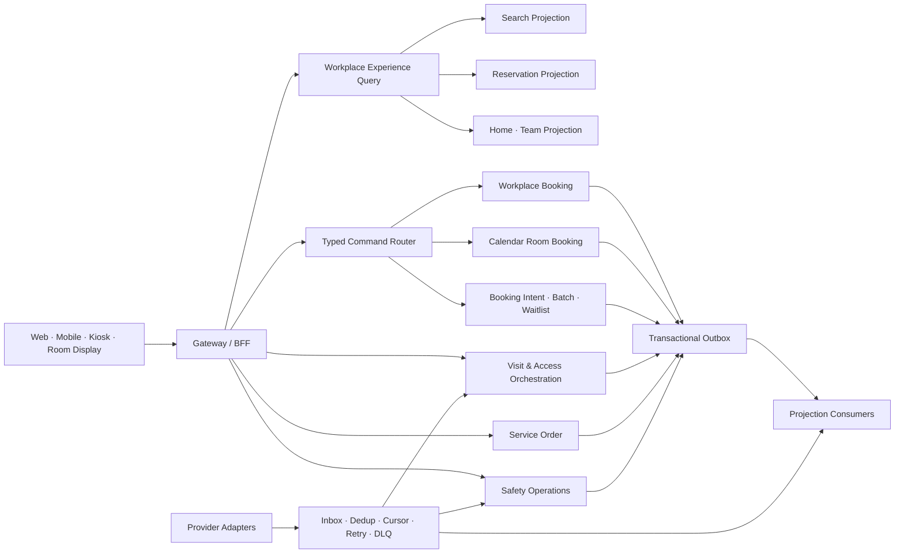

# 근무공간 글로벌 고도화 디자인 AI 프롬프트·구현 아키텍처

- 기준일: 2026-09-16
- 선행 문서: [글로벌 벤치마크·기능 갭 결정서](./08-2026-글로벌-벤치마크-기능-갭-결정서.md)
- 적용 원칙: Stitch 01–13의 시각 언어와 검증된 화면을 보존하고, 14번 이후 화면군으로 기능 공백을
  확장한다.

## 1. 디자인 AI 공통 프롬프트

아래 공통 문장을 각 화면 프롬프트 앞에 그대로 붙인다.

```text
DWP 근무공간 Stitch 01–13과 동일한 제품·디자인 시스템 안에서 후속 화면을 설계한다.
1440px 데스크톱과 390px 모바일을 모두 만든다. 데스크톱은 현재 DWP의 64px 상단 헤더,
248px 좌측 제품 메뉴, 안정된 중앙 그리드를 유지한다. Noto Sans KR/Geist 계열 글꼴,
흰색·연회색 Surface, 절제된 Blue Primary, 얇은 구분선, 촘촘하지만 읽기 쉬운 정보 구조를 쓴다.
장식용 대형 Hero, Gradient, Glow, 의미 없는 KPI, 같은 모양의 Card 반복을 사용하지 않는다.

모든 지표에는 조회 범위, 기준 시각, 데이터 원천, Fresh/Stale/Partial 상태를 표시한다.
미연결 외부 공급자, 알 수 없는 결과, 권한 밖 데이터, 추정값을 정상 또는 실제값처럼 만들지 않는다.
Loading, Empty, Partial source failure, Stale, Read-only, Permission denied, Policy blocked,
409 conflict, Result unknown, Offline 상태를 함께 설계한다.

모바일은 44px 이상 Touch target, 한 손 조작, 하단 고정 Primary action, Sheet/Drawer,
수평 Page overflow가 없는 구조를 사용한다. 200% 확대, 키보드, 스크린리더, 고대비,
Reduced motion, 긴 한국어·영어, 색을 보지 못하는 사용자까지 지원한다. 표와 Chart는 접근 가능한
텍스트·표 대안을 제공한다. 예시 데이터는 Demo임을 명시하고 공급자 Secret, 재사용 가능한 QR,
실제 개인정보를 그리지 않는다.
```

## 2. 화면별 프롬프트

### 14. 통합 찾기 및 예약 — P0

```text
‘찾기 및 예약’ 화면을 설계한다. 회의실, 좌석, 포커스 부스, 전화 부스, 사물함, 주차,
공용 장비를 하나의 결과에서 탐색한다. 상단 Command bar에는 날짜, 시작·종료 시간, 여러 날짜,
사업장, 층, 인원수를 한 문장처럼 배치한다. 자원 유형, 설비, 접근성, Neighborhood, 예약 방식은
Facet과 적용 Filter chip으로 제공하고 ‘전체 초기화’는 모든 조건을 실제 기본값으로 되돌린다.

1440px 화면은 결과 목록, 실제 Floor plan, 공통 Resource inspector를 연결한다. 목록·지도 선택을
양방향 동기화한다. Inspector는 사진, 위치 Breadcrumb, 인원, 설비, 접근성, 정책, 가용 Timeline,
체크인 방식, 데이터 기준 시각, 예약 버튼을 제공한다. Calendar가 소유하는 회의실과 Workplace가
소유하는 다른 자원의 상태를 같은 문법으로 보이되 내부 시스템 이름을 사용자가 알아야만 예약할 수
있게 만들지 않는다.

전체 사업장, 선택 사업장, 선택 층의 결과 수와 Facet 수가 실제 Query scope와 일치해야 한다.
한 원천이 실패하면 정상 자원은 유지하고 실패한 유형만 Partial warning과 재시도를 제공한다.
도면이 없으면 가상의 벽과 통로를 만들지 않고 완전한 목록과 ‘도면 미등록’을 제공한다.

390px 화면은 목록 우선, Filter bottom sheet, 지도 명시적 열기, Resource detail bottom sheet,
하단 고정 예약 버튼으로 만든다. Search URL 공유, 뒤로가기, 새로고침 뒤에도 조건을 보존한다.
```

### 15. 여러 날짜·대리·팀 예약과 대기열 — P0

```text
‘주간 예약 플래너’를 기존 찾기 및 예약의 Mode로 설계한다. 사용자는 본인 또는 권한 있는 이용자를
선택하고 월~금 여러 날짜에 좌석, 주차, 사물함을 함께 계획한다. 예약을 실행하는 Actor와 실제
이용자인 Beneficiary를 항상 분리해 표시한다.

데스크톱은 날짜별 추천 자원, 동료 근처, 같은 Zone, 접근성, 정책, 충돌을 비교하는 Matrix를
사용한다. 팀 예약은 인접 좌석 조건, 최소·최대 거리, 같은 Neighborhood 조건을 제공한다. 서버가
발행한 만료 시간이 있는 Hold만 확정 가능하며 남은 시간을 보인다. 참가자별 부분 성공을 정상 완료로
숨기지 말고 성공, 정책 거부, 자원 없음, 결과 불명을 구분한다. 전체 취소 또는 성공 항목 유지·실패
항목 재선택의 보상 선택지를 제공한다.

자원이 없으면 같은 층·가까운 시간·다른 사업장 대안과 대기열 가입을 제시한다. 대기열에는 순위가
정책상 공개 가능한지, 승격 Offer 만료, 자동 확정 Opt-in, 최대 가격·시간·거리 조건, 알림 채널을
표시한다. 내 예약에는 대기열 항목과 승격 Countdown을 함께 보여준다.

390px에서는 날짜별 단계형 흐름과 하단 ‘검토’ 버튼을 사용한다. Result unknown일 때 같은 명령을
다시 보내지 않고 Batch 상태 조회를 안내한다.
```

### 16. 통합 내 예약과 예약 이후 경험 — P0

```text
‘내 예약’을 회의, 좌석, 주차, 사물함, 장비, 대기열을 결합한 시간순 Day/Week timeline으로
설계한다. Filter는 기간, 사업장, 유형, 상태, 본인/대리 예약, 대기열로 구성한다. 각 항목은 위치,
자원 유형, 현지 시간대, 체크인 가능 시각, 자동 해제까지 남은 시간, Actor와 Beneficiary를 표시한다.

허용된 명령만 보인다. 공통 명령은 상세, 변경, 취소, 지도 보기이고 공간에는 체크인·반납,
회의에는 참석 응답·참석자·Calendar 열기, 대기열에는 조건 변경·나가기를 제공한다. 예약 상세에는
‘방문자’, ‘서비스’, ‘출입’, ‘감사’ Tab을 위한 확장 지점을 둔다. Calendar 또는 Workplace 한쪽이
실패하면 다른 예약은 유지하고 실패한 Source만 경고한다.

홈에는 가장 긴급한 다음 행동 하나와 이어지는 시간순 계획을 표시한다. 체크인, 대기열 Offer,
공간 폐쇄 영향, 방문자 도착, 서비스 변경을 기한 순으로 정렬한다. 모바일은 다음 행동과 Primary
command를 첫 Viewport 안에 둔다.
```

### 17. 방문자·계약자와 출입 준비 — P1

```text
사용자 예약 상세의 ‘방문 및 출입’ Tab과 관리자 Operations의 ‘방문 예외’ 화면을 함께 설계한다.
호스트는 방문 일시, 사업장, 목적, 최소한의 방문자 정보, 회의실, 주차, 접근 구역을 입력한다.
방문자 유형별로 필요한 승인, 안내, NDA, 신원 확인을 Preview하고 불필요한 필드는 수집하지 않는다.

방문 상세에는 초대 발송, 문서 확인, 승인, 임시 출입 요청, Badge 준비, 호스트 알림, 도착·퇴실을
Timeline으로 표시한다. 외부 Visitor와 Access Control은 각각의 운영 상태, 마지막 성공, 지연을
보인다. 재사용 가능한 QR 값이나 Credential Secret은 화면에 표시하지 않는다. 미연결 상태에서는
‘출입 준비 완료’를 만들지 않고 수동 안내와 책임자를 제공한다.

관리자 화면은 오늘 방문, 승인 필요, 출입 발급 실패, 호스트 미응답, 장기 미퇴실을 밀도 높은 Table과
Inspector로 처리한다. 이름·연락처·목적은 권한에 따라 Masking하고 조회·변경·내보내기는 감사한다.
Kiosk에는 장치 등록, Offline, Privacy notice, 도움 요청, 접근 가능한 입력 상태를 포함한다.
```

### 18. 예약 연계 Workplace Services — P1

```text
회의실 또는 공간 예약 상세의 ‘서비스’ Tab과 관리자 Operations의 ‘서비스 이행’ 화면을 설계한다.
사용자는 Catering, AV, Room layout, IT 지원, Cleaning 중 허용된 항목을 주문한다. 서비스별 제공
사업장, 인원, 수량, 옵션, 주문 마감, 취소 정책, 비용센터, 예상 비용, 특별 요청을 검토한다.

예약 시간·장소가 바뀌면 영향 받는 서비스와 재확정 필요 항목을 먼저 보여준다. 예약 취소가 서비스
취소를 자동 의미한다고 가정하지 말고 각 주문의 정책과 상태를 확인한다. 관리자 Table에는 마감,
SLA, Provider, Assignee, Blocker, 예약 변경 영향, 외부 Fulfillment reference를 표시한다.
Inspector에는 요청, 승인, 준비, 제공, 실패, 취소 Timeline과 첨부, 사용자 메시지, 감사 기록을 둔다.

기존 시설 고장 요청과 서비스 주문은 같은 화면 문법을 사용하되 목적과 상태 모델을 섞지 않는다.
외부 공급자 미연결, 주문 전송 결과 불명, 공급자 지연, 부분 이행 상태를 설계한다.
```

### 19. 실내 길찾기와 현장 장치 — P1

```text
예약 성공 후 사용하는 모바일 ‘공간으로 이동’과 Room display·Status board 운영 화면을 설계한다.
길찾기는 현재 진입점에서 예약 자원까지 층별 경로, 엘리베이터, 계단, 화장실, 프린터, 안내 데스크,
AED, 비상구, 집결지 POI를 제공한다. 휠체어 접근, 계단 회피, 제한 구역 권한을 경로 조건에 반영한다.
정확한 Published navigation graph가 없으면 직선 경로를 만들지 않고 위치 Breadcrumb, 층 지도,
안내 데스크 정보를 제공한다.

Room display는 현재·다음 일정, 가용성, 즉시 예약, 체크인, 조기 종료를 제공한다. 일정 제목과
주최자 이름은 Privacy policy에 따라 가린다. 장치 운영 화면에는 Device identity, 연결된 Site·Floor·
Resource, 앱·정책 버전, 마지막 Heartbeat, Online/Offline, Schedule freshness, 최근 오류, 원격 설정
상태를 표시한다. 미등록 장치, Stale schedule, Offline, 권한 거부와 안전 공지 Takeover 상태를
포함한다.
```

### 20. 안전·현장 대응 Command Center — P1

```text
관리자 Operations의 ‘안전 대응’ Command center와 사용자의 안전 확인 Sheet를 설계한다.
관리자는 사건 유형, 영향 Site·Floor·Zone, 메시지, 대상 범위, 채널, 집결지를 Preview한 뒤 권한과
정책에 맞게 발령한다. 예약자, 검증된 실제 재실자, 방문자, 예정 방문자를 같은 숫자로 합치지 말고
대상 Source와 기준 시각을 구분한다.

Command center는 전달 성공·실패, ‘안전함’, ‘도움 필요’, 미응답, 집결 확인을 실시간 Table과
Summary로 제공한다. 개인 단위 상세는 필요한 역할에만 공개한다. 양방향 메시지, 재전송, 범위 변경,
종료, 사후 보고서와 전체 감사 Timeline을 제공한다. 데이터가 Stale하거나 공급자가 끊기면 누락
가능성과 마지막 정상 시각을 강조한다.

사용자 Sheet는 짧은 메시지, 사건 범위, 안전 행동, ‘안전함/도움 필요’ 두 명확한 명령, 접근 가능한
대체 연락 수단을 제공한다. 색이나 소리만으로 긴급 상태를 전달하지 않는다.
```

### 21. 데이터 연계 운영 관제 — P0

```text
기존 ‘데이터 연계 운영’을 실제 Adapter 관제 화면으로 고도화한다. Calendar, Actual Presence,
Access Control, Signage, Visitor, Vehicle, Facility Work Order별로 ‘설정 상태’와 ‘운영 상태’를
분리한다. Table에는 공급자, 상태, 마지막 성공, Source timestamp, Received timestamp, Freshness,
Lag, Cursor/Watermark, 최근 오류, Retry queue, DLQ를 표시한다.

Inspector에는 연결 검사, 오류 Timeline, 데이터 품질, 식별자 Mapping 검증, 최근 Event 표본의
비식별 Metadata, Replay 범위 Preview, 예상 영향, 진행 상태와 감사 기록을 제공한다. Secret은
불투명 Configuration reference만 노출한다. NOT_CONFIGURED, CONFIGURED_UNVERIFIED, HEALTHY,
DEGRADED, STALE, REPLAYING, DISABLED를 구분한다. Replay와 Cursor 변경은 영향 Preview, 사유,
확인, 권한, Idempotency를 요구한다.
```

### 22. 수요 예측·공간 시나리오·지속가능성 — P2

```text
관리자 Insights의 ‘공간 계획’ 화면을 설계한다. 계획 출근, 예약, 체크인, 출입·센서 실제 점유,
No-show를 서로 다른 Series로 표시하고 Coverage와 Freshness를 함께 보인다. Site, Floor,
Neighborhood, 자원 유형, 시간 범위별 수요, 피크, 초과 수요, 저활용을 비교한다.

Scenario panel에서 좌석 수, 회의실 용량, Neighborhood 배정, 운영 시간과 정책을 Draft로 조정하고
현재와 제안의 수용력, 이용률, 영향 예약, 접근성 자원 수를 비교한다. 추천에는 사용한 Source,
제외된 데이터, 신뢰도, 계산 버전을 표시하고 자동 게시하지 않는다. 에너지와 탄소는 실제 Meter 또는
승인된 계산 모델이 있을 때만 kWh·CO2e를 표시하고 계수 버전과 지역을 제공한다.

데이터가 부족하거나 Stale하면 Chart를 만들어 채우지 말고 예측 불가 이유와 필요한 연결·기간을
보여준다.
```

### 23. 설명 가능한 예약 도우미 — P2

```text
자연어 Workplace 예약 도우미를 설계한다. 사용자가 ‘다음 주 화·목 강남에서 팀원 세 명 근처 좌석과
주차를 잡아줘’라고 입력하면 즉시 예약하지 않고 날짜별 제안, 선택 근거, 정책, 충돌, 대기열 대안을
보여준다. 사용자는 항목별 또는 전체를 검토하고 명시적으로 확정한다.

AI의 제안과 권위 API의 가용성·권한·정책 판정을 구분한다. 실행 결과는 성공, 부분 성공, 실패,
결과 불명으로 나누고 원본 Batch 상태를 조회한다. 학습 데이터 사용 여부, 개인정보, 피드백,
제안 근거, 제외된 조건을 설명한다. 관리자에게 Tenant Opt-in, Model version, Prompt·Tool audit,
Kill switch와 민감정보 Redaction 상태를 제공한다.
```

## 3. 목표 구현 아키텍처

### 3.1 원칙

1. 통합 UI를 위해 권위 도메인을 합치지 않는다. 회의실 쓰기는 Calendar, 다른 자원 쓰기는
   Workplace가 소유한다.
2. 검색·홈·내 예약은 두 권위 원천을 조합한 Read Projection이다.
3. 여러 날짜·여러 사람 예약은 분산 Transaction으로 위장하지 않고 Batch/Saga가 항목별 결과와
   보상 명령을 추적한다.
4. 공급자 DTO와 Credential을 Core Aggregate에 저장하지 않는다. Canonical Event와 불투명 Reference만
   경계를 통과한다.
5. 실제 Presence, 예약 기반 이용, 계획 출근을 서로 다른 사실로 저장하고 표시한다.



### 3.2 Bounded Context와 소유권

| Context                     | 소유 데이터                                              | 책임                                       |
| --------------------------- | -------------------------------------------------------- | ------------------------------------------ |
| Workplace Catalog & Booking | 비회의 자원, 정책, Booking                               | 좌석·주차·사물함·장비 예약 생명주기        |
| Calendar Room Booking       | Event, 참석자, 회의실 Reservation                        | 회의실 충돌·참석·반복·승인                 |
| Experience Query            | PlaceResource, Search·Reservation·Home Projection        | 사용자용 통합 조회, Facet, 상태 Freshness  |
| Booking Intent              | Intent, BatchItem, Hold, WaitlistEntry                   | 여러 날짜·대리·팀 예약, 대기열, 보상       |
| Visit & Access              | Visit, GuestRef, AccessRequirement                       | 방문 초대부터 출입 준비·퇴실 Orchestration |
| Workplace Services          | ServiceCatalogItem, ServiceOrder, FulfillmentTask        | 예약 연계 서비스와 SLA·공급자 이행         |
| Indoor Experience           | POI, NavigationGraphRevision, DeviceRegistration         | 길찾기와 현장 장치의 공개 Projection       |
| Safety Operations           | Incident, AudienceSnapshot, Delivery, Acknowledgement    | 발령, 전달, 안전 응답, 현장 확인, 감사     |
| Connector Operations        | Checkpoint, HealthObservation, ReplayJob                 | 외부 원천 연결과 복구 운영                 |
| Analytics & Planning        | OccupancyObservation, Forecast, Scenario, EmissionMetric | 사실 분리, 예측, 시나리오, 계산 버전       |

### 3.3 Canonical Entity

- `PlaceResource`: UX용 정규 ID, Workplace/Calendar 원본 ID Mapping, 위치·설비·접근성
- `ReservationReference`: Authority, 원본 Booking/Event ID, 상태, Version
- `BookingIntent`: Actor, Beneficiary, 날짜 집합, 자원 요구, 정책 Snapshot
- `BookingBatch`·`BookingBatchItem`: 항목별 상태, 원본 Command, Compensation 가능 여부
- `ReservationHold`: Resource, Window, TTL, Holder, Version
- `WaitlistEntry`·`AlternativeOffer`: 조건, 우선순위 정책, Offer TTL, 승격 상태
- `Visit`·`GuestRef`·`AccessRequirement`·`CredentialProvisioningAttempt`
- `ServiceCatalogItem`·`ServiceOrder`·`ServiceOrderLine`·`FulfillmentTask`
- `POI`·`NavigationGraphRevision`·`RouteConstraint`·`DeviceRegistration`
- `SafetyIncident`·`AudienceSnapshot`·`NotificationDelivery`·`SafetyAcknowledgement`
- `ConnectorCheckpoint`: Cursor, Watermark, Lag, Last success/error, Replay 상태

`GuestRef`는 개인정보 원문 대신 목적별 참조를 사용한다. QR·NFC·Badge Token은 Aggregate에 저장하지
않고 승인된 Credential Provider가 짧은 만료와 일회성 검증을 책임진다.

### 3.4 API 초안

| Method | Path                                                                 | 목적                                 |
| ------ | -------------------------------------------------------------------- | ------------------------------------ |
| GET    | `/api/platform/v1/workplace/experience/search`                       | 다중 사업장 통합 검색·Facet·Cursor   |
| GET    | `/api/platform/v1/workplace/experience/reservations`                 | Calendar·Workplace 통합 예약 조회    |
| GET    | `/api/platform/v1/workplace/experience/home`                         | 다음 행동·일정·부분 장애 Projection  |
| POST   | `/api/platform/v1/workplace/booking-intents/preview`                 | 정책·권한·가용성·부분 성공 사전 검토 |
| POST   | `/api/platform/v1/workplace/booking-batches`                         | 여러 날짜·대리·팀 예약 시작          |
| GET    | `/api/platform/v1/workplace/booking-batches/{id}`                    | Result unknown 포함 항목별 결과 조회 |
| POST   | `/api/platform/v1/workplace/waitlist-entries`                        | 대기열 등록                          |
| PATCH  | `/api/platform/v1/workplace/waitlist-entries/{id}`                   | 조건·자동 확정 동의 변경             |
| POST   | `/api/platform/v1/workplace/alternative-offers/{id}:accept`          | TTL 안에서 대안 확정                 |
| POST   | `/api/platform/v1/workplace/visits`                                  | 방문 초대 생성                       |
| POST   | `/api/platform/v1/workplace/visits/{id}/access-requests`             | 최소 범위 임시 출입 요청             |
| POST   | `/api/platform/v1/workplace/reservations/{id}/service-orders`        | 예약 연계 서비스 주문                |
| GET    | `/api/platform/v1/workplace/floors/{floorId}/navigation`             | Published graph와 접근 가능 경로     |
| POST   | `/api/platform/v1/admin/workplace/safety/incidents`                  | 영향 Preview가 검증된 사건 발령      |
| GET    | `/api/platform/v1/admin/workplace/connectors/operations`             | Health·Lag·Cursor·Queue 조회         |
| POST   | `/api/platform/v1/admin/workplace/connectors/{kind}/replays:preview` | 재처리 범위·영향 Preview             |

모든 쓰기 API는 `Idempotency-Key`, 현재 Version, Tenant Context, Actor, 명령 사유를 받는다.
Timeout 뒤 재전송보다 명령·Batch 조회를 우선하며 `202 Accepted`와 조회 Location을 지원한다.

### 3.5 Event

- 자원·예약: `PlaceResourcePublished`, `BookingReserved`, `BookingCheckedIn`, `BookingReleased`,
  `BookingCancelled`, `BookingNoShow`, `CalendarRoomBooked`
- 고급 예약: `BookingBatchStarted`, `BookingBatchItemResolved`, `HoldExpired`,
  `WaitlistPromoted`, `AlternativeOfferExpired`
- 방문·출입: `VisitInvited`, `VisitApproved`, `VisitCheckedIn`, `VisitCheckedOut`,
  `AccessCredentialRequested`, `AccessCredentialIssued`, `AccessCredentialRevoked`
- 서비스: `ServiceOrderSubmitted`, `ServiceOrderAccepted`, `ServiceOrderBlocked`,
  `ServiceOrderFulfilled`, `ServiceOrderCancelled`
- 현장·안전: `OccupancyObserved`, `DeviceHeartbeatObserved`, `SafetyIncidentActivated`,
  `SafetyMessageDelivered`, `SafetyAcknowledged`, `SafetyIncidentClosed`
- 연계: `ConnectorCheckpointAdvanced`, `ConnectorDegraded`, `ConnectorReplayCompleted`

모든 Event는 Tenant ID, Idempotent Event ID, Aggregate ID·Version, Source timestamp, Received
timestamp, Schema version을 가진다. Consumer는 중복, 순서 역전, Revision 공백을 감지하고 전체
Projection 재동기화를 지원한다.

## 4. 보안·개인정보·복원력 계약

- 대리 예약은 Actor와 Beneficiary를 분리해 모두 감사하고 Grant 범위·기간을 재검증한다.
- Team work plan과 Actual presence는 별도 저장하고 사용자 동의와 Tenant 정책을 각각 확인한다.
- 방문자 개인정보는 목적별 최소 수집, 필드별 보존, Masking, 검색·로그·Trace Redaction을 적용한다.
- 임시 출입은 최소 Site·Zone, 짧은 만료, 일회성 Token, 즉시 회수와 방문 상태를 연결한다.
- Kiosk와 Room display는 사람 계정이 아닌 Device identity와 제한된 공개 Projection을 사용한다.
- Navigation은 제한 구역과 접근 권한을 반영하고 Graph가 없을 때 경로를 추정하지 않는다.
- Safety Audience snapshot에는 Source와 기준 시각을 보존하고 실제 재실로 과장하지 않는다.
- AI는 정책·권한·가용성의 최종 판정자가 아니며 제안 뒤 사용자의 명시적 확인을 요구한다.
- 외부 Adapter는 Secret reference, Cursor, Retry, DLQ, Replay, Retention, 삭제 전파가 없으면
  `HEALTHY`가 될 수 없다.

## 5. 단계별 구현과 Gate

### Phase 1 — P0 Read Model

- Search·Reservation·Home Projection을 Read-only Feature flag로 한 Tenant에 출시한다.
- 기존 경로는 Query를 보존해 목표 IA로 한 번 Redirect한다.
- Count, 권한, 다중 시간대, Partial source failure, Projection lag를 검증한다.

### Phase 2 — P0 Advanced Booking

- 반복·여러 날짜·대리·팀 Batch, Hold, Waitlist, 대안 Offer를 제한 출시한다.
- 동시 예약, TTL, Idempotency, 부분 성공·보상, 알림 중복을 검증한다.

### Phase 3 — P0 Connector Operations

- Health·Lag·Cursor·Retry·DLQ·Replay를 먼저 제공한다.
- 승인된 실제 공급자 한 곳과 한 Site에서 체크인 근거, Result unknown, 장애 복구를 검증한다.

### Phase 4 — P1 Onsite Experience

- 방문자·출입, 서비스 주문, 길찾기, Room display, Safety를 공급자·Site별 Pilot으로 출시한다.
- PII 보존, Device identity, Offline, Stale, 다중 채널 실패와 수동 절차를 검증한다.

### Phase 5 — P2 Intelligence

- 충분한 Coverage와 데이터 기간을 가진 Tenant에만 예측·시나리오를 활성화한다.
- AI는 읽기·제안 전용으로 시작하고 명시적 확인, Audit, Kill switch 뒤에 명령을 허용한다.

## 6. 전체 완료 기준

1. 통합 Search와 Reservation Projection이 실제 다중 사업장·다중 시간대에서 권위 원천과 일치한다.
2. `찾기 → 예약 → 체크인 → 변경·취소`, `대리·팀·여러 날짜`, `대기열 승격`이 E2E로 통과한다.
3. `방문 초대 → 출입 준비 → 도착·퇴실`, `서비스 주문 → 이행·실패·취소`가 실제 권한으로 통과한다.
4. `Adapter 정상 → 지연 → stale → replay → 복구`가 데이터 생성 없이 관측된다.
5. Safety 발령·전달·응답·종료는 Source와 감사 증거를 보존한다.
6. 성능 SLO, Tenant 격리, 개인정보 삭제, 장애 복구, 접근성·반응형 증거가 출시 Artifact로 남는다.

이 Gate를 통과한 기능만 `완료`로 표시한다. 디자인 시안, Fixture, Connector 설정 존재는 운영 완료의
대체 근거가 아니다.
