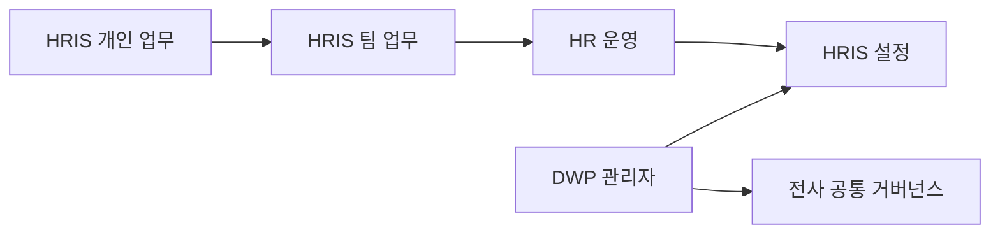
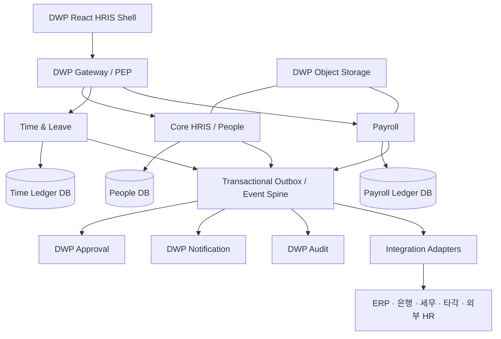
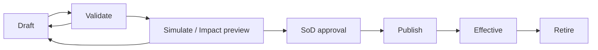
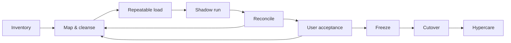

# DWP HRIS 완전 이관 마스터 플랜

## 1. 경영진 요약

### 권고안

SKKF HRIS가 가진 업무 범위는 충분히 넓다. 인사기본·조직·발령·계약·증명, 근무계획·근태마감·휴가, 급여계산·소급·사회보험·퇴직·연말정산, 목표·평가·다면·보정, 그리고 테넌트·메뉴·권한·코드·다국어·양식·배치·감사 기능까지 확인됐다. 그러나 현 구조를 그대로 DWP에 이식하면 다음 세 가지 부채도 함께 이관된다.

1. 서비스마다 반복된 공통 코드와 공통 테이블
2. 소스에 혼재된 고객사 전용 분기
3. 동적 메뉴 DB와 사설 공통 JAR에 숨어 있는 권한·실행 의미

따라서 목표는 **소스 복제**가 아니라 **업무 능력 완전 이관**이어야 한다. DWP의 현행 기반을 시스템 오브 레코드로 삼고, SKKF를 행위 명세와 대조 데이터로 사용해 재구현하는 스트랭글러 방식이 가장 안전하다.

### 즉시 승인할 11개 결정

| 번호 | 결정 | 권고 |
|---|---|---|
| D-00 | HRIS/급여 SoR | 완전 이관 목표상 DWP를 Core HR·Time·Payroll의 최종 SoR로 설계. 현행 외부 HRIS/Payroll projection 원칙은 ADR로 변경 |
| D-01 | 제품 명칭 | 사용자 표시만 `HRIS`로 변경. 내부 `hcm`, `/hr`, canonical `APP.HCM`은 1차에서 유지하고 `APP.HRIS`는 compatibility alias로 읽음 |
| D-02 | 이관 방식 | 화면·서비스 1:1 복제 금지, 업무 능력 기준 재구현 |
| D-03 | 런타임 경계 | Core HRIS/People, Time, Payroll의 논리 경계. 완전 이관 목표에서는 Time과 Payroll을 각각 신규 런타임·원장으로 구축하고, 현행 People의 근태/휴가는 전환기 호환 파사드로만 유지 |
| D-04 | 설정 소유권 | 공통 거버넌스는 DWP 관리자, 업무 규칙은 HRIS 관리 영역 |
| D-05 | 커스텀 정책 | 제품 코어 → 국가팩 → 테넌트 설정 → 확장팩의 4계층; 고객사 포크 금지 |
| D-06 | 계산 데이터 | 급여·근태·휴가를 버전형 원장으로 설계, 확정 결과 직접 수정 금지 |
| D-07 | 전환 원칙 | 도메인별 단일 SoR, 변경 동결·그림자 실행·대사·롤백 증적 필수 |
| D-08 | 권리/보안 | 소스 사용권, OSS, 비밀정보 검증 게이트를 개발 착수 조건으로 지정 |
| D-09 | 권한 모델 | DWP 네이티브 앱 grant·role·scope/field를 product access package로 원자 결합; SKKF 권한모델 복제 금지 |
| D-10 | 디자인 순서 | 기능·권한·상태·오류·대사까지 G4 검증 후 모듈별 전체 화면 Design AI 패키지를 G5A에서 만들고, G5B 사용자·제품 owner 승인 뒤 G5C에서 시각 디자인 교체·회귀; 구현 중에는 semantic scaffold만 사용 |

### 현재 DWP의 활용 가치

DWP는 이미 `dwp-people-server`에 인물, 고용관계, 배치, 조직, 직무, 위치, 유효일자 조직 그래프, 민감정보 암호화, 외부 매핑, 동기화·대사, 감사·아웃박스, 접근 경계와 통제된 반출 모델을 갖고 있다. 프론트도 `SELF`, `TEAM`, `OPERATIONS`, `MANAGEMENT` 표면과 정책·capability 기반 진입 제어를 갖추고 있다. 이 부분은 폐기 대상이 아니라 HRIS의 핵심 기반이다.

반면 현행 급여는 급여주기와 명세서 참조 중심이고, 근태는 기본 입력·승인 중심이다. SKKF 수준의 급여 계산 엔진, 법정 공제, 사회보험, 퇴직·연말정산, 소급, 지급·회계, 근태 해석·일/월 마감, 복합 스케줄, 평가 주기·보정은 신규 구축 범위다.

현행 DWP 문서는 외부 HRIS/Payroll을 원장으로 두는 projection 모델을 전제한다. 이 문서는 사용자의 `SKKF 완전 이관` 목표를 우선해 **목표 상태에서 DWP가 Core HR·Time·Payroll의 canonical SoR이 된다**고 가정한다. 외부 급여를 계속 사용하는 고객은 connector/hybrid 모드로 지원할 수 있지만, 제품 코어의 계산·원장 책임을 모호하게 두지는 않는다. 구현 착수 전 이 제품경계 변경, 법정 급여 책임, 운영 support 모델을 ADR로 승인해야 한다.

## 2. 분석 범위와 판정 원칙

### 포함

- SKKF 공통설정/SYS
- HRM: 인사기본, 조직, 발령, 계약, 증명, 변경요청, 퇴직 등
- TIM: 근무계획, 출퇴근, 시간해석, 예외, 연장근무, 휴가, 일·월 마감 등
- PAY: 급여기준, 계산, 소급, 결과, 지급, 세금, 보험, 퇴직, 연말정산 등
- PER: 목표, 평가, 다면, 면담, 보정, 결과 등
- DWP 현행 People/HCM, 관리자, 권한, 승인, 감사, 알림, 연계 구조

### 제외

- BENSK 및 ADDSK의 업무 기능과 고객사 구현
- 레거시 인프라를 그대로 운영하는 방안
- 운영 DB가 없는 상태에서의 실제 사용자별 메뉴 노출 순서 확정

### 기능 판정 코드

| 코드 | 의미 | 예시 |
|---|---|---|
| `REUSE` | DWP 현행을 유지·확장 | 사람/고용/배치, 접근 경계, 감사/아웃박스 |
| `REBUILD` | SKKF 행위를 기준으로 DWP에 재구현 | 급여 계산, 근태 해석, 평가 주기 |
| `CONFIGURE` | 코드가 아닌 버전형 설정으로 전환 | 수당식, 휴가 규칙, 승인선, 코드/다국어 |
| `EXTENSION` | 국가 또는 고객 확장팩으로 분리 | 한국 세법, 특정 사내수당, 전용 연계 |
| `RETIRE` | 중복·샘플·낡은 구현 제거 | 퍼블리싱 예제, 중복 공통 모듈 |
| `UNKNOWN` | DB·실행 추적이 필요한 항목 | 동적 메뉴가 가리키는 운영 프로그램 |

`완전 이관`은 모든 레거시 파일을 옮겼다는 뜻이 아니라, 모든 업무 능력과 법정 결과가 위 판정 중 하나로 귀결되고 추적 대장에 근거와 승인자가 남는 상태를 의미한다.

## 3. 현행 분석 결과

### 3.1 SKKF 규모

정적 분석 기준으로 다음이 확인됐다.

| 구분 | HRM | PER | PAY | TIM | SYS | YEA | 합계/비고 |
|---|---:|---:|---:|---:|---:|---:|---|
| 프론트 라우트 선언 | 193 | 121 | 189 | 196 | 153 | 34 | 886 |
| `*Controller.java` 후보 | 246 | 126 | 199 | 232 | 22 | - | 825; 표준 controller annotation 후보 820 |
| JPA 엔티티 | 144 | 102 | 158 | 140 | 14 | - | 558 |
| Java 파일 | 1,867 | 1,544 | 2,211 | 2,394 | 243 | - | 8,259 |
| Vue 파일 | 353 | 260 | 281 | 326 | 200 | 193 | 1,613 |

수치는 기능 수가 아니라 코드 선언 수다. 상세/팝업/별칭/동적 경로, 퍼블리싱 샘플, 모듈별 중복 공통 코드가 포함된다. raw artifact 2,269건 중 BENSK benefit route 2건은 대장에서 삭제하지 않고 `RETIRE / EXCLUDED_BENSK`로 선판정했다. 민감 경계 9건은 `SECURITY_BLOCKED_UNKNOWN`으로 격리했고, 2,258건만 정제 분석 뷰에서 직접 characterization할 수 있다. 9건은 누락이 아니라 Security 검토 또는 안전한 행위 대체 설계가 필요한 명시적 `UNKNOWN`이다. 정확한 목록은 coverage와 sanitized-access CSV를 함께 사용한다.

### 3.2 SKKF의 강점

- 한국 기업 HR 운영에 필요한 업무 범위가 넓다.
- 회사·사업단위·사업장과 유효기간 개념을 다수 모델에서 사용한다.
- 급여기준, 계산, 소급, 보험, 퇴직, 연말정산까지 운영 흐름이 이어진다.
- 근무계획에서 일/월 마감, 예외, 휴가까지 실무 단계를 포함한다.
- SYS가 메뉴·프로그램·역할·사용자·다국어·공통코드·템플릿·배치·로그를 폭넓게 다룬다.
- 화면과 API가 많아 업무 명세를 역추출할 풍부한 단서를 제공한다.

### 3.3 그대로 이관하면 안 되는 부분

| 발견 | 영향 | 목표 처리 |
|---|---|---|
| HRM/PER/PAY/TIM마다 `app/com` 및 공통 인물·조직·코드 구현 반복 | 데이터 주인과 규칙 불일치 | DWP 공통 계약과 한 개 SoR로 통합 |
| 모듈마다 사설 `worx-*`, `hr-common-*` JAR 버전이 다름 | 실제 권한/예외/트랜잭션 의미가 불투명 | 행위 테스트로 의미 추출 후 DWP 표준으로 재구현 |
| Spring Boot 2.2.5, Java 8, Vue 2.6, Vue CLI 4 | 보안·운영·채용·유지보수 비용 | DWP Java 21/Spring Boot 3, React/TS 체계 유지 |
| 정적 프론트 테스트가 사실상 없음, 각 주요 백엔드 서비스의 테스트도 극소수 | 회귀 위험 | 골든마스터·계약·결정표 테스트 선행 |
| 고객사 식별자와 사별 용어가 다수 소스에 직접 존재 | 범용 코어 오염 | 설정/국가팩/확장팩으로 격리 |
| 메뉴가 `/sys/auth/menu`에서 동적 로딩 | 소스만으로 실제 역할별 메뉴 확정 불가 | 운영 메뉴·역할·프로그램 DB export 확보 |
| 확정 결과를 일반 CRUD로 다룰 가능성이 있는 코드와 native SQL hotspot | 정합성·감사 위험 | 원장·확정·역분개·재실행 모델 도입 |
| 소스 헤더에 사전 승인 없는 복사·사용 금지 문구, 최상위 명시 라이선스 미발견 | 법적 이관 리스크 | 사용권 증빙 게이트 또는 clean-room 재구현 |

고객사 표식 정적 검색에서는 `SK2` 141개 파일, `SKC` 32개, `SKKF` 1개, `키파운드리` 67개 파일이 탐지됐다. 단순 문자열 탐지이므로 모두 커스텀이라고 단정하지는 않지만, 코어 반입 전 격리 심사를 해야 할 충분한 신호다.

### 3.4 DWP의 현재 격차

| 영역 | 현재 DWP | 완전 HRIS 목표 | 판정 |
|---|---|---|---|
| 인물·고용·배치·조직 | 강한 기반과 유효일 모델 존재 | 발령·계약·변경요청·퇴직·증명 확장 | `REUSE + BUILD` |
| 권한 | 표면/리소스/권한/범위 계약 존재 | 필드·행·대상집단·직무분리 강화 | `REUSE + HARDEN` |
| 근태 | 기본 일정, 카드, 입력, 예외 | 원시타각, 해석, 일/월마감, 복합규칙 | `REBUILD` |
| 휴가 | 계획, 등록, 잔액, 신청 | 발생·소멸·이월 원장과 국가 규칙 | `REBUILD` |
| 급여 | 급여주기·명세서 참조 | 계산·소급·법정공제·지급·회계·퇴직·연말정산 | `NEW BOUNDED CONTEXT` |
| 성과 | 목표·학습 기초 | 주기·평가자·다면·보정·결과 | `BUILD` |
| 통합 | 커넥터·매핑·receipt·대사 기반 | HR 이벤트·재처리·급여/근태 어댑터 | `REUSE + EXTEND` |
| 운영 UX | 4개 역할 표면과 반응형 셸 | 업무별 command center·설정 studio | `REUSE + EXTEND` |

## 4. 목표 제품 구조

### 4.1 사용자에게 보이는 4개 작업면



- **개인 업무**: 내 정보, 근태, 휴가, 급여·연말정산, 목표·평가, 증명·요청
- **팀 업무**: 팀 현황, 근태·휴가 승인, 인사변경, 평가 수행
- **HR 운영**: 인사·조직·근태·휴가·급여·성과의 일상 운영과 마감
- **HRIS 설정**: HR 업무 규칙, 계산기준, 폼·워크플로, 연계, 확장
- **DWP 관리자**: 제품 자격, ID/역할, 전사 분류·감사·비밀·확장 거버넌스

사용자/관리자를 이분법으로만 나누지 않는다. DWP 관리자 UI에서 HRIS 앱 아래에 직원, 관리자, HR 운영, 근태 운영, 급여 운영, 성과 운영, HRIS 설정, 전사감사의 기본 권한 패키지를 두고 메뉴별 atomic capability로 세분화한다. 물리적으로 독립된 app grant, role/permission, target population/field policy는 한 개 versioned access-package assignment가 원자적으로 묶는다. 상세는 `authorization-blueprint.md`를 따른다.

**권한체계 판단:** DWP의 현행 권한 골격은 충분하다. 별도 HRIS 권한 엔진이나 SKKF 권한 테이블은 필요 없다. 다만 현재 app grant·role·People 접근정책이 독립이고 일부 scoped group role은 런타임 반영이 불완전하므로, 이를 묶는 product-neutral access-package aggregate가 필요하다. HRIS capability catalog, 급여 Maker/Checker SoD, field group, 모든 surface의 앱권한 교집합, 메뉴와 API PEP 동기화를 함께 고도화한다. 관리자 UI에서는 이를 `HRIS 권한그룹`으로 한 번에 관리하되 내부의 구성원 그룹과 atomic duty는 분리한다.

### 4.2 런타임 아키텍처



#### 배포 권고

1. `dwp-people-server`는 Core HRIS의 SoR과 기존 API 호환 파사드를 유지한다.
2. 급여는 초기부터 별도 런타임과 DB/암호키/배포권한을 사용한다. 금액, 법정기준, 배치부하, 직무분리 요구가 다르기 때문이다.
3. 근태는 완전 이관 목표에서 신규 `dwp-time-server`와 Time ledger DB로 구축한다. 현행 People V38 기반 `tme_*`·`abs_*`는 수정하지 않고 forward migration, compatibility facade와 명시적 단일 SoR 전환으로 걷어낸다. 원시타각·해석·승인·마감·보정은 처음부터 독립 계약으로 둔다.
4. 승인·알림·메일·파일·감사·스케줄러 엔진을 HRIS 안에 다시 만들지 않는다. DWP 공통 서비스에는 업무 ID와 불변 event/receipt를 넘긴다.
5. 외부 시스템은 코어 테이블을 직접 읽거나 쓰지 않는다. 버전형 API, event, staging·mapping·reconciliation 경로만 사용한다.

### 4.3 동기/비동기 계약

| 패턴 | 적용 | 필수 속성 |
|---|---|---|
| 동기 command | 개인정보 변경, 휴가 신청, 승인 | idempotency key, actor, target scope, expected version |
| 동기 query | 프로필, 잔액, 명세서 조회 | tenant/scope 필터, field masking, as-of date |
| 비동기 job | 급여 계산, 근태 월마감, 대량 업로드, 대사 | receipt, 단계/진척, 재시도, 취소 가능 구간, 결과 파일 |
| domain event | 입사·배치변경·휴가승인·근태마감·급여확정 | event id, schema version, occurred/effective time, causation/correlation |
| controlled export | 급여·인사 대량 반출 | 목적, 승인, 만료, 워터마크, 다운로드 감사 |

API는 레거시 컨트롤러 수를 따라 수천 개 CRUD로 늘리지 않는다. `calculate payroll`, `close time period`, `publish policy`처럼 업무 불변식을 책임지는 use-case 계약으로 설계한다.

## 5. 코드와 워크스페이스 구조

### 5.1 프론트엔드

기존 `hcm` 식별자는 호환 경계로 유지하고, 신규 코드는 feature slice로 점진 이동한다.

```text
apps/dwp/src/features/hris/
  shell/                 # 제품 표면, route projection, compatibility aliases
  home/                  # 개인/팀/운영 command center
  people/                # 인사기본·고용·배치·발령·계약
  organization/          # 조직·직무·직급·포지션
  time/                  # 일정·타각·해석·마감
  leave/                 # 휴가·발생·잔액원장
  payroll/               # 계산·검증·지급·회계·명세
  performance/           # 목표·평가·보정
  employee-services/     # 변경요청·증명·문서
  administration/       # 정책·규칙·폼·설정
  integrations/         # 커넥터·매핑·대사
  shared/                # HRIS 전용 typed primitives만
```

각 slice 내부는 화면 크기와 무관하게 업무 단위로 나눈다.

```text
payroll/run/
  api/
  model/
  views/
  components/
  tests/
```

- SKKF의 Vue 컴포넌트를 React wrapper로 감싸 장기 운영하지 않는다.
- 레거시 화면의 필드·검증·상태 전이는 추출하되 DWP design system과 접근성 계약으로 다시 만든다.
- 페이지는 목록 카드의 집합이 아니라 하나의 주 질문과 주 행동을 갖는다.
- 라우트는 기능마다 세분화하기보다 list-detail, step route, query state를 사용해 정보구조를 안정화한다.

### 5.2 백엔드

```text
dwp-people-server/
  hris/
    people/
    employment/
    organization/
    performance/
    employeeservice/
    policy/
    integration/
    compatibility/

dwp-time-server/         # 신규 독립 Time & Leave 원장; 현행 People 근태/휴가는 전환 파사드
  schedule/
  clock/
  interpretation/
  timecard/
  leave/
  close/

dwp-payroll-server/
  foundation/
  element/
  formula/
  calculation/
  retro/
  statutory/
  retirement/
  yearend/
  payment/
  accounting/
  payslip/
```

각 bounded context는 `domain`, `application`, `adapters/in`, `adapters/out` 경계를 갖는다. 다른 context의 테이블/Repository를 직접 참조하지 않고 public ID, API, event를 사용한다. 공통 라이브러리는 `Money`, `EffectivePeriod`, `TenantContext`, `Actor`, `Receipt`처럼 안정적인 값/계약에 한정한다. 인사 업무 서비스를 다시 `common`에 넣지 않는다.

### 5.3 명칭 변경 전략

현행 프론트 manifest에는 `id: hcm`, `appKey: APP.HCM`, `basePath: /hr`가 있고 소스 전반에 HCM 참조가 넓다. 1차에 일괄 rename하면 route, 권한, saved view, bookmark, telemetry, E2E 계약이 동시에 깨질 수 있다.

| 단계 | 사용자 표시 | 내부 계약 |
|---|---|---|
| 1 | `인사` → `HRIS` | `hcm`, `/hr`, `APP.HCM` 유지 |
| 2 | 신규 문서/이벤트에 `HRIS` canonical 명칭 도입 | HCM alias 및 deprecation telemetry |
| 3 | 충분한 사용량·클라이언트 확인 후 선택적 migration | redirect/alias 최소 1개 release train 유지 |

DWP 소스에서 `HRIS`라는 말은 현재 외부 인사원장 connector/workbench 의미로도 사용된다. 앱 전체를 HRIS로 바꿀 때 해당 하위 메뉴는 `외부 HR 시스템`, 영문 `Source systems & connectors`로 재명명해 제품명과 연계대상을 구분한다. 코드 namespace 변경은 표시명 변경과 분리하고 deprecation 기간을 둔다.

## 6. 설정 아키텍처

### 6.1 DWP 관리자에 추가할 공통 설정

| 메뉴 | 소유 | 주요 기능 |
|---|---|---|
| HRIS 제품 및 국가팩 | Platform admin | 테넌트 entitlement, 국가/법정팩 설치, 버전·지원기간 |
| HRIS ID·역할·직무분리 | Security admin | HR persona, 대상집단, 필드그룹, 급여 maker-checker |
| 데이터 분류·보존·동의 | Privacy admin | 민감도, 보존/파기, 접근근거, 정보주체 요청 |
| 확장팩 거버넌스 | Platform/Security | 서명, 권한·데이터 선언, 호환 버전, 설치·중지·철회 |
| 연계 자격증명과 endpoint | Integration admin | 비밀 참조, 네트워크, 인증서, 허용 목적지 |
| 전사 감사·반출 정책 | Audit admin | 이벤트 보존, 조사, controlled export 정책 |

### 6.2 HRIS 관리 영역에 둘 도메인 설정

| 그룹 | 설정 |
|---|---|
| Enterprise | 법인/고용주, 사업단위, 사업장, 조직·직무·직급·포지션, 번호체계 |
| Reference | 코드셋, 다국어, 사유, 상태, 통화, 단위, 캘린더·공휴일 |
| People | 고용형태, 발령유형, 계약/증명/서약 양식, 개인정보 필드 구성 |
| Time | 근무제, 교대/스케줄, 타각원천, 해석 규칙, 연장/휴일, 마감 정책 |
| Leave | 휴가유형, 발생·소멸·이월, 사용순서, 증빙, 음수잔액·중복 정책 |
| Payroll | 급여그룹/달력, 항목, 산식, 과세/비과세, 소급, 지급·회계 매핑 |
| Statutory | 세율·보험·퇴직·연말정산 규칙 버전과 근거 |
| Performance | 주기, 템플릿, 평가군/평가자, 배점, 다면, 보정·공개 정책 |
| Workflow | 승인선, 위임, SLA, 알림, 예외 에스컬레이션 |
| Document | 문서/리포트/메일/알림 템플릿, 출력·전자서명, 보존 |
| Integration | 커넥터, 매핑, 동기화 주기, 대사, 오류 격리, 재처리 |
| Extensibility | custom field, rule, webhook, tenant extension 활성화 |

### 6.3 설정 변경 생명주기



모든 설정은 `tenant + scope + effective period + version`을 가진다. 게시된 버전은 덮어쓰지 않고 새 버전을 만든다. 급여·근태 계산 run은 사용한 규칙·코드·조직·환율·법정팩 버전을 스냅샷으로 고정한다.

## 7. 범용 기능과 회사별 커스텀의 경계

### 7.1 4계층 모델

| 계층 | 예 | 변경 주체 | 배포 |
|---|---|---|---|
| DWP HRIS Core | 사람, 고용, 배치, 원장, 승인 연결, 감사 | 제품팀 | 공통 release |
| Country/Jurisdiction Pack | 한국 세법, 4대보험, 퇴직, 연말정산 | 법정팩팀 | 서명된 독립 버전 |
| Tenant Configuration | 조직명, 수당식, 캘린더, 승인선, 양식 | 고객 관리자 | 검증·승인 후 게시 |
| Tenant Extension Pack | 사내 특수제도, 전용 ERP/은행, 독자 알고리즘 | 확장팀 | 격리·계약시험 후 설치 |

### 7.2 설정과 확장 코드의 선택 기준

다음은 설정으로 해결한다.

- 코드·명칭·다국어
- 대상집단과 유효기간
- 계산식과 decision table로 표현 가능한 규칙
- approval workflow, 알림, 양식, 보고서
- custom field와 validation
- import/export mapping

다음 조건에서만 확장 코드를 허용한다.

- 외부 시스템 특수 프로토콜 또는 독자 암호화
- 샌드박스 규칙 엔진으로 표현할 수 없는 복합 알고리즘
- 코어 release 주기와 분리돼야 하는 국가·산업 규정

확장팩은 서명된 manifest, 호환 API 버전, 요청 권한, 사용하는 데이터 분류, 설정 schema, migration, health check, 제거 절차, 자동 계약 테스트를 선언해야 한다. 코어 DB 직접 접근과 코어 클래스 override는 금지한다. 고객사마다 Git branch를 만들지 않는다.

### 7.3 SKKF 고객사 코드 처리

1. 고객사 표식이 있는 파일을 quarantine 목록으로 만든다.
2. 보편 규칙, 한국 국가 규칙, 진짜 고객 특수 규칙으로 HR SME가 판정한다.
3. 보편 규칙은 익명화된 결정표/테스트로 코어에 반영한다.
4. 국가 규칙은 근거와 시행일을 가진 country pack으로 옮긴다.
5. 고객 특수 규칙은 tenant config 또는 extension pack으로만 구현한다.
6. 어떤 층에도 필요 없는 dead path는 `RETIRE`하고 승인 근거를 남긴다.

## 8. 데이터 설계 원칙

상세 테이블은 별도 카탈로그를 참조한다. 모든 신규 테이블은 다음을 기본 계약으로 갖는다.

- `tenant_id`를 모든 PK/UK/FK 경계에 포함하고 tenant 불일치 FK를 DB에서 차단
- 외부 노출용 UUID `public_id`와 내부 key 분리
- 유효일 데이터는 `[valid_from, valid_to)` 규칙과 중복 금지 constraint 사용
- 기술 시간(`recorded_at`)과 업무 효력 시간(`effective_at`)을 분리
- 금액은 `NUMERIC`과 ISO currency 사용, 부동소수점 금지
- 급여·근태·휴가 확정 데이터는 append-only entry와 reversal/correction 사용
- PII/급여/건강/장애 등은 필드그룹별 암호화·마스킹·목적기반 접근
- `created_by`, `updated_by`, `version`, `correlation_id`, source/provenance 유지
- 대량 원장은 tenant/기간 partition, 조회 projection, 보관 계층을 설계
- 애플리케이션 권한 외에 PostgreSQL RLS를 방어 계층으로 검토

## 9. 이관 실행 계획

아래 Phase는 통합·출시 Exit 순서다. 5개 전문 세션의 G1 characterization은 G0 격리 후 병렬로 수행하며, 각 모듈의 기능 코드는 선행 계약이 고정된 vertical slice부터 열린다.

### Phase 0 — 권리·명세·데이터 가드레일

- 소스 사용권/계약 범위, OSS notice/SBOM, 비밀정보 scan·rotation 확인
- 운영 메뉴·프로그램·역할·사용자메뉴 DB export 확보
- 스케줄러/배치 목록, 운영 파라미터, 실제 external interface 목록 확보
- 대표 3개 이상 회사/급여군/근무제를 익명화한 golden dataset 구축
- 886 route, 825 controller, 558 entity를 추적 대장으로 연결
- 기능별 SME와 owner, 법정근거, 중요도, 데이터 민감도 지정

**Exit:** `UNKNOWN` 항목에 owner와 해소 계획이 있고, 코드 사용 방식이 법무/보안 승인됨.

### Phase 1 — HRIS 셸과 공통설정

- 표시명 HRIS 전환, 기존 URL/권한 alias 유지
- 4개 작업면과 persona/capability 계약 확정
- versioned policy, code, calendar, custom field, extension registry 구축
- DWP 승인·감사·알림·반출·secret 연동
- 공통 import receipt, mapping, reconciliation 확장

**Exit:** 설정의 draft→simulate→approve→publish→rollback과 tenant 격리 테스트 통과.

### Phase 2 — Core HR/조직/직원 서비스

- 사람·고용·배치 DWP 모델을 기준으로 SKKF 데이터 매핑
- 발령, 계약, 변경요청, 증명, 가족·경력·자격 등 민감 profile 확장
- 조직/직무/직급/포지션 및 as-of 조회
- 직원·관리자 self-service와 승인 연결
- CDC 또는 반복 가능한 batch로 shadow projection 검증

**Exit:** 인원/재직/배치/조직 수량과 유효일 무결성, 필드 마스킹, 부정 권한 테스트 통과.

### Phase 3 — Time & Leave

- 원시 타각을 불변 저장하고 규칙 버전별 해석 결과 생성
- 스케줄, 교대, 유연근무, 연장/휴일/예외, 일·월마감
- 휴가 entitlement 원장, 발생·소멸·이월·사용·취소
- 기존과 그림자 계산 후 직원/일/월/유형별 대사

**Exit:** 대표 근무제의 golden 결과 일치, 마감 후 직접수정 불가, 재개방과 재마감 감사 가능.

### Phase 4 — Payroll & Statutory

- 급여기준/항목/산식/employee entry, 계산 graph와 trace
- regular/off-cycle/retro, 세금·보험, 퇴직·연말정산
- payment instruction, payslip, GL posting, 대사
- maker-checker, step-up, run freeze, reversal
- 최소 2~3개 실제 주기 parallel run

**Exit:** 개인별·항목별·총액·세금·보험·지급·GL이 승인된 허용오차 내 일치. 화폐 결과의 기본 허용오차는 0이며 법정 반올림 차이만 근거와 함께 예외 승인.

### Phase 5 — Performance 및 고도화

- 주기·목표·평가자·다면·면담·보정·결과 공개
- 분석 projection과 설명 가능한 결과
- 법정팩/확장팩 marketplace 운영 모델
- 레거시 기능별 종료와 archive/retention

**Exit:** 주기·평가 상태전이, 대상/평가자 snapshot, 보정 SoD, 결과공개 정책과 회귀 증거가 고정되고 모든 PER source 행이 판정됨.

### Phase 6 — Design AI handoff 및 시각 교체

- `G5A DESIGN_REQUEST_READY`: G4를 통과한 실제 route, ViewModel, command, 상태, 권한, 오류, 접근성 fixture를 [모듈별 전체 화면 Design AI 전달 계약](./session-prompts/90-design-ai-handoff-output-contract.md)에 맞춰 패키징한다.
- `확장형 근무공간 예약 구축` 방식으로 README·첫 요청문·공통 계약·home brief/prompt·전체 화면군 prompt·현재 화면·state matrix·audit/review/verification·검증 ZIP을 만든다. route뿐 아니라 tab·dialog·wizard·document·persona/권한/상태 variant까지 coverage 100%, `UNMAPPED=0`이어야 한다.
- `G5B DESIGN_ACCEPTED`: editable 원본, frame ID/name, component·variant·token·interaction, asset/license를 수령하고 사용자·제품 owner가 module home부터 화면군별로 승인한다.
- `G5C VISUAL_REPLACEMENT_COMPLETE`: 세련되고 편안한 사용자 경험으로 시각 계층·반응형·motion을 교체하되 기능 계약을 보존하고 상태·권한·API·키보드·접근성·반응형·시각·golden 회귀를 수행한다.
- 실제 인사·급여·계좌·주민식별·세무·평가 데이터는 외부 Design AI에 전달하지 않고 합성 fixture와 승인된 비가역 마스킹만 사용한다.

**Exit:** G5A 패키지와 무결성, G5B 승인·반환물 추적, G5C 디자인 변경 전후 회귀가 모두 통과하고 모든 상태와 persona/scope 조합이 검증됨.

### 테넌트 전환 절차



- 기능별 dual-write를 장기간 유지하지 않는다.
- 컷오버 시점마다 어느 시스템이 SoR인지 하나만 지정한다.
- 모든 load는 재실행 가능하고 동일 입력에 동일 결과를 내야 한다.
- 실패 시 되돌릴 route alias, feature flag, DB snapshot/restore 절차, 미처리 event 재생 위치를 문서화한다.

## 10. 검증 체계

### 10.1 테스트 피라미드가 아니라 증거망

| 증거 | 목적 |
|---|---|
| Legacy characterization | 레거시 입력→출력·상태전이 보존 |
| Golden decision table | HR/급여/근태 SME가 업무 규칙을 검증 |
| Contract test | UI/API/event/확장팩 호환성 |
| Property test | 금액 합계, 원장 보존, 유효일 중복 금지 |
| Tenant negative test | 타 테넌트 key를 사용한 조회/수정 실패 |
| Authorization matrix | persona × resource × action × scope × field |
| Migration reconciliation | 수량, checksum, 핵심 aggregate, 표본 상세 |
| Performance/soak | 월마감·급여 peak와 대량 export |
| Accessibility/responsive | keyboard, screen reader, 1440/1280/390/320, zoom |
| DR rehearsal | 급여 run·event·파일을 RPO/RTO 안에서 복구 |

### 10.2 도메인 불변식 예시

- 한 worker의 주 고용/주 배치는 같은 유효구간에 허용 개수를 넘지 않는다.
- 같은 tenant와 payroll period에서 확정된 동일 run type은 중복 게시되지 않는다.
- 급여 result line 합은 worker result와 run total에 일치한다.
- 지급 instruction 합과 승인된 지급 대상 합이 일치한다.
- leave balance는 거래 원장의 합에서 재생성할 수 있다.
- 월마감 이후 time entry는 직접 변경되지 않고 correction entry를 만든다.
- 모든 변경·계산·승인·반출은 actor와 correlation ID로 end-to-end 추적된다.
- 테넌트/대상집단/필드 범위를 벗어난 읽기·쓰기·검색·export가 모두 실패한다.

## 11. 운영·보안·컴플라이언스

### 반드시 추가할 통제

- 급여 설정자/계산자/승인자/지급파일 생성자의 직무분리
- 급여/주민식별/계좌/건강 관련 field group 암호화와 별도 key rotation
- 민감 화면 step-up 인증, 짧은 세션, copy/download/print 감사
- 승인된 목적과 만료를 가진 controlled export
- 법정 규칙의 근거 URL/문서, 시행일, 검토자, 테스트 case 기록
- payroll/time close의 immutable audit bundle
- 비동기 작업의 queue depth, retry, poison message, reconciliation SLO
- per-tenant capacity, rate limit, 대량작업 window와 noisy-neighbor 방지
- 보존기간 종료 시 legal hold 확인 후 암호학적/물리적 파기

### AI 기능 원칙

DWP 에이전트는 정책 설명, 오류 원인 요약, 대사 차이 분류, 설정 변경 초안과 영향 분석에 유용하다. 그러나 채용·평가·보상·징계와 같은 고영향 인사결정을 자율 확정하거나, 급여 계산 결과를 승인 없이 변경하지 않는다. 제안과 근거를 남기고 권한 있는 사람이 승인하게 한다.

## 12. 리스크와 완화책

| 우선순위 | 리스크 | 조기 신호 | 완화 |
|---|---|---|---|
| P0 | 코드 사용권 불명확 | 계약/승인 문서 부재 | clean-room 경계, 법무 승인 전 코드 복사 금지 |
| P0 | 급여 결과 불일치 | 사번/항목별 차이 반복 | 골든 데이터, formula trace, 2~3주기 parallel run |
| P0 | 테넌트/민감정보 누출 | tenant 없는 query, 과도한 export | composite FK/RLS, negative test, field policy |
| P1 | 동적 메뉴 누락 | source route와 실제 메뉴 차이 | 운영 DB export, role별 crawl, 사용 로그 |
| P1 | 고객사 분기가 코어로 유입 | 사명/전용코드가 core PR에 등장 | quarantine lint, 4계층 architecture review |
| P1 | 빅뱅 일정 붕괴 | 모든 도메인이 동시에 `in progress` | capability slice, exit gate, 테넌트별 strangler |
| P1 | 중복 공통 플랫폼 재구축 | HRIS 내 승인/알림/파일 서비스 생성 | DWP platform ADR와 dependency rule |
| P2 | 화면 수를 완료율로 오인 | route 구현률만 보고 | end-to-end 업무 scenario와 대사 지표 사용 |

## 13. 성공 지표

### 제품 완성도

- 레거시 capability의 100%가 추적 대장에서 판정·승인됨
- P0 업무 시나리오 100%, P1 95% 이상 자동화
- 알려진 고객사 하드코딩 0건이 제품 코어에 존재
- 정책/산식/법정팩 100%가 버전·효력일·근거·승인자를 보유

### 정확성과 통제

- 급여 병행 결과: 승인되지 않은 금액 차이 0건
- 근태/휴가 원장 재생성 결과와 projection 차이 0건
- tenant escape와 권한 negative test 통과율 100%
- 확정 run/마감의 직접 update/delete 0건
- 모든 고위험 변경의 impact preview, approval, audit, recovery 증적 100%

### 운영성

- P0 batch가 정의된 window 안에 완료
- 실패 작업 100%가 receipt/correlation ID로 원인 추적 가능
- 연계 재처리가 중복 결과를 만들지 않음
- 확장팩 upgrade contract test 통과율 100%

## 14. 추가 제안

### 14.1 Behavioral specification mining을 별도 워크스트림으로 운영

소스 독해만으로 급여·근태의 숨은 순서와 반올림·예외를 모두 알아낼 수 없다. 레거시를 테스트 하네스로 감싸 대표 입력을 넣고 API 응답, DB 변화, 파일, 상태전이를 캡처한다. 이 결과를 DWP 구현의 실행 가능한 인수 기준으로 만든다. 이는 단순 코드 마이그레이션보다 위험을 크게 줄이는 핵심 작업이다.

### 14.2 “왜 이 결과인가”를 제품 기능으로 제공

급여 항목과 근태 결과마다 입력값, 적용 규칙 버전, 중간 계산, 반올림, 예외, 승인 이력을 권한 있는 운영자가 설명 가능하게 한다. 대사와 문의 처리 시간이 줄고 법정 검증도 쉬워진다.

### 14.3 HR event spine을 DWP 전 제품의 계약으로 승격

`WorkerHired`, `AssignmentChanged`, `LeaveApproved`, `TimePeriodClosed`, `PayrollPosted`를 버전형 event catalog로 관리한다. Provider, Approval, Notification, Agent가 People DB를 직접 읽는 결합을 줄이고 재생·대사를 가능하게 한다.

### 14.4 국가팩 적합성 인증 절차 도입

국가팩 release마다 법령 근거, 효력일, 회귀 case, 샘플 결과, SME/법무 승인, 이전 버전 종료일을 하나의 evidence bundle로 배포한다. 고객별 법정 코드를 복제하지 않아도 된다.

### 14.5 최신 HRIS 확장은 별도 제품 로드맵으로 연결

2026-09 기준 주요 HCM 제품의 공식 기능 범위는 core HR·급여·근태만이 아니라 skills 기반 인재관리, 채용·온보딩·학습·내부이동, workforce/compensation planning, employee listening·HR service delivery, contingent workforce, 분석과 AI 지원까지 확장돼 있다. [Workday HCM Suite](https://www.workday.com/en-us/products/human-capital-management/hcm-suite.html), [Workday Workforce Planning](https://www.workday.com/en-us/products/human-capital-management/workforce-planning.html), [SAP Talent Intelligence Hub](https://help.sap.com/docs/successfactors-platform/using-talent-intelligence-hub/talent-intelligence-hub), [Oracle HCM](https://www.oracle.com/human-capital-management/what-is-hcm/)을 비교 기준으로 사용한다.

- `P1`: skills/competency ontology와 성장 profile, ATS·온보딩, LMS, internal talent marketplace·승계, workforce/compensation planning
- `P1`: HR case/help, employee listening, advanced scheduling/labor demand, contingent workforce, people analytics
- `P2`: 자연어 self-service, 정책 설명, 초안·요약·이상치·시뮬레이션을 지원하는 governed AI

이 항목들은 [modern HRIS capability roadmap](./modern-hris-capability-roadmap.csv)에 등록하되 5개 source 세션의 “화면 수 늘리기”로 즉흥 구현하지 않는다. 먼저 Core HR의 신뢰 가능한 worker/skill/job data, permission, consent, provenance와 human-in-the-loop 계약을 만든 후 독립 Gate로 개발한다. 고용·평가·보상·징계·스케줄의 고영향 결정을 AI가 단독 확정하지 않도록 한다.

## 15. 다음 4주 실행 백로그

| 주 | 산출물 | 책임 구성 |
|---|---|---|
| 1 | 운영 메뉴/역할/배치/인터페이스 export, 권리 확인, capability owner 지정 | PM, 법무, 보안, SKKF 운영 |
| 1~2 | 추적 대장 1차 판정, P0 업무 여정 20~30개, 익명화 golden dataset | HR/급여/근태 SME, BA |
| 2 | ADR: 명칭 alias, service boundary, ledger, config/extension, event spine | Architecture, Platform, Security |
| 2~3 | HRIS information architecture, 5개 대표 journey의 command/state/permission/API 계약과 semantic fixture | Product, FE, BE, HR SME |
| 2~4 | Core/Time/Payroll schema spike, tenant/effective-date constraint test | BE, DBA, Security |
| 3~4 | 레거시 characterization harness와 첫 급여/근태 golden test | QA, BE, SME |
| 4 | 1차 vertical slice 선정 및 phase exit criteria 승인 | Steering group |

추천 첫 vertical slice는 `직원 기본/배치 조회 + 개인 변경요청 + 승인 + 감사`다. DWP 기반 재사용성을 검증하면서도 급여 계산보다 위험이 낮고, 이후 모든 도메인이 사용할 person/assignment/scope 계약을 조기에 고정할 수 있다. 동시에 급여·근태는 구현보다 characterization과 데이터 대사를 먼저 시작해야 전체 일정의 병목을 피할 수 있다. 시각 prototype은 이 기능 slice가 G4를 통과한 뒤 Phase 6에서 만든다.
