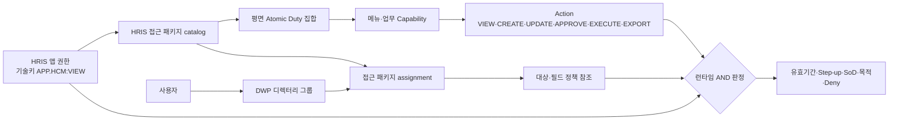

# DWP 네이티브 HRIS 권한그룹 설계

## 1. 결론

HRIS 전용 인증·권한 엔진을 새로 만들지 않는다. **DWP의 앱 권한, 디렉터리 그룹, 역할·리소스·행동 권한, 제품 surface/capability, 대상집단·필드그룹, 직무분리 체계를 확장**한다.



관리자에게 보이는 논리 권한은 `HRIS 앱 진입`이다. 현재 기술 canonical은 `APP.HCM:VIEW`, `APP.HRIS:VIEW`는 호환 alias다. 실제 메뉴와 API는 앱 진입권한, 하위 capability, action, 대상범위, 필드범위를 모두 충족해야 하며 명시적 `DENY`가 우선한다.

여기서 관리자 UI의 **권한그룹**은 하나의 관리 개념으로 제공하되, 물리 모델은 DWP처럼 분리한다.

- `com_groups`: 누가 속하는가 — 수동/SCIM 구성원
- atomic role/duty: 무엇을 할 수 있는가 — capability/resource/action의 최소 업무 단위
- product access package assignment: 어떤 앱·duty·정책을 어느 scope에서 언제까지 부여하는가

이 분리를 유지해야 같은 HRIS 권한 묶음을 여러 조직/SCIM 그룹에 재사용하고, 구성원 변경과 권한정의 변경을 독립적으로 감사할 수 있다. 별도 `hris_permission_groups` 테이블로 세 체계를 다시 합치지 않고, DWP 관리자 화면이 이들을 하나의 권한그룹 workflow로 조합한다.

## 2. DWP에 이미 있는 기반

| 현행 구조 | 확인된 구현 | HRIS 적용 |
|---|---|---|
| 앱 리소스 | `APP.HCM` canonical, `APP.HRIS` compatibility alias | HRIS 제품 진입 entitlement |
| 역할/권한 | `com_roles`, `com_resources`, `com_permissions`, `com_role_permissions` | HRIS permission bundle |
| 디렉터리 그룹 | `com_groups`, `com_group_members` | 부서/직무/운영팀 그룹 동기화 |
| 그룹-역할 할당 | `com_group_role_assignments` | 그룹 단위 역할 부여, scope/유효기간 |
| 역할 부여/충돌 정책 | `sys_role_assignment_policies`, `sys_role_conflict_policies` | 위임 주체와 SoD |
| HR 도메인 역할 | `TIME_ADMIN`, `ABSENCE_ADMIN`, `PAYROLL_ADMIN`, `TALENT_ADMIN` 등 | 현재 초안 재사용·세분화 |
| HR 데이터 경계 | workforce access policy | 대상집단·필드그룹·action 2차 검사 |
| 제품 surface | personal/team/operations/management | 메뉴 projection과 진입 policy |
| 앱 관리자 preset | scoped duty/resource set, user/group principal, 승인/만료/review | HRIS 권한 패키지 생명주기의 재사용 패턴 |

현재 `sys_admin_app_preset_catalog`에는 `HCM_PRESET_CATALOG_PENDING`이 `DRAFT`로 존재한다. 즉 HRIS 세부 패키지는 아직 승인되지 않았다. 또한 기존 HR 도메인 관리자 role은 `assignable_to_groups = FALSE`다. 그룹 중심 운영을 완성하려면 이 제약을 무조건 해제하지 않는다.

목표는 **제품 중립적인 access package**가 한 번의 승인 단위로 다음 세 가지를 묶는 것이다.

1. 디렉터리 그룹에 대한 canonical `APP.HCM:VIEW` grant
2. 세분화된 atomic role/duty 집합
3. People/Time/Payroll 소유의 대상집단·필드 정책 참조

기존 app-admin preset의 승인→활성화→만료→review→SoD 패턴은 재사용하되 `sys_admin_*` 테이블에 HR 업무권한을 그대로 밀어 넣지는 않는다. 할당은 DWP 디렉터리 그룹을 우선하고 직접 USER 할당은 예외·만료·사유·독립승인을 요구한다. 고위험 package는 짧은 review 주기를 적용한다.

`HRIS 앱 권한 하위`는 관리자 화면과 catalog의 논리적 소유관계다. 현재 DWP는 app grant, role permission, People 접근정책을 서로 독립 평가하므로 목표 access package가 셋을 원자적으로 조정하고 drift를 차단해야 한다. 런타임에서는 상위권한을 암묵 상속하지 않고 각 package가 앱 grant와 필요한 role/policy를 명시적으로 펼친다.

별도의 `parent_group_id`나 HRIS 전용 group table은 필요 없다. product key, package category와 assignment로 관리자 UI 트리를 구성한다. `com_role_hierarchy`와 과거 범용 SoD table은 후속 migration에서 의도적으로 제거됐으므로 되살리지 않는다. atomic duty는 평면 구조로 두고 versioned package가 명시적으로 조합하며, 명시적 DENY와 effective-user SoD를 우선한다.

호환 `APP.HRIS` grant/deny는 전환기간의 read/deny-fold 입력으로만 처리하고 신규 package projection은 canonical `APP.HCM` resource의 exact permission만 기록한다.

## 3. 권한그룹 논리 구조

### 3.1 앱 접근

| 구분 | 기술 계약 | 의미와 경계 |
|---|---|---|
| 현행 canonical | `APP.HCM:VIEW` | HRIS launchpad/셸 진입. 업무데이터 권한은 포함하지 않음 |
| 현행 호환 alias | `APP.HRIS:VIEW` | 전환기간 호환용이며 canonical과 deny 우선 규칙으로 함께 평가 |
| 관리 surface | `APP.HCM:VIEW` + exact configuration capability | 앱 진입과 설정 권한을 교집합으로 검사하며 별도 app-level permission을 신설하지 않음 |

현재 기술 canonical은 `APP.HCM`이고 `APP.HRIS`는 compatibility alias이며 deny 우선 평가가 구현돼 있다. 관리자 UI에는 `HRIS 앱 권한`으로 표시하되 1차에는 두 key를 읽어 호환한다. 새 grant는 `APP.HCM`으로만 기록한다. 기술 canonical 변경은 기능 이관과 분리된 후속 migration으로 판단한다.

현재 migration 파일럿은 `WORKSPACE_MEMBER` 전체에 호환 `APP.HRIS:VIEW`를 부여한다. 범용 제품에서는 테넌트별로 `ALL_ACTIVE_WORKERS` 또는 `DESIGNATED_GROUPS` 접근정책을 선택하고, 후자는 DWP의 group principal app grant를 사용한다.

### 3.2 DWP 제공 기본 권한 패키지

모든 테넌트에 다음 package 템플릿을 제공한다. 고객사는 대상 그룹을 직접/SCIM으로 연결하거나 템플릿을 복제해 scope만 달리한다. 표의 package는 아래 atomic duty를 조합한 사용자 친화적 권한그룹이다.

| 논리 분류 | Package 템플릿 | 기본 surface | 권한 성격 |
|---|---|---|---|
| 직원 | `HRIS_EMPLOYEE` | 개인 | 자기 정보·신청·조회 |
| 관리자 | `HRIS_LINE_MANAGER` | 팀 | live 보고관계/승인된 위임 대상의 조회·승인 |
| 업무운영 — 인사 | `HRIS_HR_BUSINESS_PARTNER`, `HRIS_HR_LIFECYCLE_APPROVER`, `HRIS_HR_SENSITIVE_DATA_READER`, `HRIS_HR_COMPENSATION_READER`, `HRIS_WORKFORCE_EXPORT_OPERATOR` | 인사운영 | 조회·수정·승인·민감/보상조회·반출 분리 |
| 업무운영 — 근태 | `HRIS_TIMEKEEPER`, `HRIS_TIME_APPROVER`, `HRIS_TIME_CONTROLLER` | 근태운영 | 정정·승인·마감/재오픈 분리 |
| 업무운영 — 휴가 | `HRIS_LEAVE_ADMINISTRATOR`, `HRIS_LEAVE_APPROVER`, `HRIS_LEAVE_BALANCE_ADJUSTER`, `HRIS_LEAVE_ADJUSTMENT_APPROVER` | 휴가운영 | 운영·승인·잔액조정·조정승인 분리 |
| 업무운영 — 급여 | `HRIS_PAYROLL_SUPPORT_VIEWER`, `HRIS_PAYROLL_SPECIALIST`, `HRIS_PAYROLL_RUN_OPERATOR`, `HRIS_PAYROLL_VALIDATOR`, `HRIS_PAYROLL_CONTROLLER`, `HRIS_PAYROLL_RELEASE_OFFICER`, `HRIS_PAYROLL_ACCOUNTING`, `HRIS_BANK_TAX_MAINTAINER` | 급여운영 | 마스킹조회·입력·계산·검증·승인·지급·회계·민감정보 분리 |
| 업무운영 — 법정 | `HRIS_STATUTORY_OPERATOR` | 법정업무 | 세금·보험·퇴직·연말정산 |
| 업무운영 — 성과 | `HRIS_PERFORMANCE_OPERATOR`, `HRIS_PERFORMANCE_CALIBRATOR`, `HRIS_PERFORMANCE_RESULT_PUBLISHER` | 성과운영 | 주기운영·보정·결과공개 분리 |
| 설정관리 | `HRIS_CONFIG_AUTHOR`, `HRIS_CONFIG_PUBLISHER`, `HRIS_INTEGRATION_AUTHOR`, `HRIS_INTEGRATION_EXECUTOR` | 설정·연계 | 설계/게시와 연계 작성/실행 분리 |
| 전사감사 | `HRIS_AUDITOR` | 감사 | 증적·이력·정합성 read-only |

`직원·관리자·업무운영자·설정관리자·전사감사자`는 UI/catalog의 논리 분류일 뿐 상속 가능한 상위 role이 아니다. 실제 권한그룹은 위처럼 업무와 위험도에 따라 세분화한다. 하나의 `HRIS 업무운영자`가 인사·근태·급여·성과를 모두 가지게 하지 않는다. 전체 package와 atomic binding은 `hris-permission-group-matrix.csv`, `hris-atomic-duty-matrix.csv`를 기준으로 한다.

두 CSV의 `implementation_status`는 현재와 목표를 구분한다. `CURRENT_REUSE`는 현행 계약을 그대로 재사용할 수 있음, `REUSE_WITH_CHANGE`는 현행 resource가 있으나 scope/field/PEP 세분화가 필요함, `TARGET_NEW`는 신규 구현 대상이라는 뜻이다. Package의 `default_field_groups`와 `derived_menu_node_keys`는 포함 duty binding의 합집합으로 기계 생성하며 직접 편집하지 않는다. 권한 원본은 exact atomic binding이다.

### 3.3 메뉴별 atomic duty와 capability

Package에는 route 자체가 아니라 평면 구조의 atomic duty를 넣고, duty는 안정적인 업무 capability/resource/action을 갖는다. 메뉴는 이 capability의 결과를 표시한다.

| 메뉴 | capability 예 | resource/action 예 |
|---|---|---|
| 내 프로필 조회 | `hcm.personal.profile.view` | `DATA.HRIS_SELF_PROFILE:VIEW` |
| 내 프로필 수정 | `hcm.personal.profile.update` | `DATA.HRIS_SELF_PROFILE:UPDATE` |
| 팀 근태 승인 | `hcm.team.time.approve` | `DATA.HR_TIME:APPROVE` |
| 사람 운영 조회 | `hcm.operations.people.view` | `DATA.HRIS_WORKFORCE:VIEW` |
| 인사변경 승인 | `hcm.operations.people-change.approve` | `ACTION.HRIS_WORKFORCE_CHANGE_APPROVE:APPROVE` |
| 근태 기간마감 | `hcm.operations.time.close` | `ACTION.HRIS_TIME_CLOSE:EXECUTE` |
| 근태 마감해제 | `hcm.operations.time.reopen` | `ACTION.HRIS_TIME_REOPEN:MANAGE` |
| 휴가잔액 조정 | `hcm.operations.leave-balance.adjust` | `ACTION.HRIS_ABSENCE_BALANCE_ADJUST:EXECUTE` |
| 급여 계산 | `hcm.operations.payroll-run.execute` | `ACTION.HRIS_PAYROLL_RUN:EXECUTE` |
| 급여 승인 | `hcm.operations.payroll.approve` | `ACTION.HRIS_PAYROLL_APPROVE:APPROVE` |
| 급여 지급·명세 게시 | `hcm.operations.payroll.release` | `ACTION.HRIS_PAYROLL_RELEASE:EXECUTE` |
| HRIS 정책 작성 | `hcm.configuration.policy.update` | `CONFIG.HRIS_POLICY:UPDATE` |
| HRIS 정책 게시 | `hcm.configuration.policy.publish` | `ACTION.HRIS_POLICY_PUBLISH:PUBLISH` |
| HRIS 감사 | `hcm.audit.evidence.view` | `AUDIT.HRIS:VIEW` |

리소스를 메뉴명이나 URL에 직접 묶지 않는다. 메뉴 개편에도 권한 의미가 유지되어야 한다. 같은 capability는 메뉴, command palette, 알림 deep link, API에서 동일하게 평가한다.

권한그룹도 leaf 화면마다 하나씩 만들지 않는다. `급여 결과 목록`, `급여 결과 상세`, `급여 결과 popup`은 하나의 `payroll result read` capability다. 반대로 계산, 확정, 지급, 설정 게시는 같은 메뉴 안에 있어도 위험과 직무가 달라 별도 capability/그룹으로 분리한다. 즉 **메뉴 구조를 따르되 업무 권한과 위험 단위로 쪼갠다.**

### 3.4 대상과 필드 범위

같은 access package 템플릿도 resource set과 scope-policy binding을 달리해 재사용한다.

| 축 | 예 |
|---|---|
| 대상 | `SELF`, `DIRECT_REPORTS`, `APPROVED_DELEGATION`, `ORG_TREE`, `LEGAL_ENTITY`, `PAY_GROUP`, `NAMED_POPULATION` |
| 필드 | `DIRECTORY`, `EMPLOYMENT`, `CONTACT`, `TIME_DETAIL`, `ABSENCE_BALANCE`, `COMPENSATION`, `PAY_RESULT`, `BANK_PAYMENT`, `TAX_SOCIAL_INSURANCE`, `PERFORMANCE_PRIVATE` |
| 행동 | 현행 `VIEW`, `CREATE`, `UPDATE`, `APPROVE`, `MANAGE`, `EXPORT`, `PUBLISH`; 마감해제·역분개는 각각 이름 붙인 exact `ACTION.HRIS_...` resource의 `EXECUTE`/`APPROVE`/`MANAGE`로 표현 |
| 시간 | `valid_from/to`, 임시대행/지원 세션 만료 |
| 목적 | 일상운영, 급여계산, 감사, 지원, 법정신고 |

예를 들어 같은 `HRIS_PAYROLL_SPECIALIST` access package를 A법인의 특정 급여그룹에만 주거나, `HRIS_HR_BUSINESS_PARTNER`를 특정 조직 subtree와 `EMPLOYMENT` 필드에만 줄 수 있어야 한다.

## 4. 논리 분류별 적용

### 직원

```text
HRIS_EMPLOYEE
  APP.HCM:VIEW
  personal surface
  SELF population
  본인용 field groups
  신청/조회 capability
```

직원 self-service는 공용 그룹 또는 workspace membership에서 자동 projection할 수 있다. 타인 데이터는 별도 권한 없이는 조회할 수 없다.

### 관리자

```text
HRIS_LINE_MANAGER
  APP.HCM:VIEW
  team surface
  manager relationship + live target population
  team용 제한 field groups
  team read/approve capability
```

정적 관리자 그룹만으로 대상 직원을 결정하지 않는다. DWP의 relationship/target population이 조직변경과 위임을 실시간 반영해야 한다.

### 업무운영자

인사, 근태, 휴가, 급여 Maker/Checker, 지급, 회계, 법정, 성과 그룹 중 필요한 것만 조합한다. `HRIS_ALL_OPERATOR` 같은 전권 그룹은 기본 제공하지 않는다. 비상 권한은 만료·사유·승인·review가 있는 break-glass 절차로만 제공한다.

### 설정관리자

`HRIS_CONFIG_AUTHOR`는 draft/validate/simulate, `HRIS_CONFIG_PUBLISHER`는 approve/publish/retire를 담당한다. 고위험 정책에서는 동일인이 겸할 수 없다. `HRIS_INTEGRATION_AUTHOR`와 `HRIS_INTEGRATION_EXECUTOR`도 분리하고 비밀 평문이나 HR 원문 데이터 접근은 별도 권한으로 제한한다.

### 전사감사자

`HRIS_AUDITOR`는 감사 surface와 evidence projection만 읽는다. 운영 action은 없고 급여/주민식별/계좌 원문 전체도 기본 노출하지 않는다. 변경 package와 동시에 유효하면 `SOD_HRIS_AUDIT_INDEPENDENCE`로 차단한다.

## 5. 직무분리

| Rule code | 충돌 | 기본 정책 |
|---|---|---|
| `SOD_HRIS_PAYROLL_PREPARE_APPROVE` | `HRIS_PAYROLL_SPECIALIST` ↔ `HRIS_PAYROLL_CONTROLLER` | 같은 legal entity/pay group/기간에 동시 유효 금지 |
| `SOD_HRIS_PAYROLL_PREPARE_RELEASE` | `HRIS_PAYROLL_SPECIALIST` ↔ `HRIS_PAYROLL_RELEASE_OFFICER` | 같은 pay group/기간에 동시 유효 금지 |
| `SOD_HRIS_PAYROLL_RUN_RELEASE` | `HRIS_PAYROLL_RUN_OPERATOR` ↔ `HRIS_PAYROLL_RELEASE_OFFICER` | 같은 run scope에서 동시 유효 금지 |
| `SOD_HRIS_PAYROLL_APPROVE_RELEASE` | `HRIS_PAYROLL_CONTROLLER` ↔ `HRIS_PAYROLL_RELEASE_OFFICER` | 모든 고객에서 기본 분리 |
| `SOD_HRIS_BANK_RELEASE` | `HRIS_BANK_TAX_MAINTAINER` ↔ `HRIS_PAYROLL_RELEASE_OFFICER` | 계좌변경과 지급 분리 |
| `SOD_HRIS_CONFIG_FOUR_EYES` | `HRIS_CONFIG_AUTHOR` ↔ `HRIS_CONFIG_PUBLISHER` | 같은 policy scope에서 동시 유효 금지 |
| `SOD_HRIS_INTEGRATION_FOUR_EYES` | `HRIS_INTEGRATION_AUTHOR` ↔ `HRIS_INTEGRATION_EXECUTOR` | 같은 connector scope에서 동시 유효 금지 |
| `SOD_HRIS_LEAVE_ADJUST_FOUR_EYES` | `HRIS_LEAVE_BALANCE_ADJUSTER` ↔ `HRIS_LEAVE_ADJUSTMENT_APPROVER` | 같은 대상·조정기간에서 분리 |
| `SOD_HRIS_PERFORMANCE_CALIBRATE_PUBLISH` | `HRIS_PERFORMANCE_CALIBRATOR` ↔ `HRIS_PERFORMANCE_RESULT_PUBLISHER` | 같은 평가주기에서 분리 |
| `SOD_HRIS_AUDIT_INDEPENDENCE` | 변경 package ↔ `HRIS_AUDITOR` | 감사 독립성 때문에 겸임 금지 |

SoD는 role code만 비교하면 부족하다. 서로 다른 그룹, direct role, product access package, delegation을 합친 **effective permission**, 겹치는 유효기간과 resource set을 기준으로 검사한다.

정적·동적 rule의 정확한 좌우 대상, scope, 기간 겹침, enforcement owner는 `hris-sod-rule-matrix.csv`를 단일 기준으로 사용한다.

## 6. 메뉴와 API의 동일한 강제

### 프론트

1. 로그인 시 DWP가 평가한 app entitlement와 capability contract를 받는다.
2. HRIS manifest가 required capability와 surface policy로 메뉴를 projection한다.
3. 권한이 없으면 메뉴를 숨기되 deep link에는 명확한 denied 상태를 보인다.
4. tenant/identity/scope/decision revision 변경 시 HRIS query cache를 폐기한다.
5. 메뉴 숨김을 보안 경계로 간주하지 않는다.

### Gateway/백엔드

1. Gateway가 검증한 tenant/identity/evidence만 신뢰한다.
2. 서비스 PEP registry가 method/path를 app+capability+resource/action에 연결한다.
3. repository 호출 전에 target population과 field group policy를 평가한다.
4. 고위험 action은 step-up, SoD, approval, expected version, idempotency를 검사한다.
5. export와 비동기 worker도 요청 snapshot과 실행 시점 정책을 검사한다.

```text
메뉴 표시 성공 ≠ API 허용
APP.HCM:VIEW ≠ HR 데이터 조회
Role 보유 ≠ 모든 직원 대상
Tenant Admin ≠ HRIS 운영자
Platform Support ≠ 고객 급여 접근
```

## 7. 필요한 DWP 권한 고도화

### P0 — 완전 이관 전

1. `HCM_PRESET_CATALOG_PENDING`의 lifecycle 패턴을 바탕으로 product-neutral access-package aggregate를 만들고 HRIS package/duty를 승인한다.
2. package assignment 한 건이 canonical app grant, atomic roles, owner별 population/field policy ref 집합을 원자적으로 생성·활성화·회수하고 revision drift 시 fail closed하게 한다.
3. 기존 `TIME_ADMIN/ABSENCE_ADMIN/PAYROLL_ADMIN/TALENT_ADMIN`의 광범위 `VIEW/CREATE/UPDATE/APPROVE/MANAGE`를 atomic capability/action으로 쪼개고 기존 역할은 migration 호환용으로만 유지한다.
4. 현재 session 해석이 `TENANT` group-role scope만 포함하는 불일치를 고친다. 조직·법인·급여그룹 범위는 opaque scope key와 owner-service policy로 끝까지 보존한다.
5. operations/management surface를 포함한 모든 HRIS capability가 앱 entitlement를 교집합으로 요구하도록 `requiresProductEntitlement` 계약을 강화한다.
6. `DATA.HR_PAY`를 급여설정·입력·결과·계좌·세무 리소스/필드그룹으로, 기존 workforce field group도 근태·휴가·민감문서까지 확장한다.
7. 모든 신규 HRIS API에 PEP registry entry와 deny test가 없으면 merge되지 않게 한다.
8. group/direct role/package/delegation을 합친 effective permission과 겹치는 resource set/기간에서 SoD를 검사한다.
9. payroll/time/leave worker와 export worker가 요청자의 tenant/scope/policy snapshot을 사용하게 한다.
10. 권한 회수나 조직 scope 변경 시 프론트 cache와 대기 job을 즉시 재평가한다.

### P1 — 운영 고도화

1. 기본 그룹 템플릿을 복제하고 scope/필드를 선택하는 HRIS 권한 Studio
2. 변경 전 영향 사용자 수, 새 메뉴, 새 민감필드, 새 고위험 action preview
3. “왜 허용/거부됐는가”를 group/role/policy 경로로 설명하는 effective-access 화면
4. 미사용 특권, 과도한 scope, SoD 충돌, 만료예정 권한 탐지
5. 정기 access review와 HR 조직변경/퇴직 시 자동 review
6. SCIM group mapping drift와 orphan role/package 검사
7. 메뉴 capability catalog와 backend PEP registry의 자동 일치 검사

## 8. 목표 DWP 권한 고도화 스키마

기존 `com_roles`는 atomic duty, `com_groups`는 구성원 집합으로 유지한다. 다음 product-neutral aggregate는 새로운 권한 엔진이 아니라 독립된 app grant·role·People 정책을 한 번의 승인과 revision으로 묶기 위한 거버넌스 계층이다.

### Auth 소유

| 테이블 | 핵심 역할 |
|---|---|
| `sys_product_access_package_catalog` | product key, package code/version, 위험도, 상태, i18n 표시명 |
| `sys_product_access_package_roles` | package에 포함된 atomic role/duty와 순서 |
| `sys_product_access_package_conflicts` | duty/package 간 정적 SoD 정책 |
| `com_product_access_package_assignments` | tenant, USER/GROUP principal, package version, 유효기간/review, 승인·활성·회수 상태의 aggregate root |
| `com_product_access_package_policy_refs` | assignment별 1:N `{policy_owner, policy_ref, policy_revision}`; People/Time/Payroll 정책을 함께 결합 |
| `com_product_access_package_projection_status` | app grant/Auth role/owner-service policy의 expected/applied revision과 drift/error |

활성 assignment 한 건은 앱 grant, 정확한 atomic role 집합, owner-service의 population/field policy 참조를 함께 고정한다. 어느 projection 하나라도 revision이 맞지 않으면 활성 권한으로 평가하지 않는다.

핵심 제약은 다음과 같다.

- package catalog는 `(product_key, package_code, catalog_version)` unique이고 `ACTIVE` 이후 구성 변경 금지
- package-role은 `(package_code, catalog_version, role_code)` unique이며 `parent_role`/`inherits_from` 컬럼을 두지 않음
- conflict는 `left_subject_type/code`, `right_subject_type/code`, `scope_overlap_policy`, `enforcement`를 명시
- assignment는 optimistic `version`, 승인자와 활성화자를 분리하고 동일 principal/package/scope/유효기간 중복을 차단
- policy ref는 `(assignment_id, policy_owner, policy_ref)` unique이고 서로 다른 owner service를 1:N으로 참조
- lifecycle은 `DRAFT → PENDING_APPROVAL → APPROVED → ACTIVE → SUSPENDED/EXPIRED/REVOKED`
- projection 변경과 audit/outbox 기록은 같은 Auth transaction에 남기고 owner-service 적용은 revision receipt로 수렴

### HR 데이터 owner 소유

| 테이블 | 핵심 역할 |
|---|---|
| 기존 `ppl_workforce_access_policies` 확장 | People 접근정책 aggregate header; source assignment ID/revision, 목적, effect, 우선순위, fingerprint |
| `ppl_access_population_sets` | `SELF/DIRECT_REPORT/ORG/ORG_TREE/LEGAL_ENTITY/TARGET_POPULATION` 정의와 live relationship revision |
| `ppl_field_group_catalog` | 민감도, masking policy, system/tenant extension 여부 |
| `ppl_field_catalog` | 실제 schema/field path와 field group·분류 매핑 |
| `ppl_workforce_access_policy_populations` | policy header의 1:N population-set binding |
| `ppl_workforce_access_policy_actions` | policy header의 exact capability/action과 deny 우선 effect |
| `ppl_workforce_access_policy_field_groups` | policy header의 field group별 `VIEW/MASK/OMIT` |

현행 workforce field group은 `DIRECTORY`, `WORKER_IDENTIFIERS`, `EMPLOYMENT`, `JOB_GRADE` 중심이라 HRIS에 부족하다. 최소 `CONTACT`, `PERSONAL_IDENTIFIER`, `COMPENSATION`, `BANK_PAYMENT`, `TAX_SOCIAL_INSURANCE`, `TIME_DETAIL`, `ABSENCE_BALANCE`, `ABSENCE_REASON_EVIDENCE`, `PAY_RESULT`, `PAY_STATEMENT`, `PERFORMANCE_PRIVATE`, `DOCUMENT_CONTENT`까지 분리한다.

People는 직원·조직·manager relationship과 People 필드의 최종 PEP를 소유한다. `PAY_GROUP`, payroll entity, time group/period 같은 사실과 해당 민감필드는 Time/Payroll owner가 자체 policy/read model로 판정한다. Auth는 HR 업무 데이터를 복제하지 않고 assignment별 1:N opaque policy reference만 저장하며 서비스 간 물리 FK를 만들지 않는다.

## 9. 관리자 UI

`DWP 관리자 > 앱 거버넌스 > HRIS > 권한그룹`에 다음 구조를 둔다.

```text
HRIS 앱
  ├─ 앱 접근 그룹: 직원 / 관리자
  ├─ 업무 운영 그룹: 인사 / 근태 / 휴가 / 급여 / 법정 / 성과
  ├─ 설정 그룹: Designer / Publisher / Integration
  └─ 감사 그룹: Read-only Auditor
```

그룹 상세는 구성원과 SCIM source, 포함 access package와 atomic duty, 보이는 메뉴 preview, 대상집단/legal entity/pay group, 필드그룹, 유효기간·승인·review, 충돌 package와 실제 SoD 위반자, 최근 사용과 감사를 한 화면에 보여준다. 변경 저장 전 diff와 영향 사용자를 시뮬레이션하고 승인 전에는 효력이 발생하지 않는다.

## 10. 수용 기준

- 앱 권한이 없는 사용자는 HRIS를 열 수 없다.
- 앱 권한만 있는 사용자는 self-service 밖의 타인 데이터/API에 접근할 수 없다.
- 그룹/SCIM/위임 변경이 정의된 시간 안에 메뉴와 API 모두에 반영된다.
- 직접 URL/API 호출도 메뉴와 동일한 capability/resource/scope/field 판단을 받는다.
- 여러 그룹을 조합해도 SoD를 우회할 수 없다.
- Tenant/Platform Admin과 Provider Support는 HRIS 데이터 권한을 자동 상속하지 않는다.
- 권한 회수 후 기존 browser cache와 비동기 job이 권한을 지속 사용하지 않는다.
- 허용/거부를 app, directory group/package/duty, capability, population, field, decision revision으로 설명할 수 있다.
- 모든 고특권 그룹은 owner, 승인자, 만료/review, 사용기록을 가진다.

이 설계를 따르면 메뉴별 세분화가 DWP 권한체계의 자연스러운 확장이 되며 SKKF의 별도 메뉴/역할 모델을 이중으로 가져올 필요가 없다.

## 11. 1차 구현 시점의 확인된 공백과 authorization v7 전환 계약

2026-09-09 frontend integration 기준 authorization v6은 capability 119개, access policy 22개, entitlement expression 16개, predicate policy 34개, route 250개다. 그중 HCM route는 PAGE/DATA/ACTION 합계 53개이고 HCM access policy 8개 모두 `requiresProductEntitlement=false`다. 따라서 현재 메뉴가 보이고 개별 capability가 통과하는 것만으로 사용자가 요청한 `HRIS 앱 권한 ∩ 하위 권한그룹` 부모-자식 계약이 완성됐다고 볼 수 없다.

운영 활성화는 append-only v7에서 다음 순서로만 진행한다.

1. `HCM_PRODUCT_ENTITLEMENT_V1 = LEAF(APP.HCM:VIEW)` expression을 추가한다. `APP.HRIS`는 입력 호환 alias로 fold하되 어느 alias의 명시적 DENY도 우선하고, 신규 grant는 canonical `APP.HCM`만 기록한다.
2. `hcm.personal-product-entitlement.v1`, `hcm.team-product-entitlement.v1`, `hcm.operations-product-entitlement.v1`, `hcm.management-product-entitlement.v1` 정책을 `SINGLE / ENTITLEMENT / requiresProductEntitlement=true`로 추가한다. 기존 route access profile을 대체하거나 약화하지 않고 부모 gate로 교집합 평가한다.
3. Auth는 route와 surface를 식별한 뒤, 하위 profile 평가 전에 부모 앱 gate를 적용한다. 부모 실패는 `APP_DENIED`, 하위 실패는 `ROUTE_DENIED`로 구분해 진단 가능성을 보존한다.
4. Provider Support는 승인된 지원 세션·목적·scope가 있는 정확한 read-only route에만 별도 정책을 적용한다. 일반 HCM entitlement 우회 또는 사람/급여 민감정보 우회로 사용하지 않는다.
5. People 48개 route/75개 service binding과 Platform의 HRIS 관련 5개 route/6개 binding에 owner PEP가 모두 준비되기 전에는 v7을 활성화하지 않는다. Auditor도 부모 entitlement, audit duty, field mask를 모두 요구한다.
6. frontend manifest와 route fixture를 v7에 동기화한 뒤 tenant/identity/scope/decision revision별 cache 격리, 직접 URL/API, alias DENY, group 조합, SoD, 지원 세션 만료 negative test를 통과한다.
7. `DRAFT → shadow → canary → active`로 승격하고 rollback 가능한 이전 bundle을 보존한다. v7 수치만 맞거나 UI에서 숨겨지는 것은 활성화 근거가 아니다.

1차 워킹 스켈레톤은 이 공백을 문서와 UI 상태에 공개하지만 v7을 부분 적용하지 않는다. Auth 부모 gate와 owner-service PEP 중 한쪽만 먼저 켜면 화면/API 불일치 또는 우회 경로를 만들 수 있으므로 하나의 운영 전환 블록으로 검증한다.
